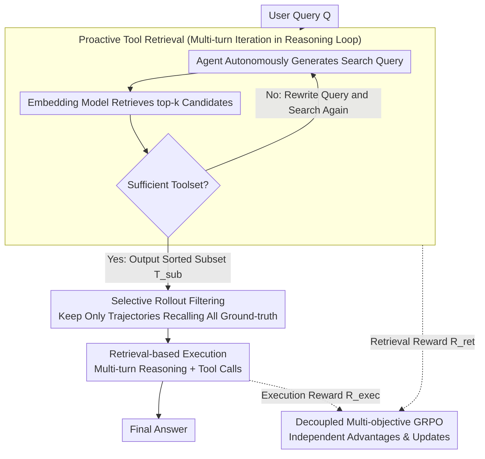

# ToolOmni: Enabling Open-World Tool Use via Agentic Learning with Proactive Retrieval and Grounded Execution

**Conference**: ACL 2026  
**arXiv**: [2604.13787](https://arxiv.org/abs/2604.13787)  
**Code**: [GitHub](https://github.com/Huangsz2021/ToolOmni)  
**Area**: LLM Agent  
**Keywords**: Tool Learning, Proactive Retrieval, Open-world, GRPO, End-to-end

## TL;DR

This paper proposes ToolOmni, a unified agent framework that integrates proactive tool retrieval and retrieval-based tool execution into a single reasoning loop. Through a two-stage approach of cold-start SFT and decoupled multi-objective GRPO, it jointly optimizes retrieval and execution capabilities, achieving an end-to-end success rate on ToolBench that surpasses strong baselines by +10.8%.

## Background & Motivation

**Background**: LLMs enhance problem-solving capabilities by calling external tools. In open-world scenarios, tool libraries are massive (>10,000 APIs) and dynamically updated, requiring models to not only use tools but also proactively search and select the correct ones.

**Limitations of Prior Work**: (1) **Embedding Retrieval** relies on semantic similarity for passive retrieval, decoupling retrieval from agent reasoning and failing to refine searches based on task needs; (2) **Parameter Memory** internalizes tool documentation into model parameters, making updates expensive and generalization poor; (3) Existing agent RL frameworks limit LLMs to a few tools like search engines/code executors, failing to scale to diverse open-world scenarios.

**Key Challenge**: Open-world tool use requires solving both "finding the right tool" (retrieval) and "correctly using it" (execution). Current methods either treat them as independent pipelines or optimize only one.

**Goal**: Build an end-to-end agent framework that unifies proactive tool discovery and execution into a single reasoning loop.

**Key Insight**: Treat retrieval and execution as interconnected yet independent sub-tasks, optimizing both synchronously via decoupled multi-objective GRPO to avoid mutual interference.

**Core Idea**: A two-stage training process—SFT for cold-starting basic capabilities, followed by decoupled GRPO to independently update retrieval and execution components based on separate rewards, optimizing the entire cycle in an online environment.

## Method

### Overall Architecture

Given a user query $Q$, ToolOmni alternates between two phases in a unified reasoning loop: (1) **Proactive Retrieval Phase**: The agent autonomously decides whether to retrieve, generates search queries, calls an embedding retrieval server, and iterates until a sufficient toolset $\mathcal{T}_{sub}$ is collected; (2) **Retrieval-based Execution Phase**: Based on the retrieved documentation, the agent generates an answer through multi-turn reasoning and tool calls. The training process uses decoupled multi-objective GRPO for online optimization, with selective rollout filtering to ensure the execution stage learns only from high-quality contexts.

### Key Designs

**1. Proactive Tool Retrieval: Autonomous Searching and Stopping**

In open-world settings with over 10,000 APIs, passive one-shot retrieval often fails. ToolOmni transforms retrieval into a proactive action within the reasoning loop. The agent generates search queries within `<search>` tags, retrieves top-k candidates via a pre-trained embedding model, and iteratively decides whether to continue or rewrite queries. This autonomy allows the agent to adjust search strategies dynamically based on task complexity.

**2. Decoupled Multi-objective GRPO: Separate Accounting for Retrieval and Execution**

Retrieval and execution are functionally distinct. Using a single reward signal causes the sparsity of execution rewards to drown out retrieval signals. ToolOmni decouples them: the retrieval reward $R_{ret}$ comprises format correctness, recall, and conversion rates, while the execution reward $R_{exec}$ includes format and answer correctness. Advantage estimation remains group-normalized but is calculated independently for each sub-task. Gradient updates use a "Separated Update" mechanism to prevent the gradient of one objective from overwhelming the other.

**3. Selective Rollout Filtering: Learning Execution in Clean Contexts**

Execution quality depends heavily on the retrieved toolset. Training on faulty retrieval results introduces noise. ToolOmni filters trajectories before the execution phase, retaining only those that successfully recalled all ground-truth tools (i.e., $\mathcal{T}_{gold} \subseteq \mathcal{T}_{sub}$). This ensures the execution policy learns from high-quality, relevant contexts.

### Loss & Training

Two-stage training: (1) SFT cold-start using ~28K retrieval and ~33K execution trajectories with cross-entropy loss; (2) Decoupled GRPO where retrieval and execution advantages are calculated and updated sequentially, with a group size $G=5$ and temperature $T=1.0$.

## Key Experimental Results

### Retrieval Performance (NDCG Average, Multi-Domain)

| Method | NDCG Average |
|--------|--------------|
| BM25 | 18.29 |
| EmbSim | 37.13 |
| ToolGen | 68.64 |
| ToolRetriever | 76.44 |
| **ToolOmni** | **78.29** |

### Ablation Study

| Configuration | Effect |
|---------------|--------|
| Full ToolOmni | Best |
| Single-turn Retrieval | Decline (Lacks iterative refinement) |
| Coupled GRPO (Single Reward) | Decline (Signal interference) |
| No Selective Rollout | Decline (Noisy training data) |

### Key Findings
- ToolOmni achieves SOTA in both retrieval and execution, with an end-to-end success rate +10.8% over baselines.
- Significant improvements in NDCG@1 and @3 demonstrate the advantage of proactive retrieval in pinpointing "gold tools."
- Strong generalization to unseen instructions and tools suggests the model learns general tool-use mechanisms rather than memorization.

## Highlights & Insights
- The **"Proactive Retrieval" paradigm shift** is crucial: moving from passive reception to autonomous searching tightly couples retrieval with reasoning.
- **Decoupled multi-objective GRPO** provides a general solution for avoiding signal interference in multi-subtask RL, applicable to other multi-stage agent tasks.
- **Selective Rollout** elegantly addresses training data quality issues by filtering based on sub-task success.

## Limitations & Future Work
- Evaluation is based on the relatively small Qwen3-4B model; performance on larger models is unexplored.
- Dependence on pre-trained embedding models for low-level retrieval establishes a performance ceiling.
- Use of LLM simulators in ToolBench instead of real API calls may introduce biases.
- Retrieval is limited to 4 rounds, which might be insufficient for extremely complex multi-tool collaboration.

## Related Work & Insights
- **vs ToolGen**: ToolGen uses generative identifiers but requires retraining for new tools, whereas ToolOmni generalizes via proactive retrieval.
- **vs Meta-Tool**: Meta-Tool treats retrieval/execution as pipeline stages rather than jointly optimized components.
- **vs Search-R1**: These agent RL frameworks inspired ToolOmni, but ToolOmni extends the scope to diverse open-world toolsets.

## Rating
- Novelty: ⭐⭐⭐⭐ Innovative proactive retrieval and decoupled GRPO design.
- Experimental Thoroughness: ⭐⭐⭐⭐ Comprehensive evaluation on ToolBench across both dimensions.
- Writing Quality: ⭐⭐⭐⭐ Clear framework and complete technical details.
- Value: ⭐⭐⭐⭐ Provides a practical end-to-end solution for open-world tool use.

<!-- RELATED:START -->

## Related Papers

- [\[ACL 2026\] Robust Tool Use via Fission-GRPO: Learning to Recover from Execution Errors](robust_tool_use_via_fission-grpo_learning_to_recover_from_execution_errors.md)
- [\[ACL 2026\] IntrAgent: An LLM Agent for Content-Grounded Information Retrieval through Literature Review](intragent_an_llm_agent_for_content-grounded_information_retrieval_through_litera.md)
- [\[ACL 2026\] FAMA: Failure-Aware Meta-Agentic Framework for Open-Source LLMs in Interactive Tool Use Environments](fama_failure-aware_meta-agentic_framework_for_open-source_llms_in_interactive_to.md)
- [\[ICLR 2026\] R-WoM: Retrieval-augmented World Model for Computer-use Agents](../../ICLR2026/llm_agent/r-wom_retrieval-augmented_world_model_for_computer-use_agents.md)
- [\[ACL 2026\] PRInTS: Process Reward Modeling for Long-range Information Retrieval](prints_reward_modeling_for_long-horizon_information_seeking.md)

<!-- RELATED:END -->
