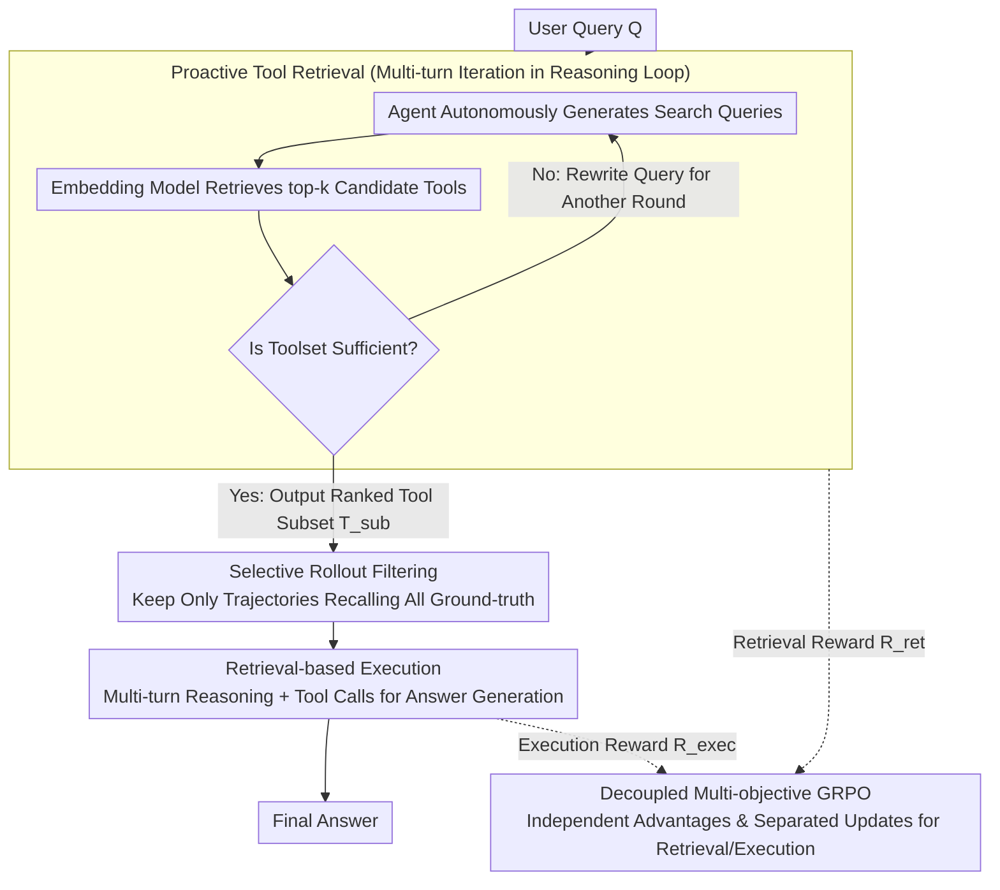

# ToolOmni: Enabling Open-World Tool Use via Agentic Learning with Proactive Retrieval and Grounded Execution

**Conference**: ACL 2026  
**arXiv**: [2604.13787](https://arxiv.org/abs/2604.13787)  
**Code**: [GitHub](https://github.com/Huangsz2021/ToolOmni)  
**Area**: LLM Agent  
**Keywords**: Tool learning, Proactive retrieval, Open world, GRPO, End-to-end

## TL;DR

This paper proposes ToolOmni, a unified agent framework that integrates proactive tool retrieval and retrieval-based tool execution into a single reasoning loop. Through a combination of cold-start SFT and decoupled multi-objective GRPO, it jointly optimizes retrieval and execution capabilities, achieving an end-to-end execution success rate that exceeds strong baselines by +10.8% on ToolBench.

## Background & Motivation

**Background**: LLMs enhance their problem-solving capabilities by calling external tools. In open-world scenarios, tool libraries are massive (>10,000 APIs) and dynamically updated. Models must not only know how to use tools but also proactively search for and select the correct ones.

**Limitations of Prior Work**: (1) **Embedding retrieval methods** rely on semantic similarity for passive retrieval, decoupling retrieval from agent reasoning, making them unable to proactively participate in tool selection or search refinement based on task requirements; (2) **Parameter memory methods** internalize tool documentation into model parameters, requiring expensive retraining for every update and resulting in poor generalization; (3) Existing agent RL training frameworks restrict LLMs to a few tools like search engines or code executors, failing to scale to diverse open-world scenarios.

**Key Challenge**: Open-world tool use requires solving "finding the right tool" (retrieval) and "using the tool correctly" (execution) simultaneously. However, existing methods either treat them as independent pipelines or optimize only one of them.

**Goal**: To build an end-to-end agent framework that unifies proactive tool discovery and tool execution into a single reasoning loop.

**Key Insight**: Treating retrieval and execution as interconnected yet independent sub-tasks, optimized simultaneously via decoupled multi-objective GRPO to avoid mutual interference.

**Core Idea**: A two-stage training approach: first, use SFT for cold-start to provide basic capabilities; then, use decoupled multi-objective GRPO to independently calculate rewards/advantages for retrieval and execution for separate updates, optimizing proactive retrieval and retrieval-based execution end-to-end in an online environment.

## Method

### Overall Architecture

Given a user query $Q$, ToolOmni alternates between two stages within a unified reasoning loop: (1) **Proactive Retrieval Stage**: The agent autonomously decides whether retrieval is necessary, generates search queries, calls an embedding retrieval server to obtain candidate tools, and iterates multiple times until a sufficient toolset $\mathcal{T}_{sub}$ is collected; (2) **Retrieval-based Execution Stage**: Based on the retrieved tool documentation, the agent generates the final answer through multi-turn reasoning and tool calls. On the training side, decoupled multi-objective GRPO optimizes the entire loop online, utilizing selective rollout filtering before execution to ensure the execution stage learns only within high-quality contexts.

### Key Designs

**1. Proactive Tool Retrieval: Letting the agent decide what to search and when to stop**

In the open world, tool libraries containing over 10,000 APIs are dynamically updated, making passive one-time embedding retrieval difficult to hit the target in one step. ToolOmni transforms retrieval into a proactive action within the reasoning loop: the agent generates search queries within `<search>` tags, retrieves top-k candidate tools using a pre-trained embedding model, and determines whether to continue searching or rewrite the query based on existing results. This proactive nature prevents retrieval from being decoupled from reasoning—the agent can dynamically adjust its search strategy according to task complexity and existing results, searching more for complex tasks and stopping early for simple ones.

**2. Decoupled Multi-objective GRPO: Separate accounting for retrieval and execution**

Retrieval and execution are sub-tasks of different natures. Forcing them into a single reward causes the sparsity of the execution reward to overshadow retrieval signals, leading to mutual interference. ToolOmni decouples them: the retrieval reward $R_{ret}$ consists of weighted components for format correctness, recall rate, and conversion rate; the execution reward $R_{exec}$ consists of format correctness and answer correctness. Advantage estimation still uses group normalization but is calculated independently for each sub-task. Gradient updates further employ Separated Update, backpropagating for retrieval and execution sequentially to prevent the gradient of one objective from overwhelming the other. This ensures both capabilities are optimized synchronously without hindering each other.

**3. Selective Rollout Filtering: Training execution only in clean contexts**

The quality of the execution policy depends heavily on the provided toolset—training on incorrect retrieval results injects noise gradients and undermines stability. ToolOmni implements a filtering step before starting execution generation: it retains only trajectories where the retrieval stage successfully recalled all ground-truth tools (i.e., satisfying $\mathcal{T}_{gold} \subseteq \mathcal{T}_{sub}$), discarding invalid retrieval instances. Consequently, the execution policy always learns from high-quality contexts, ensuring cleaner training signals.

### Loss & Training

Two-stage training: (1) SFT cold-start, training with cross-entropy loss on approximately 28K retrieval trajectories + 33K execution trajectories to provide basic capabilities; (2) Decoupled GRPO, where advantages are calculated and updated sequentially for retrieval and execution, with group size $G=5$ and temperature $T=1.0$.

## Key Experimental Results

### Main Results (NDCG Average, Multi-Domain)

| Method | NDCG Average |
|------|-----------|
| BM25 | 18.29 |
| EmbSim | 37.13 |
| ToolGen | 68.64 |
| ToolRetriever | 76.44 |
| **ToolOmni** | **78.29** |

### Ablation Study

| Configuration | Effect |
|------|------|
| Full ToolOmni | Best |
| Single-turn Retrieval | Decrease, lacks iterative refinement |
| Coupled GRPO (Single Reward) | Decrease, signal interference |
| Without Selective Rollout | Decrease, noisy training data |

### Key Findings
- ToolOmni achieves SOTA in both retrieval and execution, with an end-to-end execution success rate exceeding the baseline by +10.8%.
- It significantly outperforms baselines in NDCG@1 and @3, indicating the advantage of proactive retrieval in precisely locating "gold tools."
- It demonstrates strong generalization to unseen instructions and tools, learning general tool-use mechanisms rather than rote memorization.

## Highlights & Insights
- The **"Proactive Retrieval" paradigm shift** is crucial: moving from "passively accepting retrieval results" to "the agent autonomously deciding what to search and when to stop" ensures tight coupling between retrieval and reasoning.
- **Decoupled Multi-objective GRPO** provides a general solution for avoiding signal interference in multi-subtask RL, which can be transferred to other multi-stage agent tasks.
- **Selective Rollout** ingeniously addresses the issue of training data quality.

## Limitations & Future Work
- Based on the relatively small Qwen3-4B model; the effectiveness on larger models is unknown.
- Relies on pre-trained embedding models for underlying retrieval; the quality of the embedding model limits the performance ceiling.
- Uses the LLM simulator in ToolBench instead of real API calls, which may deviate from real-world environments.
- The retrieval stage is limited to a maximum of 4 rounds, which may be insufficient for extremely complex multi-tool collaboration scenarios.

## Related Work & Insights
- **vs ToolGen**: ToolGen uses a generative approach to directly produce tool identifiers but requires retraining to adapt to new tools; ToolOmni generalizes naturally through proactive retrieval.
- **vs Meta-Tool**: Meta-Tool treats retrieval and execution as pipeline stages rather than jointly optimizing them.
- **vs Search-R1**: These agent RL frameworks inspired ToolOmni, but the latter extends the scope to diverse toolsets in the open world.

## Rating
- Novelty: ⭐⭐⭐⭐ The framework design of proactive retrieval + decoupled GRPO is novel.
- Experimental Thoroughness: ⭐⭐⭐⭐ Comprehensive evaluation of both retrieval and execution dimensions on ToolBench.
- Writing Quality: ⭐⭐⭐⭐ Clear framework and complete technical details.
- Value: ⭐⭐⭐⭐ Provides a practical end-to-end solution for open-world tool use.

<!-- RELATED:START -->

## Related Papers

- [\[ACL 2026\] Robust Tool Use via Fission-GRPO: Learning to Recover from Execution Errors](robust_tool_use_via_fission-grpo_learning_to_recover_from_execution_errors.md)
- [\[ACL 2026\] IntrAgent: An LLM Agent for Content-Grounded Information Retrieval through Literature Review](intragent_an_llm_agent_for_content-grounded_information_retrieval_through_litera.md)
- [\[ACL 2026\] FAMA: Failure-Aware Meta-Agentic Framework for Open-Source LLMs in Interactive Tool Use Environments](fama_failure-aware_meta-agentic_framework_for_open-source_llms_in_interactive_to.md)
- [\[NeurIPS 2025\] ContextAgent: Context-Aware Proactive LLM Agents with Open-World Sensory Perceptions](../../NeurIPS2025/llm_agent/contextagent_context-aware_proactive_llm_agents_with_open-world_sensory_percepti.md)
- [\[ACL 2026\] SafeMCP: Proactive Power Regulation for LLM Agent Defense via Environment-Grounded Look-Ahead Reasoning](safemcp_proactive_power_regulation_for_llm_agent_defense_via_environment-grounde.md)

<!-- RELATED:END -->
