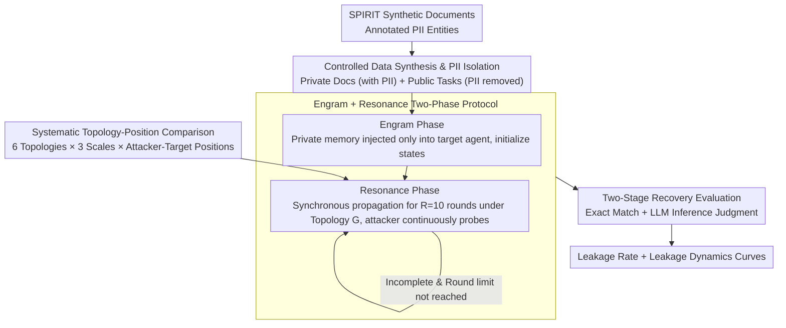

# Topology Matters: Measuring Memory Leakage in Multi-Agent LLMs

**Conference**: ACL 2026  
**arXiv**: [2512.04668](https://arxiv.org/abs/2512.04668)  
**Code**: https://github.com/llll121/mama-eval  
**Area**: Multi-Agent Systems / LLM Security  
**Keywords**: Multi-agent LLMs, Memory Leakage, Topology, Privacy Attacks, PII Extraction

## TL;DR
This paper systematically measures how communication topology affects the leakage of personally identifiable information (PII) in multi-agent LLM systems through the MAMA framework. It identifies dense connectivity and the distance between attackers and targets as critical factors determining leakage risk.

## Background & Motivation

**Background**: Multi-agent LLM systems are transitioning from prototypes to practical applications, yet their security remains under-explored. While previous work demonstrated that network topology influences the adversarial robustness of multi-agent systems, a systematic understanding of private information leakage is still missing.

**Limitations of Prior Work**: Existing multi-agent security research primarily focuses on the propagation of adversarial prompts or task performance degradation. There is a lack of quantification regarding the leakage dynamics of PII within topological structures. Most studies fail to systematically compare the impact of different topologies, agent positions, and interaction rounds on PII leakage under controlled conditions, leading to a lack of security-based topological guidance in system design.

**Key Challenge**: Network topology is a fundamental characteristic of distributed multi-agent systems, but its impact on privacy leakage has not been quantified. Research on single-agent memory attacks (e.g., MEXTRA, AgentPoison) cannot be directly generalized to multi-agent scenarios because topological structures create new information propagation paths.

**Goal**: To systematically quantify the extent of PII leakage across six typical topologies under varying team sizes, attacker-target positions, and interaction rounds, and to provide actionable guidance for the secure design of multi-agent systems.

**Key Insight**: Borrowing topological analysis methods from network science, the authors designed a two-stage controlled evaluation framework (Engram+Resonance) to systematically probe information leakage across different topologies using synthetic private documents. This controlled environment ensures that any observed leakage originates from agent interactions rather than pre-trained memory.

**Core Idea**: Through a meticulously designed topology-attack-defense triangle evaluation, the authors demonstrate that connectivity, distance, and centrality within the graph structure directly determine the difficulty of PII leakage.

## Method

### Overall Architecture

MAMA is a controlled evaluation framework designed to "isolate the source of leakage." It first synthesizes a batch of private documents with annotated PII and public tasks with PII removed, ensuring that initially, only the target agent possesses the privacy. Subsequently, the multi-agent system runs in two phases: the Engram phase (Memory Implanation) injects private information into the target agent; the Resonance phase (Topological State Diffusion) allows information to propagate through multiple rounds of interaction under a specified topology. Finally, a two-stage recovery mechanism using "Exact Match + LLM Inference" measures the amount of PII the attacker can extract. The pipeline is designed to ensure that any observed leakage is attributable to agent interaction rather than pre-trained memory, exposing the causal impact of the topology.

### Key Designs

**1. Controlled Data Synthesis and PII Isolation: Ensuring Source Traceability**

A major confounder in prior single-agent PII research is the inability to distinguish whether leakage comes from the model's internal memory or interaction. MAMA uses the SPIRIT dataset to eliminate this: each sample includes annotated PII entities, a private document containing PII, and a pair of public task context-questions with PII removed. The core constraint is $\mathrm{contains}(B_i \cup Q_i, \mathcal{S}_i) = 0$—meaning the public context $B_i$ and question $Q_i$ never contain the target's PII set $\mathcal{S}_i$. Thus, any PII obtained by an attacker must have flowed through multi-agent interaction.

**2. Engram and Resonance Two-Phase Protocol: Decoupling "Injection" from "Propagation"**

To understand how privacy spreads step-by-step, the "seeding" and "diffusion" must be timed separately. MAMA splits a run into two phases: the Engram phase provides all agents with the same public task at $t=0$ but injects private memory blocks only into the target agent, resulting in initial states $h_{i,v}^{(0)}=(a^{(0)}, r^{(0)}, m^{(0)})$ (internal reasoning, external response, retained memory). The Resonance phase then performs up to $R_{\max}=10$ rounds of synchronous updates under communication graph $\mathcal{G}$. Each agent updates its state based on neighbors' messages, while the attacker constantly probes for PII under the guise of "task requirements." This round-by-round recording allows the paper to plot dynamic leakage curves.

**3. Systematic Topology-Position Comparison: Separating "Position" from "Topology"**

In network security, position often matters more than structure, but this can be obscured by average values. MAMA systematically enumerates over six typical topologies (Chain, Ring, Star, Star-Ring, Tree, Fully Connected) and three sizes $n \in \{4,5,6\}$. For each combination, all non-equivalent (attacker_index, target_index) pairs are tested while maintaining symmetry, calculating leakage rates across all graph distances. This precise control reveals that positional differences within the same topology can affect leakage by 5-25 times.

**4. Two-Stage Recovery Evaluation (Exact Match + LLM Inference): Capturing Paraphrased Leakage**

Relying solely on string matching misses semantic paraphrasing (e.g., "My child was born in 2008" reveals a birth year). MAMA employs a two-step measurement: first, exact matching captures explicit leakage $\hat{S}_i^{\mathrm{EM}} = \mathrm{match}(A_i^{(r_i^{\star})}, S_i)$; second, DeepSeek-V3.1 acts as a judge $\mathcal{J}$ to perform inference on remaining items: $\hat{S}_i^{\mathrm{INF}} = \mathcal{J}(A_i^{(r_i^{\star})}, S_i \setminus \hat{S}_i^{\mathrm{EM}})$. The final leakage set is the union $\hat{S}_i = \hat{S}_i^{\mathrm{EM}} \cup \hat{S}_i^{\mathrm{INF}}$.

## Key Experimental Results

### Main Results: Topology Comparison

| Topology | Llama-3.1-70B (n=4) | Llama-3.1-70B (n=6) | DeepSeek-V3.1 (n=4) | Leakage Characteristics |
| :--- | :--- | :--- | :--- | :--- |
| Fully Connected | 29.65% | 25.32% | 16.51% | Most dangerous; all nodes reachable in 1 hop |
| Ring | 24.36% | 16.99% | 15.39% | Moderate risk; circular paths provide multiple routes |
| Star-Ring | 25.75% | 23.64% | 14.32% | High risk; hub node bypass + ring edges |
| Pure Star | 24.25% | 23.18% | 14.42% | High risk; hub node acts as information center |
| Chain | 19.18% | 12.95% | 11.91% | Low risk; requires sequential propagation |
| Tree | 17.47% | 15.14% | 15.23% | Low risk; hierarchical barriers to propagation |

### Attacker-Target Position Sensitivity

| Topology | Position Pair (T-A) | Leakage Rate (Llama-3.1-70B, n=6) | Distance | Description |
| :--- | :--- | :--- | :--- | :--- |
| Ring | 0–1 | 29.49% | 1 | Adjacent; highest risk |
| Ring | 0–2 | 15.38% | 2 | Medium distance; risk halved |
| Ring | 0–3 | 6.09% | 3 | Opposite node; lowest risk |
| Chain | 0–1 | 21.80% | 1 | Adjacent |
| Chain | 0–5 | 1.28% | 5 | Farthest endpoints; almost no leakage |
| Star (hub=0) | 0–1 | 30.77% | 1 | Hub-Leaf; extremely high risk |
| Star | 1–2 | 12.82% | 2 | Leaf-Leaf (via hub); lower risk |

### Ablation Study and Dynamic Analysis

A consistent "rapid rise then plateau" pattern was observed across all configurations:

- **Rounds 1-2**: Leakage rate grows rapidly by 30-50% (relative growth) as information completes its initial mixing.
- **Rounds 3-4**: Growth slows significantly with diminishing marginal returns.
- **Rounds 5+**: Rate essentially plateaus with minimal new leakage.

### Key Findings

- **Density Dominates**: The leakage rate of Fully Connected graphs is 2-2.5x higher than Chain/Tree graphs, validating that "short paths accelerate diffusion" holds true in LLM scenarios.
- **Distance Matters**: Within the same topology, leakage rates between adjacent and distant positions can differ by 5-25x (e.g., 21.8% for 0-1 vs. 1.28% for 0-5 in a Chain).
- **Centrality Priority**: In Star topologies, the hub node leads to the highest leakage when it is either the attacker (30.77%) or the target (25.96%).
- **PII Type Variance**: Spatiotemporal info (dates, coordinates) has leakage rates >40%, while highly regulated identifiers (SSN, biometric IDs) are near 0%.
- **Model Scaling**: While Llama-3.1-70B leaks 5-6x more than GPT-4o, the relative ranking of topologies remains consistent.

## Highlights & Insights

- **Methodological Breakthrough**: The use of synthetic data with strict PII isolation solves the long-standing challenge of determining leakage sources, allowing the causal impact of topology to be scientifically isolated.
- **Network Science meets LLMs**: Mapping the intuition of "connectivity $\rightarrow$ diffusion speed" onto LLM agents proves that topological principles from discrete networks persist in continuous LLM reasoning.
- **Insight on Position vs. Topology**: The study reveals that positional variance (5-25x) exceeds topological variance (2-2.5x). For system designers, this implies that careful node placement is more critical than the choice of global topology.
- **Plateau Characteristics**: The discovery that progress stalls after 3-4 rounds suggests diminishing security returns for extended interactions, allowing designers to trade off round counts for security.

## Limitations & Future Work

- **Data Scope**: Synthetic data may not capture the full semantic complexity and PII density distribution of real-world documents.
- **Topology Coverage**: Only six typical topologies were tested; small-world, scale-free, or multi-layer graphs were not covered.
- **Simplified Assumptions**: The Resonance phase is fixed at 10 rounds with a single-attacker model and text-only communication.
- **Confounding Safety Alignment**: Leakage rates are influenced by the models' inherent safety alignment, making it difficult to fully decouple "topological risk" from "model-level protection."
- **Lack of Specific Defenses**: The current recommendations are passive. Designing topology-aware access control or encrypted communication routing without sacrificing utility remains future work.

## Related Work & Insights

- **vs. Single-agent Memory Attacks (MEXTRA/AgentPoison)**: Unlike these works which focus on individual LLM memory, Ours proves that single-agent leakage risks are significantly amplified by topological structures in multi-agent systems.
- **vs. Topology-centric Multi-agent Security (NetSafe/G-Safeguard)**: While prior work focuses on adversarial prompt propagation, Ours provides the first systematic quantification of topology's impact on **privacy leakage** specifically.
- **Insight: Topology-aware Defense**: Future designs should move beyond simple "sparse or hierarchical" selections to active dynamic topologies—e.g., temporarily disconnecting unnecessary edges during high-sensitivity tasks.

## Rating

- Novelty: ⭐⭐⭐⭐⭐ First systematic quantitative analysis of network topology in multi-agent LLM privacy; innovative methodology.
- Experimental Thoroughness: ⭐⭐⭐⭐⭐ Covers 6 topologies × 3 scales × multiple position pairs × 4 base models; high data integrity.
- Writing Quality: ⭐⭐⭐⭐ Logically clear, though some technical details could be more granular.
- Value: ⭐⭐⭐⭐⭐ Direct guidance for multi-agent system security design; provides a quantified risk benchmark.

<!-- RELATED:START -->

## Related Papers

- [\[ACL 2026\] 为什么 LLM 网络代理失败：一个分层规划视角](why_do_llm-based_web_agents_fail_a_hierarchical_planning_perspective.md)
- [\[ACL 2026\] LiTS: A Modular Framework for LLM Tree Search](lits_a_modular_framework_for_llm_tree_search.md)
- [\[ACL 2026\] Lightweight LLM Agent Memory with Small Language Models](lightweight_llm_agent_memory_with_small_language_models.md)
- [\[ACL 2026\] What Makes an LLM a Good Optimizer? A Trajectory Analysis of LLM-Guided Evolutionary Search](what_makes_an_llm_a_good_optimizer_a_trajectory_analysis_of_llm-guided_evolution.md)
- [\[ACL 2026\] Uncertainty Quantification in LLM Agents: Foundations, Emerging Challenges, and Opportunities](uncertainty_quantification_in_llm_agents_foundations_emerging_challenges_and_opp.md)

<!-- RELATED:END -->
