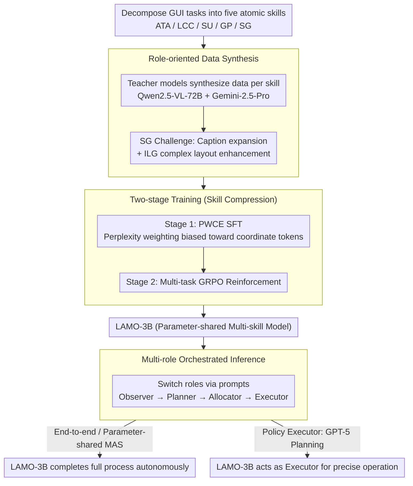

# Towards Scalable Lightweight GUI Agents via Multi-role Orchestration

**Conference**: ACL 2026 Findings  
**arXiv**: [2604.13488](https://arxiv.org/abs/2604.13488)  
**Code**: [GitHub](https://github.com/BigTaige/LAMO)  
**Area**: LLM Agent / GUI Automation  
**Keywords**: GUI Agent, Lightweight Model, Multi-role Orchestration, Policy Executor, Reinforcement Learning

## TL;DR

This paper proposes the LAMO framework, which trains a lightweight 3B MLLM into a GUI Agent capable of flexible multi-role orchestration through role-oriented data synthesis and two-stage training (SFT with Perplexity-Weighted Cross-Entropy + Multi-task RL). Operating in three modes—monolithic inference, multi-agent collaboration, and plug-and-play policy executor——it achieves a 77.6% success rate on AndroidWorld when paired with a GPT-5 planner, surpassing specialized GUI Agents with 72B parameters.

## Background & Motivation

**Background**: MLLM-based GUI Agents are evolving from static environments to complex online real-world scenarios. Current state-of-the-art methods (e.g., UI-TARS-72B, Agent-S2) achieve significant gains by scaling parameters and data, but deployment costs remain extremely high. While lightweight GUI Agents ($\le$ 7B) perform decently on static benchmarks, their performance drops sharply in online real-world environments.

**Limitations of Prior Work**: (1) Lightweight MLLMs are limited by parameter scale and perform poorly in end-to-end long-horizon tasks that require simultaneous screen analysis, strategic decision-making, and tool calling; (2) End-to-end monolithic learning (episodic learning) couples high-level reasoning and low-level execution into a fixed pipeline, leading to poor task scalability and difficulty in adapting to Multi-Agent Systems (MAS); (3) Training multiple skill experts is costly—for instance, Agent-S2 requires the simultaneous deployment of UI-TARS-72B (visual localization), Tesseract OCR (text localization), and UNO (structural localization), resulting in high system overhead; (4) Lightweight Agents lack task scalability and cannot flexibly switch roles via context engineering.

**Key Challenge**: The cost-scalability dilemma—large models possess task scalability but high deployment costs, while lightweight models are cheap to deploy but limited in capability and lack scalability.

**Goal**: To achieve task scalability on lightweight MLLMs. Through parameter sharing and multi-role orchestration, a 3B model can work flexibly across different inference modes and serve as a plug-and-play policy executor that benefits from advanced planners.

**Key Insight**: Break down GUI automation into five core capabilities: Action-Tool Alignment (ATA), Logical Consistent CoT (LCC), Screen Understanding (SU), Goal Planning (GP), and Screen Grounding (SG). Use role-oriented data synthesis and parameter sharing to allow a single 3B model to assume multiple roles.

**Core Idea**: Replace multiple specialized models with parameter-sharing multi-role orchestration—a single lightweight model switches between Observer, Planner, Allocator, and Executor roles via context engineering, achieving MAS-level performance.

## Method

### Overall Architecture

LAMO addresses a central question: Can a 3B lightweight MLLM possess all sub-capabilities required for GUI automation and collaborate flexibly like a Multi-Agent System? The approach involves decomposing GUI tasks into five atomic skills, synthesizing training data for each skill using teacher models, and compressing these skills into a single set of parameters through two-stage training (PWCE SFT + Multi-task GRPO). During inference, the trained LAMO-3B switches roles by varying prompts, supporting three operating modes: end-to-end monolithic inference, parameter-shared MAS collaboration, and acting as a plug-and-play executor paired with an advanced planner like GPT-5.

### Key Designs

**1. Role-oriented Data Synthesis: Breaking long-horizon problems into reliable sub-capabilities**

Lightweight models perform poorly on end-to-end long-horizon tasks but are reliable when handling individual sub-capabilities. This work decomposes GUI automation into five task categories—ATA (Action-Tool Alignment), LCC (Logical Consistent CoT), SU (Screen Understanding), GP (Goal Planning), and SG (Screen Grounding). Data is synthesized using Qwen-2.5-VL-72B (for ATA, SG) and Gemini-2.5-Pro (for SU, LCC, GP), allowing a single model to learn all skills via parameter sharing.

Grounding (SG) is the most difficult. Two specific pain points are addressed: First, for semantically sparse elements, short original descriptions are expanded into semantically rich captions by a teacher model. During training, the model predicts both the rich description and the coordinates, forcing it to "understand" the target rather than memorizing coordinates. Second, for complex layout interference, rule-based enhancement overlays foreground targets onto background screens with distractor items, creating Intricate-Layout Grounding (ILG) data to train localization in crowded interfaces.

**2. Perplexity-Weighted Cross-Entropy (PWCE): Biasing loss toward the hardest coordinate tokens**

SFT can master textual reasoning, but predicted coordinates often show systematic bias. The root cause is that coordinate tokens have high perplexity but share the same loss weight as ordinary tokens, resulting in insufficient pressure for the model to perceive numerical details. PWCE dynamically weights tokens based on perplexity: $w_i = \frac{1 + \alpha \frac{PPL_i}{\overline{PPL} + \epsilon}}{\frac{1}{|M|}\sum_{j \in M}(1 + \alpha \frac{PPL_j}{\overline{PPL} + \epsilon})}$. The weighted cross-entropy is then calculated as $\mathcal{L}_{PW} = \frac{1}{|M|}\sum_{i \in M} w_i \cdot CE(h_i^*, \tilde{y}_i)$, with the final loss being $\mathcal{L}_{PWCE} = \mathcal{L}_{CE} + \lambda \mathcal{L}_{PW}$. Tokens with higher perplexity (coordinates) receive higher weights, forcing the model to focus on these uncertain values, which significantly improves localization precision—removing PWCE resulted in a 38.3% drop on ScreenSpot-pro.

**3. Multi-role Orchestrated Inference: One set of parameters performing as a whole team**

To gain MAS advantages without increasing parameter count, LAMO-3B switches between four roles via context engineering during inference: the Observer produces screen semantic descriptions $\mathcal{C}_{s2w}$, the Planner decomposes the goal into sub-tasks $\mathcal{C}_{plan}$ and tips $\mathcal{C}_{tips}$, the Allocator determines the current action $\mathcal{C}_{action}$ based on history and context, and the Executor converts action instructions into atomic operations $a_t$. This decomposition makes the context for each role shorter and more focused, alleviating "lost-in-the-middle" issues and thought-action hallucinations.

Crucially, in the policy executor mode, planning responsibilities are handed to a stronger MLLM (e.g., GPT-5) to generate high-level instructions $\mathcal{C}_{action}^*$. LAMO-3B acts as a reliable "hand," responsible only for translating instructions into precise screen operations. This allows the lightweight model to avoid its weakness in long-term planning while continuously improving alongside the planner.

### Loss & Training

SFT Stage: 1 epoch, learning rate 4e-6, warmup ratio 0.03, global batch size 256, LoRA (rank 128, alpha 256). RL Stage: Freeze visual backbone, train only merge layer and LLM, GRPO for 1 epoch, learning rate 1e-6, rollout batch 32, 8 rollouts per sample. Multi-task RL rewards: TF-IDF similarity normalization for SU/GP, coordinate distance for SG, and string matching of tool categories/values for ATA, with a length penalty $r_{penalty} = -\varphi \cdot \frac{length(y_{pred})}{L_{max}}$.

## Key Experimental Results

### Main Results

**MiniWob++ Online Environment Success Rate**

| Method | Success Rate |
|------|--------|
| Qwen2.5-VL-3B | 34.6 |
| UI-TARS-7B | 58.7 |
| Gemini-2.5-pro (Monolithic) | 71.0 |
| LAMO-3B (End-to-End) | 50.0 |
| LAMO-3B (MAS) | 60.9 (+21.8%) |
| LAMO-3B (Gemini-2.5-pro Planned) | **77.2** (+54.4%) |

**AndroidWorld Success Rate**

| Method | Success Rate |
|------|--------|
| UI-TARS-72B | 46.6 |
| Agent-S2 | 54.3 |
| Mobile-Agent-V3 | 73.3 |
| LAMO-3B (Gemini-2.5-pro Planned) | 60.3 |
| LAMO-3B (GPT-5 Planned) | **77.6** |

### Ablation Study

**Ablation of Key Components (Performance drop relative to LAMO-3B)**

| Ablation Item | SP | SP-v2 | SP-pro | MiniWob++ |
|--------|-----|-------|--------|-----------|
| W/O ILG Data | -2.1% | -3.8% | -34.7% | -2.7% |
| SFT Only (No RL) | -1.1% | -3.0% | -32.7% | -22.5% |
| W/O PWCE | -1.7% | -3.5% | -38.3% | -26.9% |
| Qwen2.5-VL-3B (No Training) | -7.7% | -6.3% | -51.0% | -44.5% |

### Key Findings

- MAS mode improves performance by 21.8% over end-to-end inference (MiniWob++), while policy executor mode boosts it by 54.4%.
- LAMO-3B + GPT-5 planner reaches 77.6% on AndroidWorld, surpassing Mobile-Agent-V3 (73.3%) and UI-Venus-Navi-72B (65.9%).
- On ScreenSpot-pro, LAMO-3B (36.1%) outperforms UI-TARS-7B (35.7%) and several 72B models.
- PWCE contributes most to complex layout scenarios: its removal causes a 38.3% drop on SP-pro.
- The RL stage is critical for online environments: SFT-only performance drops by 22.5% on MiniWob++.
- On OSWorld, LAMO-3B (38.5%) surpasses UI-TARS-1.5-7B (28.2%) and is only 5.1 points behind Qwen2.5-VL-32B (43.6%), despite having 10x fewer parameters.

## Highlights & Insights

- The policy executor mode is a forward-looking design—lightweight models do not need to plan; they only need to be reliable "hands." As planners (GPT-5, etc.) evolve, the overall performance ceiling rises.
- The PWCE loss function provides an elegant solution for coordinate prediction in GUI Agents—perplexity weighting focuses the model on uncertain numerical tokens.
- Parameter-sharing multi-role orchestration achieves MAS advantages without increasing model parameters, representing an efficient way to expand capabilities.
- InfiGUI-R1-3B is competitive in static environments but crashes in online ones (38.5 vs 10.3 in OSWorld), highlighting the task scalability flaws of end-to-end learning.

## Limitations & Future Work

- Limited by 3B parameters, reasoning depth is insufficient for long-horizon tasks exceeding 10 steps, still requiring pairing with a large model planner.
- Performance in desktop environments (especially spreadsheets and software requiring priors) is inferior to mobile.
- The synthesis quality and diversity of ILG data enhancement can still be improved.
- Combinations with different types of planners (e.g., open-source vs. closed-source) have not been fully explored.

## Related Work & Insights

- **vs UI-TARS**: UI-TARS-72B has 24 times more parameters than LAMO-3B but only reaches 46.6% on AndroidWorld, whereas LAMO-3B + GPT-5 reaches 77.6%—proving that a "large executor" is inferior to a "lightweight executor + strong planner."
- **vs GUI-R1 / InfiGUI-R1**: These methods are trained on end-to-end episodic RL, performing well in static environments but failing in online ones; LAMO achieves better task scalability via role decomposition.
- **vs Agent-S2**: Agent-S2 uses multiple large-parameter specialized executors (UI-TARS-72B + Tesseract + UNO), incurring high system costs; LAMO-3B handles all execution functions with a single 3B model.

## Rating

- Novelty: ⭐⭐⭐⭐⭐ PWCE loss, role-oriented synthesis, and parameter-sharing multi-role orchestration are all original; policy executor mode has strong practical foresight.
- Experimental Thoroughness: ⭐⭐⭐⭐⭐ Covers five benchmarks across static (ScreenSpot-pro, AndroidControl) and online (MiniWob++, AndroidWorld, OSWorld) environments with detailed ablations.
- Writing Quality: ⭐⭐⭐⭐ Problem definitions are clear, and the hierarchy of the three inference modes is strong, though the notation system is slightly complex.
- Value: ⭐⭐⭐⭐⭐ Identifies a viable "executor + planner" path for lightweight GUI Agents; the 77.6% success rate on AndroidWorld is a top-tier result.

<!-- RELATED:START -->

## Related Papers

- [\[ICML 2026\] NaviAgent: Graph-Driven Bilevel Planning for Scalable Tool Orchestration](../../ICML2026/llm_agent/naviagent_graph-driven_bilevel_planning_for_scalable_tool_orchestration.md)
- [\[CVPR 2026\] MMBench-GUI: A Unified Hierarchical Evaluation Framework for Multi-Platform GUI Agents](../../CVPR2026/llm_agent/mmbench-gui_a_unified_hierarchical_evaluation_framework_for_multi-platform_gui_a.md)
- [\[CVPR 2026\] iSHIFT: Lightweight Slow-Fast GUI Agent with Adaptive Perception](../../CVPR2026/llm_agent/ishift_lightweight_slow-fast_gui_agent_with_adaptive_perception.md)
- [\[AAAI 2026\] History-Aware Reasoning for GUI Agents](../../AAAI2026/llm_agent/history-aware_reasoning_for_gui_agents.md)
- [\[ACL 2026\] Lightweight LLM Agent Memory with Small Language Models](lightweight_llm_agent_memory_with_small_language_models.md)

<!-- RELATED:END -->
