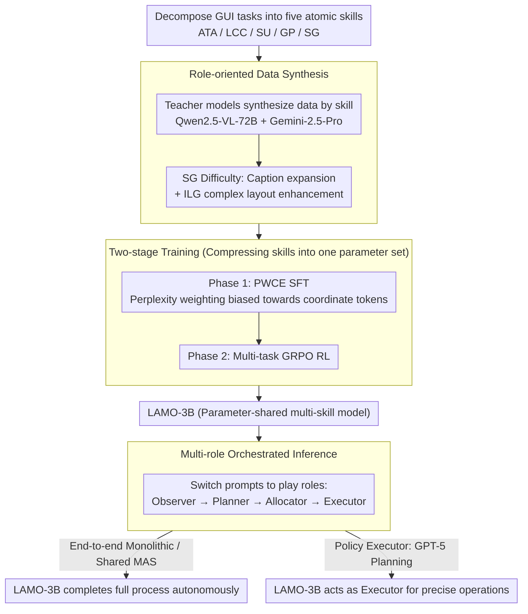

# Towards Scalable Lightweight GUI Agents via Multi-role Orchestration

**Conference**: ACL 2026 Findings  
**arXiv**: [2604.13488](https://arxiv.org/abs/2604.13488)  
**Code**: [GitHub](https://github.com/BigTaige/LAMO)  
**Area**: LLM Agent / GUI Automation  
**Keywords**: GUI Agent, Lightweight Models, Multi-role Orchestration, Policy Executor, Reinforcement Learning

## TL;DR

This work proposes the LAMO framework, which trains a lightweight 3B MLLM into a flexible multi-role GUI Agent through role-oriented data synthesis and two-stage training (SFT with Perplexity-Weighted Cross-Entropy + Multi-task RL). Operating in three modes—monolithic inference, multi-agent collaboration, and as a plug-and-play policy executor—it achieves a 77.6% success rate on AndroidWorld when paired with a GPT-5 planner, surpassing specialized GUI Agents with 72B parameters.

## Background & Motivation

**Background**: MLLM-based GUI Agents are evolving from static environments to complex, online real-world scenarios. Current SOTA methods (e.g., UI-TARS-72B, Agent-S2) achieve significant gains by scaling parameters and data, but deployment costs remain prohibitive. Lightweight GUI Agents ($\leq$7B) perform well on static benchmarks but suffer sharp performance degradation in online real-world environments.

**Limitations of Prior Work**: (1) Lightweight MLLMs are constrained by parameter scale, performing poorly in end-to-end long-horizon tasks requiring simultaneous screen analysis, strategic decision-making, and tool calling; (2) End-to-end episodic learning couples high-level reasoning and low-level execution in a fixed pipeline, leading to poor task scalability and difficulty adapting to Multi-Agent Systems (MAS); (3) Training multiple skill experts is expensive—for instance, Agent-S2 requires deploying UI-TARS-72B (visual grounding), Tesseract OCR (text grounding), and UNO (structural grounding) simultaneously; (4) Lightweight agents lack task scalability and cannot flexibly switch roles via context engineering.

**Key Challenge**: The cost-scalability dilemma—large models possess task scalability but high deployment costs, while lightweight models are cheap to deploy but limited and non-scalable.

**Goal**: To achieve task scalability on lightweight MLLMs via parameter sharing and multi-role orchestration, allowing a 3B model to work flexibly across different inference modes and serve as a plug-and-play policy executor that benefits from advanced planners.

**Key Insight**: GUI automation can be decomposed into five core abilities (Action-Tool Alignment ATA, Logically Consistent CoT LCC, Screen Understanding SU, Goal Planning GP, Screen Grounding SG). Through role-oriented data synthesis and parameter sharing, a single 3B model can assume multiple roles.

**Core Idea**: Replace multiple specialized models with parameter-shared multi-role orchestration—a single lightweight model switches between Observer, Planner, Allocator, and Executor roles via context engineering to achieve MAS-level performance.

## Method

### Overall Architecture

LAMO addresses whether a 3B MLLM can possess all sub-capabilities required for GUI automation while collaborating flexibly like a Multi-Agent System. It decomposes GUI tasks into five categories of atomic skills, synthesizes training data for each skill using teacher models, and compresses these skills into a single set of parameters through two-stage training (PWCE SFT + Multi-task GRPO). At inference time, LAMO-3B switches roles via prompts, supporting three modes: end-to-end monolithic inference, parameter-shared MAS collaboration, and acting as a plug-and-play executor paired with advanced planners like GPT-5.

### Key Designs

**1. Role-oriented Data Synthesis: Decomposing Long-horizon Challenges into Reliable Sub-capabilities**

Lightweight models perform poorly on end-to-end long tasks but are reliable when handling specific sub-tasks. This work decomposes GUI automation into five categories—ATA (Action-Tool Alignment), LCC (Logically Consistent CoT), SU (Screen Understanding), GP (Goal Planning), and SG (Screen Grounding). Data is synthesized using Qwen-2.5-VL-72B (ATA, SG) and Gemini-2.5-Pro (SU, LCC, GP).

For Screen Grounding (SG), two major pain points are addressed: (1) Semantically sparse elements: Short descriptions are expanded into rich semantic captions using teacher models, forcing the model to "understand" the target rather than memorizing coordinates; (2) Complex layout interference: Intricate-Layout Grounding (ILG) data is synthesized by overlaying foreground targets onto background screens with distractors, enhancing localization in crowded interfaces.

**2. Perplexity-Weighted Cross-Entropy (PWCE): Biasing Loss towards Difficult Coordinate Tokens**

Standard SFT handles textual reasoning well, but predicted coordinates often show systematic bias. This stems from coordinate tokens having high perplexity while sharing the same loss weight as common tokens. PWCE dynamically weights tokens based on perplexity: $w_i = \frac{1 + \alpha \frac{PPL_i}{\overline{PPL} + \epsilon}}{\frac{1}{|M|}\sum_{j \in M}(1 + \alpha \frac{PPL_j}{\overline{PPL} + \epsilon})}$. The weighted cross-entropy is calculated as $\mathcal{L}_{PW} = \frac{1}{|M|}\sum_{i \in M} w_i \cdot CE(h_i^*, \tilde{y}_i)$, with the final loss $\mathcal{L}_{PWCE} = \mathcal{L}_{CE} + \lambda \mathcal{L}_{PW}$. This forces the model to focus on uncertain numerical values, significantly improving grounding accuracy—removing PWCE leads to a 38.3% drop on ScreenSpot-pro.

**3. Multi-role Orchestrated Inference: One Parameter Set as a Whole Team**

To gain MAS advantages without increasing parameters, LAMO-3B switches between four roles via context engineering: Observer outputs screen semantic descriptions $\mathcal{C}_{s2w}$, Planner decomposes goals into sub-tasks $\mathcal{C}_{plan}$ and tips $\mathcal{C}_{tips}$, Allocator provides the current action $\mathcal{C}_{action}$ based on history, and Executor translates instructions into atomic operations $a_t$. This decomposition shortens and focuses the context for each role, mitigating "lost-in-the-middle" issues and thought-action hallucinations.

Crucially, in policy executor mode, planning is delegated to a stronger MLLM (e.g., GPT-5) to generate high-level instructions $\mathcal{C}_{action}^*$. LAMO-3B serves as the reliable "hands," responsible only for translating those instructions into precise screen operations.

### One Full Example

Taking "search for a product in a shopping app and add to cart" on AndroidWorld: In policy executor mode, the GPT-5 planner reads the task and generates a high-level instruction $\mathcal{C}_{action}^*$="Click the top search bar and input the product name." LAMO-3B, as the Executor, observes the screenshot, locates the search bar coordinates, and outputs $a_t$=click(x, y) followed by text input. Upon receiving a new screenshot, the planner provides the next instruction "Click the first search result," which the Executor grounds and executes. The 3B model avoids long-term decision-making, focusing on precise grounding for each step.

### Loss & Training

SFT Phase: 1 epoch, learning rate 4e-6, warmup ratio 0.03, global batch size 256, LoRA (rank 128, alpha 256). RL Phase: Vision backbone frozen, training only merge layer and LLM, GRPO for 1 epoch, learning rate 1e-6, rollout batch 32, 8 rollouts per sample. Multi-task RL Rewards: TF-IDF similarity normalization for SU/GP, coordinate distance for SG, string matching for ATA tool type and value, with a length penalty $r_{penalty} = -\varphi \cdot \frac{length(y_{pred})}{L_{max}}$.

## Key Experimental Results

### Main Results

**MiniWob++ Online Environment Success Rate**

| Method | Success Rate |
|------|--------|
| Qwen2.5-VL-3B | 34.6 |
| UI-TARS-7B | 58.7 |
| Gemini-2.5-pro (Monolithic) | 71.0 |
| LAMO-3B (End-to-End) | 50.0 |
| LAMO-3B (MAS) | 60.9 (+21.8%) |
| LAMO-3B (Gemini-2.5-pro Planning) | **77.2** (+54.4%) |

**AndroidWorld Success Rate**

| Method | Success Rate |
|------|--------|
| UI-TARS-72B | 46.6 |
| Agent-S2 | 54.3 |
| Mobile-Agent-V3 | 73.3 |
| LAMO-3B (Gemini-2.5-pro Planning) | 60.3 |
| LAMO-3B (GPT-5 Planning) | **77.6** |

### Ablation Study

**Ablation of Key Components (Relative Performance Drop vs. LAMO-3B)**

| Ablation Item | SP | SP-v2 | SP-pro | MiniWob++ |
|--------|-----|-------|--------|-----------|
| Remove ILG Data | -2.1% | -3.8% | -34.7% | -2.7% |
| SFT Only (No RL) | -1.1% | -3.0% | -32.7% | -22.5% |
| Remove PWCE | -1.7% | -3.5% | -38.3% | -26.9% |
| Qwen2.5-VL-3B (No Training) | -7.7% | -6.3% | -51.0% | -44.5% |

### Key Findings

- MAS mode improves by 21.8% over end-to-end inference (MiniWob++), while the policy executor mode further improves by 54.4%.
- LAMO-3B + GPT-5 planner achieves 77.6% on AndroidWorld, surpassing Mobile-Agent-V3 (73.3%) and UI-Venus-Navi-72B (65.9%).
- On ScreenSpot-pro, LAMO-3B (36.1%) outperforms UI-TARS-7B (35.7%) and several 72B models.
- PWCE contributes most to complex layout scenarios: its removal caused a 38.3% drop on SP-pro.
- The RL phase is vital for online environments: SFT-only performance dropped 22.5% on MiniWob++.
- On OSWorld, LAMO-3B (38.5%) beats UI-TARS-1.5-7B (28.2%) and is only 5.1 points below Qwen2.5-VL-32B (43.6%) despite 10x fewer parameters.

## Highlights & Insights

- The policy executor mode is a forward-looking design—the lightweight model doesn't need to plan; it just needs to be reliable "hands." As planners (GPT-5, etc.) improve, the overall performance ceiling rises.
- The PWCE loss function provides an elegant solution for coordinate prediction in GUI Agents—perplexity weighting focuses the model on uncertain numerical tokens.
- Parameter-shared multi-role orchestration achieves MAS advantages without increasing model size, representing an efficient way to scale capabilities.
- InfiGUI-R1-3B is competitive in static environments but collapses in online settings (38.5 vs 10.3 in OSWorld), highlighting the task scalability flaws of end-to-end episodic learning.

## Limitations & Future Work

- Constrained by 3B parameters, reasoning depth is insufficient for long-horizon tasks exceeding 10 steps, still requiring large model planners.
- Performance on desktop environments (especially spreadsheets requiring software priors) lags behind mobile.
- Synthesis quality and diversity of ILG data augmentation can be further improved.
- Combinations with more types of planners (e.g., open-source vs. closed-source) have not been explored.

## Related Work & Insights

- **vs UI-TARS**: UI-TARS-72B has 24x the parameters of LAMO-3B but only reaches 46.6% on AndroidWorld, while LAMO-3B + GPT-5 hits 77.6%. This proves a "light executor + strong planner" beats a "large monolithic executor."
- **vs GUI-R1 / InfiGUI-R1**: These methods train on end-to-end episodic RL, performing well on static benchmarks but failing online. LAMO achieves better task scalability via role decomposition.
- **vs Agent-S2**: Agent-S2 uses multiple large specialized executors (UI-TARS-72B + Tesseract + UNO), incurring high system costs. LAMO-3B handles all execution functions within a single 3B model.

## Rating

- Novelty: ⭐⭐⭐⭐⭐ PWCE loss, role-oriented synthesis, and parameter-shared orchestration are all original; policy executor mode is highly practical.
- Experimental Thoroughness: ⭐⭐⭐⭐⭐ Spans five benchmarks including static (ScreenSpot-pro, AndroidControl) and online (MiniWob++, AndroidWorld, OSWorld) with detailed ablations.
- Writing Quality: ⭐⭐⭐⭐ Problem definition is clear and the three inference modes are well-structured, though the notation system is slightly complex.
- Value: ⭐⭐⭐⭐⭐ Establishes a viable "executor + planner" path for lightweight GUI Agents; 77.6% on AndroidWorld is state-of-the-art.

<!-- RELATED:START -->

## Related Papers

- [\[ICML 2026\] NaviAgent: Graph-Driven Bilevel Planning for Scalable Tool Orchestration](../../ICML2026/llm_agent/naviagent_graph-driven_bilevel_planning_for_scalable_tool_orchestration.md)
- [\[CVPR 2026\] MMBench-GUI: A Unified Hierarchical Evaluation Framework for Multi-Platform GUI Agents](../../CVPR2026/llm_agent/mmbench-gui_a_unified_hierarchical_evaluation_framework_for_multi-platform_gui_a.md)
- [\[ACL 2026\] Lightweight LLM Agent Memory with Small Language Models](lightweight_llm_agent_memory_with_small_language_models.md)
- [\[AAAI 2026\] History-Aware Reasoning for GUI Agents](../../AAAI2026/llm_agent/history-aware_reasoning_for_gui_agents.md)
- [\[CVPR 2026\] DRAMA: Next-Gen Dynamic Orchestration for Resilient Multi-Agent Ecosystems in Flux](../../CVPR2026/llm_agent/drama_next-gen_dynamic_orchestration_for_resilient_multi-agent_ecosystems_in_flu.md)

<!-- RELATED:END -->
