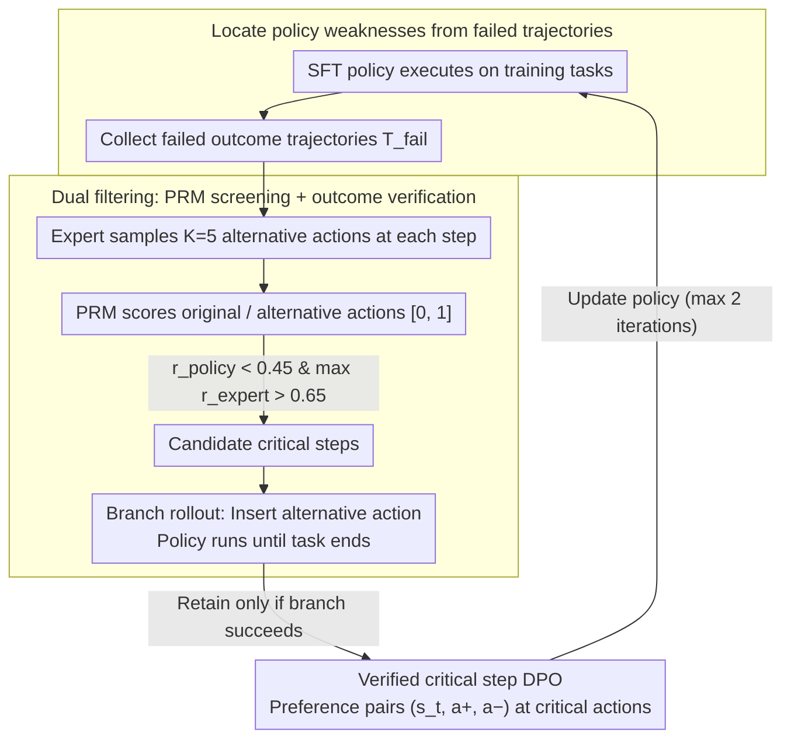

# Verified Critical Step Optimization for LLM Agents

**Conference**: ACL2026 Findings  
**arXiv**: [2602.03412](https://arxiv.org/abs/2602.03412)  
**Code**: https://github.com/kiaia/CSO; https://github.com/Tencent/CognitiveKernel-Pro  
**Area**: LLM Agent  
**Keywords**: LLM Agent, Critical Step Optimization, DPO, Process Reward Model, Credit Assignment  

## TL;DR
CSO identifies "verified critical steps" from an agent's own failed trajectories—specific points where "changing a single action leads to task success." By constructing DPO preference pairs only at these critical decision points, it enhances the post-training effectiveness of long-horizon LLM agents using fewer but more reliable supervisory signals.

## Background & Motivation
**Background**: LLM agents are increasingly handling long-horizon tasks, such as web searches, tool calls, file operations, and multi-step information synthesis. The standard post-training pipeline involves SFT on high-quality trajectories followed by RL or preference optimization to improve execution. Unlike chat models, agent outputs are trajectories consisting of interleaved states, actions, and observations.

**Limitations of Prior Work**: Trajectory-level methods apply success/failure rewards to the entire sequence, which often penalizes reasonable steps in failed trajectories or reinforces accidental errors in successful ones. While dense step-level methods seem more granular, they typically rely on PRM estimates for every step; PRM noise tends to amplify in long-horizon tasks. Monte Carlo-style step rewards require rollouts from every intermediate state, which is computationally expensive.

**Key Challenge**: Not every step in an agent's trajectory is equally worth learning. Many steps are merely sequential executions or information transfers. Success or failure is often determined by a few pivotal branching points, such as selecting the right tool or writing an effective search query. Post-training requires precise credit assignment without modeling all steps uniformly.

**Goal**: The authors aim to establish a method between trajectory-level DPO and expensive online RL: learning only those critical steps verified to change the final outcome. This avoids the coarse granularity of trajectory-level rewards and the unreliability of step-wise PRM estimates.

**Key Insight**: Drawing from the observation in RLVR that "a few high-entropy tokens drive effective learning," this paper treats critical actions in long-horizon agents as sparse learning locations. Starting from failed trajectories of the current policy, it allows an expert to provide candidate alternative actions and uses outcome verification to determine if these actions truly flip a failure to a success.

**Core Idea**: First, use a PRM to efficiently filter candidate critical steps where the "policy action is poor but the expert alternative is good." Then, perform a branch rollout from the alternative action to the end of the task. Only branches that result in a verified success are constructed as DPO preference pairs.

## Method
The core of CSO is not to provide more accurate rewards for every step, but to change how training data is constructed. It treats agent post-training as a process of "locating critical errors from failures." The current policy executes tasks to collect failed trajectories; at each potential decision point, an expert model generates alternative actions. A PRM performs initial filtering of candidate critical points, followed by the policy itself completing the task from that expert action. Only if the branch ultimately succeeds is the step considered a verified critical step, forming a DPO preference pair where the "expert alternative is better than the original policy action."

### Overall Architecture
The paper formalizes an agent trajectory as $\tau=(s_1,a_1,o_1,\ldots,s_T,a_T,o_T)$, where $s_t$ includes the task and history, $a_t$ is the action, and $o_t$ is the observation. The outcome $y\in\{0,1\}$ indicates task success. After an initial SFT to obtain $\pi_\theta$, the model still fails at specific critical decisions.

CSO consists of six steps: 1) Deploy the current policy to collect failed trajectories. 2) Sample $K=5$ alternative actions using an expert model at each step of the failed trajectories. 3) Score the original policy action and expert alternatives using a PRM. 4) Identify candidate critical steps where $r^{policy}_t<\gamma_{low}$ and $max_j r^{expert}_{t,j}>\gamma_{high}$ ($\gamma_{low}=0.45, \gamma_{high}=0.65$). 5) Perform branch rollouts for high-scoring expert alternatives where the policy completes the task. 6) Retain only successfully verified branches to construct $(s_t,a_t^+,a_t^-)$ preference pairs for DPO.

### Key Designs

**1. Locate policy weaknesses from failed trajectories: Aligning training data with the model's actual error distribution**

If the model only generalizes from expert demonstrations, it may learn actions beyond its capability. If it only looks at its own successes, it cannot identify specific weaknesses. CSO instead collects failed trajectories $\mathcal{T}_{fail}$ by executing the current policy. These trajectories provide semi-on-policy state coverage, ensuring learning signals target the exact points where the model needs correction rather than unreachable expert states.

**2. Dual filtering with PRM screening + outcome verification: Downgrading PRM from supervisor to retriever**

Step-level methods often use PRM scores as direct rewards, but PRM noise can amplify in long tasks. Conversely, Monte Carlo verification for every step is too costly. CSO decouples these: the PRM acts as a candidate retriever to find steps where the original action is low-scored but at least one expert alternative is high-scored ($r^{policy}_t < 0.45$ and $\max_j r^{expert}_{t,j} > 0.65$). Then, branch rollouts are performed only for these candidates to confirm via final task success if the step was truly a "game-changer." This ensures high recall via PRM and high precision via verification, avoiding both excessive compute and PRM noise contamination.

**3. Verified critical step DPO: Learning signals applied only to outcome-impacting local actions**

Trajectory-level DPO compares whole sequences, resulting in coarse credit assignment. CSO focuses solely on verified critical actions to build preference pairs $(s_t, a_t^+, a_t^-)$, where $a_t^+$ is the expert action that enabled success and $a_t^-$ is the original failed policy action. The loss function is defined as:

$$L_{CSO}=-\mathbb{E}\log\sigma\!\Big(\beta\log\frac{\pi_\theta(a_t^+|s_t)}{\pi_{ref}(a_t^+|s_t)}-\beta\log\frac{\pi_\theta(a_t^-|s_t)}{\pi_{ref}(a_t^-|s_t)}\Big)$$

By concentrating preference on sparse critical actions, the model reduces interference from irrelevant tokens and achieves much finer credit assignment.

### Loss & Training
The base model is CK-Pro-8B, an agent policy based on Qwen3-8B SFT, running in the Cognitive Kernel Pro framework. Training data is derived from 47K SFT task trajectories. Claude-3.7-Sonnet serves as both the expert model and the PRM (using a rubric-based prompt). DPO training utilizes LlamaFactory with $\beta=0.5$. The framework supports iterative training; after updating the policy, new failure trajectories are collected to form a new $\mathcal{D}_{pref}$, with the previous policy serving as the reference for at most 2 rounds.

## Key Experimental Results

### Main Results
Evaluation is conducted on GAIA-Text-103 (textual subset of GAIA L1/L2/L3) and XBench-DeepSearch2505. Comparisons use an LLM judge to verify output correctness against gold answers.

| Model/Method | GAIA L1 | GAIA L2 | GAIA L3 | GAIA All | XBench Score |
|-----------|---------|---------|---------|----------|--------------|
| GPT-4.1 | 56.4 | 44.2 | 16.7 | 45.6 | 27.0 |
| Claude-3.7-Sonnet | 76.9 | 57.7 | 33.3 | 62.1 | 41.0 |
| Qwen3-8B | 35.9 | 13.5 | 0.0 | 20.4 | 7.0 |
| CK-Pro-8B (SFT) | 46.2 | 34.6 | 8.3 | 35.9 | 23.0 |
| CK-Pro-8B + ETO | 51.2 | 36.5 | 8.3 | 38.9 | 22.0 |
| CK-Pro-8B + RFT | 51.2 | 28.8 | 8.3 | 34.9 | 20.0 |
| CK-Pro-8B + Step-DPO | 53.3 | 34.6 | 8.3 | 38.9 | 25.0 |
| CK-Pro-8B + IPR | 56.4 | 42.3 | 16.7 | 44.6 | 24.0 |
| CK-Pro-8B + CSO | 61.5 | 48.1 | 16.7 | 49.5 | 29.0 |

### Ablation Study

| Configuration | GAIA-Text | Sample Size / Cost | Note |
|------|-----------|------------|------|
| Expert Success + Expert Failure | 46.6 | Same set of critical steps | Compares expert's own steps; less relevant to policy weaknesses |
| Policy Success + Policy Failure | 42.7 | Same set of critical steps | Policy success quality is limited; weak learning signal |
| Expert Success + Policy Failure | 49.5 | Same set of critical steps | Optimal: high-quality positive, policy-failure negative |
| PRM + Verification | 49.5 | 671 preference pairs | Best performance with least samples |
| w/o PRM | 48.5 | 1,967 preference pairs | Similar performance but ~3x verification cost |
| w/o Verification | 43.6 | 4,126 preference pairs | PRM-only noise is significant; performance drops sharply |

### Key Findings
- CSO improves GAIA-Text-103 from 35.9 (SFT) to 49.5 (~37% relative gain) and XBench from 23.0 to 29.0 (~26% relative gain).
- The 8B open-source agent with CSO reaches 49.5 on GAIA All, surpassing GPT-4.1 (45.6), proving critical step training significantly boosts small model performance.
- IPR also uses outcome-grounded signals but propagates them across more steps; CSO focus on verified critical steps leads to a 5.0-point GAIA lead over IPR.
- Error distribution at critical steps: tool call errors (26.1%), reasoning (25.1%), comprehension (13.0%), and information extraction (11.7%).

## Highlights & Insights
- The most compelling aspect is "downgrading" the PRM to a "candidate retriever." Like a high-recall first stage in retrieval systems, it allows for noise while the final decision is made by the ground-truth outcome.
- Learning from failed trajectories is highly suited for agents; errors are often specific to the framework or tool constraints. Fixing the model where it actually fails is more precise than broadly imitating expert successes.
- The "reachability" design is crucial: because rollouts are completed by the policy itself, the positive example is not an unreachable expert trajectory, but a trajectory the model *can* complete given a better starting point.

## Limitations & Future Work
- Outcome verification requires running branches to completion, which can be time-consuming in complex environments.
- Main experiments rely on Claude-3.7-Sonnet as the expert/PRM. While GPT-4.1 and Qwen3-235B show gains, the strongest results depend on high-tier closed models.
- The method requires a reliable way to judge final success. For open-ended or subjective tasks without gold answers, defining "verified outcome" is difficult.

## Related Work & Insights
- **vs Trajectory-level ETO/DPO**: ETO uses entire trajectories, leading to coarse credit assignment; CSO isolates critical steps to avoid penalizing irrelevant actions.
- **vs Step-DPO / AgentRPM**: Step-level methods rely on noisy PRM scores for every step; CSO uses PRM just for filtering and verifies with final outcomes.
- **vs IPR**: IPR propagates outcome signals across steps; CSO uses a triple-filter ("low policy score + high expert score + branch success") to isolate sparse critical points.

## Rating
- Novelty: ⭐⭐⭐⭐⭐ The "verified critical step" as a training unit is ingenious, effectively combining PRM, branch rollouts, and DPO.
- Experimental Thoroughness: ⭐⭐⭐⭐☆ Extensive main experiments and ablations; however, verification on open-ended tasks is still needed.
- Writing Quality: ⭐⭐⭐⭐☆ Clear problem decomposition and pipeline description; tables are well-supported.
- Value: ⭐⭐⭐⭐⭐ Highly valuable for credit assignment in long-horizon agents, particularly for systems requiring recursive search and tool usage.

<!-- RELATED:START -->

## Related Papers

- [\[ACL 2026\] Hierarchical Reinforcement Learning with Augmented Step-Level Transitions for LLM Agents](hierarchical_reinforcement_learning_with_augmented_step-level_transitions_for_ll.md)
- [\[ACL 2026\] SEARL: Joint Optimization of Policy and Tool Graph Memory for Self-Evolving Agents](searl_joint_optimization_of_policy_and_tool_graph_memory_for_self-evolving_agent.md)
- [\[AAAI 2026\] DEPO: Dual-Efficiency Preference Optimization for LLM Agents](../../AAAI2026/llm_agent/depo_dual-efficiency_preference_optimization_for_llm_agents.md)
- [\[ACL 2026\] Agent-GWO: Collaborative Agents for Dynamic Prompt Optimization in Large Language Models](agent-gwo_collaborative_agents_for_dynamic_prompt_optimization_in_large_language.md)
- [\[ICLR 2026\] Exploratory Memory-Augmented LLM Agent via Hybrid On- and Off-Policy Optimization](../../ICLR2026/llm_agent/exploratory_memory-augmented_llm_agent_via_hybrid_on-_and_off-policy_optimizatio.md)

<!-- RELATED:END -->
