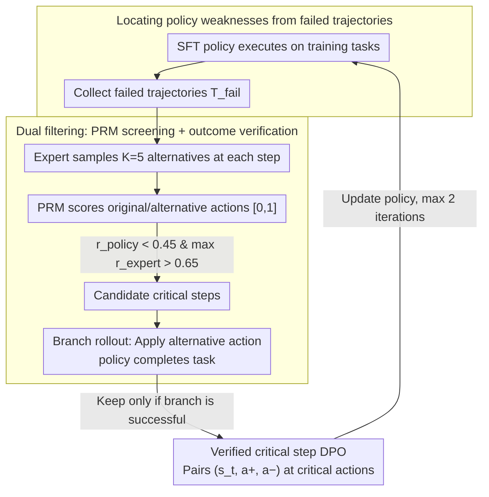

# Verified Critical Step Optimization for LLM Agents

**Conference**: ACL2026 Findings  
**arXiv**: [2602.03412](https://arxiv.org/abs/2602.03412)  
**Code**: https://github.com/kiaia/CSO; https://github.com/Tencent/CognitiveKernel-Pro  
**Area**: LLM Agent  
**Keywords**: LLM Agent, Critical Step Optimization, DPO, Process Reward Model, Credit Assignment  

## TL;DR
CSO identifies "verified critical steps" from an agent's own failed trajectories where "changing a single action leads to task success." It constructs DPO preference pairs only at these critical decision points, enhancing the post-training performance of long-horizon LLM agents with fewer and more reliable supervisory signals.

## Background & Motivation
**Background**: LLM agents are handling increasingly long-horizon tasks, such as web searching, tool calling, file manipulation, and multi-step information synthesis. The common post-training pipeline involves SFT using high-quality trajectories followed by RL or preference optimization to improve execution capabilities. Unlike pure chat models, the output of an agent is a trajectory composed of alternating states, actions, and observations.

**Limitations of Prior Work**: Trajectory-level methods apply success/failure rewards to the entire trajectory, which prone to punishing reasonable steps in failed trajectories or inadvertently reinforcing accidental errors in successful ones. Dense step-level methods appear more granular but often rely on PRM score estimations for every step, where PRM noise can be amplified in long-horizon tasks. Monte Carlo-style step rewards require rollouts from every intermediate state, which is computationally expensive.

**Key Challenge**: Not every step in an agent trajectory is worth learning. Many steps are merely sequential executions or information transfers; success or failure is determined by a few bifurcation points—such as choosing the right tool, writing a search query, or extracting evidence from a page. Post-training requires precise credit assignment but should not model all steps equally.

**Goal**: The authors aim to find a method positioned between trajectory-level DPO and expensive online RL: learning only those critical steps verified to change the final outcome. This avoids the coarse rewards of full trajectories and the unreliability of step-wise PRM estimates.

**Key Insight**: Drawing inspiration from the observation in RLVR that "a few high-entropy tokens drive effective learning," the paper treats critical actions in long-horizon agents as similar sparse learning positions. Starting from failed trajectories of the current policy, the method allows an expert to provide candidate alternative actions, then uses outcome verification to determine if these actions truly flip a failed branch into a successful one.

**Core Idea**: Use a PRM to efficiently filter candidate critical steps ("bad policy action, good expert alternative"), then verify the result by continuing the rollout from the alternative action to the end of the task. Only branches that are verified as successful are used to construct DPO preference pairs.

## Method
The core of CSO is not to provide more accurate rewards for every step, but to change how training data is constructed. It treats agent post-training as a process of "locating critical errors from failures": letting the current policy actually execute tasks and collecting failed trajectories; at each potential decision point, letting an expert generate several alternative actions; using a PRM to pre-screen candidate critical points; and then attaching the expert's alternative action to the original trajectory state for the policy to complete. Only if the branch ultimately succeeds is the step considered a verified critical step, and the "expert alternative action > original policy action" comparison is used for DPO.

### Overall Architecture
The paper formalizes an agent trajectory as $\tau=(s_1,a_1,o_1,\ldots,s_T,a_T,o_T)$, where $s_t$ contains the original task and interaction history, $a_t$ is the action taken by the policy at that state, $o_t$ is the observation returned by the environment, and the final outcome $y\in\{0,1\}$ indicates success. The model is first SFT-ed to obtain a basic policy $\pi_\theta$, which may still fail at critical decision points.

CSO consists of six steps: First, deploy the current policy to collect failed trajectories. Second, sample $K=5$ alternative actions using an expert model at each step of the failed trajectories. Third, score both the policy's original action and the expert's alternatives using a PRM in $[0,1]$. Fourth, identify candidate critical steps where $r^{policy}_t<\gamma_{low}$ and $max_j r^{expert}_{t,j}>\gamma_{high}$ (in main experiments, $\gamma_{low}=0.45$ and $\gamma_{high}=0.65$). Fifth, perform branch rollouts for high-scoring expert alternatives where the policy completes the task. Sixth, retain only the successful branches to construct $(s_t,a_t^+,a_t^-)$ preference pairs for DPO training.

### Key Designs

**1. Locating policy weaknesses from failed trajectories: Aligning training data with the distribution where the model actually errs**

If learning only generalizes from expert success demonstrations, the model might learn actions beyond its own capability; if looking only at successful trajectories, the model's specific shortcomings remain unknown. CSO does the opposite: it lets the current policy execute on training tasks to collect failed trajectories $\mathcal{T}_{fail}$. All subsequent candidate critical steps originate only from these failures. Failed trajectories naturally provide semi-on-policy state coverage, ensuring learning signals target the exact points where the model needs correction rather than unreachable expert states.

**2. PRM screening + outcome verification: Demoting the PRM from a supervisor to a recaller**

Step-level methods often use PRM scores directly as rewards, but PRM estimates are noisy and amplified in long-horizon tasks. Conversely, performing Monte Carlo verification for every step is too expensive. CSO decouples these: the PRM acts only as a candidate recaller to find steps where "the original action is low-scoring while at least one expert alternative is high-scoring." Specifically, positions satisfying $r^{policy}_t < \gamma_{low}$ and $\max_j r^{expert}_{t,j} > \gamma_{high}$ are retained. Only these high-scoring expert alternatives undergo branch rollouts to verify if the step truly enables a "turnaround" via final task success. The PRM ensures high-recall screening while outcome verification ensures precise final judgment, avoiding the need to verify massive branches or letting PRM noise contaminate the training objective.

**3. Verified critical step DPO: Applying learning signals only to local actions that change outcomes**

Trajectory-level DPO compares entire success/failure trajectories, leading to coarse credit assignment where reasonable steps in a failure are punished and accidental errors in a success are reinforced. CSO only constructs preference pairs $(s_t, a_t^+, a_t^-)$ for verified critical steps, where $a_t^+$ is the expert alternative that led to success and $a_t^-$ is the original policy action from the failed trajectory. The training objective is:

$$L_{CSO}=-\mathbb{E}\log\sigma\!\Big(\beta\log\frac{\pi_\theta(a_t^+|s_t)}{\pi_{ref}(a_t^+|s_t)}-\beta\log\frac{\pi_\theta(a_t^-|s_t)}{\pi_{ref}(a_t^-|s_t)}\Big)$$

By concentrating preference only on sparse critical actions, the interference from irrelevant tokens is minimized, making credit assignment far more precise than trajectory-level methods.

### A Complete Example: How a failed trajectory becomes a preference pair

Suppose a policy produces a 12-step failed trajectory on a GAIA task. CSO first samples $K=5$ alternative actions per step using an expert model and scores them with a PRM. Most steps are skipped because the policy action is already high-scoring or alternatives are not significantly better. At step 7, the policy selected the wrong search tool (score 0.3), while an expert alternative (using web search with a rewritten query, score 0.8) satisfied the conditions $r^{policy}<0.45$ and $\max_j r^{expert}>0.65$. The system then grafts this expert alternative at step 7 and lets the policy execute the remaining steps. If the task succeeds, step 7 is confirmed as a verified critical step, creating the pair $(s_7,\,a_7^+\!=\text{Web Search Action},\,a_7^-\!=\text{Original Tool Action})$. Note that the positive example is "reachable" because subsequent steps are performed by the policy itself—it learns a path success from a better starting point rather than a complete expert demo. After this filtering, only about 671 high-quality pairs remain in the full dataset for one round.

### Loss & Training
The base model is CK-Pro-8B, an agent policy based on Qwen3-8B SFT, running in the Cognitive Kernel Pro framework. Training data is collected by executing the CK-Pro-8B policy on 47K SFT tasks to find failures. Both the expert model and PRM in main experiments use Claude-3.7-Sonnet. The PRM uses rubric-based prompts evaluating code correctness, task relevance, logic, information utilization, and reasoning quality. DPO training uses LlamaFactory with $\beta=0.5$. The framework supports iterative training: after each policy update, it re-collects failed trajectories and constructs new $\mathcal{D}_{pref}$ using the previous policy as a reference, for up to 2 rounds.

## Key Experimental Results

### Main Results
Experiments use GAIA-Text-103 and XBench-DeepSearch2505. GAIA-Text-103 is a text subset of GAIA with L1/L2/L3 difficulties; XBench-DeepSearch tasks require deep searching and evidence synthesis. Evaluation follows the WebThinker/CK-Pro-8B protocol using an LLM judge with gold answers to determine correctness.

| Model/Method | GAIA L1 | GAIA L2 | GAIA L3 | GAIA All | XBench Score |
|-----------|---------|---------|---------|----------|--------------|
| GPT-4.1 | 56.4 | 44.2 | 16.7 | 45.6 | 27.0 |
| Claude-3.7-Sonnet | 76.9 | 57.7 | 33.3 | 62.1 | 41.0 |
| Qwen3-8B | 35.9 | 13.5 | 0.0 | 20.4 | 7.0 |
| CK-Pro-8B (SFT) | 46.2 | 34.6 | 8.3 | 35.9 | 23.0 |
| CK-Pro-8B + ETO | 51.2 | 36.5 | 8.3 | 38.9 | 22.0 |
| CK-Pro-8B + RFT | 51.2 | 28.8 | 8.3 | 34.9 | 20.0 |
| CK-Pro-8B + Step-DPO | 53.3 | 34.6 | 8.3 | 38.9 | 25.0 |
| CK-Pro-8B + IPR | 56.4 | 42.3 | 16.7 | 44.6 | 24.0 |
| CK-Pro-8B + CSO | 61.5 | 48.1 | 16.7 | 49.5 | 29.0 |

### Ablation Study

| Configuration | GAIA-Text | Samples/Cost | Description |
|------|-----------|------------|------|
| Expert Success + Expert Failure | 46.6 | Same critical step set | Compares expert success vs expert fail; less relevant to policy weaknesses |
| Policy Success + Policy Failure | 42.7 | Same critical step set | Limited quality of policy success actions; weaker signal |
| Expert Success + Policy Failure | 49.5 | Same critical step set | Optimal combination; high-quality positive, negative from real policy failure |
| PRM + Verification | 49.5 | 671 preference pairs | Best performance with fewest samples |
| w/o PRM | 48.5 | 1,967 preference pairs | Comparable perf but ~3x verification cost |
| w/o Verification | 43.6 | 4,126 preference pairs | PRM-only noise is evident; performance drops significantly |

| Analysis | Result | Implication |
|--------|------|------|
| Branch candidates $k=3$ | GAIA 46.6, XBench 26.0 | Insufficient candidates, poor exploration |
| Branch candidates $k=5$ | GAIA 49.6, XBench 29.0 | Optimal cost-benefit balance |
| Larger branch candidates | GAIA 49.6, XBench 28.0 | Saturated gains, increased verification cost |
| PRM Claude-3.7-Sonnet | CSO 61.5, Step-level BoN 56.2 | CSO outperforms direct PRM action selection |
| PRM GPT-4.1 | CSO 53.3, Step-level BoN 48.7 | PRM quality matters, but verification mitigates noise |
| Extra tokens per round | CSO ~168M, Step-DPO ~141M, ETO ~212M | CSO is 19% higher than Step-DPO but much lower than ETO |

### Key Findings
- CSO improves GAIA-Text-103 score from 35.9 (SFT) to 49.5 (approx. 37% gain) and XBench from 23.0 to 29.0 (approx. 26% gain).
- The 8B open-source agent with CSO achieves 49.5 on GAIA All, surpassing GPT-4.1 (45.6), demonstrating that critical step post-training significantly amplifies small model execution.
- IPR also uses outcome-grounded signals but propagates them to more steps. CSO's focus on sparse verified critical steps leads to a 5.0 point lead on GAIA All over IPR.
- Error analysis shows critical steps are distributed: Tool Calling (26.1%), Reasoning (25.1%), Others (24.1%), Task Understanding (13.0%), and Information Extraction (11.7%). CSO captures diverse semantic decision points.

## Highlights & Insights
- The most significant contribution is demoting the PRM from a "supervisor" to a "recaller." This mimics a high-recall first stage in retrieval: PRM noise is tolerated because the final judgment is verified against outcomes.
- Starting from failed trajectories is ideal for agents. Agent errors are often tied to specific frameworks, tools, or prompt formats. Fixing the policy where it actually fails is more precise than learning generalized expert successful trajectories.
- The "reachability" design is crucial: branch rollout steps are completed by the policy itself. Thus, the positive example is not an unreachable expert demo, but a trajectory the policy can successfully complete given a better critical action.
- CSO's principles can migrate to code agents, web agents, and research agents: no need for dense rewards for every step, just find the few tool calls, queries, or parses that change the outcome.

## Limitations & Future Work
- Outcome verification requires executing branches to completion, which is time-consuming in complex online settings. While token costs are manageable, real-time wall-clock and tool costs are more sensitive.
- Main experiments rely on Claude-3.7-Sonnet as both expert and PRM. Although GPT-4.1 and Qwen3-235B show gains, the strongest results come from closed-source models.
- The method requires reliable outcome judgment (e.g., gold answers). For open-ended tasks or subjective workflows, defining a verified outcome is challenging.
- The PRM is not jointly trained with the policy; if policy improvements lead to new error types, the PRM rubrics may need dynamic adaptation.

## Related Work & Insights
- **vs Trajectory-level ETO/DPO**: ETO learns from whole trajectories, leading to coarse credit assignment. CSO builds preferences only for verified critical steps, avoiding punishment for irrelevant steps.
- **vs Step-DPO / AgentRPM**: Step-level methods rely on noisy PRM estimates for every step. CSO uses PRM for recall and verification for precision, preventing PRM noise from contaminating objectives.
- **vs IPR**: IPR uses verification for step signals but may contaminate non-critical steps. CSO's triple condition (low policy score + high expert score + branch success) focuses strictly on sparse critical points.
- **vs Online RLVR**: RLVR is closer to the policy distribution but suffers from high rollout costs and sparse rewards. CSO achieves stable data efficiency via offline/semi-online DPO.

## Rating
- Novelty: ⭐⭐⭐⭐⭐ The concept of "verified critical step" is a clear and innovative training unit combining PRM, branch rollouts, and DPO.
- Experimental Thoroughness: ⭐⭐⭐⭐☆ Main experiments, data source ablations, PRM analyses, and cost comparisons are solid; open-ended task validation is still needed.
- Writing Quality: ⭐⭐⭐⭐☆ Metrics and methodology are well-explained with strong visual/tabular support; some steps depend on external frameworks which may hinder reproduction.
- Value: ⭐⭐⭐⭐⭐ Extremely valuable for addressing credit assignment in long-horizon agents, particularly for systems involving tool use and deep search.

<!-- RELATED:START -->

## Related Papers

- [\[ACL 2026\] Hierarchical Reinforcement Learning with Augmented Step-Level Transitions for LLM Agents](hierarchical_reinforcement_learning_with_augmented_step-level_transitions_for_ll.md)
- [\[ACL 2026\] SEARL: Joint Optimization of Policy and Tool Graph Memory for Self-Evolving Agents](searl_joint_optimization_of_policy_and_tool_graph_memory_for_self-evolving_agent.md)
- [\[AAAI 2026\] DEPO: Dual-Efficiency Preference Optimization for LLM Agents](../../AAAI2026/llm_agent/depo_dual-efficiency_preference_optimization_for_llm_agents.md)
- [\[ICML 2026\] Self-evolving LLM agents with in-distribution Optimization](../../ICML2026/llm_agent/self-evolving_llm_agents_with_in-distribution_optimization.md)
- [\[ACL 2026\] Agent-GWO: Collaborative Agents for Dynamic Prompt Optimization in Large Language Models](agent-gwo_collaborative_agents_for_dynamic_prompt_optimization_in_large_language.md)

<!-- RELATED:END -->
