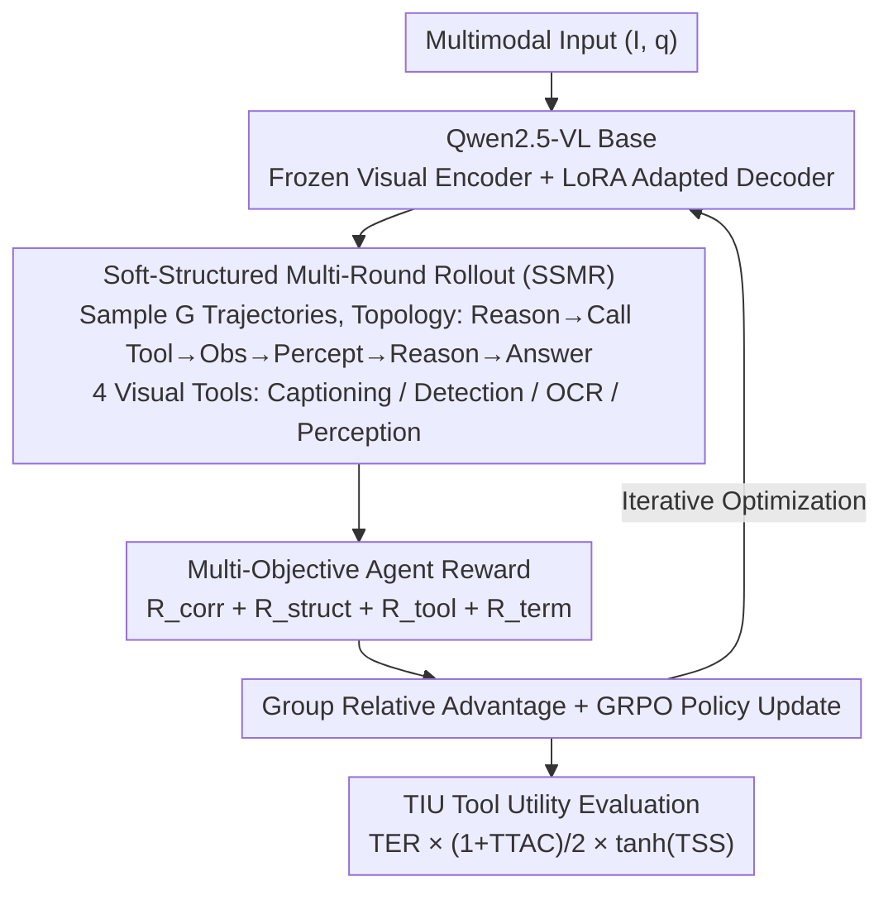

# Waking Up Blind: Cold-Start Optimization of Supervision-Free Agentic Trajectories

**Conference**: ACL 2026 Findings  
**arXiv**: [2604.17475](https://arxiv.org/abs/2604.17475)  
**Code**: [GitHub](https://github.com/ab-iitd/spectra)  
**Area**: Multimodal Agent / Visual Reasoning  
**Keywords**: Small VLM, Tool Calling, Cold-Start RL, Multi-Objective Reward, Agent Trajectory Optimization

## TL;DR

This paper proposes SPECTRA, a framework that requires no supervised trajectories. Through cold-start Reinforcement Learning (GRPO) and soft-structured multi-round rollout topology constraints, Small Vision-Language Models (SVLMs) autonomously discover effective tool-calling and visual reasoning behaviors in pure environment interactions. It improves task accuracy by up to 5% and tool efficiency by 9% across 4 multimodal benchmarks, while introducing the Tool Instrumental Utility (TIU) metric to quantify tool efficacy in unsupervised settings.

## Background & Motivation

**Background**: Small Vision-Language Models (SVLMs, such as Qwen2.5-VL-7B) are suitable as agent controllers due to low latency and deployment costs, but they lag behind large models in long-range reasoning, fine-grained visual perception, and tool orchestration. Existing improvement methods follow two paths: (1) Trajectory Fine-Tuning—supervised fine-tuning using synthetic tool-calling data (e.g., MM-Traj in T3-Agent), yielding ~20% gains; (2) Reinforcement Learning—e.g., Tool-R1 optimizing sampling efficiency for tool calls via RL.

**Limitations of Prior Work**: (1) Trajectory fine-tuning relies on expensive synthetic supervised data (usually distilled from large models), limiting scalability and generalization; (2) Existing methods optimizing tool-calling reasoning do not directly improve visual perception—tool usage and visual understanding are decoupled; (3) There is a lack of metrics to evaluate tool efficacy when labeled trajectory ground truths are absent—existing Tool Accuracy depends on ground truth trajectories.

**Key Challenge**: Equipping SVLMs with effective multi-step tool calling requires high-quality supervised trajectories, but acquiring these is expensive and restricts generalization. Can models start from zero (cold-start) and discover effective tool-usage strategies solely through environmental feedback?

**Goal**: (1) Design an unsupervised agent policy optimization method to bypass reliance on supervised trajectories; (2) Improve SVLM visual perception through structured rollout constraints; (3) Propose tool efficacy evaluation metrics that do not depend on ground truth.

**Key Insight**: It is observed that the "visual blind spots" of SVLMs can be mitigated by enforcing a structured sequence of tool calling-observation-perception—forcing the model to acquire visual evidence via tools first, then reason based on evidence, rather than reasoning directly from the raw image. This topological constraint serves as a structural prior for RL.

**Core Idea**: Utilizing GRPO reinforcement learning + soft-structured rollout topology constraints + multi-objective rewards (correctness + structural integrity + tool utility) to allow SVLMs to discover tool-driven visual reasoning strategies under cold-start conditions.

## Method

### Overall Architecture

SPECTRA enables SVLMs to learn the strategy of "evidence collection before reasoning" under cold-start conditions without any supervised trajectories, relying solely on environmental feedback. Using Qwen2.5-VL as the backbone, the visual encoder is frozen while the language decoder is adapted via LoRA. For each multimodal input $(I, q)$, $G$ structured rollout trajectories are sampled and scored by a multi-objective reward (correctness, structural integrity, tool utility, and termination). Relative group advantages are calculated to update the policy using GRPO. The action space consists of natural language tokens plus four visual tool primitives (Image Captioning, Object Detection, OCR, Visual Perception). The soft-structured topological constraint acts as "training wheels" to guide the model from blind direct reasoning toward tool-driven reasoning paths. After training convergence, the TIU metric evaluates tool performance without ground truth.

### Key Designs

**1. Soft-Structured Multi-Round Rollout (SSMR): Anchoring Reasoning to Visual Evidence via Topological Priors**

SVLMs reasoning directly from images are prone to visual hallucinations because they skip evidence collection. SSMR mandates that optimal trajectories follow the topological sequence $\tau = \langle reason \to tool \to obs \to percep \to reason \to ans \rangle$—reasoning to select a tool, obtaining the tool output (Observation), integrating the output with visual features (Perception), then reasoning again before answering. This forces the model to ground conclusions in tool-provided evidence.

This constraint is "soft": deviations are not strictly prohibited but penalized via a structural integrity reward $R_{struct} = \alpha \cdot \gamma^{\phi(\tau)}$ ($\alpha=2.0$, $\gamma=0.75$, where $\phi(\tau)$ measures the degree of deviation). Soft constraints provide sufficient inductive bias for cold-start learning while preserving exploration space—ablation shows a >5% drop on ScienceQA without it.

**2. Multi-Objective Agent Reward: Learning "Correct Answer" and "Correct Process"**

Correctness rewards alone may lead models to take shortcuts, such as guessing without tools or repeatedly using only OCR. SPECTRA decomposes the reward: $R_{total} = \lambda_1 R_{corr} + \lambda_2 R_{struct} + \lambda_3 R_{tool} + \lambda_4 R_{term}$. Task correctness $R_{corr} = C_1 \cdot \mathbb{1}(y_{pred} = y_{gt})$ governs the answer, $R_{struct}$ governs the trajectory topology, and the termination flag $R_{term}$ ensures convergence to a definitive answer.

The tool utility term is particularly novel: $R_{tool} = \mathbb{1}_{syntax} + \mathbb{1}_{success} + R_{div}$ rewards valid syntax, successful execution, and tool diversity. The diversity term $R_{div}$ includes per-tool saturation caps $\kappa$ and a global cap $\eta$, encouraging multi-tool usage while preventing reward hacking. All terms are normalized as $R_{Total} = S \times R_{total} / N_{norm}$ to align multi-objective signals.

**3. Tool Instrumental Utility (TIU): Quantifying Tool Efficacy without Ground Truth**

Existing Tool Accuracy metrics rely on labeled correct tool sequences, which is impossible in unsupervised settings. TIU synthesizes three dimensions that do not require labels: $TIU = TER \times \frac{1+TTAC}{2} \times \tanh(TSS)$. Tool Execution Reliability (TER) is the success rate of tool calls; Task-Tool Alignment Coefficient (TTAC) is the point-biserial correlation between tool usage and task success (positive values imply tools help); Tool Selectivity Score (TSS) is the KL divergence between tool usage distribution and a uniform distribution, where high values indicate strategic tool selection.

**Loss & Training**

GRPO Objective: $\mathcal{J}_{SPECTRA}(\theta) = \mathbb{E}[\frac{1}{G}\sum_i \frac{1}{|\tau_i|}\sum_t \min(\rho_{i,t} \hat{A}_{i,t}, \text{clip}(\rho_{i,t}, 1-\epsilon_l, 1+\epsilon_h)\hat{A}_{i,t})] - \psi D_{KL}(\pi_\theta \| \pi_{\theta_{ref}})$. Using the VERL framework + vLLM engine, LoRA fine-tuning is applied to Qwen2.5-VL (3B/7B), with 1000 training and 200 test samples per dataset.

## Key Experimental Results

### Main Results

**Benchmark Comparison (Accuracy %)**

| Model | AI2D | TQA | OK-VQA | ScienceQA | Avg. | MMMU-Pro(OOD) |
|------|------|-----|--------|-----------|------|-------------|
| GPT-4o | 76.5 | 77.0 | 88.5 | 86.0 | 82.0 | 61.8 |
| Qwen2.5-VL [7B] (base) | 63.8 | 74.6 | 71.5 | 73.5 | 70.9 | 40.5 |
| VERL Baseline [7B] | 67.5 | 73.3 | 74.6 | 78.3 | 73.4 | 44.3 |
| **Ours [7B]** | **71.1** | **77.5** | **79.6** | **83.1** | **77.8** | **46.7** |

**Tool Instrumental Utility (TIU, 7B variants)**

| Configuration | TER(%) | TTAC | TSS | TIU(%) |
|------|--------|------|-----|--------|
| Baseline Agent | 77.30 | -0.003 | 2.05 | 35.63 |
| **Ours** | **88.69** | **0.009** | **2.98** | **44.66** |

### Ablation Study

**Leave-one-out Reward Ablation (SPECTRA 7B)**

| Configuration | AI2D | TQA | OK-VQA | ScienceQA | Avg. |
|------|------|-----|--------|-----------|------|
| Full $R_{total}$ | 71.1 | 77.5 | 79.7 | 83.2 | 77.8 |
| w/o $R_{corr}$ | 68.5 | 78.5 | 80.5 | 77.5 | 76.2 |
| w/o $R_{struct}$ | 66.0 | 77.5 | 82.5 | 77.0 | 75.7 |
| w/o $R_{tool}$ | 74.5 | 74.0 | 79.5 | 78.0 | 76.5 |
| w/o $R_{term}$ | 72.0 | 75.5 | 77.5 | 78.0 | 75.7 |

### Key Findings

- SPECTRA 7B improves by 4.4 percentage points over the strongest VERL baseline, and by 2.4 points on OOD (MMMU-Pro).
- TIU increased from 35.63% to 44.66%—TER improved by 11.4% and TTAC shifted from negative to positive (tool usage became "positively correlated" with success).
- Trajectory Analysis: SPECTRA significantly increased Reason→Terminal correct paths (+48) and reduced Tool_Call→Tool_Call recursive loops (-103).
- On ScienceQA, removing any reward component resulted in a >5% drop, proving the multi-objective framework is critical for complex reasoning.
- The 3B variant showed consistent gains (60.3→63.9), proving efficacy for small models.

## Highlights & Insights

- The concept of "cold-start RL" is valuable—allowing models to discover tool-usage strategies without supervised trajectories reduces data costs. The structural prior (SSMR) provides the necessary inductive bias.
- The TIU metric's three-dimensional decomposition (reliability-alignment-selectivity) provides a reusable framework for unsupervised agent evaluation.
- The saturation design of the diversity reward $R_{div}$ is a practical trick—encouraging tool variety while preventing reward hacking, proving sturdier than simple counter rewards.

## Limitations & Future Work

- Only 4 visual tools are integrated; lacking code execution or search engines limits applicability to complex tasks requiring external knowledge.
- Despite correct final results, intermediate reasoning steps occasionally show hallucinations (e.g., fantasizing non-existent tools).
- Training and evaluation were conducted only on MCQ scenarios; performance on open-ended generation tasks remains unknown.
- Efficiency of cold-start learning depends on reasonable reward design; new tasks require re-designing reward signals.

## Related Work & Insights

- **vs T3-Agent**: T3-Agent uses automatically generated supervised trajectories (MM-Traj) for fine-tuning. SPECTRA is entirely unsupervised, reducing data costs, although T3-Agent may have a higher upper bound with sufficient supervision.
- **vs Tool-R1**: Tool-R1 uses RL to optimize tool calling but does not directly improve visual perception. SPECTRA anchors tool outputs to visual understanding via SSMR.
- **vs RL4VLM**: RL4VLM uses environmental rewards without structural priors. SPECTRA's topological constraints provide essential inductive bias for cold-start scenarios.

## Rating

- Novelty: ⭐⭐⭐⭐ Cold-start RL + Soft topology + TIU metric, though base technologies (GRPO, LoRA) are established.
- Experimental Thoroughness: ⭐⭐⭐⭐ 4 benchmarks + OOD + ablation + trajectory/qualitative analysis with full statistical testing.
- Writing Quality: ⭐⭐⭐⭐ Clear motivation, complete formulas, though dense notation requires careful reading.
- Value: ⭐⭐⭐⭐ Provides a practical framework for unsupervised agent training; the TIU metric is independently useful.

<!-- RELATED:START -->

## Related Papers

- [\[ACL 2026\] SynthAgent: Adapting Web Agents with Synthetic Supervision](synthagent_adapting_web_agents_with_synthetic_supervision.md)
- [\[ACL 2026\] BAPO: Boundary-Aware Policy Optimization for Reliable Agentic Search](bapo_boundary-aware_policy_optimization_for_reliable_agentic_search.md)
- [\[ICLR 2026\] Towards Scalable Oversight via Partitioned Human Supervision](../../ICLR2026/llm_agent/towards_scalable_oversight_via_partitioned_human_supervision.md)
- [\[ACL 2026\] Your LLM Agents are Temporally Blind: The Misalignment Between Tool Use Decisions and Human Time Perception](your_llm_agents_are_temporally_blind_the_misalignment_between_tool_use_decisions.md)
- [\[ACL 2026\] LPO: Towards Accurate GUI Agent Interaction via Location Preference Optimization](lpo_towards_accurate_gui_agent_interaction_via_location_preference_optimization.md)

<!-- RELATED:END -->
