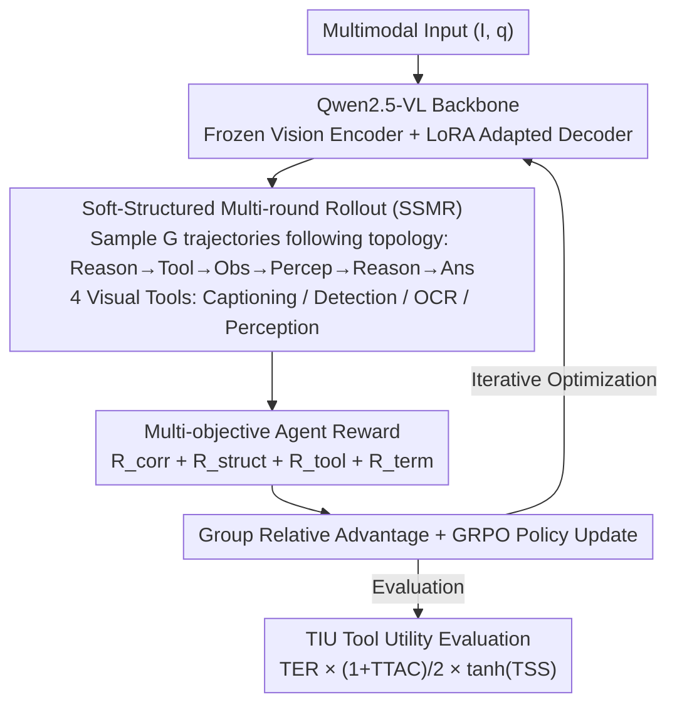

# Waking Up Blind: Cold-Start Optimization of Supervision-Free Agentic Trajectories

**Conference**: ACL 2026 Findings  
**arXiv**: [2604.17475](https://arxiv.org/abs/2604.17475)  
**Code**: [GitHub](https://github.com/ab-iitd/spectra)  
**Area**: Multimodal Agent / Visual Reasoning  
**Keywords**: Small VLM, Tool Calling, Cold-start RL, Multi-objective Reward, Agent Trajectory Optimization

## TL;DR

This paper proposes SPECTRA, a framework that requires no supervised trajectories. By utilizing cold-start Reinforcement Learning (GRPO) and soft-structured multi-round rollout topological constraints, it enables Small Vision-Language Models (SVLMs) to autonomously discover effective tool-calling and visual reasoning behaviors through pure environment interaction. It achieves up to a 5% increase in task accuracy and a 9% improvement in tool efficiency across 4 multimodal benchmarks, while introducing the Tool Instrumental Utility (TIU) metric to quantify tool efficacy in unsupervised settings.

## Background & Motivation

**Background**: Small Vision-Language Models (SVLMs, such as Qwen2.5-VL-7B) are suitable as Agent controllers due to low latency and deployment costs. However, they lag behind large models in long-range reasoning, fine-grained visual perception, and tool orchestration. Existing improvement methods follow two paths: (1) Trajectory Fine-tuning—using synthetic tool-calling data (e.g., T3-Agent's MM-Traj) for Supervised Fine-Tuning (SFT), yielding ~20% gains; (2) Reinforcement Learning—such as Tool-R1, which optimizes tool-calling sampling efficiency via RL.

**Limitations of Prior Work**: (1) Trajectory fine-tuning relies on expensive synthetic supervision data (usually distilled from large models), limiting scalability and generalization; (2) Existing methods for optimizing tool-calling reasoning do not directly improve visual perception—tool usage and visual understanding remain disjointed; (3) There is a lack of metrics to evaluate tool efficacy when no ground truth trajectories are available—existing Tool Accuracy relies on ground truth paths.

**Key Challenge**: Enabling SVLMs to learn effective multi-step tool calling requires high-quality supervised trajectories, but obtaining these trajectories is expensive and limits generalization. Can a model start from zero (cold-start) and discover effective tool-use strategies solely through environment feedback?

**Goal**: (1) Design an unsupervised Agent policy optimization method to bypass dependence on supervised trajectories; (2) Improve SVLM visual perception through structured rollout constraints; (3) Propose a tool efficacy evaluation metric that does not rely on ground truth.

**Key Insight**: It is observed that the "visual blind spots" of SVLMs can be mitigated by enforcing a structured sequence of tool calling-observation-perception. This forces the model to acquire visual evidence via tools and then reason based on that evidence, rather than reasoning directly from the raw image. This topological constraint serves as a structural prior for RL.

**Core Idea**: Utilize GRPO reinforcement learning combined with soft-structured rollout topological constraints and multi-objective rewards (correctness + structural integrity + tool utility) to allow SVLMs to discover tool-driven visual reasoning strategies under cold-start conditions.

## Method

### Overall Architecture

SPECTRA enables small vision-language models to autonomously learn the strategy of "evidence collection before reasoning" under cold-start conditions without any supervised trajectories. Using Qwen2.5-VL as the backbone, it freezes the visual encoder and uses LoRA for the language decoder. For each multimodal input $(I, q)$, $G$ structured rollout trajectories are sampled and scored using a multi-objective reward (correctness + structural integrity + tool utility + termination). Relative advantages within the group are calculated to update the policy via GRPO. The action space consists of natural language tokens and four visual tool primitives (Image Captioning, Object Detection, OCR, Visual Perception). Soft-structured topological constraints act as "training wheels," guiding the model from blind direct reasoning to tool-driven reasoning paths. After training convergence, the TIU metric is used to evaluate tool effectiveness without ground truth.

### Key Designs

**1. Soft-Structured Multi-round Rollout (SSMR): Anchoring Reasoning to Visual Evidence via Topological Priors**

SVLMs performing direct visual reasoning are prone to hallucinations because they skip evidence collection and answer based on impressions. SSMR mandates that optimal trajectories follow the topological sequence $\tau = \langle reason \to tool \to obs \to percep \to reason \to ans \rangle$. By first reasoning to select a tool, obtaining the tool output (Observation), and integrating the output with visual features (Perception) before final reasoning, the model is forced to base conclusions on evidence provided by tools.

This constraint is "soft": deviations are not strictly prohibited but are progressively penalized via a structural integrity reward $R_{struct} = \alpha \cdot \gamma^{\phi(\tau)}$ (where $\alpha=2.0$, $\gamma=0.75$, and $\phi(\tau)$ measures the degree of deviation). Exponential decay of the reward for higher deviation provides enough inductive bias for cold-start learning while maintaining exploration space—ablations show a drop of over 5% on ScienceQA without it.

**2. Multi-objective Agent Reward: Learning "Correct Process" Alongside "Correct Answer"**

Relying solely on correctness rewards leads to shortcuts, such as guessing answers without tools or repeatedly using only one tool like OCR. SPECTRA decomposes the reward into four parts: $R_{total} = \lambda_1 R_{corr} + \lambda_2 R_{struct} + \lambda_3 R_{tool} + \lambda_4 R_{term}$. While task correctness $R_{corr} = C_1 \cdot \mathbb{1}(y_{pred} = y_{gt})$ governs the accuracy, $R_{struct}$ manages topological adherence, and the termination flag $R_{term}$ ensures reasoning converges to a clear answer.

The tool utility term is particularly clever: $R_{tool} = \mathbb{1}_{syntax} + \mathbb{1}_{success} + R_{div}$ rewards legal syntax, successful execution, and diversity in tool usage. The diversity term $R_{div}$ includes per-tool saturation limits $\kappa$ and a global limit $\eta$, encouraging the use of multiple tools while preventing reward hacking through excessive tool calling. All terms are normalized as $R_{Total} = S \times R_{total} / N_{norm}$ to align multi-objective signals.

**3. Tool Instrumental Utility (TIU): Quantifying Tool Efficacy Without Ground Truth**

Existing Tool Accuracy metrics depend on annotated correct tool sequences, which are unavailable in unsupervised settings. TIU synthesizes a metric from three annotation-free dimensions: $TIU = TER \times \frac{1+TTAC}{2} \times \tanh(TSS)$. Tool Execution Reliability (TER) measures the success rate of tool calls, reflecting reliability. The Task-Tool Alignment Coefficient (TTAC) measures the point-biserial correlation between tool usage and task success; positive values indicate that tool usage helps in getting the right answer. The Tool Selectivity Score (TSS) is the KL divergence between the tool usage distribution and a uniform distribution, where high values indicate strategic tool selection.

These dimensions are bounded—$(1+TTAC)/2$ maps the correlation to $[0,1]$ and $\tanh(TSS)$ bounds selectivity—ensuring that failure in any single dimension significantly lowers the total score. This allows TIU to evaluate whether tools are being used reliably, relevantly, and selectively without relying on ground truth trajectories.

### Loss & Training

GRPO Objective: $\mathcal{J}_{SPECTRA}(\theta) = \mathbb{E}[\frac{1}{G}\sum_i \frac{1}{|\tau_i|}\sum_t \min(\rho_{i,t} \hat{A}_{i,t}, \text{clip}(\rho_{i,t}, 1-\epsilon_l, 1+\epsilon_h)\hat{A}_{i,t})] - \psi D_{KL}(\pi_\theta \| \pi_{\theta_{ref}})$. Using the VERL framework + vLLM engine, LoRA fine-tuning is applied to Qwen2.5-VL (3B/7B), with 1,000 training and 200 testing samples per dataset.

## Key Experimental Results

### Main Results

**Benchmark Comparison (Accuracy %)**

| Model | AI2D | TQA | OK-VQA | ScienceQA | Avg. | MMMU-Pro(OOD) |
|------|------|-----|--------|-----------|------|-------------|
| GPT-4o | 76.5 | 77.0 | 88.5 | 86.0 | 82.0 | 61.8 |
| Qwen2.5-VL [7B] (base) | 63.8 | 74.6 | 71.5 | 73.5 | 70.9 | 40.5 |
| VERL Baseline [7B] | 67.5 | 73.3 | 74.6 | 78.3 | 73.4 | 44.3 |
| **SPECTRA [7B]** | **71.1** | **77.5** | **79.6** | **83.1** | **77.8** | **46.7** |

**Tool Instrumental Utility (TIU, 7B Variant)**

| Configuration | TER(%) | TTAC | TSS | TIU(%) |
|------|--------|------|-----|--------|
| Baseline Agent | 77.30 | -0.003 | 2.05 | 35.63 |
| **SPECTRA** | **88.69** | **0.009** | **2.98** | **44.66** |

### Ablation Study

**Leave-one-out Reward Ablation (SPECTRA 7B)**

| Configuration | AI2D | TQA | OK-VQA | ScienceQA | Avg. |
|------|------|-----|--------|-----------|------|
| Full $R_{total}$ | 71.1 | 77.5 | 79.7 | 83.2 | 77.8 |
| w/o $R_{corr}$ | 68.5 | 78.5 | 80.5 | 77.5 | 76.2 |
| w/o $R_{struct}$ | 66.0 | 77.5 | 82.5 | 77.0 | 75.7 |
| w/o $R_{tool}$ | 74.5 | 74.0 | 79.5 | 78.0 | 76.5 |
| w/o $R_{term}$ | 72.0 | 75.5 | 77.5 | 78.0 | 75.7 |

### Key Findings

- SPECTRA 7B improves by an average of 4.4 percentage points over the strongest VERL baseline and by 2.4 points on OOD (MMMU-Pro).
- TIU increased from 35.63% to 44.66%—TER improved by 11.4% (tool execution success), and TTAC shifted from negative to positive (tool use moved from "irrelevant" to "positively correlated" with success).
- Trajectory Analysis: SPECTRA significantly increased Reasoning→Terminal correct paths (+48) and reduced Tool_Call→Tool_Call recursive loops (-103).
- On ScienceQA, removing any reward component led to a >5% drop, highlighting the importance of the full multi-objective framework for complex reasoning.
- Small model effectiveness: The 3B variant also showed consistent improvements (60.3→63.9).

## Highlights & Insights

- The concept of "Cold-start RL" is highly valuable—allowing models to discover tool-use strategies without supervised trajectories, significantly reducing data costs. The success hinges on the structural prior (SSMR) providing sufficient inductive bias.
- The TIU metric's three-dimensional decomposition (reliability-alignment-selectivity) provides a reusable framework for unsupervised Agent evaluation that can be migrated to other tool-calling scenarios.
- The saturation design of the reward diversity term $R_{div}$ is a practical trick—encouraging variety while preventing reward hacking, making it more robust than simple counting rewards.

## Limitations & Future Work

- Only 4 visual tools were integrated; the lack of general tools like code execution or search engines limits applicability to complex tasks requiring external knowledge.
- Despite correct final results, intermediate reasoning steps occasionally display hallucinations (e.g., fantasizing about non-existent tools).
- Training and evaluation were conducted only in MCQ scenarios; performance in open-ended generation tasks remains unknown.
- Efficiency in cold-start learning depends heavily on a well-designed reward structure—new tasks may require re-engineering the reward signals.

## Related Work & Insights

- **vs T3-Agent**: T3-Agent uses automatically generated supervised trajectories (MM-Traj) for fine-tuning. SPECTRA is fully unsupervised, reducing data costs, although T3-Agent might have a higher performance ceiling with sufficient supervised data.
- **vs Tool-R1**: Tool-R1 uses RL to optimize tool calls but does not directly improve visual perception. SPECTRA anchors tool outputs to visual understanding via SSMR.
- **vs RL4VLM**: RL4VLM uses environment rewards without structural priors. SPECTRA's topological constraints provide the critical inductive bias needed for cold-start learning.

## Rating

- Novelty: ⭐⭐⭐⭐ Cold-start RL + Soft topological constraints + TIU metric represent strong contributions, though base techniques (GRPO, LoRA) are established.
- Experimental Thoroughness: ⭐⭐⭐⭐ 4 benchmarks + OOD + Ablations + Trajectory analysis + Qualitative analysis with complete statistical testing.
- Writing Quality: ⭐⭐⭐⭐ Clear motivation and complete formulas, though dense notation requires careful reading.
- Value: ⭐⭐⭐⭐ Provides a practical framework for unsupervised Agent training; the TIU metric is independently useful.

<!-- RELATED:START -->

## Related Papers

- [\[ICLR 2026\] TusoAI: Agentic Optimization for Scientific Methods](../../ICLR2026/llm_agent/tusoai_agentic_optimization_for_scientific_methods.md)
- [\[ACL 2026\] BAPO: Boundary-Aware Policy Optimization for Reliable Agentic Search](bapo_boundary-aware_policy_optimization_for_reliable_agentic_search.md)
- [\[ACL 2026\] SynthAgent: Adapting Web Agents with Synthetic Supervision](synthagent_adapting_web_agents_with_synthetic_supervision.md)
- [\[ACL 2026\] Your LLM Agents are Temporally Blind: The Misalignment Between Tool Use Decisions and Human Time Perception](your_llm_agents_are_temporally_blind_the_misalignment_between_tool_use_decisions.md)
- [\[ICLR 2026\] Towards Scalable Oversight via Partitioned Human Supervision](../../ICLR2026/llm_agent/towards_scalable_oversight_via_partitioned_human_supervision.md)

<!-- RELATED:END -->
