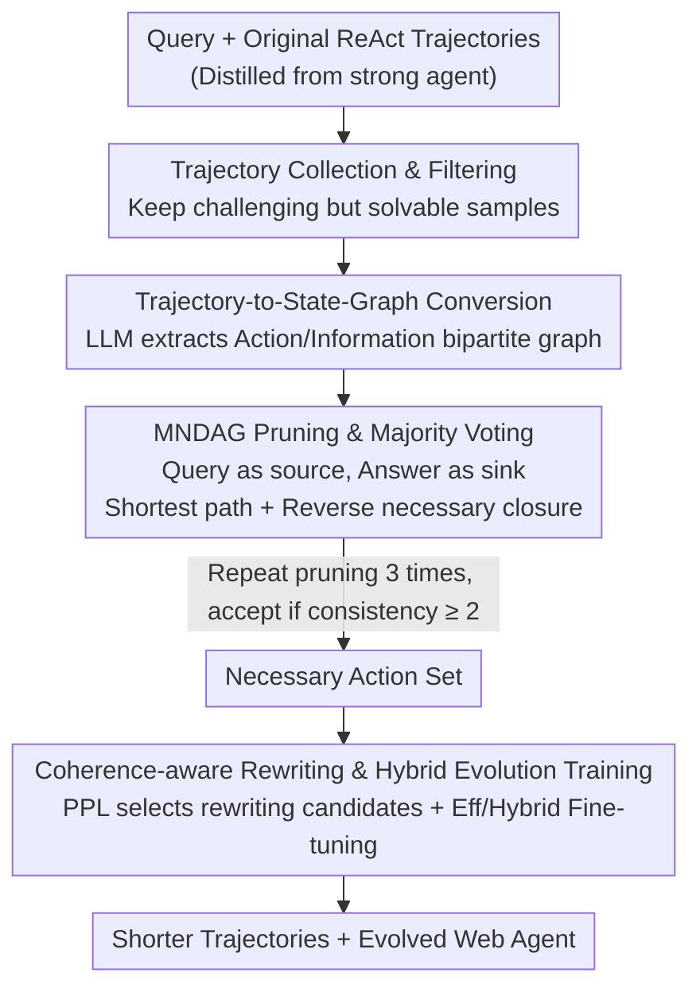

# WebClipper: Efficient Evolution of Web Agents with Graph-based Trajectory Pruning

**Conference**: ACL2026  
**arXiv**: [2602.12852](https://arxiv.org/abs/2602.12852)  
**Code**: https://github.com/AQ-MedAI/AntAFu-DeepResearch  
**Area**: LLM Agent  
**Keywords**: Web Agent, Trajectory Pruning, State Graph, Tool Call Efficiency, Agent Training

## TL;DR
WebClipper models long tool-call trajectories of Web Agents as "Action Node-Information Node" state graphs and mines the minimum necessary DAG to prune cyclic searches and invalid branches. This reduces the average tool rounds by approximately 21% and tokens by 19.4% for Deep Research agents while maintaining or even improving accuracy.

## Background & Motivation
**Background**: Deep Research-style Web Agents are capable of handling complex information retrieval tasks. Typical systems repeatedly search, visit webpages, run code, and finally generate answers. Existing open-source agents primarily pursue final accuracy by increasing coverage through longer contexts, deeper searches, and more tool calls.

**Limitations of Prior Work**: The "more searching is always better" strategy is costly in real-world deployment. Tongyi-DeepResearch allows up to 100 tool calls, and MiroThinker allows up to 600. If the backend uses commercial search, web parsing, or code execution tools, latency and costs rise rapidly. Furthermore, long trajectories do not necessarily lead to higher accuracy; many errors stem from repetitive verification, straying from the main problem, or following noisy branches.

**Key Challenge**: Effective information in Web Agent trajectories is often sparsely distributed. The final answer depends on only a few key actions and observations, yet training data retains all detour steps. Directly shortening trajectories easily breaks the ReAct structure, causing remaining thoughts to refer to deleted observations, which generates incoherent training signals.

**Goal**: Instead of training a new agent from scratch, the authors aim to evolve existing high-performance but low-efficiency Web Agents into versions that save on tool calls. The specific goal is to remove redundant searches, cyclic verifications, and invalid branches without sacrificing accuracy, using a unified metric to balance accuracy and efficiency.

**Key Insight**: The critical observation is that agent trajectories can be abstracted as state graphs where actions generate information and subsequent actions depend on existing information. Consequently, determining "which steps are truly necessary for the final answer" becomes a problem of mining the minimum necessary subgraph rather than relying on another LLM to subjectively judge each step.

**Core Idea**: Use graph structures to explicitly represent information dependencies in tool-call trajectories, mine the minimum necessary DAG from the initial query to the final answer, and then perform coherence-aware rewriting and continued training to teach the agent shorter, more focused search paths.

## Method
WebClipper is not an inference-time pruning method but a training data processing and agent evolution framework. It first distills raw trajectories from a strong agent, converts them into state graphs to identify the necessary action set, deletes redundant steps, rewrites broken thoughts, and finally uses these refined trajectories to fine-tune the original agent.

### Overall Architecture
The input consists of a batch of queries and ReAct trajectories generated by the original Web Agent, including initial observations, thoughts, actions, and new observations for each round. The output is a collection of shorter trajectories that still support the correct answer, along with an evolved agent trained on these trajectories.

The process is divided into four stages. First, initial trajectories are collected and filtered, keeping only samples that are challenging for the original agent but not impossible. Second, trajectories are converted into directed bipartite graphs consisting of Action nodes and Information nodes. Third, an approximate Minimum Necessary DAG (MNDAG) is discovered on the graph to identify the set of necessary actions. Fourth, coherence-aware thought rewriting is performed on the pruned trajectories, followed by efficiency-guided or hybrid training strategies to evolve the agent.

### Key Designs

**1. Trajectory-to-State-Graph Conversion: Restoring linear tool calls to information dependency graphs to track redundancy.**

Redundancy in long trajectories is not simply "long text" but useless loops and branches in the information dependency chain. It is difficult to judge whether a search contributed to the answer by looking at text alone. WebClipper abstracts the trajectory as a directed bipartite graph: Action node $A_t$ represents the thought and action of round $t$, and Information node $I_t$ represents the atomic information returned by the environment. If an action depends on information, an edge $I \rightarrow A$ is drawn; if it generates information, $A \rightarrow I$ is drawn. This graph is constructed by an LLM extractor that extracts action types and targets, splits observations into atomic information, and determines which information subsequent actions relied on.

**2. MNDAG Pruning & Majority Voting: Mining the minimum necessary DAG to retain only critical paths supporting the answer.**

Deleting turns based on semantic similarity or subjective LLM scores often accidentally removes key evidence. WebClipper defines pruning as a graph problem: the initial query node is the source, and the final answer action is the sink. Action nodes have a cost of 1, while Information nodes have a cost of 0, reflecting that tool calls are expensive whereas information itself is just evidence. It uses Dijkstra-style shortest path search to find low-cost paths and then performs a backward closure from the final answer to include all critical dependencies. To handle LLM instability, each trajectory is processed three times, and the pruned set is only accepted if the same result is reached at least twice.

**3. Coherence-aware Rewriting & Hybrid Evolution Training: Sewing pruned trajectories into natural ReAct data with a balance between efficiency and accuracy.**

Pruning makes two retained actions non-adjacent, and a subsequent thought might still refer to a deleted observation. Direct SFT would teach the model to "hallucinate" references to non-existent observations. WebClipper performs coherence-aware rewriting at the pruning points: generating multiple candidates based on full context and deleted steps, then selecting the version that best matches the base model's language style using perplexity (PPL). Two training strategies are offered: **Eff** uses only pruned trajectories for cost-sensitive deployment, while **Hybrid** mixes pruned trajectories with unpruned difficult trajectories from different queries to retain deep search capabilities when necessary.

### Loss & Training
The training objective is standard likelihood maximization. Efficiency-guided training optimizes $L_{eff}=-\sum_{\tilde{\tau}}\log P_M(\tilde{\tau})$ on the pruned set. Hybrid training optimizes $L_{hybrid}=-\sum_{\tau^*}\log P_M(\tau^*)$ on the union of pruned and unpruned hard trajectories. The evaluation uses the F-AE Score, a harmonic mean of accuracy and efficiency $E=1-Rounds/Max\_Rounds$: $F\text{-}AE=2\times Acc\times E/(Acc+E)$, where $Max\_Rounds=100$.

## Key Experimental Results

### Main Results
The authors used Tongyi-DeepResearch as the base agent, evaluating on xbench-deepsearch, Browsecomp, GAIA, and HLE. WebClipper(Eff) prioritizes tool-call savings, while WebClipper(Hybrid) prioritizes overall accuracy.

| Method | xbench Acc / F-AE / Rounds | Browsecomp Acc / F-AE / Rounds | GAIA Acc / F-AE / Rounds | HLE Acc / F-AE / Rounds |
|------|----------------------------|--------------------------------|--------------------------|-------------------------|
| Tongyi-DeepResearch | 0.713 / 0.779 / 14.26 | 0.410 / 0.385 / 63.70 | 0.682 / 0.733 / 20.56 | 0.358 / 0.487 / 23.92 |
| WebClipper (Eff) | 0.713 / 0.792 / 10.81 | 0.427 / 0.431 / 56.50 | 0.684 / 0.760 / 14.44 | 0.353 / 0.492 / 18.60 |
| WebClipper (Hybrid) | 0.733 / 0.797 / 12.57 | 0.467 / 0.428 / 60.42 | 0.695 / 0.744 / 19.92 | 0.361 / 0.495 / 21.07 |

Compared to the original Tongyi-DeepResearch, the Eff version reduces tool rounds by ~21% and tokens by 19.4% on average while maintaining or increasing accuracy. The Hybrid version improves average accuracy by ~4.8% while still reducing rounds by ~7%.

| Pruning/Training Method | xbench Acc / Rounds / Token | Browsecomp Acc / Rounds / Token | Main Conclusion |
|---------------|-----------------------------|----------------------------------|----------|
| Prompt Control | 0.676 / 12.50 / 6321 | 0.373 / 62.80 / 12222 | Round constraints via prompt reduce little and drop accuracy |
| Coarse Prune | 0.603 / 8.85 / 4774 | 0.220 / 37.10 / 8365 | Coarse pruning shortens trajectories but severely harms accuracy |
| WebClipper (Eff) | 0.713 / 10.81 / 5931 | 0.427 / 56.50 / 10599 | Maintains accuracy while significantly reducing calls |
| WebClipper (Hybrid) | 0.733 / 12.57 / 6205 | 0.467 / 60.42 / 11507 | Highest accuracy, efficiency still better than original |

### Ablation Study
Ablations verified three designs: Graph Pruning (GP), PPL-based rewrite selection (PPL-S), and Context-aware Selective Rewriting (CSR). Removing any component leads to degradation, with the removal of selective rewriting being most severe due to contradictory training signals.

| Ablation Config | Change | Observed Impact | Explanation |
|----------|------|--------------|----------|
| w/o GP | Use coarse-grained pruning | Performance drops | Single LLM judgments struggle with long-range dependencies |
| w/o PPL-S | No PPL selection | Performance drops | Rewritten thoughts mismatch base model style, shifting distribution |
| w/o CSR | Unconditional rewrite, no historical context | Severest degradation | Rewriting breaks logic and introduces inconsistent references |
| Unpruned-Distill | SFT with unpruned hard trajectories | Accuracy may rise, rounds lengthen | It amplifies capability but also reinforces inefficient behavior |

### Key Findings
- WebClipper(Eff) is particularly effective on GAIA, reducing rounds from ~20.56 to 14.44 (~30% reduction). GAIA contains many logic riddles not requiring long tool chains; pruning training inhibits over-reliance on external tools.
- The value of F-AE lies in not rewarding short trajectories alone. Models like Kimi have few rounds but low accuracy, resulting in low F-AE.
- Case studies show the baseline often shifts attention to trivial details (e.g., digging into minor materials after finding the paper). WebClipper learns to advance along the critical path.

## Highlights & Insights
- Trajectory compression is transformed from "shortening text" to "retaining information dependency paths," which is more suitable for tool-call scenarios than general CoT compression.
- The MNDAG design (Info cost 0, Action cost 1) is intuitive: tool calls are the expensive operations.
- Majority voting is a pragmatic engineering detail to handle the instability of LLM extractors.
- Coherence rewriting is a critical but often overlooked step to prevent "hallucinated references" in training data.

## Limitations & Future Work
- WebClipper inherits the capability boundaries of the base agent.
- Evaluation focuses on search, web access, and code execution; applicability to multi-modal tools or enterprise APIs needs verification.
- Graph construction and rewriting rely on heavy offline processing (e.g., Qwen3-235B on 8×H800).
- F-AE depends on the $Max\_Rounds$ setting. Real systems might need to consider token costs, latency, and API pricing simultaneously.

## Related Work & Insights
- **vs Deep Research / WebExplorer**: These emphasize search capability; WebClipper focuses on efficiency evolution, aiming for "fewer detours" rather than just "more search."
- **vs Prompt Control**: Prompt constraints are weak; WebClipper changes the search pattern through training data for more stable effects.
- **vs CoT Compression**: General compression handles text reasoning, while WebClipper handles ReAct trajectories with environment feedback, requiring action-observation consistency.

## Rating
- Novelty: ⭐⭐⭐⭐☆ 
- Experimental Thoroughness: ⭐⭐⭐⭐☆
- Writing Quality: ⭐⭐⭐⭐☆
- Value: ⭐⭐⭐⭐⭐

<!-- RELATED:START -->

## Related Papers

- [\[AAAI 2026\] Prune4Web: DOM Tree Pruning Programming for Web Agent](../../AAAI2026/llm_agent/prune4web_dom_tree_pruning_programming_for_web_agent.md)
- [\[ACL 2025\] Explorer: Scaling Exploration-Driven Web Trajectory Synthesis for Multimodal Web Agents](../../ACL2025/llm_agent/explorer_scaling_exploration-driven_web_trajectory_synthesis_for_multimodal_web_.md)
- [\[ACL 2026\] SEARL: Joint Optimization of Policy and Tool Graph Memory for Self-Evolving Agents](searl_joint_optimization_of_policy_and_tool_graph_memory_for_self-evolving_agent.md)
- [\[ICLR 2026\] ToolTree: Efficient LLM Agent Tool Planning via Dual-Feedback Monte Carlo Tree Search and Bidirectional Pruning](../../ICLR2026/llm_agent/tooltree_efficient_llm_agent_tool_planning_via_dual-feedback_monte_carlo_tree_se.md)
- [\[ACL 2026\] CoEvolve: Training LLM Agents via Agent-Data Mutual Evolution](coevolve_training_llm_agents_via_agent-data_mutual_evolution.md)

<!-- RELATED:END -->
