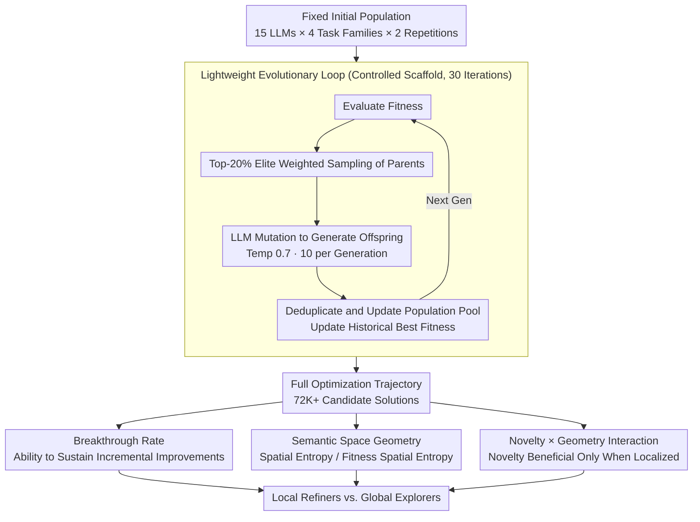

# What Makes an LLM a Good Optimizer? A Trajectory Analysis of LLM-Guided Evolutionary Search

**Conference**: ACL 2026 Findings  
**arXiv**: [2604.19440](https://arxiv.org/abs/2604.19440)  
**Code**: [https://github.io/traj_evo_search](https://github.io/traj_evo_search)  
**Area**: LLM Agent / Optimization  
**Keywords**: LLM Optimizer, Evolutionary Search, Trajectory Analysis, Exploration-Exploitation Trade-off, Semantic Geometry  

## TL;DR

Through large-scale experiments (15 LLMs × 8 tasks, 72K candidate solutions), this paper finds that excellent LLM optimizers function as "local refiners"—continuously producing frequent incremental improvements and gradually concentrating search within semantic space, rather than generating high-novelty jumpy breakthroughs. A key finding is that novelty itself does not predict optimization performance; novelty is beneficial only when the search remains sufficiently localized.

## Background & Motivation

**Background**: LLMs are increasingly embedded in evolutionary search loops as black-box optimizers—iteratively proposing candidate solutions, receiving feedback, and improving solutions in fields such as prompt optimization, scientific discovery, and combinatorial optimization.

**Limitations of Prior Work**: Although LLM-guided evolutionary workflows have demonstrated significant empirical gains, the mechanisms driving these improvements remain unclear. Even under strictly controlled optimization loops, selection rules, and evaluation functions, different LLMs exhibit vastly different optimization trajectories and final performance.

**Key Challenge**: Intuitively, higher novelty/diversity should help explore a wider search space to find better solutions. In practice, however, exploration in LLM-driven evolution is not blindly random—LLM semantic priors constrain mutation directions, meaning the classical "more novelty = better exploration" equation no longer holds.

**Goal**: To understand what makes an LLM a good optimizer—is the difference a reflection of foundational capabilities or a product of more subtle exploration-exploitation dynamics during the search process?

**Key Insight**: Instead of looking only at final results, this paper analyzes full optimization trajectories—how the search proceeds in semantic space, when breakthroughs occur, and how spatial geometry evolves.

**Core Idea**: Effective LLM optimizers act as "local refiners"—their trajectories gradually concentrate into high-performance regions within the semantic space, consistently producing small improvements; they are not "global explorers," which move aimlessly despite high novelty.

## Method

### Overall Architecture

To answer "what makes an LLM a good optimizer," this study does not propose a new algorithm. Instead, it places all models into the same strictly controlled, lightweight evolutionary loop and microscopically analyzes the search trajectories they leave behind. This loop takes a fixed initial population as input. In each generation, fitness is evaluated, the top 20% elites are weighted and selected as parents, and these parents are provided as in-context prompts to the LLM to perform mutations, generate new offspring, and update the population. This continues for 30 generations with 10 offspring per generation. 15 LLMs × 4 task families (Route Optimization, Prompt Optimization, Equation Discovery, Heuristic Design) × 2 repetitions generated over 72K candidate solutions (mutation temperature fixed at 0.7). The output consists of complete optimization trajectories for each model, upon which all metrics are built. The paper analyzes these trajectories through three lenses: breakthrough rates (process quality), semantic space geometry (where and how the search converges), and the interaction between novelty and geometry.

### Key Designs

**1. Breakthrough Rate: Explaining Optimization Results via Process Quality**

Zero-shot capabilities alone cannot explain a recurring phenomenon: models with similar base capabilities often achieve vastly different final optimization results. The authors define a "breakthrough" as an event where an offspring exceeds the historical best fitness. The breakthrough rate (breakthrough events / total generations) characterizes the ability of a trajectory to yield continuous improvements. Trajectory-level regression (OLS) shows that the breakthrough rate has the largest standardized coefficient and explains the most variance (approximately twice that of zero-shot capability). When zero-shot capability and breakthrough rate are modeled together, explanatory power increases further, while the coefficient for zero-shot capability decreases—indicating that a significant portion of foundational capability's effect is mediated through the "process variable" of the breakthrough rate.

**2. Semantic Space Geometry: Observing Search Locations and Convergence**

Fitness curves show if the result is good but fail to explain "why" success or failure occurs. Therefore, the authors embed each candidate solution into a task-specific semantic space (Edge Set Distance for TSP, Embedding Cosine Distance for Prompts, Functional Behavior Distance for Equations) and use Kernel Density Entropy to characterize search morphology. Spatial entropy $H_{\text{spatial}}$ measures the overall diffusion of candidates, while fitness spatial entropy $H_{\text{fitness}}$ measures the concentration of high-quality solutions. For strong optimizers, both entropies decrease monotonically over generations, meaning the search converges locally toward high-performance regions. Weak optimizers maintain high entropy throughout, drifting aimlessly in the space. This geometric perspective makes the distinction between "local refiners" and "global explorers" measurable.

**3. Interaction Effect of Novelty × Geometry: Novelty is Useful Only When Localized**

Intuitively, higher novelty should aid exploration and find better solutions. However, a generation-level mixed-effects regression provides a conditional conclusion: the positive effect of novelty is suppressed by a strong negative interaction term "Novelty × Spatial Entropy." In other words, novelty increases breakthrough probability only when the search is already sufficiently localized (low spatial entropy). High novelty paired with high spatial dispersion corresponds to low breakthrough probability. This interaction is significant in both concurrent and lagged analyses. MDS visualizations further confirm that breakthroughs are concentrated in "high novelty + low spatial entropy" regions. This finding breaks the "more novelty = better exploration" equation and reveals the conditional value of novelty in LLM-driven evolution.

## Key Experimental Results

### Main Results

**Optimization Performance Tiering of 15 LLMs Across 8 Tasks**

| Model Tier | Representative Models | Zero-shot Performance | Final Optimization Performance | Breakthrough Rate |
| :--- | :--- | :--- | :--- | :--- |
| Strong Optimizers | Gemini-1.5-Pro, GPT-4o | High | Highest | High (Frequent Incremental Improvement) |
| Medium Optimizers | DeepSeek-V3 | Highest Zero-shot | Medium-High | Medium |
| Weak Optimizers | Mistral-7B | Medium | Low | Low (Sparse Breakthroughs + Drifting) |

### Ablation Study

| Predictor | Standardized Coefficient | Explained Variance | Significance |
| :--- | :--- | :--- | :--- |
| Zero-shot Capability | Positive (Medium) | ~25% | *** |
| Breakthrough Rate | Positive (Largest) | ~50% | *** |
| Average Novelty | ~0 | ~0% | n.s. |
| Initial Novelty | ~0 | ~0% | n.s. |
| Zero-shot + Breakthrough Rate | - | ~60% | *** |

### Key Findings

- DeepSeek-V3 is strongest in zero-shot tasks but not necessarily the best in long-term optimization, confirming that "a good problem solver ≠ a good search operator."
- Small/cheap models can outperform stronger base models when they exhibit more reliable refining behavior.
- Novelty is not a predictor of optimization performance at all (coefficient near 0, non-significant).
- Perturbation Experiments: Directly manipulating refining behavior via model mixing led to predictable changes in optimization performance, verifying the causal relationship.

## Highlights & Insights

- The distinction between "local refiners" and "global explorers" provides a clear conceptual framework for understanding LLMs as search operators.
- The conditional value of novelty is a counter-intuitive but rigorous finding—providing direct guidance for designing better LLM optimizers.
- The trajectory analysis methodology itself is a reusable framework applicable to any LLM-driven optimization system.

## Limitations & Future Work

- Although large-scale, there were only 2 repetitions per model-task pair.
- Semantic distance definitions are task-specific, limiting generalizability.
- The study does not explore how to train LLMs to become better search operators.
- Future work could develop specialized "search operator fine-tuning" strategies emphasizing local refinement capabilities.

## Related Work & Insights

- **vs FunSearch/EoH**: While those show end-to-end performance of LLM evolution, this paper explains why certain LLMs are better suited as search operators.
- **vs van Stein et al. (2025)**: Behavioral space research associates effective optimization with continuous improvement; this paper extends this to a unified cross-model, cross-task analysis.
- **vs EvoTune**: While EvoTune proposes training specialized search operators, this paper's findings provide guidance for training objectives (optimizing refining behavior rather than general capability).

## Rating

- Novelty: ⭐⭐⭐⭐⭐ First large-scale systematic analysis of trajectory behavior for LLMs as evolutionary search operators.
- Experimental Thoroughness: ⭐⭐⭐⭐⭐ 15 LLMs × 8 tasks, 72K solutions, mixed-effects regression, and perturbation experiments.
- Writing Quality: ⭐⭐⭐⭐⭐ Rigorous analytical logic with clear practical implications.
- Value: ⭐⭐⭐⭐⭐ Provides actionable insights for the design and model selection of LLM optimization systems.

<!-- RELATED:START -->

## Related Papers

- [\[AAAI 2026\] AgentSwift: Efficient LLM Agent Design via Value-guided Hierarchical Search](../../AAAI2026/llm_agent/agentswift_efficient_llm_agent_design_via_value-guided_hierarchical_search.md)
- [\[ACL 2026\] HiGMem: A Hierarchical and LLM-Guided Memory System for Long-Term Conversational Agents](higmem_a_hierarchical_and_llm-guided_memory_system_for_long-term_conversational_.md)
- [\[ACL 2026\] LiTS: A Modular Framework for LLM Tree Search](lits_a_modular_framework_for_llm_tree_search.md)
- [\[CVPR 2026\] RAAS: LLM Agentic System Architecture Search with GRPO](../../CVPR2026/llm_agent/raas_llm_agentic_system_architecture_search_with_grpo.md)
- [\[ACL 2026\] Mem²Evolve: Towards Self-Evolving Agents via Co-Evolutionary Capability Expansion and Experience Distillation](mem2evolve_towards_self-evolving_agents_via_co-evolutionary_capability_expansion.md)

<!-- RELATED:END -->
