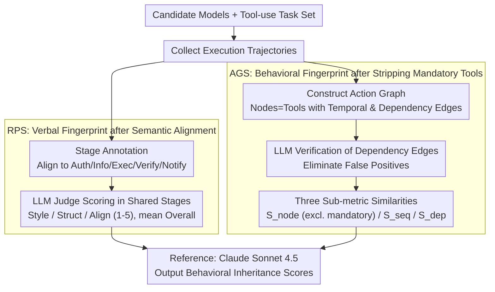

# When Agents Look the Same: Quantifying Distillation-Induced Similarity in Tool-Use Behaviors

**Conference**: ACL 2026  
**arXiv**: [2604.21255](https://arxiv.org/abs/2604.21255)  
**Code**: [https://github.com/Syuchin/AgentEcho](https://github.com/Syuchin/AgentEcho)  
**Area**: LLM Agent  
**Keywords**: Model Distillation, Behavioral Homogenization, Tool-use, Agent Evaluation, Behavioral Similarity

## TL;DR
This paper proposes two complementary metrics, RPS and AGS, to quantify distillation-induced homogenization in LLM Agent tool-use behaviors. By distinguishing between mandatory and optional behaviors, cross-family behavioral inheritance patterns are revealed across 18 models. Notably, the behavioral similarity between Kimi-K2 and Claude Sonnet 4.5 is found to exceed even that of Anthropic's own models.

## Background & Motivation

**Background**: The current LLM Agent landscape is experiencing a "Cambrian Explosion" with numerous high-performance agents emerging. However, despite diverse origins, these models exhibit highly consistent behaviors in reasoning steps, tool-calling habits, and even failure modes, suggesting many may be "distillation echoes" of a few dominant teacher models.

**Limitations of Prior Work**: Existing similarity measures primarily focus on response-level similarity in static dialogues, failing to capture the dynamic characteristics of multi-step tool-use trajectories. More critically, these methods cannot distinguish between "mandatory behaviors" (actions necessary for task success) and "optional behaviors" (actions reflecting autonomous model preferences), causing similarity scores to be inflated by the shared correct paths required by the task itself.

**Key Challenge**: Without distinguishing mandatory from optional behaviors, it is impossible to determine whether two models converge because there is only one correct path or because one model is blindly mimicking the habits of another—a fundamental obstacle in quantifying distillation impact.

**Goal**: Design a systematic framework to isolate optional behavioral patterns and quantify distillation-induced behavior homogenization between agents across linguistic expression and tool operation dimensions.

**Key Insight**: It is observed that many agents perform redundant tool calls (e.g., trying all tools even when the answer is obvious). These optional behavioral choices serve as "behavioral fingerprints" for identifying distillation.

**Core Idea**: By decomposing agent trajectories into mandatory and optional behaviors, RPS (Response Pattern Similarity) and AGS (Action Graph Similarity) are used to capture behavioral inheritance signals across different dimensions.

## Method

### Overall Architecture

The framework takes a set of candidate models and a tool-use task set as input to quantify distillation-induced behavioral homogenization. Full execution trajectories are collected for each model, followed by analysis from two orthogonal dimensions: RPS focuses on verbal fingerprints (how the model responds), and AGS focuses on behavioral fingerprints (how the model selects and organizes tool calls). Claude Sonnet 4.5 (thinking) is used as the reference oracle to compute similarity and output behavioral inheritance scores for both dimensions.

### Key Designs

**1. Response Pattern Similarity (RPS): Verbal Fingerprint Comparison after Semantic Alignment**

Directly aligning entire trajectories or turn-by-turn interactions can include functionally irrelevant content, making scoring unreliable—especially when models use different turn counts. RPS employs a two-stage pipeline: First, Stage Annotation aligns trajectory segments into five canonical stages (Authentication, Information Acquisition, Execution, Verification, Notification) to ensure functionally equivalent fragments are compared. Second, an LLM Judge scores shared stages across Style, Structure, and Alignment (1–5) and takes the mean Overall score as the linguistic similarity.

**2. Action Graph Similarity (AGS): Behavioral Fingerprint Comparison after Stripping "Mandatory" Tools**

The biggest pitfall in tool calling is that model similarity appears high when only one correct path exists, inflating scores. AGS constructs a directed graph $G=(V, E_s, E_d)$, where nodes are tool calls, $E_s$ represents temporal edges, and $E_d$ represents dependency edges. Similarity is measured across three sub-dimensions: $S_{\text{node}}$ (optional tool consistency), $S_{\text{seq}}$ (cosine similarity of features like post-write verification rate), and $S_{\text{dep}}$ (cosine similarity of dependency features like output reuse rate). The key is $S_{\text{node}}$, which identifies mandatory tools via intersection $\mathcal{F}_t^{\text{mandatory}} = \bigcap_{M \in \mathcal{M}_t^*} \text{Tools}(M, t)$ and excludes them, measuring consistency only on optional tools to avoid common-correctness inflation (averaging 12.2pp inflation) and expose "autonomous preference" fingerprints.

**3. LLM Verification of Dependency Edges: Cleaning the Dependency Graph**

Identifying dependency edges solely via string matching produces false positives—coincidental matches of IDs or dates don't imply actual consumption of output. Each candidate dependency edge is submitted to an LLM Judge for semantic validity verification to determine if a value actually originates from a source tool's output rather than prior knowledge. This step ensures the accuracy of $E_d$ and prevents noise from skewing $S_{\text{dep}}$ and other dependency metrics.

## Key Experimental Results

### Main Results

| Model | AGS (%) | RPS Overall | $S_{\text{node}}$ (%) | $S_{\text{dep}}$ (%) |
|------|---------|-------------|----------------------|---------------------|
| Claude Opus 4.1 (thinking) | 83.0 | 3.85 | 81.0 | 93.7 |
| Kimi-K2 (thinking) | 82.7 | 3.65 | 82.6 | 94.7 |
| GPT-4.1 | 79.5 | 3.15 | 75.9 | 88.0 |
| GPT-5 | 76.1 | 2.70 | 71.3 | 87.7 |
| DeepSeek-R1 | 78.6 | 3.05 | 78.3 | 85.0 |
| GLM-4.6 | 80.3 | 3.42 | 80.4 | 88.7 |
| Qwen3-235B (thinking) | 75.9 | 2.40 | 68.1 | 92.4 |

### Ablation Study

| Config | AGS toward Teacher | AGS toward Control | Description |
|------|-------------------|-------------------|------|
| Baseline (No distil) | 0.59 | 0.64 | Original Qwen2.5-14B |
| Distilled | 0.72 (+0.13) | 0.59 (-0.05) | AGS shows directional signal |
| GED Baseline | 0.42 | 0.39 | Original comparison |
| GED Distilled | 0.65 (+0.23) | 0.59 (+0.20) | GED cannot distinguish direction |

### Key Findings
- Within-family model pairs show AGS scores 5.9pp higher than cross-family pairs, validating the metric's ability to capture behavioral inheritance.
- Kimi-K2 (thinking) exceeds Anthropic's own Opus 4.1 in both $S_{\text{node}}$ and $S_{\text{dep}}$, suggesting strong cross-family behavioral inheritance.
- The Pearson correlation coefficient between RPS and AGS is only 0.491, indicating that the two metrics capture independent behavioral dimensions.

## Highlights & Insights
- Incorporating the distinction between mandatory and optional tools into distillation detection is a sophisticated design; excluding mandatory tools reduces $S_{\text{node}}$ by 12.2pp on average, demonstrating that failing to do so severely overestimates cross-model similarity. This approach is generalizable to other agent behavior analyses.
- The directional validation of the controlled distillation experiment is well-designed: AGS increased toward the teacher (+0.13) while decreasing toward the control (-0.05). In contrast, GED increased toward both directions (+0.23/+0.20), clearly proving that AGS distinguishes "specific teacher-oriented convergence" from "general capability improvement."
- Case analysis reveals that Kimi-K2 and Claude share specific "enthusiastic affirmative tones" (e.g., "Excellent!", "Perfect!") and redundant verification preferences (e.g., calling find_user_id_by_email before proceeding), whereas GPT-5's style differs completely. These fine-grained behavioral fingerprints are highly persuasive.

## Limitations & Future Work
- Results are reported relative to Claude Sonnet 4.5 (thinking) as the reference; a full pairwise comparison of 18 models requires 153 comparisons, which is computationally expensive.
- Evaluation only covers three English customer service domains in τ-Bench and τ²-Bench; generalization to other domains, task types, and languages remains to be verified.
- RPS relies on a domain-specific stage taxonomy; extending this to non-tool-use paradigms like code generation or multi-agent collaboration requires further methodological development.

## Related Work & Insights
- **vs RSE (Lee et al., 2025)**: RSE computes semantic similarity on model responses but fails to distinguish mandatory/optional behaviors, making it unable to detect distillation directionality (it increases toward both teacher and control).
- **vs GED (Graph Edit Distance)**: GED measures graph structure differences but similarly fails to account for action necessity. After distillation, GED increases significantly toward both teachers and non-teachers, losing directional discriminative power.

## Rating
- Novelty: ⭐⭐⭐⭐⭐ Highly unique approach by being the first to distinguish mandatory/optional behaviors for agent distillation detection.
- Experimental Thoroughness: ⭐⭐⭐⭐ Covers 18 models across 8 providers with rigorous controlled experiments, though limited to English customer service.
- Writing Quality: ⭐⭐⭐⭐⭐ Clear structure and vivid case studies; the logical chain from intuition to quantification is solid.
- Value: ⭐⭐⭐⭐⭐ Essential for understanding behavioral homogenization in the current LLM ecosystem.

<!-- RELATED:START -->

## Related Papers

- [\[ACL 2026\] Robust Tool Use via Fission-GRPO: Learning to Recover from Execution Errors](robust_tool_use_via_fission-grpo_learning_to_recover_from_execution_errors.md)
- [\[ACL 2026\] Mem²Evolve: Towards Self-Evolving Agents via Co-Evolutionary Capability Expansion and Experience Distillation](mem2evolve_towards_self-evolving_agents_via_co-evolutionary_capability_expansion.md)
- [\[ACL 2026\] Feedback-Driven Tool-Use Improvements in Large Language Models via Automated Build Environments](feedback-driven_tool-use_improvements_in_large_language_models_via_automated_bui.md)
- [\[ACL 2026\] ToolGrad: Efficient Tool-use Dataset Generation with Textual "Gradients"](toolgrad_efficient_tool-use_dataset_generation_with_textual_gradients.md)
- [\[ACL 2026\] ToolOmni: Enabling Open-World Tool Use via Agentic Learning with Proactive Retrieval and Grounded Execution](toolomni_enabling_open-world_tool_use_via_agentic_learning_with_proactive_retrie.md)

<!-- RELATED:END -->
