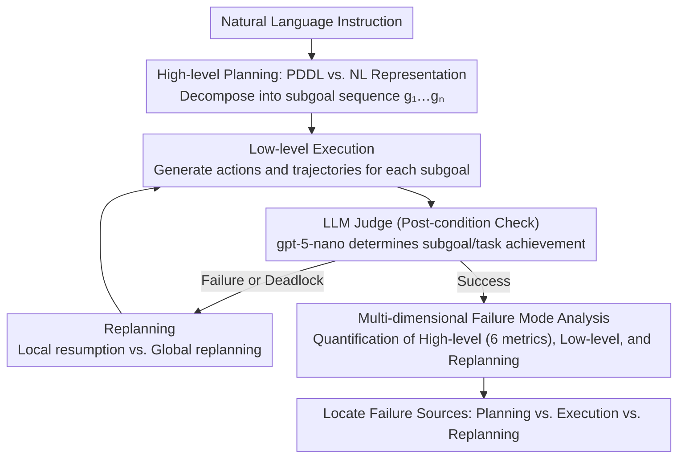

# Why LLM Web Agents Fail: A Hierarchical Planning Perspective

**Conference**: ACL 2026  
**arXiv**: [2603.14248](https://arxiv.org/abs/2603.14248)  
**Code**: https://github.com/Ziyu-Yao-NLP-Lab/llm-hierarchical-web-agents  
**Area**: LLM Agent / Web Navigation  
**Keywords**: Web agent failure analysis, hierarchical planning, natural language vs PDDL, execution bottleneck

## TL;DR

This paper systematically analyzes the failure causes of LLM web agents through a hierarchical planning framework (high-level planning, low-level execution, and replanning). It discovers that PDDL representations outperform natural language planning, but low-level execution and perceptual grounding are the primary bottlenecks.

## Background & Motivation

**Background**: LLM web agents' performance on long-horizon tasks is significantly lower than human levels, yet existing evaluations focus primarily on end-to-end success rates, providing limited understanding of failure sources.

**Limitations of Prior Work**: End-to-end evaluation metrics (e.g., task success rate) obscure real issues—failing to distinguish between high-level planning errors, insufficient low-level execution, or failure of replanning mechanisms.

**Key Challenge**: Different components have different bottlenecks, but existing methods optimize overall performance indiscriminately, leading to vague directions for improvement.

**Goal**: To establish a systematic hierarchical evaluation framework to diagnose web agent capabilities by decomposing them into three independent dimensions.

**Key Insight**: Inspired by automated planning (e.g., HTN planning), humans solve complex tasks using a three-level process: "abstract strategy $\rightarrow$ concrete execution $\rightarrow$ dynamic replanning." LLM agents should be decomposable similarly.

**Core Idea**: Use a hierarchical planning framework instead of black-box end-to-end evaluation to accurately locate the failure causes of LLM agents.

## Method

### Overall Architecture

The framework decomposes web agent capabilities into three layers for diagnosis, making the failure sources behind "end-to-end success rates" locatable. Given a natural language instruction, the LLM first performs high-level planning to decompose an abstract subgoal sequence $P = [g_1, g_2, \ldots, g_n]$. For each subgoal $g_i$, the agent generates executable actions $a_t \in \mathcal{A}$ at the low level and produces an execution trajectory $\tau_i = (o_t, a_t, o_{t+1}, \ldots, o_{t+k})$. Subsequently, an LLM-based judge performs post-condition checks to verify if the execution result satisfies the expected effect of the subgoal $\Phi(g_i, s') = 1$. If a subgoal fails or hits a dead end, replanning is triggered to decide whether to resume locally from the last successful subgoal or perform global replanning from scratch. The output consists of independent diagnostic metrics for each layer, allowing the questions of whether the problem lies in planning, execution, or replanning to be answered separately.

### Key Designs

**1. PDDL vs. Natural Language Representation: Using formal constraints to suppress plan over-specification**

Natural language (NL) planning is flexible but often mixes in low-level details, resulting in over-specification or over-decomposition, which causes high-level plans to lose abstraction. This paper compares NL and PDDL representations for the same high-level planning: PDDL enforces clear plan semantics through formal structures like *preconditions* and *effects*, constraining the model to describe "what to do" rather than "how to click." The core question is whether symbolic constraints yield more abstract, less redundant, and more executable plans, thereby isolating the high-level planning contribution from mixed end-to-end metrics.

**2. LLM as Judge: Semantic-level determination in fragile web environments**

In real web environments, rule-based success judgment is fragile; mechanical string matching cannot determine if a subgoal is truly achieved. The framework therefore uses gpt-5-nano as a judge to determine subgoal completion and overall task success based on execution trajectories and final web states; it understands semantics rather than surface matching. Manual verification of 50 samples shows the judge has 82%–86% accuracy, sufficient for large-scale hierarchical diagnosis.

**3. Multi-dimensional Failure Mode Analysis: Quantifying capabilities across three layers**

To provide clear improvement directions, a total score is not used to summarize all layers. This paper defines metrics for each layer: High-level uses 6 alignment metrics (Perfect Match / Partial / Missing / Decomposed / Unmatched / Matched Rate) to quantify deviations from human reference plans; low-level uses subgoal success rate, plan completion rate, task success rate, and action efficiency to characterize execution reliability; the replanning layer compares performance changes before and after execution. This separation allows for actionable conclusions—for instance, if low-level execution is poor but the high-level plan is good, optimization should focus on perceptual grounding rather than reasoning.

## Key Experimental Results

### High-level Planning: Natural Language vs. PDDL

| Metric | NL (Pre-replan) | PDDL (Pre-replan) | NL (Post-replan) | PDDL (Post-replan) |
|------|------------|------------|------------|------------|
| Perfect Match | 60.6% | 67.7% | 56.1% | 59.0% |
| Partial | 5.7% | 7.4% | 6.1% | 6.9% |
| Missing | 4.2% | 2.2% | 4.0% | 14.5% |
| Decomposed | 29.5% | 22.7% | 33.8% | 19.6% |
| Unmatched | 29.4% | 15.4% | 35.0% | 15.4% |
| Matched (Effective Steps) | 70.6% | 84.6% | 65.0% | 84.6% |

**Key Findings**: PDDL plans achieve a higher Perfect Match rate (67.7% vs. 60.6%) and fewer Unmatched steps (15.4% vs. 29.4%). NL plans tend toward over-decomposition (29.5%), generating redundant steps.

### Low-level Execution: Identifying True Bottlenecks

| Dataset Metric | gpt-5-nano (human plan) | gpt-5-nano (NL plan) | gpt-5-nano (PDDL plan) |
|---------|------|------|------|
| Subgoal Success Rate | 38.5% | 26.8% | 32.1% |
| Plan Completion Rate | 38.5% | - | - |
| Final Task Success Rate | 36.4% | 18.5% | 24.7% |

**Low-level Execution Failure Modes**:

| Failure Mode | Rate | Root Cause |
|--------|-------|---------|
| Hallucinated links (goto action) | 32.0% | LLM fabricates non-existent URLs |
| Redundant actions | 34.2% | Insufficient understanding of environmental state |
| Out-of-domain links | 16.7% | Navigating away from target site (e.g., search results to Wikipedia) |
| Repeated execution | 10.4% | Failure to learn from feedback, getting stuck in loops |

**Key Findings**: Even given a perfect human-annotated high-level plan, the LLM executor success rate is only 36.4%, indicating that **low-level execution and perceptual grounding are the true bottlenecks**.

### Effect of Replanning

| Configuration | Subgoal Success Rate | Task Success Rate | Gain |
|-----|----------|---------|--------|
| Pre-replan (NL) | 26.8% | 18.5% | Baseline |
| Post-replan (NL) | 31.2% | 22.3% | +4.4pp |
| Pre-replan (PDDL) | 32.1% | 24.7% | Baseline |
| Post-replan (PDDL) | 35.5% | 28.9% | +3.4pp |

Single-round replanning improves success rate by 4-5 percentage points, showing that replanning mechanisms are effective but limited in magnitude.

### Comparison of Different LLMs

- **gpt-5-nano**: strongest performance, 36.4% task success rate (human plan).
- **claude-haiku-4.5**: 29.2% success rate, highest repeated failure rate (16.7%), weak feedback utilization.
- **gemini-flash-2.5**: 17.3% success rate, worst low-level execution, highest redundant action rate (41.2%), but most compact plans.

## Highlights & Insights

- **Innovation in Hierarchical Diagnostics**: Instead of improving end-to-end performance, the framework systematically isolates the evaluation of three layers, making improvement directions more precise. This approach is introduced from automated planning but applied to LLM web agent failure analysis for the first time.
- **Quantitative Advantage of PDDL**: The paper quantitatively proves that formal representation is superior to natural language—while PDDL has higher learning costs, it yields more precise plans with less redundancy and higher executability.
- **Low-level Execution is the Core Issue**: The study breaks the common assumption that "improving LLM reasoning will improve web agents." It demonstrates that even with perfect high-level planning, a 36.4% success rate in low-level execution suggests the problem lies in perceptual grounding rather than reasoning.
- **Fine-grained Classification of Failure Modes**: Categorizing execution failures into hallucinated links, redundant actions, out-of-domain jumps, and repetitive loops provides a roadmap for targeted optimization.
- **Limitations of Replanning**: Single-round replanning only improves success by 4-5pp, suggesting the need for more complex adaptation mechanisms rather than simple retries.

## Limitations & Future Work

**Limitations acknowledged by the authors**:
- Experiments were conducted on limited high-level representations (NL and PDDL), action spaces (3 types), and agent configurations.
- Multi-modal settings (visual information) were not considered.
- High-level plan evaluation requires human-annotated reference plans, reducing flexibility.

**Self-identified limitations**:
- Evaluation is limited to 104 tasks from Mind2Web-Live, which is a small sample size.
- While LLM-as-Judge has 82%-86% accuracy, it may still misjudge edge cases in complex web pages.
- Replanning was only explored for 1 round; the convergence characteristics of multi-round iterations were not studied.
- Hybrid solutions (e.g., PDDL planning + neural network low-level executor) were not explored.

**Specific improvement ideas**:
1. **Perceptual Grounding**: Introduce visual features or structured page representations (e.g., symbolic DOM trees) to mitigate link hallucination.
2. **Action Space Design**: Allow agents to explicitly express "uncertainty" or "need for clarification" rather than blindly guessing.
3. **Distributed Execution**: Decouple the planning module (using PDDL) from the execution module (using specialized tools or neural networks) for independent optimization.
4. **Multi-round Replanning Strategies**: Design adaptive feedback mechanisms so agents learn when to backtrack versus proceed.

## Related Work & Insights

- **vs. WebArena/Mind2Web (End-to-End Evaluation)**: These benchmarks only measure task success rates. This paper introduces procedural evaluation, redefining assessment from a diagnostic perspective rather than pure performance testing.
- **vs. Prior PDDL Planning (Silver et al.)**: Previous research used PDDL+LLM in classical planning; this paper is the first to introduce it to web agents with quantitative comparisons, finding formal representations still advantageous in open-world web environments.
- **vs. Low-level Execution Improvements (WALT, etc.)**: These methods use tools or site-specific APIs to improve execution but do not diagnose why execution fails. The framework in this paper can be orthogonally combined with these approaches.
- **vs. Adaptive Agents (Reflexion, etc.)**: While these methods use feedback, this paper quantifies the specific gains of single-round replanning (+4-5pp) and points out the need for multi-layer feedback mechanisms.

## Rating

- **Novelty**: ⭐⭐⭐⭐ Applying a hierarchical planning framework systematically to web agent diagnostics is a new perspective, though hierarchical planning itself is not new. The PDDL vs. NL comparison is also a fresh contribution.
- **Experimental Thoroughness**: ⭐⭐⭐⭐ The experimental design is rigorous, covering multiple LLM models and multi-dimensional metrics, though the dataset of 104 tasks is somewhat thin. The failure mode analysis is detailed.
- **Writing Quality**: ⭐⭐⭐⭐⭐ Clear logic, moving from motivation to framework to experiments and suggestions; excellent readability.
- **Value**: ⭐⭐⭐⭐ Highly practical, providing clear improvement directions (focusing on low-level execution rather than planning) with significant guidance for the web agent community.

<!-- RELATED:START -->

## Related Papers

- [\[ACL 2026\] Hierarchical Reinforcement Learning with Augmented Step-Level Transitions for LLM Agents](hierarchical_reinforcement_learning_with_augmented_step-level_transitions_for_ll.md)
- [\[AAAI 2026\] When Refusals Fail: Unstable Safety Mechanisms in Long-Context LLM Agents](../../AAAI2026/llm_agent/when_refusals_fail_unstable_safety_mechanisms_in_long-context_llm_agents.md)
- [\[ACL 2026\] HiGMem: A Hierarchical and LLM-Guided Memory System for Long-Term Conversational Agents](higmem_a_hierarchical_and_llm-guided_memory_system_for_long-term_conversational_.md)
- [\[ACL 2026\] SynthAgent: Adapting Web Agents with Synthetic Supervision](synthagent_adapting_web_agents_with_synthetic_supervision.md)
- [\[ICML 2026\] Agent JIT Compilation for Latency-Optimizing Web Agent Planning and Scheduling](../../ICML2026/llm_agent/agent_jit_compilation_for_latency-optimizing_web_agent_planning_and_scheduling.md)

<!-- RELATED:END -->
