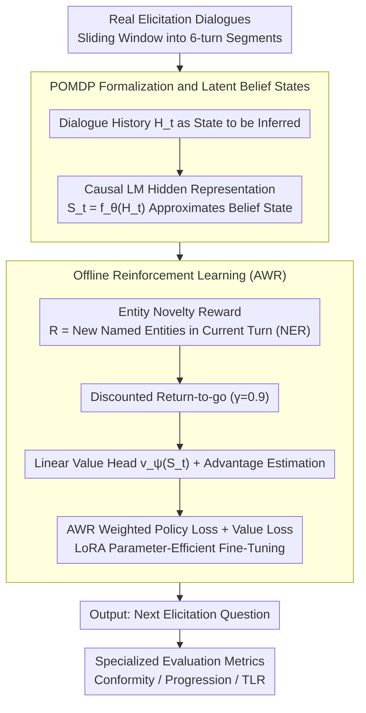

# YIELD: A Large-Scale Dataset and Evaluation Framework for Information Elicitation Agents

**Conference**: ACL 2026  
**arXiv**: [2604.10968](https://arxiv.org/abs/2604.10968)  
**Code**: [https://github.com/infosenselab/yield](https://github.com/infosenselab/yield)  
**Area**: Model Compression  
**Keywords**: Information Elicitation, Dialogue Dataset, Reinforcement Learning, Conversational Agents, POMDP

## TL;DR

This paper proposes Information Elicitation Agents (IEA) as a new dialogue paradigm and releases YIELD, the first large-scale human-to-human information elicitation dialogue dataset (2,281 dialogues, 26M tokens). The study formalizes information elicitation as a finite-horizon POMDP and designs specialized evaluation metrics (Conformity, Progression, TLR). Experiments demonstrate that fine-tuning on YIELD significantly improves the alignment of Large Language Models (LLMs) with authentic elicitation behaviors.

## Background & Motivation

**Background**: Most Conversational Agents (CA) are designed for user-driven interactions aimed at fulfilling user needs—where the user controls the agenda and direction while the agent provides assistance. Common datasets such as MultiWOZ and SGD are oriented toward this paradigm.

**Limitations of Prior Work**: Many real-world scenarios (academic interviews, judicial proceedings, investigative journalism) require agents to proactively elicit information from users to support the institutional or task-oriented goals of the agent's side. This "information elicitation" differs fundamentally from traditional CA: (1) Dialogue initiative differs—the agent must proactively ask questions to guide the direction; (2) Goals differ—success is defined by the volume of valuable information acquired rather than resolving user queries; (3) There is no single optimal question, but rather multiple possible directions, each potentially yielding valuable information.

**Key Challenge**: Despite the clear demand for IEAs, there is a lack of specialized datasets, formal frameworks, and evaluation metrics to support research. Existing dialogue datasets feature short dialogue turns (e.g., DSTC2 averages 14.49 turns), which fail to capture long-range elicitation strategies.

**Goal**: (1) Define IEA as a new dialogue paradigm; (2) Construct the first large-scale IEA dataset; (3) Formalize the information elicitation problem; (4) Design specialized evaluation metrics.

**Key Insight**: Data is collected from authentic human-to-human elicitation dialogues (oral histories, judicial hearings, academic interviews, investigative journalism) to ensure the data reflects genuine elicitation behavior patterns.

**Core Idea**: Information elicitation is modeled as a POMDP, utilizing entity novelty as a proxy reward signal. LLMs are fine-tuned via Offline Reinforcement Learning (AWR) to learn to pose questions like human elicitors.

## Method

### Overall Architecture

The problem YIELD addresses is enabling LLMs to learn proactive questioning like real elicitors, who face a partially observable dialogue environment—information in the interviewee's mind is always hidden and must be extracted turn by turn. To this end, the authors model the entire elicitation process as a finite-horizon POMDP: the input is the current dialogue history, the latent belief state is approximated via the hidden representations of the language model, "newly elicited entity count" serves as the reward signal, and the output is the most appropriate next question. Based on this formalization, the model is fine-tuned on 2,281 authentic elicitation dialogues using Offline Reinforcement Learning (ORL, specifically AWR). Elicitation quality is then measured from the perspectives of distribution alignment, dialogue advancement, and questioning efficiency using three specialized metrics.

### Key Designs

**1. POMDP Formalization and Latent Belief States: Transforming "What to Ask" into Optimizable Sequential Decision-Making**

The inherent difficulty of elicitation lies in the fact that the elicitor can never fully observe the interviewee's knowledge base and must probe it indirectly through questions, which is naturally a partially observable problem. The authors denote the interviewee's hidden information as state $X_t$, the elicitor's question as action $A_t$, and the interviewee's response as observation $O_{t+1}$. Since the hidden state space is unbounded and traditional belief states cannot be explicitly maintained, the method uses the hidden representation $S_t = f_\theta(H_t^s)$ of a causal language model to directly encode "what has been learned so far." The reward is defined as the number of new named entities appearing in the current turn's response: $R_{t+1} = |\mathcal{E}_{t+1} \setminus \mathcal{E}_{\leq t}|$. Using entity novelty as a proxy for information gain avoids the difficulty of objectively defining "information value," while various constraints prevent reward hacking.

**2. Offline Reinforcement Learning (AWR): Biasing the Model Towards Questions that Extract More New Information**

Standard SFT merely imitates real elicitors turn-by-turn and cannot distinguish between "a good question" and "an inconsequential one." This method employs Advantage-Weighted Regression: an additional linear value head is trained to estimate the state value $v_\psi(S_t)$, from which the advantage function of each elicitation utterance is calculated. Samples with higher advantages (those eliciting more new information) receive higher weights during training. The entire model is fine-tuned using LoRA for parameter efficiency, jointly optimizing the policy loss and value loss: $\mathcal{L}(\theta, \psi) = \mathcal{L}_\pi(\theta) + \mathcal{L}_v(\psi)$. This allows the model to learn "the contribution of this utterance to the entire subsequent dialogue," thereby acquiring long-range elicitation strategies rather than short-sighted imitation.

**3. Specialized Evaluation Metric System: Characterizing Elicitation Capability Across Three Dimensions**

Traditional metrics like BLEU or task success rates fail to capture the essence of elicitation dialogues—whether the conversation moves forward, whether questioning is efficient, and whether the style resembles a human. Consequently, the authors design three metrics: **Conformity** uses perplexity and response length to measure whether model outputs fall within the distribution of real elicitors; **Progression** uses a decaying cosine distance window to measure whether the dialogue continues to advance or gets stuck on the same topic; **Turn-Length Ratio (TLR)** is the ratio of the interviewee's average response length to that of the elicitor. A good elicitor should ask concise questions that prompt long, informative responses from the interviewee. Together, these three metrics fully characterize "elicitation competence."

### Loss & Training

The AWR weighted policy loss is defined as $\mathcal{L}_\pi(\theta) = -\frac{1}{|\mathcal{B}|} \sum_{i \in \mathcal{B}} \bar{w}_i \log \pi_\theta(A_i | S_i)$, where weights $\bar{w}_i$ are scaled by the advantage function. Data is segmented using a sliding window (6 turns), with a discount factor $\gamma=0.9$ and temperature $\alpha=0.25$. Training was conducted on three A6000 GPUs.

## Key Experimental Results

### Main Results

Conformity Evaluation (Perplexity and Response Length Comparison):

| Model | Academic PPL | Judicial PPL | Academic Resp. Length | Real Resp. Length |
|------|-----------|-----------|-------------|-------------|
| Llama-3.1-8B Prompt | 46.9 | 22.6 | 39.5 tokens | 16.9 tokens |
| Llama-3.1-8B SFT | 10.9 | 10.9 | 11.2 tokens | 16.9 tokens |
| Llama-3.1-8B ORL | 12.5 | 11.3 | 11.6 tokens | 16.9 tokens |

### Ablation Study

| Configuration | Key Finding | Description |
|------|---------|------|
| Prompt-only vs SFT/ORL | PPL drops 3-4x | Fine-tuning significantly improves alignment with real elicitation behavior |
| SFT vs ORL | SFT PPL slightly lower | ORL sacrifices token-level likelihood to optimize long-range strategy |
| DeepSeek-R1 Prompt | Resp. length 414-472 tokens | The verbose meta-thinking of reasoning models deviates severely from elicitation style |
| 3B vs 8B Model | Performance is similar | Indicates that YIELD data, rather than model scale, is the critical factor |

### Key Findings

- Prompt-only methods generate elicitor utterances that are significantly longer than those of real elicitors (39-53 vs. 17-39 tokens), and the prompts themselves are long (540-648 tokens), which is highly inefficient.
- The reasoning mode of DeepSeek-R1 is entirely unsuitable for elicitation tasks—generating excessively long meta-reasoning prefixes—though it recovers after fine-tuning.
- Models trained with ORL are competitive with SFT on the Progression metric, and their response length distributions are closer to real elicitors.
- Human evaluation confirms the findings of automatic metrics: models trained on YIELD are significantly superior to prompt-based methods in elicitation quality.

## Highlights & Insights

- **The introduction of the IEA concept** is pioneering—it clearly defines "agent-proactive information elicitation" as a dialogue paradigm, contrasting sharply with the traditional "user-asks-agent-answers" model. This framework can unify various scenarios such as academic interviews, judicial hearings, and investigative journalism.
- **The entity novelty reward** is simple yet effective—using NER to extract the count of new entities as a proxy for elicitation success avoids the subjectivity of defining "information value" while preventing reward cheating via constraints.
- **The dataset construction methodology** itself is exemplary—manually annotated from various public domain/CC-licensed real human dialogues, with an average of 171 turns per dialogue, far exceeding existing datasets (13-20 turns).

## Limitations & Future Work

- Experiments were only evaluated in an offline setting without testing against real user interactions; the actual elicitation effectiveness of IEAs remains unknown.
- The entity novelty reward is overly simplistic and cannot measure the "depth" or "relevance" of information; more refined reward design is a key future direction.
- The dataset is exclusively in English, and data volume in certain domains is small (e.g., investigative journalism has only 129 dialogues).
- The ethical boundaries of IEAs require further discussion—specifically, to what extent an agent's elicitation behavior is appropriate.

## Related Work & Insights

- **vs. MultiWOZ/SGD**: These datasets are oriented toward user-driven task-oriented dialogues, averaging 13-20 turns per dialogue. YIELD is oriented toward agent-driven information elicitation, averaging 171 turns per dialogue, representing a completely different scale and paradigm.
- **vs. LLM-as-Interviewer**: Existing work mostly focuses on LLMs simulating interviewers but lacks a systematic dataset and formal framework. YIELD provides a complete research infrastructure spanning data, theory, and evaluation.

## Rating

- Novelty: ⭐⭐⭐⭐⭐ Defines the new paradigm of Information Elicitation Agents; the dataset, formalization, and metrics are all novel.
- Experimental Thoroughness: ⭐⭐⭐⭐ Multi-model comparisons and human evaluations are sufficient, though online interaction experiments are missing.
- Writing Quality: ⭐⭐⭐⭐⭐ Concepts are clearly defined, the paper structure is rigorous, and the logical chain from motivation to methodology to evaluation is complete.
- Value: ⭐⭐⭐⭐ The pioneering dataset and framework hold long-term value for the community, although the application scope is relatively specialized.

<!-- RELATED:START -->

## Related Papers

- [\[CVPR 2026\] WebChain: A Large-Scale Human-Annotated Dataset of Real-World Web Interaction Traces](../../CVPR2026/llm_agent/webchain_a_large-scale_human-annotated_dataset_of_real-world_web_interaction_tra.md)
- [\[ACL 2026\] Feedback-Driven Tool-Use Improvements in Large Language Models via Automated Build Environments](feedback-driven_tool-use_improvements_in_large_language_models_via_automated_bui.md)
- [\[ICML 2026\] Video2GUI: Synthesizing Large-Scale Interaction Trajectories for Generalized GUI Agent Pretraining](../../ICML2026/llm_agent/video2gui_synthesizing_large-scale_interaction_trajectories_for_generalized_gui_.md)
- [\[ACL 2026\] AdaRubric: Task-Adaptive Rubrics for Reliable LLM Agent Evaluation and Reward Learning](adarubric_task-adaptive_rubrics_for_reliable_llm_agent_evaluation_and_reward_lea.md)
- [\[CVPR 2026\] MMBench-GUI: A Unified Hierarchical Evaluation Framework for Multi-Platform GUI Agents](../../CVPR2026/llm_agent/mmbench-gui_a_unified_hierarchical_evaluation_framework_for_multi-platform_gui_a.md)

<!-- RELATED:END -->
