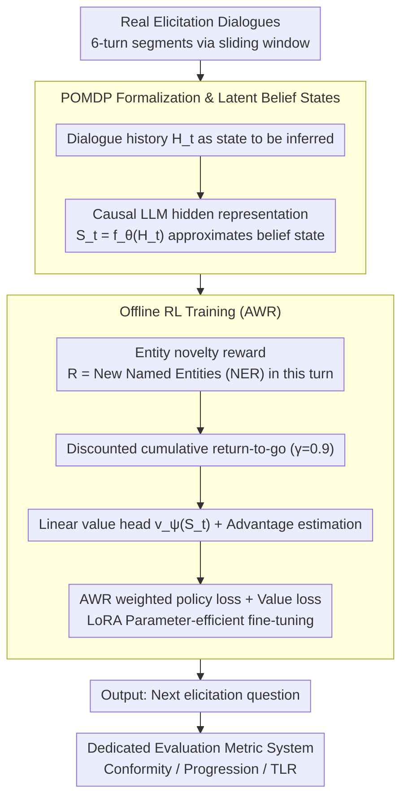

# YIELD: A Large-Scale Dataset and Evaluation Framework for Information Elicitation Agents

**Conference**: ACL 2026  
**arXiv**: [2604.10968](https://arxiv.org/abs/2604.10968)  
**Code**: [https://github.com/infosenselab/yield](https://github.com/infosenselab/yield)  
**Area**: Model Compression  
**Keywords**: Information Elicitation, Dialogue Dataset, Reinforcement Learning, Conversational Agents, POMDP

## TL;DR

The authors propose Information Elicitation Agents (IEA) as a new dialogue paradigm and release YIELD, the first large-scale (2,281 dialogues, 26M tokens) human-to-human information elicitation dialogue dataset. The study formalizes information elicitation as a finite-horizon POMDP and designs specialized evaluation metrics (Conformity, Progression, TLR). Experiments demonstrate that fine-tuning LLMs on YIELD significantly improves alignment with real human elicitation behavior.

## Background & Motivation

**Background**: Most conversational agents (CA) are designed for user-driven interactions to satisfy user needs—where the user controls the agenda and direction, and the agent provides assistance. Common datasets like MultiWOZ and SGD are oriented toward this paradigm.

**Limitations of Prior Work**: Many real-world scenarios (academic interviews, legal proceedings, investigative journalism) require agents to proactively elicit information from users to support the institutional or task-oriented goals of the agent. This "information elicitation" differs fundamentally from traditional CA: (1) different initiative—the agent must actively ask questions to lead the direction; (2) different goals—success is defined by the amount of valuable information obtained rather than resolving user queries; (3) absence of a single optimal question—there are multiple possible directions, each potentially yielding valuable information.

**Key Challenge**: Despite the clear demand for IEAs, there is a lack of specialized datasets, formal frameworks, and evaluation metrics to support research. Existing dialogue datasets feature short dialogue turns (DSTC2 averages 14.49 turns), failing to capture long-range elicitation strategies.

**Goal**: (1) Define IEA as a new dialogue paradigm; (2) Construct the first large-scale IEA dataset; (3) Formalize the information elicitation problem; (4) Design specialized evaluation metrics.

**Key Insight**: Data is collected from real human-to-human elicitation dialogues (oral histories, judicial hearings, academic interviews, investigative journalism) to ensure it reflects authentic elicitation behavior patterns.

**Core Idea**: Model information elicitation as a POMDP, utilizing entity novelty as a proxy reward signal. LLMs are fine-tuned via offline reinforcement learning (AWR) to learn how to pose questions like human elicitors.

## Method

### Overall Architecture

The problem YIELD aims to solve is enabling LLMs to learn to ask questions proactively like real elicitors. Real elicitors face a partially observable environment—information in the interviewee's mind is always hidden and must be extracted turn by turn. To address this, the authors model the elicitation process as a finite-horizon POMDP: the input is the current dialogue history; the unobservable belief state is approximated via the hidden layer representations of the language model; "newly elicited entity count" serves as the reward signal; and the output is the next optimal question. Based on this formalization, models are fine-tuned on 2,281 real elicitation dialogues using offline reinforcement learning (ORL, specifically AWR). Finally, three specialized metrics evaluate elicitation quality from the perspectives of distributional alignment, dialogue progression, and questioning efficiency.

### Key Designs

**1. POMDP Formalization & Latent Belief States: Optimizing "What to Ask" as Sequential Decision Making**

The inherent difficulty of elicitation is that the elicitor can never fully observe the interviewee's knowledge base and can only probe it indirectly through questions, which is naturally a partially observable problem. The authors denote the interviewee's hidden information as state $X_t$, the elicitor's question as action $A_t$, and the interviewee's answer as observation $O_{t+1}$. Since the hidden state space is unbounded and traditional belief states cannot be explicitly maintained, the method uses the hidden representation $S_t = f_\theta(H_t^s)$ of a causal language model to directly encode "what has been revealed so far." The reward is defined as the number of new named entities appearing in the current turn's answer $R_{t+1} = |\mathcal{E}_{t+1} \setminus \mathcal{E}_{\leq t}|$. Using entity novelty as a proxy for information gain bypasses the difficulty of objectively defining "information value" while incorporating constraints to prevent reward hacking.

**2. Offline Reinforcement Learning (AWR): Biasing Models Towards Questions that Extract New Information**

Standard SFT only mimics human elicitors turn-by-turn and cannot distinguish between "a good question" and "an irrelevant one." The method adopts Advantage-Weighted Regression: it trains an additional linear value head to estimate the state value $v_\psi(S_t)$, calculating the advantage function for each elicitation utterance. Samples with higher advantages (eliciting more new information) receive higher weights during training. The entire model is fine-tuned using LoRA for parameter efficiency, jointly optimizing the policy loss and value loss $\mathcal{L}(\theta, \psi) = \mathcal{L}_\pi(\theta) + \mathcal{L}_v(\psi)$. Consequently, the model learns the "contribution of an utterance to the subsequent dialogue," thereby acquiring long-range elicitation strategies rather than short-sighted imitation.

**3. Dedicated Evaluation Metric System: Characterizing Elicitation Ability from Three Dimensions**

Traditional metrics like BLEU or task success rates fail to capture the essence of elicitation—whether the dialogue is progressing, whether questioning is efficient, and whether the style matches human behavior. Thus, the authors design three metrics: **Conformity** uses perplexity and response length to measure if model outputs fall within the distribution of real elicitors; **Progression** uses a decayed cosine distance window to measure if the dialogue continues to advance or gets stuck on the same topic; and **Turn-Length Ratio (TLR)** is the ratio of the interviewee's average response length to that of the elicitor. A proficient elicitor should ask concise questions that yield long, detailed responses. Together, these metrics provide a complete characterization of elicitation capability.

### Loss & Training

The AWR weighted policy loss is defined as $\mathcal{L}_\pi(\theta) = -\frac{1}{|\mathcal{B}|} \sum_{i \in \mathcal{B}} \bar{w}_i \log \pi_\theta(A_i | S_i)$, where weights $\bar{w}_i$ are scaled according to the advantage function. Data is segmented using a sliding window (6 turns). Training is conducted on 3 A6000 GPUs with a discount factor $\gamma=0.9$ and temperature $\alpha=0.25$.

## Key Experimental Results

### Main Results

Conformity Evaluation (PPL and Response Length comparison):

| Model | Academic PPL | Legal PPL | Academic Resp. Len. | Ground Truth Len. |
|------|-----------|-----------|-------------|-------------|
| Llama-3.1-8B Prompt | 46.9 | 22.6 | 39.5 tokens | 16.9 tokens |
| Llama-3.1-8B SFT | 10.9 | 10.9 | 11.2 tokens | 16.9 tokens |
| Llama-3.1-8B ORL | 12.5 | 11.3 | 11.6 tokens | 16.9 tokens |

### Ablation Study

| Configuration | Key Finding | Description |
|------|---------|------|
| Prompt-only vs SFT/ORL | 3-4x PPL reduction | Fine-tuning significantly improves alignment with real elicitation behavior. |
| SFT vs ORL | SFT PPL slightly lower | ORL sacrifices token-level likelihood to optimize long-range strategies. |
| DeepSeek-R1 Prompt | Resp. Len. 414-472 tokens | The verbose meta-thinking of reasoning models deviates severely from elicitation style. |
| 3B vs 8B models | Similar performance | Indicates that YIELD data, rather than model scale, is the bottleneck. |

### Key Findings

- Prompt-only methods generate elicitor utterances much longer than those of real human elicitors (39-53 vs 17-39 tokens), and the prompts themselves are long (540-648 tokens), which is highly inefficient.
- DeepSeek-R1's reasoning mode is unsuitable for elicitation tasks in its raw form—generating excessively long meta-reasoning prefixes; it only returns to normal after fine-tuning.
- ORL-trained models are competitive with SFT on the Progression metric and show response length distributions closer to real elicitors.
- Human evaluation confirms findings from automatic metrics: models trained on YIELD significantly outperform prompt-only methods in elicitation quality.

## Highlights & Insights

- **The introduction of the IEA concept** is pioneering—it clearly defines the dialogue paradigm where the "agent proactively elicits information," forming a sharp contrast to traditional "user asks, agent answers" setups. This framework can unify various scenarios like academic interviews, legal hearings, and investigative journalism.
- **The entity novelty reward** is simple yet effective—using NER to extract the count of new entities as a proxy for elicitation success avoids the subjectivity of defining "information value" and employs constraints to prevent reward exploitation.
- **The dataset construction methodology** is exemplary—manual annotation from various public domain/CC-licensed real human dialogues results in an average of 171 turns per dialogue, far exceeding existing datasets (13-20 turns).

## Limitations & Future Work

- Experiments were conducted only in offline settings; performance during interaction with real users remains unknown.
- The entity novelty reward is relatively simplistic and cannot measure the "depth" or "relevance" of information; more refined reward design is a key future direction.
- The dataset is entirely in English, and some domain data volumes are small (investigative journalism has only 129 dialogues).
- The ethical boundaries of IEA require further discussion—specifically, to what extent an agent's elicitation behavior is appropriate.

## Related Work & Insights

- **vs MultiWOZ/SGD**: These datasets focus on user-driven task-oriented dialogues with 13-20 turns/dialogue. YIELD focuses on agent-driven information elicitation with 171 turns/dialogue, differing entirely in scale and paradigm.
- **vs LLM-as-Interviewer**: Existing works focus mostly on LLMs simulating interviewers but lack systematic datasets and formal frameworks. YIELD provides the complete research infrastructure from data to theory to evaluation.

## Rating

- Novelty: ⭐⭐⭐⭐⭐ Defines the new paradigm of Information Elicitation Agents; the dataset, formalization, and metrics are first-of-their-kind.
- Experimental Thoroughness: ⭐⭐⭐⭐ Multi-model comparisons and human evaluations are sufficient, though online interaction experiments are missing.
- Writing Quality: ⭐⭐⭐⭐⭐ Concepts are clearly defined, the paper structure is rigorous, and the logical chain from motivation to method is complete.
- Value: ⭐⭐⭐⭐ The pioneering dataset and framework hold long-term value for the community, though the application scope is relatively specialized.

<!-- RELATED:START -->

## Related Papers

- [\[CVPR 2026\] WebChain: A Large-Scale Human-Annotated Dataset of Real-World Web Interaction Traces](../../CVPR2026/llm_agent/webchain_a_large-scale_human-annotated_dataset_of_real-world_web_interaction_tra.md)
- [\[ACL 2026\] Feedback-Driven Tool-Use Improvements in Large Language Models via Automated Build Environments](feedback-driven_tool-use_improvements_in_large_language_models_via_automated_bui.md)
- [\[ICML 2026\] Video2GUI: Synthesizing Large-Scale Interaction Trajectories for Generalized GUI Agent Pretraining](../../ICML2026/llm_agent/video2gui_synthesizing_large-scale_interaction_trajectories_for_generalized_gui_.md)
- [\[ACL 2026\] IntrAgent: An LLM Agent for Content-Grounded Information Retrieval through Literature Review](intragent_an_llm_agent_for_content-grounded_information_retrieval_through_litera.md)
- [\[ACL 2026\] AdaRubric: Task-Adaptive Rubrics for Reliable LLM Agent Evaluation and Reward Learning](adarubric_task-adaptive_rubrics_for_reliable_llm_agent_evaluation_and_reward_lea.md)

<!-- RELATED:END -->
