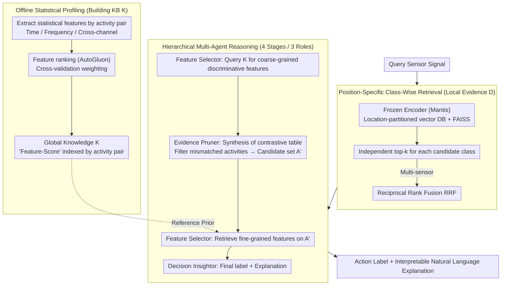

# ZARA: Training-Free Motion Time-Series Reasoning via Evidence-Grounded LLM Agents

**Conference**: ACL 2026  
**arXiv**: [2508.04038](https://arxiv.org/abs/2508.04038)  
**Code**: [https://github.com/zechenli03/ZARA](https://github.com/zechenli03/ZARA)  
**Area**: LLM Agent  
**Keywords**: Human Activity Recognition, Time-Series Reasoning, Retrieval-Augmented Generation, Multi-Agent Reasoning, Training-Free

## TL;DR

Ours proposes ZARA, a knowledge and retrieval-augmented multi-agent framework. By distilling sensor signals into a structured text knowledge base, performing class-wise retrieval, and employing hierarchical LLM reasoning, it achieves interpretable human activity recognition in a completely training-free setting, significantly outperforming existing methods on 8 datasets.

## Background & Motivation

**Background**: Human Activity Recognition (HAR) is a core technology for applications such as digital health and adaptive interfaces. Current mainstream methods rely on task-specific deep neural networks, requiring supervised training under fixed sensor configurations and activity categories.

**Limitations of Prior Work**: Existing methods face three major bottlenecks: (1) Poor generalization—adapting to new users or hardware requires costly model retraining; (2) Limited training-free adaptation—time-series foundation models like Moment and Mantis provide transferable representations but still require training specific classification heads, while contrastive learning methods like UniMTS struggle to distinguish fine-grained activities in frozen-parameter settings; (3) Lack of interpretability—most methods only output category predictions without a transparent reasoning process.

**Key Challenge**: While LLMs possess powerful open-set reasoning capabilities, directly inputting numerical time-series into an LLM leads to hallucinations and weak grounding, as LLMs cannot intuitively understand physical dynamics from raw numerical streams.

**Goal**: To build a completely training-free HAR framework capable of generalizing across users and datasets while providing an interpretable reasoning process.

**Key Insight**: The authors observe that just as RAG in NLP relies on high-quality document corpora, RAG in HAR requires a domain-specific knowledge base that transforms implicit statistical patterns of physical movement into verifiable natural language priors (e.g., "the vertical acceleration variance of running is higher than walking").

**Core Idea**: Distill the statistical features of sensor signals into a pairwise text knowledge base, combined with class-wise retrieval and hierarchical multi-agent reasoning, to achieve evidence-based training-free activity recognition.

## Method

### Overall Architecture

ZARA aims to enable a frozen LLM to understand sensor time-series and determine human actions without any training. The challenge is that feeding raw numerical streams directly to an LLM causes hallucinations and weak grounding. Therefore, ZARA decouples information into two clues: one is global knowledge $\mathcal{K}$—a static reference registry of "which features are most discriminative for paired activities" calculated offline; the other is local evidence $\mathcal{D}$—a vector database composed of raw signal embeddings, providing local distribution grounding for query samples. Online, the system first retrieves relevant evidence based on candidate classes, followed by hierarchical reasoning by multiple LLM agents, finally outputting an action label and an interpretable natural language explanation. The overall process is "offline knowledge base construction → online class-wise retrieval → hierarchical multi-agent reasoning."

### Key Designs

**1. Offline Statistical Profiling: Distilling signal features into verifiable linguistic priors**

LLMs cannot intuitively understand physical dynamics from raw numbers. Therefore, ZARA first translates "what the signal looks like" into "statistal laws readable by text." For each activity pair $(a_i, a_j)$, it extracts human-interpretable statistical features such as time domain (mean, variance, RMS), frequency domain (spectral entropy, dominant frequency), and cross-channel (correlation, tilt angle). Then, permutation-based feature importance (AutoGluon) is used to estimate scores for each feature, with cross-validation weighted averaging ensuring robustness. All "feature-score" tuples are indexed by activity pair and stored in $\mathcal{K}$. The advantage of pairwise organization is that the system can dynamically assemble relevant knowledge for any candidate subset. Adding new activities only requires registering their statistical profiles without retraining, which is key to training-free scalability.

**2. Class-Wise Multi-Sensor Retrieval: Balancing evidence for long-tail classes**

Global retrieval in standard RAG can be overwhelmed by high-frequency classes, leading to insufficient recall for long-tail activities. ZARA switches to per-class retrieval. The system maintains vector databases $\{\mathcal{D}^{loc}\}$ partitioned by sensor location, using a frozen time-series foundation encoder (default Mantis) to generate embeddings indexed by FAISS IndexFlatIP. For a query signal, top-k evidence is independently retrieved for each candidate class, ensuring sufficient recall for every class. In multi-sensor scenarios, Reciprocal Rank Fusion (RRF) aggregates results from different locations: $\text{RRF}(d) = \sum_{loc} \frac{1}{k_{rrf} + r_{loc}(d)}$. Location-based partitioning ensures that the retrieved evidence aligns with the physical context of the query.

**3. Hierarchical Multi-Agent Reasoning: Progressively narrowing the hypothesis space with interpretable traces**

Directly selecting an answer from many candidates is both confusing and opaque. ZARA lets three specialized roles perform relay reasoning across four stages. The Feature Selector first queries $\mathcal{K}$ to lock onto coarse-grained discriminative features; the Evidence Pruner synthesizes retrieved class evidence into a statistical contrastive table and filters out activities with mismatched distributions, yielding a refined candidate set $\mathcal{A}'$; the Feature Selector then retrieves fine-grained features on $\mathcal{A}'$; finally, the Decision Insightor analyzes updated statistics to provide the final label and generate an explanation. Step-wise refinement is more reliable than direct reasoning and produces verifiable intermediate results.

### Loss & Training

ZARA is completely training-free and does not involve loss functions or training processes: the knowledge base is constructed via offline statistical analysis, and reasoning is performed by a frozen LLM. All agents use a temperature of 0 to ensure deterministic reproducibility. For large-scale datasets (WISDM, DSADS), dynamic retrieval replaces static candidate lists, using cosine similarity to pre-select the top-10 most relevant categories.

## Key Experimental Results

### Main Results

Cross-subject generalization, 8 HAR datasets, frozen parameter setting:

| Method | Mean Acc | Mean F1 | Type |
|------|---------|---------|------|
| UniMTS | 39.4 | 32.1 | Contrastive Pre-training |
| IMU2CLIP | 22.7 | 17.9 | Contrastive Pre-training |
| ZARA (Qwen-30B) | 71.0 | 70.2 | Knowledge-Augmented Reasoning |
| ZARA (GPT-4.1-mini) | 77.5 | 77.2 | Knowledge-Augmented Reasoning |
| ZARA (Gemini) | **81.6** | **81.4** | Knowledge-Augmented Reasoning |

The best ZARA variant exceeds the strongest baseline UniMTS by 42.2 percentage points in Acc.

### Ablation Study

| Configuration | Mean Acc | Description |
|------|---------|------|
| ZARA (Complete) | 81.6 | Gemini backbone |
| No Knowledge Base | Significant Drop | Reasoning lacks grounding without statistical priors |
| Global vs. Class-Wise Retrieval | Drop | Insufficient recall for long-tail classes |
| Single-Stage vs. Hierarchical | Drop | Increased confusion without step-wise refinement |
| DTW vs. Mantis Encoder | 71.0→81.6 | Mantis embeddings are superior but DTW is usable |

### Key Findings

- ZARA's gains originate from the knowledge and retrieval-augmented framework design rather than LLM backbone scale; backbones from Qwen-30B to Gemini all significantly outperform all baselines.
- Direct prompting methods (HARGPT, Gemini Text/Table/Plot) fail completely, proving that without explicit reference grounding, even powerful LLMs cannot reason over numerical sensor streams.
- ZARA's Acc and F1 are highly consistent, whereas baseline methods show large gaps between Acc and F1, indicating that ZARA effectively identifies long-tail activities through class-balanced retrieval.
- In cross-dataset generalization experiments, the Cross-Dataset Knowledge setting outperforms no-knowledge and in-domain knowledge settings, proving the cross-domain transferability of statistical knowledge.

## Highlights & Insights

- **Signal-to-text knowledge distillation** is highly ingenious—transforming statistical features of sensor time-series into pairwise linguistic priors preserves physical interpretability while enabling evidence-based reasoning for LLMs. This paradigm is transferable to any scenario where LLMs process numerical data.
- **Class-wise retrieval** addresses the long-tail bias in standard RAG—independently retrieving top-k for each candidate class ensures sufficient evidence for minority classes. This design can be directly migrated to other categorical RAG tasks.
- Completely training-free and plug-and-play: adding new activities only requires registering a statistical profile without retraining, achieving true open-set activity recognition.

## Limitations & Future Work

- High inference cost: each query requires multiple LLM calls (Feature Selection → Evidence Pruning → Re-selection → Decision), limiting real-time application.
- Knowledge base construction still requires offline statistical analysis of labeled data, which may be limited when labeled data is extremely scarce.
- Currently validated only on accelerometer/gyroscope sensors; the applicability to more sensor modalities (e.g., EMG, barometer) remains to be explored.
- For fine-grained activities with very similar motions (e.g., different types of gaits), the discriminative power of statistical features may be insufficient.

## Related Work & Insights

- **vs. UniMTS**: UniMTS achieves classifier-free recognition by aligning synthetic skeletal motion with text but lacks semantic granularity. ZARA, through explicit statistical knowledge injection and class-wise retrieval, achieves a 42 percentage point higher Acc in the same training-free setting.
- **vs. HARGPT**: HARGPT directly inputs raw signals as text/image prompts into the LLM, resulting in high token costs and severe information loss. ZARA transforms signals into structured statistical knowledge before inputting them into the LLM, fundamentally solving the grounding problem.

## Rating

- Novelty: ⭐⭐⭐⭐⭐ First work to apply a knowledge and retrieval-augmented multi-agent framework to sensor time-series reasoning. The signal-to-text knowledge distillation paradigm is very novel.
- Experimental Thoroughness: ⭐⭐⭐⭐⭐ 8 datasets, 10 baselines, cross-subject and cross-dataset evaluation protocols, multiple LLM backbone comparisons, and rich ablations.
- Writing Quality: ⭐⭐⭐⭐ Clear structure and detailed method description, though table formats in LaTeX are slightly verbose.
- Value: ⭐⭐⭐⭐ Provides a new paradigm for LLMs to handle numerical sensor data, though real-time inference cost is a barrier to practical deployment.

<!-- RELATED:START -->

## Related Papers

- [\[CVPR 2026\] BAMI: Training-Free Bias Mitigation in GUI Grounding](../../CVPR2026/llm_agent/bami_training-free_bias_mitigation_in_gui_grounding.md)
- [\[ACL 2026\] CoEvolve: Training LLM Agents via Agent-Data Mutual Evolution](coevolve_training_llm_agents_via_agent-data_mutual_evolution.md)
- [\[ACL 2026\] SafeMCP: Proactive Power Regulation for LLM Agent Defense via Environment-Grounded Look-Ahead Reasoning](safemcp_proactive_power_regulation_for_llm_agent_defense_via_environment-grounde.md)
- [\[ICLR 2026\] Real-Time Reasoning Agents in Evolving Environments](../../ICLR2026/llm_agent/real-time_reasoning_agents_in_evolving_environments.md)
- [\[ACL 2026\] IntrAgent: An LLM Agent for Content-Grounded Information Retrieval through Literature Review](intragent_an_llm_agent_for_content-grounded_information_retrieval_through_litera.md)

<!-- RELATED:END -->
