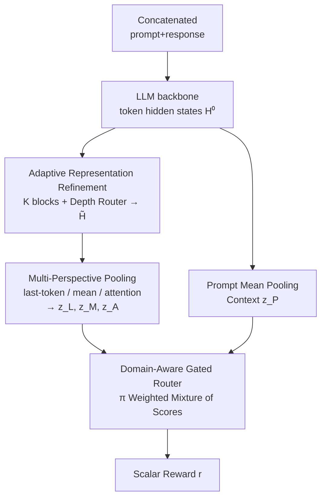

# AdaJudge: Adaptive Multi-Perspective Judging for Reward Modeling

**Conference**: ACL 2026  
**arXiv**: [2601.08097](https://arxiv.org/abs/2601.08097)  
**Code**: TBD  
**Area**: RLHF Alignment  
**Keywords**: Reward Model, Adaptive Pooling, Mixture-of-Pooling, Representation Refinement, Preference Learning

## TL;DR
To address two structural defects in reward models—the fixed spatial inductive bias and the misalignment between generative backbone representations and discriminative tasks caused by "compressing the entire sequence into a scalar via fixed pooling (e.g., last-token)"—AdaJudge proposes a gated refinement block to reshape representations into a discriminative space. It then utilizes "domain-aware gated multi-perspective pooling" to dynamically fuse evidence from last-token, mean, and attention poolings conditioned on the prompt. This approach allows 4B/8B models to outperform strong 27B off-the-shelf reward models on RM-Bench and JudgeBench.

## Background & Motivation
**Background**: The architecture of mainstream reward models (RM) is highly standardized: a causal transformer backbone encodes the concatenated "prompt+response" into token-level hidden states, followed by a **fixed pooling operation** (most commonly taking the last token's hidden state, i.e., last-token pooling) to compress it into a single scalar score, trained with the Bradley-Terry loss. While efficient, recent improvements have focused almost exclusively on data quality and backbone scale, leaving the scoring head itself unchanged.

**Limitations of Prior Work**: The paper identifies an overlooked issue with fixed pooling: the **spatial distribution of validation evidence varies by task**. Correctness signals for math or code problems are often local and concentrated near the final answer (suitable for last-token), whereas holistic attributes like safety, coherence, and style are dispersed throughout the sequence (suitable for mean pooling). Forcing a general-purpose RM to use a single pooling type necessitates a systematic trade-off between the high-frequency local sensitivity needed for reasoning errors and the low-frequency global integration required for safety evaluation. Figure 1 shows that last-token is good at capturing terminal signals but misses defects hidden earlier, while mean pooling captures global attributes but suffers from signal dilution in long contexts.

**Key Challenge**: Beyond the fixed bias of aggregation, there is a deeper issue of **representation mismatch**. Backbone hidden states are optimized for next-token prediction, while preference discrimination requires fine-grained pairwise distinction under noisy, sequence-level supervision. Subtle preference cues, such as logical consistency or minor constraint violations, are often misaligned with the pairwise ranking objective in the original representation space, and the required level of abstraction varies significantly across samples.

**Core Idea**: A **two-stage adaptive** process is employed to simultaneously transform "representation" and "aggregation." First, backbone representations are refined into a discrimination-oriented space (with adaptive refinement depth per sample). Second, a prompt-conditioned gating network dynamically mixes evidence from multiple pooling experts rather than committing to a single fixed operation.

## Method

### Overall Architecture
AdaJudge is integrated after any LLM backbone. The input consists of token-level hidden states $\mathbf{H}^{(0)}\in\mathbb{R}^{L\times d}$ obtained from the "prompt+response" sequence, and the output is a single scalar reward $r(\mathbf{x},\mathbf{y})$. The process involves two stages: Stage I, "Adaptive Representation Refinement," uses $K$ lightweight transformer blocks to enhance representations and adaptively fuses intermediate states via a depth router to produce refined representations $\tilde{\mathbf{H}}$. Stage II, "Multi-Perspective Aggregation," extracts three complementary features—last-token, mean, and attention ($\mathbf{z}_L, \mathbf{z}_M, \mathbf{z}_A$)—from $\tilde{\mathbf{H}}$. Each feature generates a score via an MLP head, which are then weighted by a pooling router conditioned on the prompt context $\mathbf{z}_P$ to produce the final reward. These modules are lightweight, trained via LoRA, and do not require token-level or process-level supervision.

### Key Designs

**1. Adaptive Representation Refinement: Reshaping generative representations for discrimination and adjusting depth by sample difficulty**

This design addresses "representation mismatch." Following the backbone states $\mathbf{H}^{(0)}$, $K$ serial lightweight transformer blocks $\mathcal{T}_k$ evolve the representations: $\mathbf{H}^{(k)}=\mathcal{T}_k(\mathbf{H}^{(k-1)})$. The goal is to amplify subtle preference signals (e.g., logical inconsistency) that may be submerged in standard language modeling features. Since refinement needs vary—simple samples may require shallow cues while hard samples need deeper reasoning traces—the paper introduces **depth gating**. A sequence-level context vector (via mean pooling of backbone features) is projected to obtain mixing coefficients $\boldsymbol{\alpha}\in\Delta^K$. The refined representation is a convex combination of intermediate states:

$$\tilde{\mathbf{H}}=\sum_{k=1}^{K}\alpha_k\,\mathbf{H}^{(k)}.$$

This allows the model to prioritize shallow layers for easy samples and deeper layers for hard ones. $K$ is kept small (e.g., 2 for Phi-3.5-mini, 3 for Qwen3-4B/8B) to minimize overhead.

**2. Multi-Perspective Pooling: Three complementary experts covering different spatial granularities**

To avoid the information bottleneck of a single pooling method, AdaJudge extracts three features from $\tilde{\mathbf{H}}$ with distinct spatial sensitivities. **Last-token pooling** takes the hidden state of the final response token $\mathbf{z}_L=\tilde{\mathbf{H}}_\tau$ (where $\tau=\max\{t\mid m_t=1\}$ and $\mathbf{m}$ is the response mask), capturing conclusion-sensitive signals. **Mean pooling** takes the masked average across all response tokens $\mathbf{z}_M=\frac{\sum_t m_t\tilde{\mathbf{H}}_t}{\sum_t m_t}$, capturing global style and coherence. **Attention pooling** uses a linear scorer $\mathbf{W}_a\in\mathbb{R}^{1\times d}$ to calculate weights for a weighted sum, specifically detecting sparse anomalies:

$$\beta_t=\frac{\exp(\mathbf{W}_a\tilde{\mathbf{H}}_t+b_a)}{\sum_j\exp(\mathbf{W}_a\tilde{\mathbf{H}}_j+b_a)},\quad \mathbf{z}_A=\sum_t \beta_t\tilde{\mathbf{H}}_t.$$

These provide diverse "perspectives" covering terminal-local, global-holistic, and sparse-distributed evidence.

**3. Domain-Aware Gated Routing: Dynamically selecting aggregation strategies via prompt context**

Each perspective vector $\mathbf{z}_v$ ($v\in\{L,M,A\}$) produces a scalar score $s_v$ via an independent MLP. To determine which perspective to trust, the model uses **prompt token** mean pooling to obtain $\mathbf{z}_P$ as a "task and intent" context signal. This signal is decoupled from the specific response and reflects the domain or intent of the query. The routing network takes the concatenated vector $[\mathbf{z}_L;\mathbf{z}_M;\mathbf{z}_A;\mathbf{z}_P]$ and outputs mixture weights $\boldsymbol{\pi}\in\Delta^3$. The final reward is:

$$r(\mathbf{x},\mathbf{y})=\pi_L s_L+\pi_M s_M+\pi_A s_A.$$

Conditioning on $\mathbf{z}_P$ encourages the model to infer the prompt's domain and intent before selecting the aggregation strategy that best matches the task's evidence distribution (e.g., favoring last-token for math and mean for safety).

### Loss & Training
The model is trained using a **Focal Bradley-Terry objective**. Let $p=\sigma((r^+-r^-)/\tau_{bt})$ be the predicted probability that the preferred response $\mathbf{y}^+$ is ranked higher than $\mathbf{y}^-$. The loss is:

$$\mathcal{L}=-w_m(1-p)^\gamma\log(p)+\lambda\max\big(0,\eta-\mathcal{H}(\boldsymbol{\pi})\big)^2.$$

Here, $(1-p)^\gamma$ is the focal term emphasizing hard samples; $w_m$ is a non-negative weight for each pair based on preference magnitude; and the final term is entropy regularization on $\boldsymbol{\pi}$. The latter penalizes weights when entropy falls below a threshold $\eta$, preventing the router from collapsing into a single perspective. Training uses the HelpSteer3 preference split (~40.5K pairs) with LoRA fine-tuning.

## Key Experimental Results

### Main Results
Evaluated on RM-Bench (chat/math/code/safety across Easy/Normal/Hard) and JudgeBench (knowledge/reasoning/math/code) using pairwise accuracy. Notably, **Qwen3-8B + AdaJudge achieved 71.1 on RM-Bench, surpassing the 27B Skywork-Reward-Gemma-2 (70.5)**, while the same backbone with fixed pooling scored 67.3.

| Model / Configuration | RM-Bench Overall | JudgeBench Overall | Description |
|------|------|------|------|
| Skywork-Reward-Gemma-2-27B (off-the-shelf) | 70.5 | 64.3 | RM-Bench Leaderboard Reference |
| Skywork-Reward-Llama-3.1-8B (off-the-shelf) | 70.1 | 62.3 | JudgeBench Leaderboard Reference |
| Phi-3.5-mini + last-token | 58.0 | 55.1 | Baseline with fixed pooling |
| Phi-3.5-mini + **AdaJudge** | 59.8 | 59.4 | Improvements on both benchmarks |
| Qwen3-4B + last-token | 67.6 | 62.3 | |
| Qwen3-4B + **AdaJudge** | 70.8 | 66.0 | |
| Qwen3-8B + last-token | 67.3 | 63.1 | |
| Qwen3-8B + **AdaJudge** | **71.1** | 66.0 | Outperforms 27B off-the-shelf |

### Ablation Study
Ablations on Qwen3-4B compared four aggregation strategies (Table 2) and validated the Stage-I refinement module (Table 3).

| Configuration | RM-Bench Avg | RM-Bench Hard | JudgeBench Avg | Description |
|------|------|------|------|------|
| Last-Token | 69.2 | 37.0 | 65.1 | Single perspective |
| Mean-Pool | 67.4 | 34.8 | 64.3 | Single perspective |
| Attn-Pool | 69.5 | 38.7 | 65.1 | Single perspective |
| **AdaJudge (Full)** | **70.8** | **43.7** | **66.0** | Multi-perspective gated |
| w/o Refinement | 69.8 | 39.6 | 62.6 | Direct backbone features |

### Key Findings
- **AdaJudge provides the largest gains on the hardest subsets**: RM-Bench Hard accuracy rose from 37.0/34.8/38.7 (single perspectives) to 43.7. This confirms that fixed pooling fails most significantly when evidence distribution is uncertain or sparse.
- **Removing Stage-I refinement hurts complex tasks**: Performance dropped on JudgeBench Avg (66.0 to 62.6) and RM-Bench Hard (43.7 to 39.6), indicating that representation refinement is crucial for fine-grained discrimination in Math/Code/Hard tasks.
- **Compact models benefit more**: Small models like Phi-3.5-mini lack the capacity to squeeze diverse preference semantics into a single perspective. AdaJudge offloads evidence extraction to specific perspectives, helping the backbone maintain general representations while improving scores by 1.4–4 points.
- **Achieved true Pareto improvement**: On Qwen3-8B, Math remained at 80.4 while Safety reached 87.5 and Hard reached 43.0. Simultaneous improvements in conflicting dimensions validate the effectiveness of prompt-adaptive receptive fields.

## Highlights & Insights
- **Transformation of "pooling method" from hyperparameter to learnable task inference**: Instead of manual selection, prompt-conditioned gating allows the model to choose. Entropy regularization prevents collapse and maintains the generalizability of the approach.
- **Decoupling prompt context $\mathbf{z}_P$ for routing is ingenious**: Decisions are based on "what the task is" without being contaminated by specific response content, avoiding shortcuts where the router might learn to select perspectives based on response quality.
- **Lightweight and sans process-level supervision**: Unlike ArmoRM (multi-objective heads) or model ensembles, AdaJudge adds minimal overhead via lightweight blocks and MLP heads. It achieves ensemble-like adaptive gains within a single model.

## Limitations & Future Work
- The set of pooling experts (last-token/mean/attention) is manually defined. If a task requires a different evidence distribution pattern (e.g., hierarchical paragraph-level aggregation), the current experts may be insufficient.
- Experiments focused on 3 backbones (≤8B) and a single training set. Generalization across larger scales and more diverse datasets remains to be tested.
- Sensitivity to hyperparameters like focal weight $w_m$, entropy threshold $\eta$, and refinement depth $K$ is not extensively discussed, which may imply tuning costs in deployment.
- While the paper claims no need for process-level supervision, the stability of attention pooling in very long sequences or multi-turn dialogues requires further investigation.

## Related Work & Insights
- **vs ArmoRM / Multi-Objective Heads**: While those use independent heads to decouple conflicting signals, AdaJudge focuses on the "aggregation layer," maintaining a single output while using multi-perspective pooling to address "spatial evidence distribution."
- **vs Model Ensembles**: AdaJudge achieves adaptive benefits through conditional computation (depth-adaptive + pooling routing) within a single model, avoiding the prohibitive latency of multi-model ensembles.
- **vs Fixed Pooling Baselines**: The study demonstrates that simply replacing the fixed readout with adaptive mixture significant improves performance on difficult subsets under identical training conditions, suggesting that the structural bias of scoring heads has been significantly underestimated.

## Rating
- Novelty: ⭐⭐⭐⭐ Turning pooling into a learnable, prompt-conditioned mixture is a fresh approach to a structural blind spot.
- Experimental Thoroughness: ⭐⭐⭐⭐ Solid benchmarks across multiple backbones with clean controls, though backbone size and data diversity are somewhat limited.
- Writing Quality: ⭐⭐⭐⭐ Clear motivation regarding structural mismatches; equations and diagrams are well-aligned.
- Value: ⭐⭐⭐⭐ Significant practical value for RLHF by allowing 8B models to exceed 27B models with lightweight, plug-and-play components.

<!-- RELATED:START -->

## Related Papers

- [\[ACL 2026\] AgentV-RL: Scaling Reward Modeling with Agentic Verifier](agentv-rl_scaling_reward_modeling_with_agentic_verifier.md)
- [\[ACL 2026\] Aligning Agents via Planning: A Benchmark for Trajectory-Level Reward Modeling](aligning_agents_via_planning_a_benchmark_for_trajectory-level_reward_modeling.md)
- [\[ACL 2025\] AMoPO: Adaptive Multi-objective Preference Optimization without Reward Models and Reference Models](../../ACL2025/llm_alignment/amopo_adaptive_multi-objective_preference_optimization_without_reward_models_and.md)
- [\[ACL 2026\] ARES: Adaptive Red-Teaming and End-to-End Repair of Policy-Reward System](ares_adaptive_red-teaming_and_end-to-end_repair_of_policy-reward_system.md)
- [\[ACL 2026\] MAESTRO: Meta-learning Adaptive Estimation of Scalarization Trade-offs for Reward Optimization](maestro_meta-learning_adaptive_estimation_of_scalarization_trade-offs_for_reward.md)

<!-- RELATED:END -->
