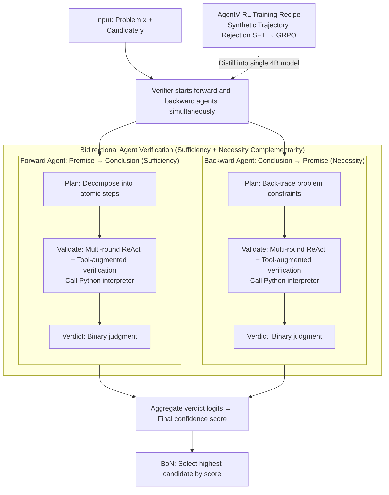

# AgentV-RL: Scaling Reward Modeling with Agentic Verifier

**Conference**: ACL 2026  
**arXiv**: [2604.16004](https://arxiv.org/abs/2604.16004)  
**Code**: Available (GitHub)  
**Area**: LLM Agent / Reward Modeling  
**Keywords**: Agentic Verifier, Reward Model, Test-Time Scaling, Tool-Augmented Reasoning, GRPO

## TL;DR
The reward model is reshaped from a "single-round scoring" mechanism into a multi-round deliberation process involving "forward + backward dual agents + tool use." Through SFT and GRPO, these multi-agent capabilities are distilled into a single 4B model, which outperforms 70B-scale ORMs by 25.2% in Best-of-N (BoN) selection.

## Background & Motivation

**Background**: In complex reasoning tasks such as mathematics, Test-Time Scaling (e.g., BoN parallel sampling, sequential refinement via iterative correction) increasingly relies on reward models (verifiers) to select or critique candidate solutions. Current mainstream solutions fall into three categories: ORM (scalar output, zero explanation), PRM (step-level scalars), and GenRM (generative natural language judgments).

**Limitations of Prior Work**: (1) **Error Propagation**: GenRMs are primarily trained with next-token prediction on mostly positive samples. When encountering solutions that "look plausible but are actually wrong," they are easily misled by surface logic and produce false positives. (2) **Lack of External Grounding**: Pure text verifiers are prone to calculation errors in numerical, long-chain arithmetic, or knowledge-intensive tasks, making them unable to provide independent verification.

**Key Challenge**: Single-round text reasoning simultaneously handles "logical chain review" and "numerical/factual verification." The former can be contaminated by incorrect premises, while the latter often fails due to the LLM's inherent arithmetic weaknesses—tasks that are naturally in conflict.

**Goal**: To upgrade reward modeling from "one-time scoring after reading" to "multi-round, bidirectional, tool-augmented deliberation" similar to human proof-checking, and to train a single model possessing these capabilities.

**Key Insight**: Borrow the "sufficiency + necessity" bidirectional check from mathematical proofs—one agent reasons from premises to conclusion to check sufficiency, while another reasons backward from conclusion to premises to check necessity. Both are allowed to use a Python interpreter for verification. These two paths are complementary and typically expose errors overlooked by the other.

**Core Idea**: Replace single-round GenRM with "Dual agent × Multi-round ReAct × Code Interpreter," then distill this multi-agent process into a single LLM using "Synthetic trajectories + Rejection sampling SFT + GRPO."

## Method

### Overall Architecture

AgentV-RL transforms the "reward model" from a one-pass scorer into a multi-round, bidirectional, tool-augmented deliberation process. During inference, given a problem $x$ and a candidate solution $y$, the verifier $\pi_\psi$ simultaneously activates two agents: a forward agent that reasons from premises to conclusion to check the sufficiency of each step, and a backward agent that reasons from the final answer back to the problem statement to check if all constraints are truly satisfied. Both can invoke a Python interpreter for numerical verification mid-process. After each path completes the "Plan → Validate → Verdict" sequence to output a binary judgment, the verdict token logits are aggregated to obtain a comprehensive confidence score for the solution. In BoN scenarios, the candidate with the highest score is selected. For training, a two-step process distills this multi-agent workflow into a single 4B model—first using Rejection Sampling SFT on synthetic trajectories to instill ReAct and tool-using behaviors, followed by GRPO to unlock deeper reasoning.

### Key Designs

**1. Bidirectional Agent Verification: Complementary Sufficiency and Necessity Checks**

Pure forward review has a chronic flaw: it is easily misled by surface logic in pseudoproofs that "look consistent step-by-step but actually bypass a constraint," leading to false positives. This paper addresses this using the mathematical methodology of "sufficiency + necessity." The forward agent decomposes the solution into atomic steps $\Pi = \{v_1, \ldots, v_n\}$ and checks the logical sufficiency between adjacent steps. Conversely, the backward agent reasons from the answer back to the problem statement to verify if every constraint was actually utilized and if there are hidden omissions. Both share the same "Plan / Validate / Verdict" three-stage prompt template but review in opposite directions, thus naturally exposing complementary error types.

**2. Multi-round ReAct + Tool-augmented Verification: Executing Code at Critical Nodes**

When reviewing competition problems like AIME, the bottleneck is often confirming whether an equation holds. LLMs are notably unreliable at long-chain arithmetic or exhaustive checks; pure text verifiers often make mistakes themselves. Thus, the Validate stage is organized as a ReAct trajectory $\mathcal{H} = (s_0, a_0, o_0, \ldots, s_t, a_t, o_t)$, where $s$ represents thought, $a$ represents code action, and $o$ is the observation from the Python interpreter. Action segments are wrapped in special tokens to allow masking the gradients of the observation parts during training. Typically, a problem requires 5–6 rounds of thought with approximately 1 tool call; while the frequency is low, utilizing the interpreter at the decisive equation is much more reliable than model hallucinations.

**3. AgentV-RL Training Recipe: Synthetic SFT Distillation + GRPO Reasoning**

Deploying multi-agent inference directly is too costly; thus, the capability is distilled into a single model. First, $k=8$ candidate solutions are sampled from datasets like Polaris, DeepScaleR, and AReaL-boba. Overly simple problems (all correct/wrong) are filtered out. The LLM acts as the forward or backward agent to generate verification trajectories, and only those where the verdict matches the ground truth are retained, forming a $\mathcal{D}_{\text{sft}}$ of 15K samples. SFT applies NLL to all non-observation tokens: $\mathcal{L} = -\mathbb{E}_\tau\big[\sum_i \mathbb{I}[\tau_i \neq o_i] \log \pi_\theta(\tau_i \mid \mathcal{H}_{<i})\big]$, instilling ReAct and tool behaviors. Subsequently, GRPO is run on 50K samples with rewards $r(\mathcal{H}) = 1$ (correct verdict) or $-1$ (incorrect). DAPO-style dynamic filtering is used to remove zero-variance groups, allowing the model to autonomously explore optimal tool use and reasoning paths.

### Loss & Training

The GRPO objective is $\mathcal{J}_{\mathrm{GRPO}}(\psi) = \mathbb{E}\big[\frac{1}{G}\sum_i \frac{1}{|\mathcal{H}_i|} \sum_t \min(r_{i,t}\hat{A}_{i,t}, \mathrm{clip}(r_{i,t}, 1-\epsilon_{\text{low}}, 1+\epsilon_{\text{high}})\hat{A}_{i,t}) - \beta D_{\mathrm{KL}}(\pi_\psi \| \pi_{\mathrm{ref}})\big]$. Mixed sampling allows the same model to act as both forward and backward agents. To prevent the model from memorizing environmental observation strings rather than learning reasoning, execution results from the interpreter are explicitly masked during loss calculation.

## Key Experimental Results

### Main Results

| Model | MATH500@128 | GSM8K@128 | Gaokao2023@128 | AIME24@128 |
|------|------------|-----------|---------------|------------|
| Qwen3-4B-Think (base) | 72.4 | 92.2 | 51.9 | 36.7 |
| INF-ORM-Llama3.1-70B | 55.4 | 91.5 | 44.4 | 40.0 |
| Qwen2.5-Math-PRM-7B | 70.2 | 95.4 | 54.3 | 46.7 |
| Skywork-V2-Llama-8B | 53.8 | 87.6 | 39.7 | 36.7 |
| **Agentic-Verifier-Qwen3-4B** | **79.0** | 93.3 | **57.4** | **53.3** |

On MATH500@128, Ours is 25.2 percentage points higher than the strongest ORM (Skywork-V2-Llama-8B at 53.8); the 4B model outperforms the 70B ORM.

### Ablation Study

| Config | MATH500 (BoN) | Description |
|------|--------------|------|
| Full (Forward + Backward + Tool) | 78.9 | Full model |
| Forward only | ~75 | Unidirectional sufficiency check |
| Backward only | ~74 | Unidirectional necessity check |
| w/o Tool | Significant drop | Performance drops without Python interpreter |
| Train-free | +2.6 Gain (Gaokao) | Effective even with direct prompting |
| SFT only | Moderate | Only SFT without RL |
| SFT + RL (Full) | Best | Full AgentV-RL recipe |

### Key Findings
- Bidirectional agents are significantly better than unidirectional ones—forward and backward paths expose complementary error types; removing either leads to performance drops.
- Tool usage frequency is not high (average of 1.6 Python calls per trajectory for the 4B model), but the performance drop after removal is significant, indicating that tools are irreplaceable at critical nodes.
- This method benefits more as the BoN $N$ increases (32 → 64 → 128), reaching 53.3% on AIME24 with $N=128$.
- Model size scaling is consistent: performance on Gaokao2023 rises monotonically from 43.9 → 49.4 → 57.4 for 0.6B → 1.7B → 4B models.
- Substantial leads were also observed on LiveCodeBench (70.86) and HotpotQA (66.00), showing the method generalizes beyond mathematics.

## Highlights & Insights
- Redefining the "Reward Model" as an "agent" marks a clear paradigm shift from the scalar/single-round paradigms of PRM/GenRM towards agentic reward modeling.
- The bidirectional proof logic is ingenious: applying "sufficiency + necessity" from mathematics to RMs explains why two agents are complementary rather than redundant.
- Excluding observation gradients via token-level masking is a crucial technical detail for training ReAct-style agents, ensuring the model learns reasoning rather than memorizing environment strings.
- The result of a 4B model defeating a 70B ORM suggests that inference compute might be more valuable for the RM than the actor, as RM errors are amplified multiplicatively.

## Limitations & Future Work
- Multi-round deliberation plus tool usage increases the reasoning token count from 2560 (base) to 8349 and per-problem latency from 119s to 323s (A100, batch 128), which is less suitable for real-time scenarios.
- Synthetic trajectory coverage is biased towards math/code; generalizability to open-domain preferences (e.g., helpfulness, writing style) remains unverified.
- Tools are limited to a Python interpreter; tasks requiring external knowledge (e.g., real-world fact-checking) might still result in missed detections.
- There is no explicit negotiation mechanism between the dual agents; they currently score independently before aggregation, potentially leaving "systemic blind spots."

## Related Work & Insights
- **vs GenRM (Zhang et al., 2025)**: GenRM's single-round text judgments are easily fooled by plausible-but-wrong solutions; this work uses multi-round, tools, and bidirectionality at the cost of 3× tokens and latency.
- **vs PRM (Lightman et al., 2024, etc.)**: PRMs provide step-level scalar supervision but lack interpretability and require dense step annotations; our verdict provides readable critiques with only outcome-level supervision.
- **vs Tool-augmented RM (Li et al., 2024)**: Existing tool-RMs use loosely coupled tools; this work embeds tool calls directly into the ReAct reasoning chain, allowing tool results to directly inform verification decisions.

## Rating
- Novelty: ⭐⭐⭐⭐ The combination of bidirectional agents, tools, and RL is a novel paradigm in the RM field.
- Experimental Thoroughness: ⭐⭐⭐⭐⭐ 4 math benchmarks + LCB + HotpotQA + scaling experiments + thorough ablations.
- Writing Quality: ⭐⭐⭐⭐ Clear motivation and complete technical details.
- Value: ⭐⭐⭐⭐ 4B > 70B results are highly attractive for industrial deployment, opening the direction for agentic RM.

<!-- RELATED:START -->

## Related Papers

- [\[ACL 2026\] Aligning Agents via Planning: A Benchmark for Trajectory-Level Reward Modeling](aligning_agents_via_planning_a_benchmark_for_trajectory-level_reward_modeling.md)
- [\[ACL 2025\] Dynamic Scaling of Unit Tests for Code Reward Modeling](../../ACL2025/llm_alignment/dynamic_scaling_of_unit_tests_for_code_reward_modeling.md)
- [\[ICLR 2026\] Skywork-Reward-V2: Scaling Preference Data Curation via Human-AI Synergy](../../ICLR2026/llm_alignment/skywork-reward-v2_scaling_preference_data_curation_via_human-ai_synergy.md)
- [\[ACL 2026\] MAESTRO: Meta-learning Adaptive Estimation of Scalarization Trade-offs for Reward Optimization](maestro_meta-learning_adaptive_estimation_of_scalarization_trade-offs_for_reward.md)
- [\[ICML 2026\] Mitigating Reward Hacking in RLHF via Bayesian Non-negative Reward Modeling](../../ICML2026/llm_alignment/mitigating_reward_hacking_in_rlhf_via_bayesian_non-negative_reward_modeling.md)

<!-- RELATED:END -->
