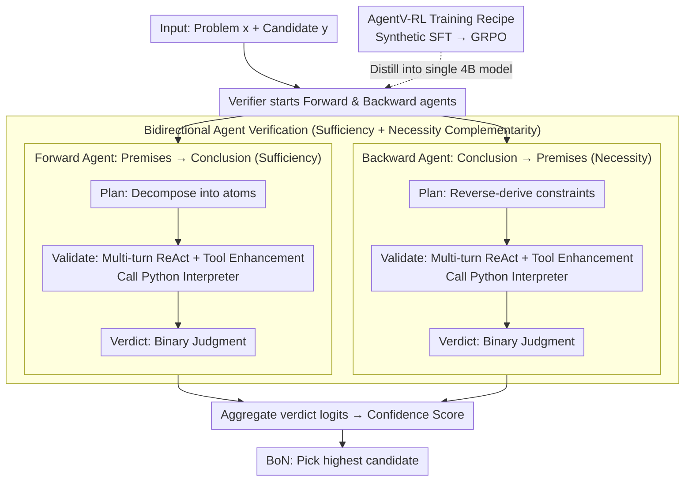

# AgentV-RL: Scaling Reward Modeling with Agentic Verifier

**Conference**: ACL 2026  
**arXiv**: [2604.16004](https://arxiv.org/abs/2604.16004)  
**Code**: Yes (GitHub)  
**Area**: LLM Agent / Reward Modeling  
**Keywords**: Agentic Verifier, Reward Model, Test-Time Scaling, Tool-Augmented Reasoning, GRPO

## TL;DR
The reward model is reshaped from a "single-turn scoring" mechanism into a multi-turn deliberation process featuring "forward + backward dual agents + tool calls." Through SFT+GRPO, these multi-agent capabilities are distilled into a single 4B model, which outperforms 70B-scale ORMs by 25.2% in Best-of-N (BoN) selection.

## Background & Motivation

**Background**: For complex reasoning tasks such as mathematics, Test-Time Scaling (parallel sampling via BoN, sequential refinement via iterative correction, etc.) increasingly relies on reward models (verifiers) to select or critique candidate solutions. Current mainstream solutions include ORMs (scalar output, zero explanation), PRMs (step-level scalars), and GenRMs (natural language generative judgments).

**Limitations of Prior Work**: (1) **Error Propagation**: GenRMs are often trained with next-token prediction on datasets biased toward positive examples. When encountering "plausible but actually incorrect" solutions, they are easily misled by surface logic, leading to false positives. (2) **Lack of External Grounding**: Pure-text verifiers are prone to calculation errors in numerical computation, long-chain arithmetic, or knowledge-intensive tasks, making them incapable of independent verification.

**Key Challenge**: A single-turn textual reasoning process simultaneously handles "logical chain review" and "numerical/factual verification." The former can be contaminated by incorrect premises, while the latter often fails due to the arithmetic weaknesses of LLMs—these two tasks are inherently in conflict.

**Goal**: Upgrade reward modeling from "one-time scoring" to a "multi-turn, bidirectional, tool-augmented review" similar to how humans verify proofs, and train a single model to possess this capability.

**Key Insight**: Borrow the "sufficiency + necessity" bidirectional check from mathematical proofs—one agent deduces from premises to the conclusion (sufficiency), while another deduces from the conclusion back to the premises (necessity). Both are allowed to call a Python interpreter for computation. These two paths are complementary and typically expose errors overlooked by the other.

**Core Idea**: Replace single-turn GenRM with a "dual agent × multi-turn ReAct × code interpreter" workflow, then distill this multi-agent process into a single LLM using "synthetic trajectories + rejection sampling SFT + GRPO."

## Method

### Overall Architecture

AgentV-RL transforms the "reward model" from a one-time scoring mechanism into a multi-turn, bidirectional, and tool-augmented deliberation process. During inference, given a problem $x$ and a candidate solution $y$, the verifier $\pi_\psi$ simultaneously activates a forward and a backward agent. The forward agent deduces from the premises to the conclusion to check if each step is sufficient, while the backward agent traces from the final answer back to the problem statement to check if all constraints are satisfied. Both can call a Python interpreter mid-way to verify numerical values. After completing their "Plan → Validate → Verdict" cycles, both output a binary judgment. Aggregating the token logits of the verdicts yields a comprehensive confidence score for the solution. In BoN scenarios, the candidate with the highest score is selected. The training involves a two-step process to compress this multi-agent workflow into a single 4B model: first, rejection sampling SFT on synthetic trajectories to instill ReAct and tool behaviors, followed by GRPO to release deeper reasoning capabilities.

### Key Designs

**1. Dual-directional Agent Verification: Complementary Sufficiency and Necessity Checks**

Purely forward review suffers from a persistent issue: when encountering "pseudoproofs" that seem self-consistent but bypass specific constraints, the model is easily misled. This research addresses this using the "sufficiency + necessity" methodology. The forward agent decomposes the solution into atomic steps $\Pi = \{v_1, \ldots, v_n\}$ and checks the sufficiency of logic between adjacent steps. Conversely, the backward agent works from the answer back to the problem statement to verify if every constraint was actually used or if there were hidden omissions. Both share the same "Plan / Validate / Verdict" prompt template but review in opposite directions, making their error detection naturally complementary. The final aggregation of both verdicts avoids systemic blind spots from a single perspective.

**2. Multi-turn ReAct + Tool-Enhanced Verification: Calling Code at Critical Nodes**

When reviewing competitive math problems (e.g., AIME), the bottleneck is often determining "whether this equation actually holds." LLMs are least reliable when performing long-chain arithmetic or enumeration. Thus, the Validate stage is organized as a ReAct trajectory $\mathcal{H} = (s_0, a_0, o_0, \ldots, s_t, a_t, o_t)$, where $s$ is thought, $a$ is code action, and $o$ is the observation from the Python interpreter. Actions are wrapped in special tokens to exclude the gradients of the observation segment during training. Typically, a problem requires 5–6 turns of thought with roughly one tool call (see Table 5); while the call frequency is low, utilizing a reliable interpreter for the final equation verification is far superior to model hallucination.

**3. AgentV-RL Training Recipe: Synthetic SFT Distillation + GRPO Reasoning**

Deploying multi-agent inference directly is costly; therefore, this capability is distilled into a single model. First, $k=8$ candidate solutions are sampled from datasets like Polaris, DeepScaleR, and AReaL-boba. Overly simple problems where all candidates are correct or incorrect are filtered out. An LLM acts as the forward or backward agent to generate verification trajectories, and only trajectories where the verdict matches the ground truth are kept, forming an SFT dataset $\mathcal{D}_{\text{sft}}$ of 15K sequences. The SFT stage applies NLL loss to all non-observation tokens: $\mathcal{L} = -\mathbb{E}_\tau\big[\sum_i \mathbb{I}[\tau_i \neq o_i] \log \pi_\theta(\tau_i \mid \mathcal{H}_{<i})\big]$. Subsequently, GRPO is run on 50K samples with rewards $r(\mathcal{H}) = 1$ (correct verdict) or $-1$ (incorrect). DAPO-style dynamic filtering is used to remove zero-variance groups, encouraging the model to explore optimal tool usage and reasoning paths.

### Loss & Training

The GRPO objective is $\mathcal{J}_{\mathrm{GRPO}}(\psi) = \mathbb{E}\big[\frac{1}{G}\sum_i \frac{1}{|\mathcal{H}_i|} \sum_t \min(r_{i,t}\hat{A}_{i,t}, \mathrm{clip}(r_{i,t}, 1-\epsilon_{\text{low}}, 1+\epsilon_{\text{high}})\hat{A}_{i,t}) - \beta D_{\mathrm{KL}}(\pi_\psi \| \pi_{\mathrm{ref}})\big]$. Mixed sampling allows the same model to play both forward and backward agents. To prevent the model from memorizing environmental observation strings rather than learning to reason, execution results from the interpreter are explicitly masked during loss calculation.

## Key Experimental Results

### Main Results

| Model | MATH500@128 | GSM8K@128 | Gaokao2023@128 | AIME24@128 |
|------|------------|-----------|---------------|------------|
| Qwen3-4B-Think (base) | 72.4 | 92.2 | 51.9 | 36.7 |
| INF-ORM-Llama3.1-70B | 55.4 | 91.5 | 44.4 | 40.0 |
| Qwen2.5-Math-PRM-7B | 70.2 | 95.4 | 54.3 | 46.7 |
| Skywork-V2-Llama-8B | 53.8 | 87.6 | 39.7 | 36.7 |
| **Agentic-Verifier-Qwen3-4B** | **79.0** | 93.3 | **57.4** | **53.3** |

On MATH500@128, Ours outperforms the strongest ORM (Skywork-V2-Llama-8B at 53.8) by 25.2 percentage points; the 4B model also surpasses the 70B ORM.

### Ablation Study

| Configuration | MATH500 (BoN) | Description |
|------|--------------|------|
| Full (Forward + Backward + Tool) | 78.9 | Full model |
| Forward only | ~75 | Unidirectional sufficiency check |
| Backward only | ~74 | Unidirectional necessity check |
| w/o Tool | Significant drop | Performance drops without Python interpreter |
| Train-free | +2.6 (Gaokao) | Zero-shot prompting is already effective |
| SFT only | Moderate | SFT without RL |
| SFT + RL (Full) | Best | Full AgentV-RL recipe |

### Key Findings
- Bidirectional agents significantly outperform unidirectional ones—forward and backward agents expose complementary error types.
- Tool usage frequency is relatively low (averaging 1.6 Python calls per trajectory), but removing them results in a marked performance drop, indicating that tools are indispensable at critical nodes.
- As N in BoN increases (32 → 64 → 128), this method benefits more, reaching 53.3% on AIME24 with N=128.
- Model size scaling is consistent: performance on Gaokao2023 rises monotonically from 43.9 to 49.4 to 57.4 for 0.6B, 1.7B, and 4B models respectively.
- Substantial leads were also observed on LiveCodeBench (70.86) and HotpotQA (66.00), demonstrating generalizability beyond mathematics.

## Highlights & Insights
- Redefining the "reward model" as an "agent" marks a significant paradigm shift from the scalar/single-turn paradigm of PRM/GenRM to agentic reward modeling.
- The dual-proof concept is ingenious: importing the "sufficiency + necessity" methodology directly into RM explains why two agents should be complementary rather than redundant.
- Tool usage utilizes token-level masking to exclude observation gradients—a vital detail for training ReAct-style agents to prevent memorizing environment strings.
- The 4B model's victory over the 70B ORM suggests that inference compute might be more effectively spent on RM than on the actor, as RM errors are amplified in search/selection.

## Limitations & Future Work
- Multi-turn processes and tool usage increase token counts from 2560 (base) to 8349 and per-problem latency from 119s to 323s (A100, batch 128), which is less suitable for real-time scenarios.
- Synthetic trajectory coverage is biased toward math and code; transferability to open-domain preferences (e.g., helpfulness, writing style) remains unverified.
- Tools are limited to a Python interpreter; tasks requiring external knowledge (e.g., real-world fact-checking) may still result in missed detections.
- There is no explicit negotiation mechanism between the dual agents; they currently score independently before aggregation, potentially leaving "systemic blind spots."

## Related Work & Insights
- **vs GenRM (Zhang et al., 2025)**: GenRM's single-turn textual judgment is easily fooled by plausible-but-wrong solutions; this work uses multi-turn, tools, and bidirectionality at the cost of 3× tokens and latency.
- **vs PRM (Lightman et al., 2024)**: PRMs provide step-level scalar supervision but lack interpretability and require dense step annotations; Ours provides readable critiques and only requires outcome-level supervision.
- **vs Tool-augmented RM (Li et al., 2024)**: Existing tool-RMs use loosely coupled tool calls; this work embeds tool calls directly into the ReAct reasoning chain, making tool results part of the decision logic.

## Rating
- Novelty: ⭐⭐⭐⭐ Combining dual agents, tools, and RL is a new paradigm in the RM field.
- Experimental Thoroughness: ⭐⭐⭐⭐⭐ 4 math benchmarks + LCB + HotpotQA + scaling experiments + thorough ablations.
- Writing Quality: ⭐⭐⭐⭐ Clear motivation and complete technical details.
- Value: ⭐⭐⭐⭐ Results showing 4B > 70B are highly attractive for industrial deployment and chart a path for agentic RM.

<!-- RELATED:START -->

## Related Papers

- [\[ACL 2026\] Aligning Agents via Planning: A Benchmark for Trajectory-Level Reward Modeling](aligning_agents_via_planning_a_benchmark_for_trajectory-level_reward_modeling.md)
- [\[ACL 2025\] Dynamic Scaling of Unit Tests for Code Reward Modeling](../../ACL2025/llm_alignment/dynamic_scaling_of_unit_tests_for_code_reward_modeling.md)
- [\[ICLR 2026\] Skywork-Reward-V2: Scaling Preference Data Curation via Human-AI Synergy](../../ICLR2026/llm_alignment/skywork-reward-v2_scaling_preference_data_curation_via_human-ai_synergy.md)
- [\[ACL 2026\] MAESTRO: Meta-learning Adaptive Estimation of Scalarization Trade-offs for Reward Optimization](maestro_meta-learning_adaptive_estimation_of_scalarization_trade-offs_for_reward.md)
- [\[ACL 2026\] AdaJudge: Adaptive Multi-Perspective Judging for Reward Modeling](adajudge_adaptive_multi-perspective_judging_for_reward_modeling.md)

<!-- RELATED:END -->
