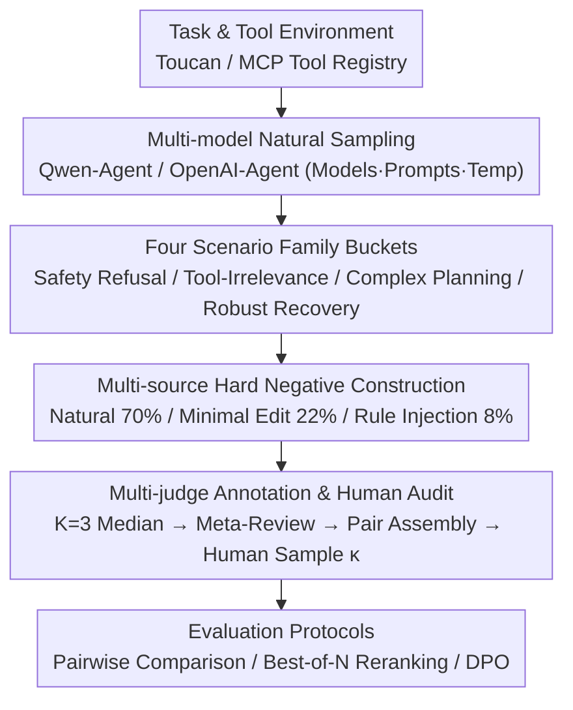

# Aligning Agents via Planning: A Benchmark for Trajectory-Level Reward Modeling

**Conference**: ACL 2026  
**arXiv**: [2604.08178](https://arxiv.org/abs/2604.08178)  
**Code**: None (To be released after corporate approval)  
**Area**: LLM Alignment  
**Keywords**: Reward Models, Agent Evaluation, Trajectory-Level Preferences, Tool Calling, Planning Benchmark

## TL;DR

Plan-RewardBench is proposed as a trajectory-level preference benchmark for complex tool-augmented scenarios, designed to evaluate the capability of reward models in distinguishing superior from inferior agent trajectories across multi-step planning, tool usage, and error recovery.

## Background & Motivation

**Background**: Large Language Models (LLMs) have evolved from passive dialogue systems into agentic systems capable of autonomous tool invocation and complex reasoning. Their behavioral manifestations have expanded from single-turn responses to complete trajectories encompassing user inputs, reasoning, tool execution, and environmental feedback.

**Limitations of Prior Work**: Existing Reward Model (RM) benchmarks (e.g., RewardBench, RM-Bench) primarily focus on response-level preference evaluation, assessing limited dimensions such as helpfulness and safety within short-context scenarios. Tool-calling benchmarks (e.g., FC-RewardBench) only verify the correctness of atomic actions, neglecting the evaluation of long-term planning behaviors.

**Key Challenge**: Agentic systems inherently require multi-turn interactions. However, current benchmarks fail to evaluate the judgment capabilities of reward models over long-range, multi-step trajectories, particularly concerning planning consistency, error recovery, and the quality of refusals.

**Goal**: To construct a trajectory-level preference benchmark that systematically evaluates the ability of reward models to judge planning logic and tool-use faithfulness in complex tool-integration scenarios.

**Key Insight**: Leveraging the MCP tool registry and real execution environments, "hard-to-distinguish" negative pairs are constructed via multi-model natural sampling, rule-based perturbations, and minimal editing.

**Core Idea**: Elevate RM evaluation from the response level to the trajectory level, covering four major scenario families: safety refusal, tool irrelevance, complex planning, and robust error recovery.

## Method

### Overall Architecture

Plan-RewardBench elevates agent alignment evaluation from "response-level" to "trajectory-level": for each instance, given a tool environment $\mathcal{T}$, a multi-turn user interaction, and two complete candidate trajectories $(\tau_A, \tau_B)$, the reward model must determine which is superior. Trajectories include not just the final response but the entire process of reasoning, tool calls, and environmental feedback. The data pipeline starts with real tasks and tool registries from Toucan/MCP. Initial trajectories are naturally sampled using multiple models (e.g., Qwen-Agent, OpenAI-Agent) with varying parameters. Subsequently, "partially correct but semantically flawed" negative samples are produced through rule injection and minimal editing. Finally, preference pairs are assembled via multi-LLM judging and human auditing. The benchmark supports three evaluation protocols: preference data for training discriminative/generative RMs, best-of-N reranking during inference, and DPO-style optimization.

### Key Designs

**1. Four Scenario Families: Covering Core Challenges of Agent Trajectories**

Existing RM benchmarks often focus on a single dimension (helpfulness, safety, or atomic action correctness), whereas real-world agents must avoid errors across diverse contexts. This benchmark categorizes trajectories into four scenario families: Safety Refusal, Tool-Irrelevance, Complex Planning, and Robust Recovery. These correspond to typical challenges: "refuse when necessary," "avoid irrelevant tool calls," "maintain consistent long-term planning," and "recover correctly after errors." This design ensures that trajectory judgment is not treated as a single scalar but requires RMs to possess discriminative power across different failure modes.

**2. Multi-source Hard Negative Construction: Forcing RMs to Focus on Semantics Over Surface Cues**

Simple negative samples are often easily identified by surface signals like length or formatting, which fails to test the true judgment of an RM. Thus, "hard" negative samples that appear correct but are semantically flawed must be constructed. This work mixes 70% natural sampling, 22% minimal edit perturbations, and 8% rule injection to generate refusal/error trajectories. By deliberately controlling the length and format bias between chosen and rejected samples, differences are isolated to the pure semantic level (e.g., in the Tool-Irrelevance scenario, token counts are nearly identical at 1363 vs 1358). Consequently, RMs must truly understand planning logic and tool-use faithfulness to succeed, rather than relying on surface shortcuts.

**3. Multi-judge Annotation & Human Audit: Ensuring Reliable Preference Labels**

Individual LLM judges are prone to systematic biases, which can distort the entire benchmark. To mitigate this, each trajectory pair is independently scored by $K=3$ LLM judges, with the median value taken, followed by a meta-review layer and random human audits. The consistency between human and machine judgments, measured by Cohen's $\kappa \in [0.71, 0.86]$, falls within the "substantial agreement" range, indicating that the preference labels produced by this pipeline are reliable for evaluating various RMs.

## Key Experimental Results

### Main Results

| Model Type | Representative Model | Evaluation Method | Characteristics |
| :--- | :--- | :--- | :--- |
| Discriminative RM | Inf-ORM-Llama3.1-70B | Pointwise Scoring → Select High | Evaluates each trajectory independently |
| Generative RM | Skywork-o1, etc. | Generative Scoring | Evaluates via the generation process |
| LLM-as-Judge | GPT-o3, Claude, etc. | Pairwise Comparison | Directly compares two trajectories |

### Dataset Statistics

| Scenario | Pairs | Avg Token (Chosen/Rejected) | Max Token |
| :--- | :--- | :--- | :--- |
| Tool-Irrelevance | 275 | 1,363 / 1,358 | ~5K |
| Planning-Multi (Hard) | 73 | 6,523 / 6,554 | ~17K |
| Robust Recovery | 361 | 4,545 / 4,462 | ~29K |
| Safety Refusal | 51 | 1,219 / 2,233 | ~11K |

### Key Findings

- All three types of evaluators (Discriminative, Generative, LLM-as-Judge) exhibit a significant performance drop on long-range trajectories.
- Tool grounding hallucinations (claiming to use a tool without an actual call) are the most frequent failure mode in complex planning.
- In safety refusal scenarios, delayed refusal (partial execution followed by a refusal) is the primary source of confusion.
- Blind retrying is the most common error pattern in robust recovery scenarios.

## Highlights & Insights

- Systematically elevates RM evaluation from the response level to the agent trajectory level for the first time, filling a critical gap in agent alignment assessment.
- The methodology for hard negative construction serves as a general blueprint for building training data for agent planning preferences.
- Human audit results (Cohen's $\kappa > 0.7$) validate the reliability of the annotation pipeline.
- It identifies that all mainstream RMs face significant challenges with long-range trajectories, highlighting the necessity for specialized training.

## Limitations & Future Work

- Currently restricted to the text modality, without considering multi-modal agent scenarios.
- Data scale is limited by the high cost of quality annotation.
- The safety refusal scenario has a relatively small sample size (51 pairs), limiting statistical significance.
- Future work could extend to multi-modal, longer-range, and more complex tool-chain scenarios.

## Related Work & Insights

- RewardBench series (Lambert et al., 2025): Foundations for response-level RM evaluation.
- AgentRewardBench (Lù et al., 2025): Evaluation of Web agent trajectories, but not in tool-augmented scenarios.
- FC-RewardBench (Agarwal et al., 2025): Evaluation of tool-calling correctness, limited to single turns.
- This work provides inspiration for future research in the direction of RL-from-agent-feedback.

## Rating

- **Novelty**: ⭐⭐⭐⭐⭐ First trajectory-level preference benchmark for tool-augmented agents.
- **Experimental Thoroughness**: ⭐⭐⭐⭐ Covers multiple model types with human audit validation.
- **Writing Quality**: ⭐⭐⭐⭐ Clear structure and systematic scenario classification.
- **Value**: ⭐⭐⭐⭐⭐ Fills a key gap in agent RM evaluation.

<!-- RELATED:START -->

## Related Papers

- [\[ACL 2025\] PRMBench: A Fine-grained and Challenging Benchmark for Process-Level Reward Models](../../ACL2025/llm_alignment/prmbench_a_fine-grained_and_challenging_benchmark_for_process-level_reward_model.md)
- [\[ACL 2026\] AdaJudge: Adaptive Multi-Perspective Judging for Reward Modeling](adajudge_adaptive_multi-perspective_judging_for_reward_modeling.md)
- [\[ACL 2026\] AgentV-RL: Scaling Reward Modeling with Agentic Verifier](agentv-rl_scaling_reward_modeling_with_agentic_verifier.md)
- [\[ACL 2025\] SDPO: Segment-Level Direct Preference Optimization for Social Agents](../../ACL2025/llm_alignment/sdpo_segment-level_direct_preference_optimization_for_social_agents.md)
- [\[ACL 2026\] CuMA: Aligning LLMs with Sparse Cultural Values via Demographic-Aware Mixture of Adapters](cuma_aligning_llms_with_sparse_cultural_values_via_demographic-aware_mixture_of_.md)

<!-- RELATED:END -->
