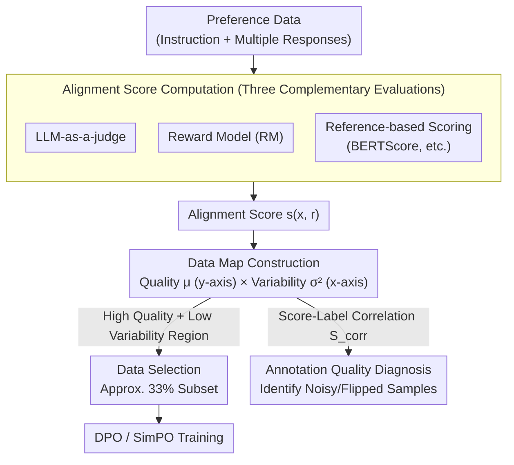

# Alignment Data Map for Efficient Preference Data Selection and Diagnosis

**Conference**: ACL 2026 Findings  
**arXiv**: [2505.23114](https://arxiv.org/abs/2505.23114)  
**Code**: [GitHub](https://github.com/01choco/Alignment-Data-Map)  
**Area**: LLM Alignment / Data Selection  
**Keywords**: Preference Learning, Data Selection, Alignment Data Map, Annotation Quality Diagnosis, DPO

## TL;DR

This paper proposes the Alignment Data Map, an analytical tool that visualizes, selects, and diagnoses preference data by jointly considering response quality and variability. It achieves the alignment performance of full-set training using only 33% of the data.

## Background & Motivation

**Background**: Preference data constitutes the core resource for Large Language Model (LLM) alignment (e.g., DPO, SimPO). However, collecting high-quality human preference annotations is both expensive and inefficient. Identifying and selecting the most effective preference data has thus become a critical challenge.

**Limitations of Prior Work**: Existing data selection methods primarily rely on the **reward margin**—the difference in reward values between two responses. The intuition is that samples with smaller margins provide stronger learning signals. However, reward margins only reflect relative differences and ignore **absolute quality**. Samples with identical margins might consist of two high-quality responses or two low-quality responses, leading to drastically different training outcomes.

**Key Challenge**: Low-margin samples may stem from "two high-quality responses that are difficult to distinguish" (valuable hard samples) or "two low-quality responses that are both poor" (valueless noisy samples). Margins alone cannot differentiate between these two scenarios.

**Goal**: To construct a data analysis tool that simultaneously considers response quality and variability to achieve efficient data selection and annotation quality diagnosis.

**Core Idea**: Drawing inspiration from Dataset Cartography, preference data is mapped into a 2D space where the x-axis represents variability and the y-axis represents quality. Data in the "high quality + low variability" region is most suitable for preference learning—these samples provide high-quality yet indistinguishable response candidates, offering the richest learning signals in a highly ambiguous preference space.

## Method

### Overall Architecture

The Alignment Data Map adopts the logic of Dataset Cartography to upgrade preference data analysis from a one-dimensional "reward margin" to a two-dimensional "quality × variability" plane. The pipeline consists of three steps: first, calculating an alignment score for each response using multiple complementary methods (LLM-as-a-judge, explicit reward models, reference-based scoring); second, calculating quality (mean, as the y-axis) and variability (variance, as the x-axis) for each sample to populate the 2D map; finally, selecting training subsets from the "high quality + low variability" region or diagnosing annotation quality based on the correlation between alignment scores and human labels. The core premise is that data in this region ensures the chosen response is sufficiently good (validating the supervision signal) and provides high information density due to the difficulty in distinguishing candidates.

### Key Designs

**1. Alignment Score Computation: Quantifying Quality via Three Complementary Evaluations**

Any single evaluator may carry inherent biases; relying on one scoring method risks distorting the map. Therefore, this paper utilizes three complementary methods to score each response: (a) LLM-as-a-judge, where a high-capability LLM directly evaluates the alignment of the response to the instruction; (b) Reward Models, using an RM trained on preference data; (c) Reference-based scoring, indirectly evaluating quality via semantic similarity (e.g., BERTScore) to a reference response generated by a high-performance model. These three perspectives cross-validate each other to yield a more robust alignment metric than any single indicator.

**2. Data Map Construction and Selection: Subsampling the "High Quality + Low Variability" Region**

Reward margins only reflect the relative difference between two responses. Identical margins could represent either "two high-quality indistinguishable responses" (valuable samples) or "two poor responses" (noise). To distinguish these, the quality $\mu_d = \frac{1}{|\mathcal{R}|}\sum_{i \in \mathcal{R}} s(x^d, r_i^d)$ and variability $\sigma_d^2 = \frac{\sum_i (s(x^d, r_i^d) - \mu_d)^2}{|\mathcal{R}|}$ are calculated for each data point $d$. By plotting quality on the y-axis and variability on the x-axis, the "High Average" (high quality + low variability) region is targeted for training. High quality ensures the chosen response is genuinely useful for DPO, while low variability implies the responses are close enough to make the comparison informative. Notably, when there are only two responses per sample, variability simplifies to the traditional reward margin, making this framework naturally compatible with existing methods.

**3. Annotation Quality Diagnosis: Identifying Noise via Score-Label Correlation**

Human preference annotations inevitably contain errors that can degrade dataset quality. This paper uses a lightweight signal for automatic detection: the cosine similarity $S_{\mathrm{corr}}$ between the annotated labels $\mathcal{Y}$ and the alignment scores $\mathcal{S}$. High correlation indicates consistency between annotations and objective alignment metrics, while low correlation suggests the sample is likely noisy or flipped. This allows for the bulk identification of systematic annotation errors without manual review, providing a diagnostic dimension to the Alignment Data Map.

### Loss & Training

The alignment algorithms directly employ standard DPO and SimPO; this paper does not modify the training objectives themselves. Data selection occurs prior to training: a subset of approximately 33% of samples is extracted from the "high quality + low variability" region, followed by standard preference learning.

## Key Experimental Results

### Main Results

| Backbone Model | Data Ratio | Selection Strategy | MT-Bench(DPO) | AlpacaEval(DPO) |
|---------------|------------|--------------------|---------------|-----------------|
| Mistral-7B    | 100%       | Full               | 49.7          | 6.81            |
| Mistral-7B    | 33%        | HighAvg            | 45.6          | 6.65            |
| Mistral-7B    | 33%        | Random             | 45.0          | 6.82            |
| Mistral-7B    | 33%        | LowAvg             | 48.8          | 7.20            |
| LLaMA-3-8B    | 33%        | HighAvg(SimPO)     | Best          | Best            |

### Ablation Study

| Region  | Quality | Variability | Effect | Description |
|---------|---------|-------------|--------|-------------|
| HighAvg | High    | Low         | Best or equal to Full | High quality + ambiguous comparison = optimal signal |
| LowAvg  | Low     | Low         | Significant drop | Poor responses are useless even with small margins |
| HighVar | High/Low| High        | Significant drop | Too easy to distinguish; insufficient learning signal |

### Key Findings
- Using only 33% of "high quality + low variability" data can match or even exceed the alignment performance of the full dataset.
- On SimPO, HighAvg selection consistently outperforms full training, proving that data selection is even more effective for newer alignment methods.
- Reward margins alone are insufficient for effective data selection—significant quality variance exists within the same margin level.
- The annotation diagnosis function effectively detects systematic annotation errors and biases.

## Highlights & Insights
- **Simple yet Profound Insight**: Extending preference data analysis from one dimension (margin) to two (quality × variability) reveals the blind spots of margin-based selection.
- **Transfer from Dataset Cartography**: Elegantly adapts the ideas of Swayamdipta et al. to the preference learning scenario.
- **Unification of Variability and Margin**: The fact that variability reduces to the margin when only two responses are present ensures compatibility with existing approaches.
- **Practical Diagnosis Function**: Beyond selection, the ability to detect annotation errors adds significant practical value.
- **Efficiency Gains**: Demonstrating that 67% of data can be safely discarded has direct implications for reducing annotation costs.

## Limitations & Future Work
- Alignment score computation depends on external evaluators (LLM judges or RMs); biases in these evaluators may affect results.
- Experiments were primarily conducted on UltraFeedback and Preference-Dissection; verification on other datasets is still needed.
- The 33% threshold is empirically selected; the optimal ratio may vary across different datasets.
- Dynamic or online data selection strategies (e.g., adjusting the selection region during training) were not explored.
- Future work could combine this with curriculum learning, starting with HighAvg and gradually introducing other regions.

## Related Work & Insights
- **vs. Margin-based Selection (Yang et al., 2024)**: Margin-based selection conflates high-quality and low-quality low-margin samples; the Alignment Data Map solves this by adding the quality dimension.
- **vs. Dataset Cartography (Swayamdipta et al., 2020)**: While the original method is based on confidence and variability during training dynamics, this work adapts it to quality and variability in the alignment context.
- **vs. DPO Data Quality Studies (Pan et al., 2025)**: While that work proves the quality of the "chosen" response is key, this paper operationalizes that finding into a practical data selection tool.

## Rating
- Novelty: ⭐⭐⭐⭐ The 2D data map approach is novel in the alignment field and provides deep insights.
- Experimental Thoroughness: ⭐⭐⭐⭐ Multiple backbones (Mistral/LLaMA), multiple algorithms (DPO/SimPO), and multiple benchmarks (MT-Bench/Evol/AlpacaEval).
- Writing Quality: ⭐⭐⭐⭐ Clear motivation, intuitive visualizations, and concise methodology.
- Value: ⭐⭐⭐⭐ Provides a practical tool for data selection, directly contributing to reducing the cost of alignment training.

<!-- RELATED:START -->

## Related Papers

- [\[AAAI 2026\] Importance-Aware Data Selection for Efficient LLM Instruction Tuning](../../AAAI2026/llm_alignment/importance-aware_data_selection_for_efficient_llm_instruction_tuning.md)
- [\[ICLR 2026\] Towards Understanding Valuable Preference Data for Large Language Model Alignment](../../ICLR2026/llm_alignment/towards_understanding_valuable_preference_data_for_large_language_model_alignmen.md)
- [\[ICLR 2026\] Is On-Policy Data always the Best Choice for Direct Preference Optimization-based LM Alignment?](../../ICLR2026/llm_alignment/is_on-policy_data_always_the_best_choice_for_direct_preference_optimization-base.md)
- [\[NeurIPS 2025\] T-SHIRT: Token-Selective Hierarchical Data Selection for Instruction Tuning](../../NeurIPS2025/llm_alignment/t-shirt_token-selective_hierarchical_data_selection_for_instruction_tuning.md)
- [\[ACL 2026\] What Makes Good Instruction-Tuning Data? An In-Context Learning Perspective](what_makes_good_instruction-tuning_data_an_in-context_learning_perspective.md)

<!-- RELATED:END -->
