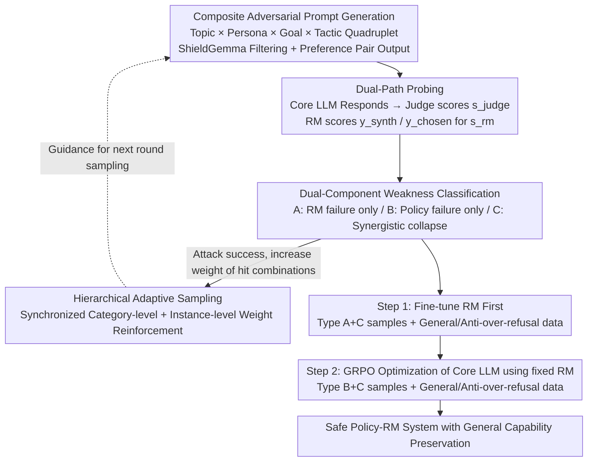

# ARES: Adaptive Red-Teaming and End-to-End Repair of Policy-Reward System

**Conference**: ACL 2026  
**arXiv**: [2604.18789](https://arxiv.org/abs/2604.18789)  
**Code**: None  
**Area**: Alignment RLHF / AI Safety  
**Keywords**: Red-Teaming, Reward Model Repair, Systemic Weakness, Dual Attack, RLHF Safety

## TL;DR
ARES detects "systemic weaknesses" (simultaneous failure of both Core LLM and Reward Model) using a Safety Mentor that dynamically combines a quaternary structure of "Topic / Persona / Goal / Tactic." It subsequently employs a two-stage closed-loop process—repairing the RM before the policy—to raise the RedTeam safety rate from 0.28 to 0.96 with negligible loss in general capabilities.

## Background & Motivation

**Background**: Modern LLM safety alignment primarily relies on RLHF, where a Core LLM learns to reject harmful instructions guided by preference signals from a Reward Model (RM). The RM thus serves as the "sole safety judge" for the entire alignment loop.

**Limitations of Prior Work**: Existing automated red-teaming works (FLIRT / FERRET / APRT, etc.) focus exclusively on policy weaknesses of the Core LLM, treating the RM as a perfect judge. Conversely, a few RM robustness works (AdvRM) only harden the RM in isolation without repairing the policy. These two lines of research do not communicate, leaving a more severe failure mode overlooked.

**Key Challenge**: When the Core LLM outputs harmful content **and** the RM incorrectly assigns it a high score (defined by the authors as **Type C systemic weakness**), no internal mechanism remains in the alignment system to prevent harmful behavior. This represents a true danger that existing methods neither detect nor repair.

**Goal**: (1) Systematically discover samples where both the Core LLM and RM fail; (2) Use these samples to repair both components in a closed-loop fashion using the correct sequence.

**Key Insight**: The authors observe that the effectiveness of adversarial prompts is not uniformly distributed; certain combinations of "Topic × Persona × Tactic × Goal" are naturally more likely to deceive both parties. By allowing a mentor to perform hierarchical adaptive reinforcement of successful combinations (category-level + instance-level), dual failures can be efficiently exposed.

**Core Idea**: Use a structurally composed Safety Mentor to simultaneously test the Core LLM and RM. After classifying failure modes, **repair the RM first and then use the repaired RM to fix the policy**, allowing the two components to calibrate each other.

## Method

### Overall Architecture
ARES connects "weakness discovery" and "weakness repair" into a closed loop. The first half, Adaptive Vulnerability Discovery, involves a Safety Mentor continuously generating adversarial prompts along with a $(y_\text{synth},\,y_\text{chosen})$ preference pair. These are sent to the Core LLM for response and the RM for scoring. Each sample is categorized into a failure library (Type A/B/C) based on the "Policy Failure / RM Failure" combination. The second half, End-to-End Repair, strictly follows the sequence of "calibrating the judge before training the student," first fine-tuning the RM with RM-related samples, then using this repaired RM as the reward signal for GRPO optimization of the Core LLM. The entire pipeline takes approximately 13 hours on 8×A100 (9h for discovery + 4h for repair), achieving a weakness hit rate of 63.5% when generating 4000 samples.

### Key Designs

**1. Composite Adversarial Prompt Generation: Decomposing Attacks into Four Orthogonal Dimensions**

A common issue with traditional template attacks is their fixed patterns, making them easy to fingerprint, while pure free-form generation struggles to maintain the stealth of "seeming legitimate." ARES resolves this by decomposing each attack vector into four orthogonal dimensions: Topic (core harmful domain), Persona (social engineering identity, e.g., "cybersecurity researcher"), Goal (specific task, e.g., "step-by-step guide"), and Tactic (packaging method, e.g., "academic authority appeal"). The Safety Mentor samples these quadruplets from a taxonomy, assembles them into coherent prompts under semantic consistency constraints, and uses ShieldGemma to filter for truly harmful samples. This creates a continuous stream of adversarial instances in a controlled yet highly diverse search space.

An extra benefit of this decomposition is that every successful prompt naturally produces a pair of $y_\text{synth}$ (harmful demonstration) and $y_\text{chosen}$ (safe response), forming a preference pair that can be fed directly into the downstream repair phase without re-annotation.

**2. Dual-Component Weakness Classification: Routing Repair Targets via Dual Signals**

To simultaneously probe the Core LLM and RM, two independent diagnostic signals are required. ARES uses a Judge to assign a harmfulness score $s_\text{judge}$ (0-5) to the LLM response, while the RM directly scores the pre-generated $y_\text{synth}$ and $y_\text{chosen}$ to produce $s_\text{rm}$. Each attack is categorized into three types: **Type A** ($s_\text{judge}=0$ but $s_\text{rm}(y_\text{synth})>s_\text{rm}(y_\text{chosen})$) denotes RM failure only; **Type B** (LLM outputs harmful content but RM correctly scores it low) denotes policy weakness; **Type C** (LLM outputs harmful content and RM incorrectly gives a high score) denotes synergistic collapse.

The value of this classification lies in binding diagnosis directly to repair: Type A is fed to RM fine-tuning, Type B to policy optimization, and Type C to both. Unlike traditional "one-size-fits-all" methods that repair only one component, this routing by failure mode captures and mends the most dangerous synergistic failures.

**3. Hierarchical Adaptive Sampling: Synchronized Category-level and Instance-level Reinforcement**

The effectiveness of adversarial combinations is non-uniform; random exploration wastes compute. After a warmup phase, ARES enters the adaptive phase, first selecting a category (e.g., Deception & Manipulation) based on Category weights, then selecting a specific instance (e.g., deepfake creation) based on Instance weights. Upon a successful attack, weights are increased as $w_c' = \min(w_c \cdot (1 + 0.2 \cdot s_\text{judge}/5 + 0.2 \cdot \min(s_\text{rm}/40, 1)), \tau_\text{max})$, where $\tau_\text{max}=0.15$ prevents monopoly by a single point.

The key trick is category-level broadcasting: "Success of one instance in a category suggests other instances in the same category are worth trying." This allows sampling to balance exploit and explore, making it less prone to overfitting to a few known winning combinations compared to pure instance-level reinforcement.

### Loss & Training
The repair phase is **highly sensitive to sequence**: Type A + Type C failure samples must first be mixed with HelpSteer2 (general helpfulness) and FalseReject (anti-over-refusal) into $\mathcal{D}_\text{pref}$ to fine-tune the RM. Then, this repaired RM acts as the reward to run Dr. GRPO on the Core LLM. If the sequence is reversed, the policy is merely guided by a still-flawed RM. The training set for the Core LLM, $\mathcal{D}_\text{core\_llm}$, also mixes Type B+C failure samples with HelpSteer2 and FalseReject to maintain general capabilities and refusal boundaries while improving safety.

## Key Experimental Results

### Main Results
Baselines include the Original model / Initial RLHF / General Safe-Alignment (PKU-SafeRLHF 10.8k pairs) / ARES. The Core LLM is Qwen3-1.7B, and the RM is Skywork-RM-Qwen3-4B.

| Dataset | Metric | Original | Initial RLHF | General Safe | ARES (Qwen mentor) | Gain vs RLHF |
|:---|:---|:---:|:---:|:---:|:---:|:---:|
| RedTeam ↑ | Safety Rate | 0.27 | 0.28 | 0.67 | **0.96** | +0.68 |
| StrongReject ↑ | Safety Rate | 0.76 | 0.79 | 0.94 | **0.97** | +0.18 |
| HarmBench ↑ | Safety Rate | 0.66 | 0.75 | 0.88 | **0.95** | +0.20 |
| PKU-SafeRLHF ↑ | Safety Rate | 0.69 | 0.74 | 0.82 | **0.96** | +0.22 |
| MMLU ↑ | Acc | 0.57 | 0.48 | 0.61 | 0.56 | +0.08 |
| GSM8K ↑ | Acc | 0.82 | 0.80 | 0.77 | 0.82 | +0.02 |
| XSTest ↓ | Wrong refusal | 0.11 | 0.07 | 0.09 | 0.10 | +0.03 |

In a horizontal comparison of red-team data generation (using the same repair pipeline but different data sources), ARES achieves StrongReject 0.94 / HarmBench 0.86 / XSTest 0.09 with 6.75h of generation, **simultaneously** outperforming FLIRT (12h/0.87/0.81/0.16), APRT (28h/0.92/0.83/0.19), and FERRET (8.5h/0.90/0.82/0.13).

### Ablation Study

| Configuration | StrongReject | HarmBench | MMLU | XSTest ↓ |
|:---|:---:|:---:|:---:|:---:|
| Full ARES | 0.97 | 0.95 | 0.56 | 0.10 |
| Uniform sampling | 0.91 | 0.88 | 0.56 | — |
| w/o General (HelpSteer2) | 0.96 | — | 0.51 | 0.14 |
| w/o Over-refusal (FalseReject) | 0.99 | — | 0.54 | 0.19 |

### Key Findings
- **Adaptive sampling is indispensable**: Removing hierarchical adaptive sampling drops HarmBench from 0.95 to 0.88 without affecting MMLU, indicating the mechanism purely improves "weakness discovery efficiency" rather than sacrificing capability for safety.
- **Data mixing is essential**: Removing HelpSteer2 general data drops MMLU by 5 points; removing FalseReject pushes StrongReject to 0.99, but XSTest wrong refusals spike from 0.10 to 0.19—proving a hard trade-off between "safety" and "helpfulness" that must be mitigated with over-refusal data.
- **Data Efficiency**: ARES surpasses the PKU-SafeRLHF 10.8k baseline with only 4k samples (StrongReject 0.97 vs 0.94, HarmBench 0.95 vs 0.88). At 2k samples, HarmBench already reaches 0.91.
- **Iterative Rounds**: Running red-teaming again on the repaired model sees the hit rate plunge from 63.5% to 4.3%, with remaining cases mostly being "helpful vs harmful" gray areas where further suppression would harm utility.
- **Mentor Independence**: Substituting with a Huihui-Ministral-3-8B mentor results in nearly identical safety rates, proving the ARES framework is decoupled from the specific teacher model.

## Highlights & Insights
- **The concept of Type C "Systemic Weakness" is a core innovation**: Prior red-teaming work generally assumed the RM was an oracle. This paper uses dual $s_\text{judge}$ and $s_\text{rm}$ signals to expose the most dangerous mode where both fail, treating it as a "reward signal contaminant" that must be fixed before GRPO.
- **Repair sequence is a critical argument**: Fixing the RM before the policy is equivalent to calibrating a student with a more accurate ruler; the reverse would be "continued training of a biased student using a broken ruler." This serves as a reminder for RLHF-dependent work: **the reward signal itself is a learnable component requiring continuous calibration**.
- **The "Category-level Broadcast" in hierarchical sampling** is highly transferable to other explore-exploit search tasks (e.g., prompt optimization, curriculum learning), as it is less prone to overfitting than pure instance-level bandits.

## Limitations & Future Work
- **Compute Overhead**: 9h of GPU time for 4k samples is more expensive than static datasets, making it less accessible for small teams.
- **Coverage**: Currently supports only single-turn text attacks; multi-modal, long-context, tool-use, and multi-agent scenarios are not covered. It also does not defend against gradient-based adversarial suffixes like GCG.
- **Judge Ceiling**: The discovery phase relies on LLM-as-a-Judge, whose blind spots may propagate to ARES. While manual evaluation (96% unsafe agreement) and cross-judging with DeepSeek-V3.2 (97%) provide validation, this remains an upper bound.
- **Residual Weaknesses**: The 4.3% hit rate in gray areas after iteration lacks an automated solution—the authors concede that pursuing zero vulnerabilities would collapse the model into over-refusal.

## Related Work & Insights
- **vs FLIRT / APRT / FERRET**: These perform policy-level red-teaming but treat the RM as an oracle. ARES targets the RM and provides a closed-loop repair path, achieving higher safety (0.95 vs 0.81-0.83 HarmBench) in less time (6.75h vs 8.5-28h).
- **vs AdvRM (Bukharin 2025)**: They harden the RM but do not fix the policy. ARES is the first to perform synchronized end-to-end repair of both.
- **vs Constitutional AI / Safe-RLHF**: Those methods encode safety principles into the training objective. ARES acts as an external diagnostic + repair plugin on top of the standard RLHF pipeline, allowing for stacking without mutual exclusivity.

## Rating
- Novelty: ⭐⭐⭐⭐ The "systemic weakness" concept is clear; the Type A/B/C routing is a well-designed pedagogical mechanism.
- Experimental Thoroughness: ⭐⭐⭐⭐ Comprehensive across 4 safety and 4 capability benchmarks, including cross-mentor tests and human validation.
- Writing Quality: ⭐⭐⭐⭐ Clear arguments, consistent terminology, and ablation tables that directly quantify each component's contribution.
- Value: ⭐⭐⭐⭐ Reveals hazards caused by untrustworthy RMs, offering direct value for industrial RLHF pipelines.

<!-- RELATED:START -->

## Related Papers

- [\[ICLR 2026\] CAGE: A Framework for Culturally Adaptive Red-Teaming Benchmark Generation](../../ICLR2026/llm_alignment/cage_a_framework_for_culturally_adaptive_red-teaming_benchmark_generation.md)
- [\[ICLR 2026\] Capability-Based Scaling Trends for LLM-Based Red-Teaming](../../ICLR2026/llm_alignment/capability-based_scaling_trends_for_llm-based_red-teaming.md)
- [\[ICLR 2026\] Sysformer: Safeguarding Frozen Large Language Models with Adaptive System Prompts](../../ICLR2026/llm_alignment/sysformer_safeguarding_frozen_large_language_models_with_adaptive_system_prompts.md)
- [\[ACL 2026\] MAESTRO: Meta-learning Adaptive Estimation of Scalarization Trade-offs for Reward Optimization](maestro_meta-learning_adaptive_estimation_of_scalarization_trade-offs_for_reward.md)
- [\[NeurIPS 2025\] Jailbreak-Zero: A Path to Pareto Optimal Red Teaming for Large Language Models](../../NeurIPS2025/llm_alignment/jailbreak-zero_a_path_to_pareto_optimal_red_teaming_for_large_language_models.md)

<!-- RELATED:END -->
