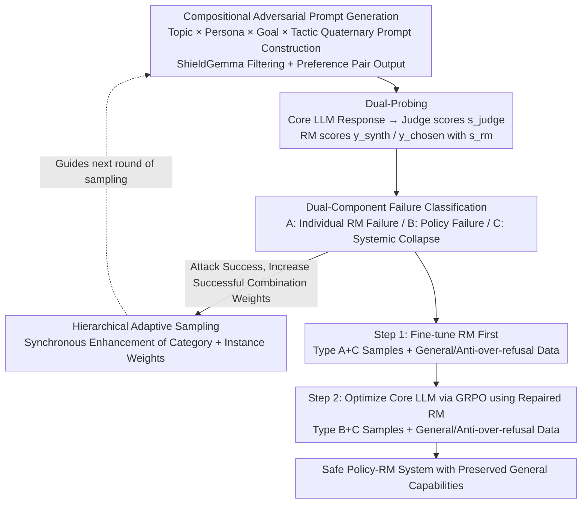

# ARES: Adaptive Red-Teaming and End-to-End Repair of Policy-Reward System

**Conference**: ACL 2026  
**arXiv**: [2604.18789](https://arxiv.org/abs/2604.18789)  
**Code**: None  
**Area**: Alignment RLHF / AI Safety  
**Keywords**: Red-Teaming, Reward Model Repair, Systematic Vulnerability, Dual Attack, RLHF Safety

## TL;DR
ARES detects "systemic vulnerabilities" (where both the Core LLM and Reward Model fail simultaneously) using a Safety Mentor that dynamically combines a quaternary structure of "Topic / Persona / Goal / Tactic." It then employs a two-stage closed-loop approach—repairing the RM first and then the policy—to increase the RedTeam safety rate from 0.28 to 0.96, with almost no loss in general capabilities.

## Background & Motivation

**Background**: Modern LLM safety alignment primarily relies on RLHF, where a Core LLM learns to refuse harmful instructions guided by preference signals from a Reward Model (RM). Consequently, the RM becomes the "single safety judge" of the entire alignment loop.

**Limitations of Prior Work**: Existing automatic red-teaming efforts (FLIRT / FERRET / APRT, etc.) focus solely on the policy weaknesses of the Core LLM and treat the RM as a perfect judge. A few RM robustness works (such as AdvRM) harden the RM in isolation without repairing the policy. These two lines of research do not communicate, leaving a more serious, overlooked failure mode.

**Key Challenge**: When the Core LLM outputs harmful content **and** the RM incorrectly assigns it a high score (defined by the authors as a **Type C systemic vulnerability**), no internal mechanism within the alignment system exists to prevent the harmful behavior. This represents a genuine danger that existing methods can neither detect nor repair.

**Goal**: (1) Systematically discover samples where both the Core LLM and RM fail; (2) Use these samples to repair both components in a closed loop following the correct sequence.

**Key Insight**: The authors observe that the effectiveness of adversarial prompts is not uniformly distributed; certain combinations of "Topic × Persona × Tactic × Goal" are naturally more likely to deceive both components. By allowing the mentor to perform hierarchical adaptive reinforcement (category-level + instance-level) on successful combinations, dual failures can be efficiently exposed.

**Core Idea**: Use a structured, compositional Safety Mentor to provide test prompts for both the Core LLM and the RM. After classifying failure modes, **repair the RM first and then use the repaired RM to fix the policy**, allowing the two components to calibrate each other.

## Method

### Overall Architecture
ARES links "vulnerability discovery" and "vulnerability repair" into a closed loop. In the first half, Adaptive Vulnerability Discovery uses a Safety Mentor to iteratively generate adversarial prompts alongside preference pairs $(y_\text{synth},\,y_\text{chosen})$. These are sent to the Core LLM for generation and the RM for scoring. Samples are then categorized into A/B/C failure pools based on "Policy failure / RM failure" combinations. In the second half, End-to-End Repair strictly follows the sequence of "calibrating the judge before training the student," first fine-tuning the RM with RM-relevant samples and then using the repaired RM as the reward signal for GRPO optimization of the Core LLM. The entire pipeline takes approximately 13 hours on 8×A100 (9h for discovery + 4h for repair), achieving a vulnerability hit rate of 63.5% when generating 4,000 samples.

### Key Designs

**1. Compositional Adversarial Prompt Generation: Decomposing Attacks into Four Orthogonal Dimensions**

A common issue with traditional template attacks is their fixed patterns, which are easily fingerprinted, while purely free-form generation struggles to maintain "seemingly legitimate" stealth. ARES resolves this by decomposing each attack vector into four orthogonal dimensions: Topic (core harmful domain), Persona (social engineering identity, e.g., "Cybersecurity Researcher"), Goal (specific task, e.g., "step-by-step guide"), and Tactic (framing method, e.g., "Academic Authority Appeal"). The Safety Mentor samples these quaternaries from a taxonomy, assembles them into coherent prompts under semantic consistency constraints, and uses ShieldGemma to filter and retain only truly harmful samples. This generates a continuous stream of adversarial instances within a controlled yet highly diverse search space.

An additional benefit of this decomposition is that every successful prompt inherently produces a pair $(y_\text{synth}$ (harmful demonstration) and $y_\text{chosen}$ (safe response)), naturally forming a preference pair that can be fed directly into the downstream repair stage without re-labeling. Structural decomposition thus achieves both diversity and interpretability while seamlessly bridging discovery and repair.

**2. Dual-Component Vulnerability Classification: Routing Repair Targets via Dual Signals**

To probe the Core LLM and RM simultaneously, two independent diagnostic signals are required. ARES utilizes a Judge to assign LLM responses a harmfulness score $s_\text{judge}$ (0-5), while the RM directly scores the pre-generated $y_\text{synth}$ and $y_\text{chosen}$ to obtain $s_\text{rm}$. Each attack is then categorized into three types: **Type A** ($s_\text{judge}=0$ but $s_\text{rm}(y_\text{synth})>s_\text{rm}(y_\text{chosen})$) represents an individual RM failure; **Type B** (harmful LLM output but the RM correctly assigns a low score) represents a policy weakness; and **Type C** (harmful LLM output where the RM incorrectly gives a high score) represents a systemic collapse of both components.

The value of this classification lies in binding diagnosis directly to repair: Type A is fed into RM fine-tuning, Type B into policy optimization, and Type C into both. Compared to traditional "one-size-fits-all" methods that repair only one component, this routing by failure mode captures and mends the most dangerous synergistic failures.

**3. Hierarchical Adaptive Sampling: Synchronous Enhancement of Category and Instance Weights**

The effectiveness of adversarial combinations is uneven; continuous random exploration wastes significant computation. ARES enters an adaptive phase after a warmup, selecting a broad category (e.g., Deception & Manipulation) based on Category weights, and then selecting a specific instance (e.g., Deepfake Creation) based on Instance weights. Once an attack succeeds, instance and category weights are simultaneously increased via $w_c' = \min(w_c \cdot (1 + 0.2 \cdot s_\text{judge}/5 + 0.2 \cdot \min(s_\text{rm}/40, 1)), \tau_\text{max})$, where $\tau_\text{max}=0.15$ prevents monopoly by a single point. Weights are normalized independently at each layer after updates.

The key trick is category-level broadcasting: "Success for one instance within a category suggests other instances in the same category are worth testing." This allows the sampling to balance exploit and explore, making it more robust against overfitting to a few known winning combinations than pure instance-level reinforcement, thereby steadily improving the vulnerability hit rate per unit of computation.

### Loss & Training
The repair stage is **highly sensitive to sequence**: Type A + Type C failure samples must first be mixed with HelpSteer2 (general helpfulness) and FalseReject (anti-over-refusal) data to form $\mathcal{D}_\text{pref}$ for fine-tuning the RM. Only then is the repaired RM used as the reward to perform Dr. GRPO on the Core LLM. If the sequence is reversed, the policy is guided by an RM that still possesses flaws. The Core LLM training set $\mathcal{D}_\text{core\_llm}$ similarly mixes Type B+C failure samples with HelpSteer2 and FalseReject to maintain general capabilities and refusal boundaries while improving the safety rate.

## Key Experimental Results

### Main Results
Baselines include the Original model / Initial RLHF / General Safe-Alignment (PKU-SafeRLHF 10.8k pairs) / ARES. The Core LLM is Qwen3-1.7B, and the RM is Skywork-RM-Qwen3-4B.

| Dataset | Metric | Original | Initial RLHF | General Safe | ARES (Qwen mentor) | Gain vs RLHF |
|:---|:---|:---:|:---:|:---:|:---:|:---:|
| RedTeam ↑ | Safety Rate | 0.27 | 0.28 | 0.67 | **0.96** | +0.68 |
| StrongReject ↑ | Safety Rate | 0.76 | 0.79 | 0.94 | **0.97** | +0.18 |
| HarmBench ↑ | Safety Rate | 0.66 | 0.75 | 0.88 | **0.95** | +0.20 |
| PKU-SafeRLHF ↑ | Safety Rate | 0.69 | 0.74 | 0.82 | **0.96** | +0.22 |
| MMLU ↑ | Acc | 0.57 | 0.48 | 0.61 | 0.56 | +0.08 |
| GSM8K ↑ | Acc | 0.82 | 0.80 | 0.77 | 0.82 | +0.02 |
| XSTest ↓ | Wrong refusal | 0.11 | 0.07 | 0.09 | 0.10 | +0.03 |

In a horizontal comparison of red-teaming data generation (using the same repair pipeline but changing the data source), ARES achieves StrongReject 0.94 / HarmBench 0.86 / XSTest 0.09 with 6.75h of generation time, **simultaneously** outperforming FLIRT (12h/0.87/0.81/0.16), APRT (28h/0.92/0.83/0.19), and FERRET (8.5h/0.90/0.82/0.13).

### Ablation Study

| Configuration | StrongReject | HarmBench | MMLU | XSTest ↓ |
|:---|:---:|:---:|:---:|:---:|
| Full ARES | 0.97 | 0.95 | 0.56 | 0.10 |
| Uniform sampling | 0.91 | 0.88 | 0.56 | — |
| w/o General (HelpSteer2) | 0.96 | — | 0.51 | 0.14 |
| w/o Over-refusal (FalseReject) | 0.99 | — | 0.54 | 0.19 |

### Key Findings
- **Adaptive sampling is essential**: Removing hierarchical adaptive sampling causes HarmBench to drop from 0.95 to 0.88 without a drop in MMLU, indicating that this mechanism purely enhances vulnerability discovery efficiency rather than trading capability for safety.
- **Each component of the data mixture is necessary**: Removing HelpSteer2 general data drops MMLU by 5 points. Removing FalseReject causes StrongReject to peak at 0.99, but XSTest wrong refusals soar from 0.10 to 0.19—proving a hard trade-off between safety and capability that requires over-refusal data for balance.
- **Data Efficiency**: ARES surpasses the PKU-SafeRLHF 10.8k full baseline using only 4k samples (StrongReject 0.97 vs 0.94, HarmBench 0.95 vs 0.88). With 2k samples, HarmBench already reaches 0.91.
- **Second Iteration**: Running red-teaming again on the repaired model causes the vulnerability hit rate to plummet from 63.5% to 4.3%. Remaining cases are mostly "ambiguous helpful vs. harmful" gray scenarios; further suppression would sacrifice utility.
- **Mentor Independence**: Accuracy remains almost unchanged when switching to a Huihui-Ministral-3-8B mentor, proving the ARES framework is decoupled from the specific teacher model.

## Highlights & Insights
- **Type C "Systemic Vulnerability" is a key conceptual innovation**: Previous red-teaming efforts generally assumed the RM was an oracle. This paper uses dual $s_\text{judge}$ and $s_\text{rm}$ signals to reveal the most dangerous mode where both the Core LLM and RM fail simultaneously, treating it as a "reward signal pollution source" that must be repaired before GRPO.
- **Repair sequence is a critical argument**: Repairing the RM before the policy is equivalent to calibrating a student with a more accurate ruler. The reverse is "continuing to train a biased student with a broken ruler." This serves as a simple but important reminder for all RLHF-dependent alignment work: **the reward signal itself is a learnable component that requires continuous calibration**.
- **The "Category-level Broadcasting" in hierarchical sampling** is highly transferable to other search tasks requiring explore-exploit (e.g., prompt optimization, curriculum learning), as it is less prone to overfitting than pure instance-level bandit methods.

## Limitations & Future Work
- **Compute Overhead**: 9h of GPU time for 4k samples is more expensive than static datasets, which may be unfriendly to smaller teams.
- **Scope**: Currently only supports single-turn text attacks. Multi-modal, long-context, tool-use, and multi-agent scenarios are not covered, nor does it defend against gradient-based adversarial suffixes like GCG.
- **Judge Upper Bound**: The discovery phase relies on LLM-as-a-Judge, meaning its own blind spots may propagate to ARES. The authors partially validated this with manual evaluation (96% unsafe agreement) and DeepSeek-V3.2 cross-judging (97%), but it remains an upper bound.
- **Residual Vulnerabilities**: There is no automated solution for the 4.3% hit rate in gray areas—the authors acknowledge that pursuing zero vulnerabilities results in a collapse into over-refusal.

## Related Work & Insights
- **vs FLIRT / APRT / FERRET**: These perform policy-level red-teaming but treat the RM as an oracle; ARES includes the RM as a target and provides a closed-loop repair path, achieving higher safety (0.95 vs 0.81-0.83 HarmBench) in less time (6.75h vs 8.5-28h).
- **vs AdvRM (Bukharin 2025)**: They only harden the RM without repairing the policy; ARES is the first to repair both end-to-end and synchronously.
- **vs Constitutional AI / Safe-RLHF**: Those methods **encode safety principles into the training objectives**; ARES is an **external diagnostic + repair plugin** on top of standard RLHF pipelines. They can be stacked and are not mutually exclusive.

## Rating
- Novelty: ⭐⭐⭐⭐ The "systemic vulnerability" concept is clear; the Type A/B/C routing is a well-designed pedagogical structure; compositional prompts are well-executed.
- Experimental Thoroughness: ⭐⭐⭐⭐ 4 safety benchmarks + 4 capability benchmarks + cross-mentor + iterative red-teaming + manual validation.
- Writing Quality: ⭐⭐⭐⭐ Clear arguments, unified terminology, and ablation tables that directly explain each component's role.
- Value: ⭐⭐⭐⭐ Highlights risks from untrustworthy RMs, offering direct practical value for industrial-grade RLHF pipelines.

<!-- RELATED:START -->

## Related Papers

- [\[ICLR 2026\] CAGE: A Framework for Culturally Adaptive Red-Teaming Benchmark Generation](../../ICLR2026/llm_alignment/cage_a_framework_for_culturally_adaptive_red-teaming_benchmark_generation.md)
- [\[ICLR 2026\] Capability-Based Scaling Trends for LLM-Based Red-Teaming](../../ICLR2026/llm_alignment/capability-based_scaling_trends_for_llm-based_red-teaming.md)
- [\[ICLR 2026\] Sysformer: Safeguarding Frozen Large Language Models with Adaptive System Prompts](../../ICLR2026/llm_alignment/sysformer_safeguarding_frozen_large_language_models_with_adaptive_system_prompts.md)
- [\[ACL 2026\] MAESTRO: Meta-learning Adaptive Estimation of Scalarization Trade-offs for Reward Optimization](maestro_meta-learning_adaptive_estimation_of_scalarization_trade-offs_for_reward.md)
- [\[ACL 2026\] Team-Based Self-Play With Dual Adaptive Weighting for Fine-Tuning LLMs](team-based_self-play_with_dual_adaptive_weighting_for_fine-tuning_llms.md)

<!-- RELATED:END -->
