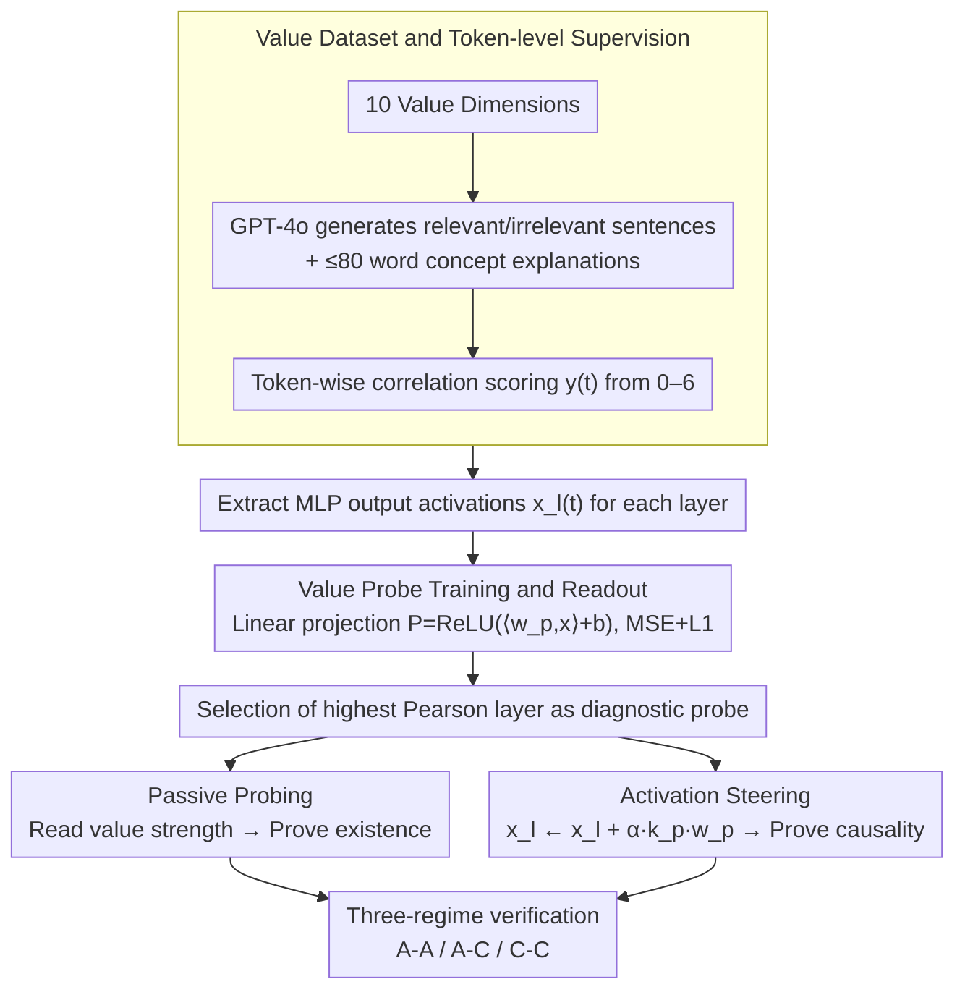

# BACH-V: Bridging Abstract and Concrete Human-Values in Large Language Models

**Conference**: ACL 2026  
**arXiv**: [2601.14007](https://arxiv.org/abs/2601.14007)  
**Code**: None  
**Area**: LLM Alignment / Values / Interpretability  
**Keywords**: Value representation, conceptual probing, activation steering, alignment mechanism, abstract-concrete grounding

## TL;DR
This paper proposes an abstraction-grounding framework that decomposes conceptual understanding in LLMs into three layers: "Abstract-Abstract / Abstract-Concrete / Concrete-Concrete." Using conceptual probing and activation steering across 6 open-source LLMs and 10 value dimensions, it demonstrates that LLMs possess structured internal value representations that migrate across abstraction levels and causally drive concrete decisions.

## Background & Motivation

**Background**: Current LLM value alignment primarily stays at the behavioral level—RLHF and Constitutional AI use preference data to shape outputs to meet human expectations.

**Limitations of Prior Work**: Behavioral alignment cannot guarantee that a model "truly understands" abstract principles. When facing out-of-distribution scenarios or novel ethical dilemmas, aligned behaviors often suffer from brittle failure; the model merely mimics the correct answer on the surface rather than internalizing the principle.

**Key Challenge**: It is incorrect to evaluate "abstract conceptual understanding" as an indivisible whole. A model might be consistent in relationships between concepts but unable to ground them in concrete events; conversely, it might recognize concrete instances but fail to use the concepts to constrain decisions. These three capabilities are essentially different, and mixing them prevents identifying the cause of failure.

**Goal**: (1) Provide an operationalized hierarchical framework for "abstract conceptual understanding"; (2) Verify the existence of genuine value representations within LLMs; (3) Verify whether these representations can causally control concrete behavior.

**Key Insight**: The authors leverage the superposition hypothesis—intermediate layer activations in LLMs are approximate orthogonal superpositions of feature vectors, with each direction encoding a semantic meaning. If values are truly encoded, they should be readable via linear probes; if the readable directions can also be "written," it proves the representation is causal and intervenable.

**Core Idea**: Use the same direction for both probabilistic readout (probing) and activation injection (steering). Systematically test across A-A / A-C / C-C regimes to prove existence, transferability, and causality.

## Method

### Overall Architecture
BACH-V uses a matrix of "three regimes × two tools" to decompose and verify LLM value representations. The three regimes divide "whether a model understands a value" into three progressive levels: Abstract-Abstract (A-A: distinguishing semantics of different abstract concepts), Abstract-Concrete (A-C: recognition of abstract concepts in concrete events), and Concrete-Concrete (C-C: regulation of concrete decisions by abstract principles). Two tools verify these from different directions: Passive Probing reads the intensity of a value in activations to prove "existence," while Active Steering injects the probe direction back into activations to prove "causality." Given a prompt with text (abstract description, concrete event, or decision scenario), the system extracts MLP output activations from each layer to output value correlation scores or modified behavior distributions. A probe is trained for each value at each layer, and the layer with the highest Pearson correlation is selected as the "diagnostic probe" for subsequent experiments.

### Key Designs

**1. Value Dataset and Token-level Supervision: Aligning directions with token-level intensity**

To ensure the direction learned by the linear probe corresponds to "value semantics" rather than sentence-level irrelevant features, the granularity of the supervision signal is crucial. BACH-V constructs a corpus for 10 value dimensions (Patriotism, Equality, Integrity, Cooperation, Individualism, Discipline, Curiosity, Bravery, Contentment, Rest) using GPT-4o in two steps: Step 1 generates 400 relevant and 400 irrelevant sentences for each value; Step 2 generates an explanation of ≤80 words for each sentence as the "abstract concept semantics." Subsequently, a 7-point scale (0-6) is used to assign a token-level correlation score $y(t)$ to each token, with 90% used for training the probe and 10% for testing.

Using token-level scores instead of sentence-level labels allows the probe direction to align with the "intensity of value semantics" token by token, avoiding bias from other features in the sentence. Using paired relevant/irrelevant contrastive samples generated by the same model further suppresses spurious correlations.

**2. Value Probe Training and Readout: Sparse linear projection + Opting for the best layer**

For a given layer $l$, BACH-V learns a linear projection $P(\vec{x}) = \text{ReLU}(\langle \vec{w}_p, \vec{x} \rangle + b)$ to map MLP output activations to the value intensity score. The training objective is MSE with L1 regularization: $$\Omega(\vec{w}_p, b) = \mathbb{E}\|y(t) - P(\vec{x}_l(t))\|_2^2 + \lambda \|\vec{w}_p\|_1$$. During readout, the value activation score for a text is the average of scores across all its tokens.

The combination of linear and sparse regularization preserves the interpretability of the direction while avoiding overfitting to token noise. Probes are trained layer-wise, and the layer with the highest Pearson correlation on the validation set is chosen because probing performance follows a curve that "rises in shallow layers, peaks in middle layers, and drops in deep layers." The optimal layer varies by model, making fixed-layer approaches unreliable.

**3. Activation Steering: Writing values back using the same direction**

To prove that value representations are causal rather than just bystander signals, it is key that the "read direction can also be written." BACH-V treats the probe direction $\vec{w}_p$ directly as an intervention vector, modifying activations according to $\vec{x}_l(t) \mapsto \vec{x}_l(t) + \alpha k_p \vec{w}_p$, where the normalization factor $k_p = k_0 / |\vec{w}_p|$ and $\alpha$ is the steering strength. This is based on the superposition and aggregation hypotheses—the readout and writing directions are geometrically equivalent. Thus, injecting this direction into certain token streams amplifies or inhibits the internal representation of the corresponding value, allowing observation of changes in the output distribution.

Unlike black-box behavioral RLHF modifications where the "affected concept" is unclear, this geometric injection is a white-box intervention. it directly maps "which value was activated" to changes in behavior, solidifying the causal chain between representation and behavior.

### Loss & Training
The entire process only trains linear probe parameters $\vec{w}_p, b$ (the LLM remains frozen), targeting MSE + L1 regularization. The intervention phase involves no training, only modifying activations during inference. Experiments were conducted across 6 open-source LLMs (Qwen3-4B/8B, Llama3-3B/8B, Mistral-7B, Gemma2-9B), forming a complete experimental matrix of 3 (regimes) × 2 (probing/steering) × 10 (values) × 6 (models).

## Key Experimental Results

### Main Results

**Probe Specificity** (Activation difference between diagonal vs. off-diagonal, using Qwen3-8B as an example):

| Regime | Task | Diagonal (Match) | Off-diagonal (Mismatch) | Phenomenon |
|--------|------|-------------------|--------------------------|------------|
| A-A | Abstract concept description | Significantly high | Significantly low | Perfect differentiation of 10 values |
| A-C | Concrete event narrative | Significantly high | Significantly low | Abstract probe successfully identifies implicit values |
| C-C | Decision-making chain | Significantly high | Significantly low | Abstract probe identifies motivation behind decisions |

External validation: GPT-5.2 / Gemini-3-Pro / Claude-Sonnet-4.5 were used to score value correlation for A-C corpora, showing high consistency with probe mean scores, indicating probes capture real value signals rather than noise.

### Ablation Study

| Setting | Phenomenon | Interpretation |
|------|------|------|
| A-A + steering (Sweeping $\alpha$ from negative to positive) | Mean correlation constant at ~50%, barely moves | Semantics in abstract descriptions are highly polarized; intervention cannot shift them |
| A-C + steering | Distribution shifts monotonically with $\alpha$ | Events in the "middle ground" are significantly pushed toward "relevant / irrelevant" |
| C-C + steering | Option probability distribution shifts systematically with $\alpha$ | Values truly exert causal influence on decision outcomes |
| Across 6 LLMs | Consistent patterns across the three regimes | Phenomenon is not sporadic or model-specific |

### Key Findings
- **Asymmetry is a core discovery**: A-A is resistant to steering, while A-C/C-C are intervenable. This suggests that once abstract concepts are encoded, they act as "stable anchors" that are not easily shaken by local linear perturbations, but they propagate downstream to concrete judgments and decisions.
- **Middle layers are most effective**: Probe performance across all LLMs shows a "rise in shallow, peak in middle, drop in deep" curve, suggesting value encoding primarily occurs in intermediate representation layers.
- **Polarized samples are insensitive to steering**: Steering primarily affects corpora in the "middle ground"; strongly polarized samples barely move, implying steering is a marginal correction rather than a global rewrite.

## Highlights & Insights
- **The three-regime framework is the most valuable conceptual contribution**: Decomposing "whether a model understands a concept" into operational layers—existence, grounding, and application—provides a template for future "Model Understanding of X" research.
- **Readout Direction = Writing Direction**: Using the same vector for probing and steering creates a seamless path from "semantic existence → behavioral causality," making the methodology more compact than previous works that separate SAE interpretation and steering.
- **The A-A null result is highly valuable**: It reveals that "abstract concepts are anchors rather than sliding activations." This is a significant warning for future value editing/unlearning research—one can change its influence on concrete decisions, but it is very difficult to change its "definition."

## Limitations & Future Work
- Single-layer linear probes have limited capacity for distributed signals; the authors acknowledge this ceiling. Multi-layer probes, SAE features, or cross-layer transcoders could be explored.
- Intervention fails when steering strength $\alpha$ is too high; only preliminary observations were made without a mechanistic explanation.
- The value set is limited to 10 and relies on GPT-4o synthetic data; cross-cultural and real-world generalization remains unverified. C-C scenarios are binary choice-based and idealized, far from real-world agents.
- There is no discussion of side effects on other capabilities (e.g., whether changing Curiosity harms reasoning); this needs to be addressed for actual deployment.

## Related Work & Insights
- **vs. SAE-based interpretability** (Anthropic Templeton et al.): They use SAEs to find monosemantic features for interpretation and steering. Ours takes a more lightweight route with linear probes and introduces "three regimes" as a new evaluation dimension, making them complementary.
- **vs. ValueBench / ValueCompass**: Those works treat LLMs as subjects filling out questionnaires for behavioral assessment. Ours, conversely, reads internal activations to trace the propagation path of value signals, moving from black-box to white-box analysis.
- **vs. CAA / Steering vectors** (Panickssery et al.): Traditional steering vectors derive from activation differences between contrastive samples. Ours directly uses the direction learned from probing for intervention, which is theoretically more coherent (reading/writing the same direction).

## Rating
- Novelty: ⭐⭐⭐⭐ The three-regime framework and unified read/write perspective are clear original contributions.
- Experimental Thoroughness: ⭐⭐⭐⭐ Full matrix of 6 models × 10 values × 3 regimes × 2 tools, including external LLM evaluation.
- Writing Quality: ⭐⭐⭐⭐ Clear presentation of the conceptual framework; insightful interpretation of the A-A resistance.
- Value: ⭐⭐⭐⭐ Provides a mechanistic basis for interpretable alignment and value editing; the A-A null result provides a warning for unlearning research.

<!-- RELATED:START -->

## Related Papers

- [\[ACL 2026\] Mitigating Selection Bias in Large Language Models via Permutation-Aware GRPO](mitigating_selection_bias_in_large_language_models_via_permutation-aware_grpo.md)
- [\[ACL 2026\] Large Language Models Are Overconfident in Their Own Responses](large_language_models_are_overconfident_in_their_own_responses.md)
- [\[ACL 2026\] Why Supervised Fine-Tuning Fails to Learn: A Systematic Study of Incomplete Learning in Large Language Models](why_supervised_fine-tuning_fails_to_learn_a_systematic_study_of_incomplete_learn.md)
- [\[NeurIPS 2025\] Can DPO Learn Diverse Human Values? A Theoretical Scaling Law](../../NeurIPS2025/llm_alignment/can_dpo_learn_diverse_human_values_a_theoretical_scaling_law.md)
- [\[ACL 2026\] Towards Bridging the Reward-Generation Gap in Direct Alignment Algorithms](towards_bridging_the_reward-generation_gap_in_direct_alignment_algorithms.md)

<!-- RELATED:END -->
