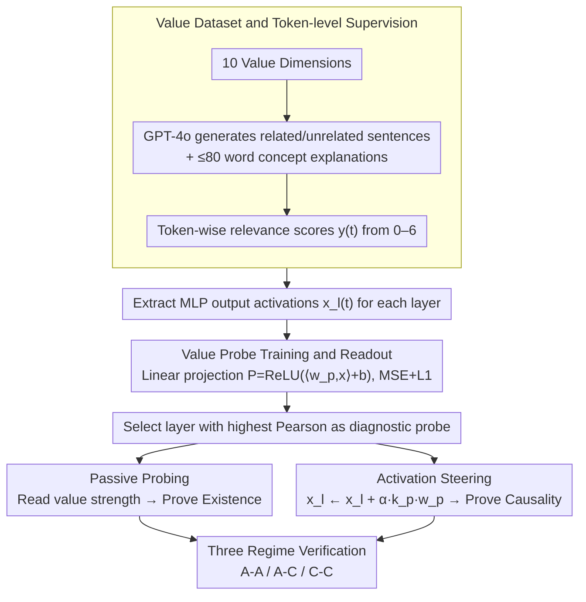

# BACH-V: Bridging Abstract and Concrete Human-Values in Large Language Models

**Conference**: ACL 2026  
**arXiv**: [2601.14007](https://arxiv.org/abs/2601.14007)  
**Code**: None  
**Area**: LLM Alignment / Values / Interpretability  
**Keywords**: Value representation, concept probing, activation steering, alignment mechanism, abstraction-grounding

## TL;DR
This paper proposes an abstraction-grounding framework that decomposes the conceptual understanding of LLMs into three layers: "abstract-abstract, abstract-concrete, and concrete-concrete." Using concept probing and activation steering across 6 open-source LLMs and 10 value dimensions, the authors demonstrate that structured value representations exist within LLMs, migrate across abstraction layers, and causally drive concrete decisions.

## Background & Motivation

**Background**: Current LLM value alignment primarily stays at the behavioral level—RLHF and Constitutional AI use preference data to shape outputs so they meet human expectations.

**Limitations of Prior Work**: Behavioral alignment cannot guarantee that the model "truly understands" abstract principles. When encountering out-of-distribution scenarios or novel ethical dilemmas, alignment behavior often fails due to fragility; the model merely mimics correct answers on the surface rather than internalizing principles.

**Key Challenge**: It is erroneous to evaluate "abstract concept understanding" as an indivisible whole. A model might be coherent regarding relationships between concepts while failing to ground those concepts in specific events; conversely, it might identify specific instances without being able to use concepts to constrain decisions. These three capabilities are essentially different, and testing them together obscures the cause of failure.

**Goal**: (1) Provide an operationalized hierarchical framework for "abstract concept understanding"; (2) verify whether true value representations exist within LLMs; (3) verify whether these representations can causally control concrete behavior.

**Key Insight**: The authors leverage the superposition hypothesis—intermediate layer activations in LLMs are approximate orthogonal superpositions of feature vectors, where each direction encodes a specific semantic meaning. If values are truly encoded, they should be extractable via linear probes. If the extracted directions can also be "written back," it proves these are causal, intervenable representations.

**Core Idea**: Use the same direction simultaneously for probabilistic readout (probing) and activation injection (steering) across three regimes—A-A, A-C, and C-C—to systematically prove existence, transferability, and causality.

## Method

### Overall Architecture
BACH-V utilizes a matrix of "three regimes × two tools" to decompose and verify LLM value representations. The three regimes divide "whether a model understands a value" into three progressive levels: Abstract-Abstract (A-A, distinguishing semantics between different abstract concepts), Abstract-Concrete (A-C, whether abstract concepts can be identified in concrete events), and Concrete-Concrete (C-C, whether abstract principles can regulate concrete decisions). Two tools verify these from different directions: Passive Probing reads value intensity from activations to prove "existence," while Active Steering injects the probe direction back into activations to prove "causality." Given a prompt with text (abstract description, concrete event, or decision scenario), the system extracts MLP output activations from each layer to output relevance scores or a regulated behavioral distribution. A probe is trained for each value at each layer, and the layer with the highest Pearson correlation is selected as the "diagnostic probe."

### Key Designs

**1. Value Dataset and Token-level Supervision: Aligning directions with token-wise intensity**

For the direction learned by the linear probe to truly correspond to "value semantics" rather than irrelevant sentence-level features, the granularity of supervision is critical. BACH-V constructs a corpus for 10 value dimensions (Patriotism, Equality, Integrity, Cooperation, Individualism, Discipline, Curiosity, Bravery, Contentment, Rest) using GPT-4o in two steps: step 1 generates 400 related and 400 unrelated sentences per value; step 2 generates explanations of ≤80 words for each sentence to serve as "abstract conceptual semantics." Subsequently, a 7-point scale (0-6) is used to assign token-level relevance scores $y(t)$, with 90% used for training and 10% for testing.

Using token-level scores instead of sentence-level labels allows the probe direction to align with the "intensity of value semantics" token-by-token, avoiding bias from other features in the sentence. Generating paired related/unrelated control samples from the same model further suppresses spurious correlations.

**2. Value Probe Training and Readout: Sparse linear projection + layer-wise selection**

At a certain layer $l$, BACH-V learns a linear projection $P(\vec{x}) = \text{ReLU}(\langle \vec{w}_p, \vec{x} \rangle + b)$, mapping MLP output activations to a value intensity score. The training objective is MSE with L1 regularization: $\Omega(\vec{w}_p, b) = \mathbb{E}\|y(t) - P(\vec{x}_l(t))\|_2^2 + \lambda \|\vec{w}_p\|_1$. During readout, the value activation score for a text is the average of scores across all tokens.

The combination of linearity and sparse regularization preserves direction interpretability while avoiding overfitting to token noise. Probes are trained layer-by-layer, and the layer with the highest Pearson correlation on the validation set is selected because probing performance typically follows a "rise in shallow layers, peak in middle layers, drop in deep layers" curve, and the optimal layer varies by model.

**3. Activation Steering: Writing values back using the same direction**

To prove that value representations are causal rather than mere correlates, the "readout direction must also be writable." BACH-V uses the probe direction $\vec{w}_p$ directly as an intervention vector, modifying activations according to $\vec{x}_l(t) \mapsto \vec{x}_l(t) + \alpha k_p \vec{w}_p$, where the normalization factor is $k_p = k_0 / |\vec{w}_p|$ and $\alpha$ is the steering strength. This is based on the superposition and aggregation hypotheses—the readout direction and writing direction are geometrically equivalent. Injecting this direction into specific token streams can amplify or suppress the internal representation of the corresponding value, allowing observation of changes in the output distribution.

Unlike black-box behavioral modifications like RLHF, this geometric injection is a white-box intervention that directly maps "which value was activated" to behavioral changes, solidifying the causal chain between representation and behavior.

### Loss & Training
The entire process only trains linear probe parameters $\vec{w}_p, b$ (the LLM remains frozen) with an MSE + L1 objective. The intervention phase involves no training, only modification of activations during inference. Experiments were conducted across 6 open-source LLMs (Qwen3-4B/8B, Llama3-3B/8B, Mistral-7B, Gemma2-9B) to form a complete 3 (regime) × 2 (probing/steering) × 10 (value) × 6 (model) matrix.

## Key Experimental Results

### Main Results

**Probe Specificity** (difference between diagonal vs. off-diagonal activations, using Qwen3-8B as an example):

| Regime | Task | Diagonal (Match) | Off-diagonal (Mismatch) | Phenomenon |
|--------|------|------------------|-------------------------|------------|
| A-A | Abstract Concept Description | Significantly High | Significantly Low | Perfect differentiation of 10 values |
| A-C | Concrete Event Narration | Significantly High | Significantly Low | Abstract probes successfully identify latent values |
| C-C | Decision Reasoning Chain | Significantly High | Significantly Low | Abstract probes identify decision motives |

External Validation: Using GPT-5.2 / Gemini-3-Pro / Claude-Sonnet-4.5 to score value relevance for A-C corpora showed high consistency with probe mean scores, indicating that the probes capture real value signals rather than noise.

### Ablation Study

| Setting | Phenomenon | Interpretation |
|------|------|------|
| A-A + steering (scanning $\alpha$ from negative to positive) | Mean relevance stays ~50%, barely moves | Semantics in abstract descriptions are highly polarized; intervention cannot shift them |
| A-C + steering | Distribution shifts monotonically with $\alpha$ | Events in the "middle ground" are significantly pushed toward "related / unrelated" |
| C-C + steering | Option probability distribution shifts systematically with $\alpha$ | Values truly and causally influence decisions |
| Across 6 LLMs | Consistent patterns across three regimes | The phenomenon is not model-specific |

### Key Findings
- **Asymmetry is the core finding**: A-A is resistant to steering, while A-C/C-C are intervenable. This suggests that once abstract concepts are encoded, they act as "stable anchors" that are not easily shaken by local linear perturbations, but they propagate downstream to concrete judgments and decisions.
- **Middle layers are most effective**: Probe performance for all LLMs follows a curve that peaks in the middle layers, suggesting that value encoding primarily occurs in intermediate representation layers.
- **Polarized samples are insensitive to steering**: Steering primarily affects corpora in the "middle ground." Already strongly polarized samples barely move, implying that steering is a marginal rewrite rather than a global one.

## Highlights & Insights
- **The three-regime framework is the most valuable conceptual contribution**: Decomposing "whether a model understands a concept" into operational layers of existence, grounding, and application provides a template for future research on "Model Understanding X."
- **Unity of Readout and Writing Directions**: Using the same vector for both probing and steering creates a seamless path from "semantic existence" to "behavioral causality," offering a more compact methodology than previous works that separate SAE explanation from steering.
- **The A-A null result is highly valuable**: It reveals that "abstract concepts are anchors rather than slidable activations." This is an important warning for future work on value editing or unlearning—you can change how a concept affects concrete decisions, but it is much harder to change its "definition."

## Limitations & Future Work
- Single-layer linear probes have limited capacity to characterize distributed signals; the authors acknowledge this ceiling. Multi-layer probes, SAE features, or cross-layer transcoders could be explored.
- Intervention effectiveness fails when the steering strength $\alpha$ is too large; the authors provide only preliminary observations without a mechanistic explanation.
- The value set is limited to 10 and relies on GPT-4o synthetic data; cross-cultural and real-world generalization remains unverified. C-C decision scenarios are also idealized binary choices, far from real-world agents.
- There is no discussion of side effects on other capabilities (e.g., whether steering curiosity harms reasoning); supplementary analysis is needed for actual deployment.

## Related Work & Insights
- **vs. SAE-based interpretability** (e.g., Anthropic Templeton): While they use SAEs to find monosemantic features for explanation and intervention, this paper takes a lighter-weight approach with linear probes and introduces "three regimes" as a new evaluation dimension, making the works complementary.
- **vs. ValueBench / ValueCompass**: Those works treat LLMs as subjects for behavioral assessment via questionnaires. This paper conversely reads internal activations and tracks the propagation paths of value signals, moving from black-box to white-box analysis.
- **vs. CAA / Steering vectors** (e.g., Panickssery et al.): Traditional steering vectors are derived from activation differences in contrastive samples. This paper uses directions trained via probing for intervention, which is theoretically more coherent (simultaneous read/write in the same direction).

## Rating
- Novelty: ⭐⭐⭐⭐ The three-regime framework and the unified "read = write" perspective are clear original contributions.
- Experimental Thoroughness: ⭐⭐⭐⭐ Complete matrix of 6 models × 10 values × 3 regimes × 2 tools, supplemented by external LLM evaluations.
- Writing Quality: ⭐⭐⭐⭐ Conceptual framework is clearly articulated, and the interpretation of the A-A resistance is insightful.
- Value: ⭐⭐⭐⭐ Provides a mechanistic foundation for interpretable alignment and value editing; the A-A null result provides a warning for unlearning research.

<!-- RELATED:START -->

## Related Papers

- [\[CVPR 2026\] Bridging Human Evaluation to Infrared and Visible Image Fusion](../../CVPR2026/llm_alignment/bridging_human_evaluation_to_infrared_and_visible_image_fusion.md)
- [\[ACL 2026\] Compatibility-Aware Dynamic Fine-Tuning for Large Language Models](compatibility-aware_dynamic_fine-tuning_for_large_language_models.md)
- [\[ACL 2026\] Mitigating Selection Bias in Large Language Models via Permutation-Aware GRPO](mitigating_selection_bias_in_large_language_models_via_permutation-aware_grpo.md)
- [\[ICML 2026\] Large Language Models Should Learn Personalized Rather Than Aggregated Human Preferences](../../ICML2026/llm_alignment/large_language_models_should_learn_personalized_rather_than_aggregated_human_pre.md)
- [\[ACL 2026\] Large Language Models Are Overconfident in Their Own Responses](large_language_models_are_overconfident_in_their_own_responses.md)

<!-- RELATED:END -->
