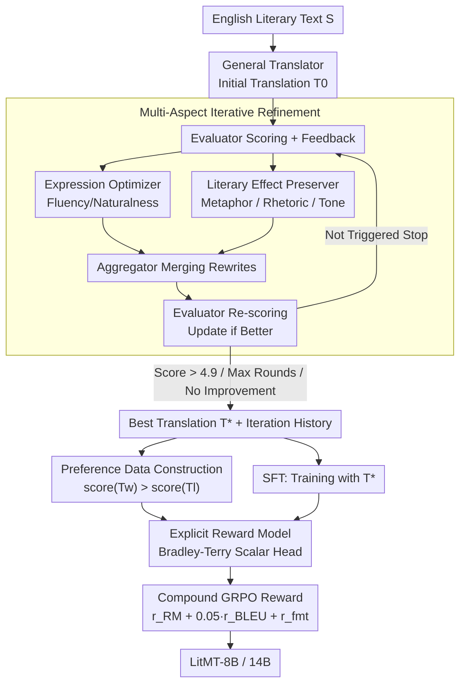

# Better Literary Translation: A Multi-Aspect Data Generation and LLM Training Approach

**Conference**: ACL2026  
**arXiv**: [2606.05924](https://arxiv.org/abs/2606.05924)  
**Code**: No public repository; the paper provides prompt details for data generation and evaluation.  
**Area**: LLM Alignment / Literary Machine Translation  
**Keywords**: Literary Translation, Multi-dimensional Data Generation, Preference Optimization, Reward Model, GRPO

## TL;DR
This paper decomposes literary translation quality into two dimensions: "expression fluency" and "literary effect." By using specialized LLMs to iteratively generate high-quality reference translations and preference pairs, the authors employ SFT + explicit Reward Model + GRPO to train LitMT. This allows 8B/14B small models to approach or even surpass some large models in English-to-Chinese literary translation.

## Background & Motivation
**Background**: Literary translation differs from general machine translation in that it must not only convey semantics accurately but also preserve metaphors, rhetoric, tone, and narrative style. Recent approaches mainly follow two categories: using large models or long CoT for detailed translations, or using LLM-as-a-judge for scoring in reinforcement learning, represented by specialized models such as DRT, DeepTrans, and ExTrans.

**Limitations of Prior Work**: These methods are effective but costly. Long CoT significantly increases inference latency, with the paper noting up to a $10\times$ overhead. Using strong LLMs as reward functions in RL requires calling expensive evaluator models for every sample in every training step, making it difficult to reuse data and reward signals.

**Key Challenge**: The quality of literary translation is not a single scalar. More natural and fluent translations may sacrifice the metaphors and defamiliarization of the original text; conversely, emphasizing literary effects can lead to stiff or unnatural language in the target tongue. Directly asking a model for "comprehensive optimization" often conflates these goals, making it difficult to obtain stable, trainable supervisory signals.

**Goal**: The authors aim to generate reusable high-quality reference translations and preference data offline, then use them to train smaller specialized translation models. Specifically, the goals include improving English-to-Chinese translation quality on MetaphorTrans, comparing the differences between DPO-style implicit preference optimization and explicit Reward Model + GRPO, and ensuring the final model does not rely on long CoT or online LLM evaluation for real-time translation suitability.

**Key Insight**: Literary translation can be decomposed into at least two articulable dimensions: expression fluency and preservation of literary effects. Instead of sampling multiple translations and letting a judge choose the best, different "translators" are tasked with rewriting along specific dimensions, followed by merging via an aggregator and final scoring by an evaluator to retain the complete iteration trajectory.

**Core Idea**: Use a "multi-aspect specialized translator + iterative evaluation aggregator" to generate better references and preference pairs than the original labels, then use an explicit reward model to convert these preference signals into stable rewards for GRPO training.

## Method
The methodology consists of two stages: offline data generation, which expands the source sentences from MetaphorTrans into high-quality reference translations and preference pairs; and model training, which explores SFT, DPO/SimPO/CPO, and Reward Model + GRPO. Crucially, expensive strong LLMs are used only for a one-time construction of training data; the final LitMT model does not require long-chain reasoning or external LLM judge calls during inference.

### Overall Architecture
The input is an English literary text $S$. The system first uses a general translator to generate an initial translation $T_0$, then enters an iterative loop: the Evaluator scores the current best translation and identifies issues; the Expression Optimizer focuses on correcting the naturalness of Chinese expressions; the Literary Effect Preserver focuses on metaphors, rhetoric, and tone; the Aggregator merges the two rewrites into a new translation; and the Evaluator scores it again. The loop stops if the score exceeds the threshold $\tau=4.9$, reaches the maximum rounds $K=8$, or shows no improvement for $N=3$ consecutive rounds.

Two types of products are generated. The first is the best translation $T^*$ for each source sentence, used for SFT. The second consists of all preference pairs from the iteration history where a "high-score translation is better than a low-score one," used for DPO-style training or Reward Model training. The training phase begins with SFT on high-quality references, followed by a comparison between implicit preference optimization and explicit reward modeling. The optimal approach starts from an SFT checkpoint, trains an 8B reward model, and continues optimizing the policy model via GRPO combined with a compound reward.

### Key Designs

**1. Multi-Aspect Iterative Refinement: Separating "Readability" and "Literary Quality" into dedicated modules.**
The quality of literary translation is inherently a dilemma: more natural and fluent translations tend to smooth over metaphors and defamiliarization, while sticking strictly to literary effects can result in stiff, unidiomatic Chinese. Randomly sampling translations and picking the best only selects from existing candidates, and general self-refinement is often driven by a single preference. This method splits optimization into three specialized modules: the Expression Optimizer ensures the Chinese is natural and concise, the Literary Effect Preserver guards metaphors and literary tension, and the Aggregator fuses them into a balanced version. The Evaluator provides specific feedback on what to change in the next round, allowing the model to explicitly explore both "readability" and "literary quality," while the iterative trajectory naturally yields a quality hierarchy.

**2. Constructing preference data from iteration history: Leveraging fine-grained comparison signals.**
If only the final best translation is kept, the model learns "what to output" but not "why this version is better than that one"—the essence of literary translation resides in these nuances. This approach utilizes every evaluated translation in the process: for the same source sentence, whenever $score(T_w) > score(T_l)$, a preference pair $(T_w, T_l)$ is constructed. Each sample thus provides an SFT target and several fine-grained comparisons. These pairs can feed into implicit preference optimization (DPO, CPO, SimPO) or train a separate reward model, offering much higher reusability than a one-off best translation.

**3. Explicit Reward Model + Compound GRPO Reward: Replacing expensive LLM-as-a-judge with local scalar rewards.**
The authors found that DPO-style methods actually degraded performance, indicating that offline preference pairs are unstable for direct policy updates. Meanwhile, calling a strong LLM as a reward at every step is too expensive. Consequently, the authors replace the language modeling head of an LLM with a linear scalar head, training a reward model with Bradley-Terry loss and adding a $\lambda(r_w+r_l)^2$ term to center the rewards and prevent drift. In the GRPO phase, $G=16$ translations are sampled per source sentence, scored by a compound reward $r(x,y)=r_{RM}+0.05\cdot r_{BLEU}+r_{fmt}$. The reward model handles overall quality, BLEU provides a stable lexical signal, and the format reward penalizes JSON output violations. Explicit RM with GRPO's online exploration leverages quality differences from the iteration history while keeping expensive LLM calls restricted to the offline stage.

### Loss & Training
SFT uses the best translation $y^*$ for cross-entropy training: $\mathcal{L}_{SFT}=-\mathbb{E}_{(x,y^*)}[\log \pi_\theta(y^*|x)]$. DPO methods optimize the strategy directly on preference pairs; the paper compares DPO, CPO, and SimPO. The explicit Reward Model uses the Bradley-Terry objective $\mathcal{L}_{RM}=-\mathbb{E}[\log\sigma(r_w-r_l)]+\lambda(r_w+r_l)^2$ with $\lambda=0.01$.

The experiments use 19,264 training samples and 2,000 test samples from MetaphorTrans. Preference data is partitioned by sample into 17,337 training and 1,927 development source sentences, yielding 179,588 training and 19,767 development preference pairs. LitMT-8B and LitMT-14B are trained from Qwen3-8B-Base and Qwen3-14B-Base respectively. SFT and DPO use a learning rate of $1e^{-5}$, warmup ratio of 0.05, and 3 epochs. GRPO starts from the SFT checkpoint with a learning rate of $1e^{-7}$, 3 epochs, temperature 1.0, top-p 0.9, and KL coefficient $\beta=0.01$.

## Key Experimental Results

### Main Results
The paper uses Claude Opus 4.5 as the primary evaluator, reporting CRF, CEA5, and CEA100, with CEA100 being the main metric. The table below excerpts key results on MetaphorTrans.

| Model | Parameters | CEA100 | Remarks |
|------|----------|--------|------|
| Qwen3-8B | 8B | 52.77 | General model |
| DRT-14B | 14B | 58.43 | Specialized literary model |
| DeepTrans-7B | 7B | 61.15 | Specialized model using RL |
| ExTrans-7B | 7B | 62.95 | Strong specialized baseline |
| Qwen3-235B-A22B | 235B / 22B act. | 65.62 | Data generation teacher |
| LitMT-8B | 8B | 67.25 | Ours |
| Claude Sonnet 4.5 | - | 68.43 | Closed-source strong model |
| GPT-5.2 | - | 68.68 | Closed-source strong model |
| LitMT-14B | 14B | 69.07 | Ours |
| Claude Opus 4.5 | - | 73.30 | Strongest model in list |

On the out-of-distribution O. Henry Collection, LitMT-8B achieves a CEA100 of 70.38, significantly outperforming Qwen3-32B's 65.81. LitMT-14B reaches 73.71, approaching Qwen3-235B-A22B's 74.01. This suggests the model generalizes to early American English narratives rather than just memorizing MetaphorTrans styles.

### Ablation Study
Ablations on training strategies show significant variance between preference optimization methods.

| Training Method | CRF | CEA5 | CEA100 | Conclusion |
|----------|-----|------|--------|------|
| SFT | 72.66 | 3.54 | 65.74 | High-quality references are very strong |
| SimPO | 69.98 | 3.41 | 62.62 | Lower than SFT |
| DPO | 70.50 | 3.44 | 63.39 | Lower than SFT |
| CPO | 70.69 | 3.45 | 63.67 | Lower than SFT |
| RM+GRPO | 73.03 | 3.61 | 67.25 | 1.51 points higher than SFT |

The multi-aspect data generation also makes a clear contribution.

| Data/Module Config | CEA100 | Key Insight |
|----------------|--------|----------|
| DRT Ground Truth | 57.09 | Original labels as SFT targets are weak |
| Qwen3-235B Distillation | 61.08 | Teacher output is better but insufficient |
| DeepSeek V3.1 Distillation | 62.78 | Improvement with stronger models |
| Ours (Multi-aspect Refinement) | 65.74 | 4.66 pts > Qwen3 distillation, 8.65 pts > original GT |

### Key Findings
- LitMT-8B's CEA100 of 67.25 is higher than its data generator Qwen3-235B (65.62), proving multi-round, multi-aspect refinement raises target quality beyond simple distillation.
- DPO, CPO, and SimPO all performed 2-3 CEA100 points worse than SFT, suggesting preference pairs are unstable for implicit policy optimization in literary translation.
- RM+GRPO outperformed SFT by 1.51 points, showing that explicit reward models with online sampling better utilize quality variance in the iteration history.
- Data generation stats show average scores improved from 4.43 to 4.73, with best translations averaging 4.88; 61.6% of samples reached the $\tau=4.9$ threshold. The reward model achieved 72.49% accuracy on dev preference pairs, reaching 96.20% when the score gap $\geq 3.0$.

## Highlights & Insights
- The strongest aspect of this paper is transforming "data generation" into an interpretable translation workflow rather than letting a model hallucinate references. Decomposing fluency and literary effect aligns perfectly with the inherent contradictions of literary translation.
- The "student surpassing teacher" result is enlightening: LitMT-8B outperforms the 235B teacher on CEA100, indicating high-quality iterative data can reorganize large model capabilities into more task-appropriate small model behaviors.
- The degradation of the DPO series is a valuable finding. It reminds us that preference data is not universally suitable for all tasks; when preference pairs stem from fine-grained linguistic quality comparisons, explicit RM and online exploration may be more robust than closed-form preference objectives.
- The BLEU weight of only 0.05 in the compound reward improved stability. For generation tasks, this "small dose of traditional metrics + learned reward" design is more controllable than relying entirely on neural rewards.

## Limitations & Future Work
- The authors only validated on English-to-Chinese literary translation; it is unclear if the multi-aspect prompts and weights transfer to other pairs, low-resource languages, or poetry.
- Evaluation relies heavily on LLM judges like Claude Opus 4.5. While the authors conducted multi-evaluator consistency analyses, literary translation ultimately requires stronger validation by human experts.
- The paper observes DPO degradation but lacks full theoretical explanation. Why explicit RM+GRPO is better suited for this preference data requires further analysis of preference distribution and reward misspecification.
- The method requires a one-time multi-round refinement of 19,264 samples by a strong LLM, which is costly. While more reusable than training-time judge calls, it may still be a barrier for smaller teams.
- Future work could extend quality dimensions to cultural allusions, character tone consistency, and chapter-level coherence, or study how to compress the explicit reasoning of long CoT into CoT-less LitMT models.

## Related Work & Insights
- **vs DRT**: DRT uses long CoT to synthesize literary training data, whereas **Ours** uses multi-aspect short-output refinement. The former emphasizes reasoning, while the latter focuses on reusable references/preference pairs with lower inference costs.
- **vs DeepTrans / ExTrans**: These rely on LLM-as-a-judge for RL rewards during training, which is expensive; **Ours** moves the judge role to offline data generation and RM training, using a local compound reward for GRPO.
- **vs Self-Refinement**: General self-refinement usually involves the same model revising itself, often converging on a single preference. **Ours** multi-agent decomposition mirrors a professional translation process: one person polishes the language, another checks literary effects, and a third synthesizes.
- **Inspiration for other tasks**: Any generation task with multi-dimensional quality trade-offs (e.g., accuracy vs. readability in medical reports, helpfulness vs. safety in dialogue) could benefit from this paradigm.

## Rating
- **Novelty**: ⭐⭐⭐⭐☆ Concatenating multi-aspect refinement, preference data, and GRPO into a complete literary translation pipeline is highly task-appropriate.
- **Experimental Thoroughness**: ⭐⭐⭐⭐☆ Main experiments, OOD testing, and ablations on training and data are comprehensive, though human expert evaluation remains limited.
- **Writing Quality**: ⭐⭐⭐⭐☆ Clear methodology and dense tables; the counter-intuitive finding of DPO degradation is well-discussed.
- **Value**: ⭐⭐⭐⭐⭐ Provides a strong baseline for low-latency literary translation and a great example of how to turn strong LLMs into reusable training data.

<!-- RELATED:START -->

## Related Papers

- [\[ICLR 2026\] StoryAlign: Evaluating and Training Reward Models for Story Generation](../../ICLR2026/llm_alignment/storyalign_evaluating_and_training_reward_models_for_story_generation.md)
- [\[NeurIPS 2025\] Limited Preference Data? Learning Better Reward Model with Latent Space Synthesis](../../NeurIPS2025/llm_alignment/limited_preference_data_learning_better_reward_model_with_latent_space_synthesis.md)
- [\[ACL 2026\] Too Correct to Learn: Reinforcement Learning on Saturated Reasoning Data](too_correct_to_learn_reinforcement_learning_on_saturated_reasoning_data.md)
- [\[AAAI 2026\] LaF-GRPO: In-Situ Navigation Instruction Generation for the Visually Impaired via GRPO with LLM-as-Follower Reward](../../AAAI2026/llm_alignment/laf-grpo_in-situ_navigation_instruction_generation_for_the_visually_impaired_via.md)
- [\[ACL 2026\] MDP-GRPO: Stabilized Group Relative Policy Optimization for Multi-Constraint Instruction Following](mdp-grpo_stabilized_group_relative_policy_optimization_for_multi-constraint_inst.md)

<!-- RELATED:END -->
