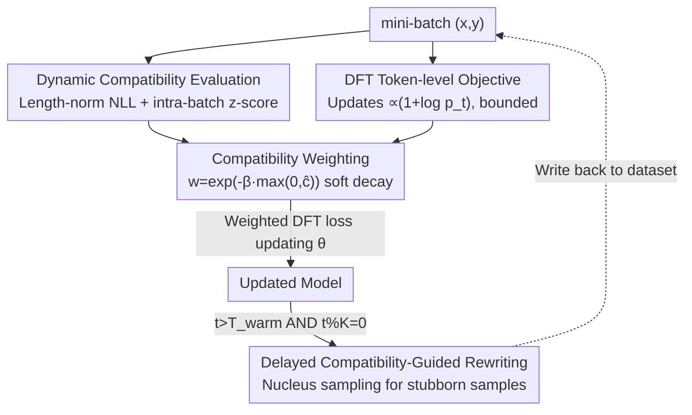

# Compatibility-Aware Dynamic Fine-Tuning for Large Language Models

**Conference**: ACL 2026  
**arXiv**: [2606.11206](https://arxiv.org/abs/2606.11206)  
**Code**: TBD  
**Area**: Alignment RLHF / LLM Training  
**Keywords**: Supervised Fine-Tuning, Gradient Variance Control, Sample-level Compatibility, DFT, Cold-start RL  

## TL;DR
Building on the token-level stabilization method DFT, CADFT introduces a "sample-level compatibility" signal calculated from the model's own likelihood to re-weight supervised gradients. It further employs a delayed, low-frequency "compatibility-guided rewriting" to transform stubborn, difficult samples into learnable targets. This suppresses high-variance gradients without reward models or RL, enhancing SFT stability, generalization, and the quality of cold-start RL initialization.

## Background & Motivation

**Background**: Supervised Fine-Tuning (SFT) is the dominant paradigm for aligning LLMs to downstream tasks and instruction-following behaviors. By maximizing the likelihood of expert demonstrations under teacher-forcing, it remains simple, stable, and scalable.

**Limitations of Prior Work**: Recent studies identify a fundamental optimization pathology in standard SFT: from a policy optimization perspective, SFT gradients are equivalent to a distorted objective where low-probability tokens induce disproportionately large updates (the gradient magnitude is inversely proportional to $\pi_\theta(y_t|\cdot)$). This "inverse probability amplification" leads to high gradient variance, training instability, and poor generalization on reasoning tasks under distribution shift. Dynamic Fine-Tuning (DFT) addresses this by rewriting SFT as a probability-aware objective—making updates proportional to $(1+\log p_t)$ and keeping them bounded as $p_t\to 0$—thereby neutralizing the pathology at the **token level**.

**Key Challenge**: DFT implicitly assumes that **all demonstrations in the dataset are equally suitable as learning targets**. However, real-world large-scale instruction data is highly heterogeneous—some demonstrations match the model's current inductive bias and capabilities, while others are overly complex, structurally messy, or semantically mismatched. Even with stabilized token-level gradients, this "demonstration-policy mismatch" still induces high-variance updates at the **sample level**: the model is forced to memorize patterns it cannot reliably internalize. In other words, DFT manages "how to scale each token's gradient" but ignores "which demonstrations should exert more influence on parameter updates."

**Goal + Key Insight**: The authors argue that stabilizing SFT requires controlling both token-level gradient scaling and **sample-level** demonstration-policy compatibility. A key observation is that compatibility should be a **relative, state-dependent** quantity—measured using the model's own likelihood rather than some absolute difficulty metric.

**Core Idea**: A normalized compatibility score is calculated using the model's own likelihood to **soft-weight** sample-level updates in DFT (suppressing high-variance gradients from incompatible samples). For persistently incompatible samples, a conservative delayed rewriting mechanism is used to project them back into the model's current "feasible region." The entire approach remains purely supervised, avoiding reward models, on-policy sampling, or policy optimization.

## Method

### Overall Architecture
CADFT takes an instruction-response dataset $\mathcal{D}=\{(x,y)\}$ and a policy model $\pi_\theta$ as input, outputting a more stable and generalizable fine-tuned model. It inserts three components into the DFT training loop: a **forward compatibility assessment** for each mini-batch (no gradient), **adaptive normalization** of these scores within the batch to obtain $\hat c$, and then applying an exponential decay weight $w(\hat c)$ to **scale each sample's DFT loss**. In later stages of training, a small subset of "persistently incompatible" samples is periodically selected for **delayed rewriting**. This pipeline unifies token-level stability (handled by DFT) and sample-level stability (handled by compatibility weighting) within a purely supervised framework.

### Key Designs

**1. Dynamic Compatibility Evaluation: Using internal likelihood to measure learnability**

While DFT treats all demonstrations equally, heterogeneous data often contain samples that are too difficult or mismatched for the current model. CADFT first calculates a **raw compatibility score**—the length-normalized negative log-likelihood:

$$c_{\text{raw}}(x,y;\theta)=\frac{1}{|y|}\sum_{t=1}^{|y|}-\log\pi_\theta(y_t\mid x,y_{<t})$$

Lower values indicate higher compatibility (the model is more "inclined" to generate the sample). However, since the absolute scale of $c_{\text{raw}}$ shifts as the model improves, fixed thresholds are ineffective. The authors use adaptive normalization within the **effective global mini-batch** $\mathcal{B}$: calculating z-scores via batch mean $\mu_\mathcal{B}$ and standard deviation $\sigma_\mathcal{B}$ (synchronized across data-parallel workers via all-reduce):

$$\hat c_i=\frac{c_{\text{raw}}(x_i,y_i)-\mu_\mathcal{B}}{\sigma_\mathcal{B}+\epsilon}$$

Crucially, $\hat c$ is **relative and state-dependent**: it measures how a demonstration fits the model relative to other samples in the batch. These compatibility statistics are detached from the gradient graph and serve only as weights.

**2. Compatibility-Aware Objective: Soft-suppressing gradients of incompatible samples**

With the normalized score $\hat c_i$, CADFT modulates the supervision strength of each sample using a soft exponential decay weight:

$$w(\hat c_i)=\exp\!\big(-\beta\cdot\max(0,\hat c_i)\big)$$

where $\beta\ge 0$ controls sensitivity (set to $\beta=1.0$ in experiments). This design ensures that samples with compatibility **no worse than the batch average** ($\hat c_i\le 0$) maintain a weight of 1, preserving their full signal. Only samples **worse than average** ($\hat c_i>0$) are gradually down-weighted. The final objective is:

$$\mathcal{L}_{\text{CADFT}}(\mathcal{B})=\frac{1}{|\mathcal{B}|}\sum_{(x,y)\in\mathcal{B}}w(\hat c(x,y))\cdot\mathcal{L}_{\text{DFT}}(x,y)$$

This aligns with self-paced or curriculum learning principles: compatible samples exert stronger influence on parameter updates. It is the opposite of heuristics like Focal Loss—CADFT **weakens** the impact of difficult samples for variance correction rather than reinforcing them. The authors theoretically show that under the assumption of "large gradient norms for incompatible samples," the second moment $\mathbb{E}[\|\tilde g\|^2]$ (where $\tilde g_i=w(\hat c_i)g_i$) is suppressed compared to standard DFT, making CADFT a **variance-controlled estimator**.

**3. Delayed Compatibility-Guided Rewriting: Projecting stubborn samples into the feasible region**

Weighting only reduces the influence of difficult samples; however, some demonstrations might be **correct but far beyond the model's current capability**. Continuous down-weighting wastes this data. CADFT introduces a conservative two-stage rewriting mechanism: the **warm-up phase** ($t<T_{\text{warm}}$, 3000 steps) uses only compatibility-aware weighting to stabilize instruction following; the **rewriting phase** ($t\ge T_{\text{warm}}$) periodically selects a small fraction (~0.5% every $K=1000$ steps) of samples with **persistently high moving-average compatibility scores** (i.e., consistently difficult). These are replaced with probability 0.5 by versions generated via nucleus sampling from the model itself:

$$\hat y\sim\text{NucleusSampling}(\pi_\theta(\cdot|x);p=0.9,T=0.7)$$

This projects "overly difficult demonstrations into the model's current hypothesis class," converting high-variance supervision into stable, albeit simplified, signals. The low frequency, delay, small proportion, and probabilistic replacement prevent the model from collapsing into self-reinforcing degradation.

### Loss & Training
The core objective is $\mathcal{L}_{\text{CADFT}}$. The training follows the DFT protocol: identical batch size, optimizer, learning rate, and steps. The effective global batch size is 256. Normalization uses per-mini-batch z-scores with $\epsilon=10^{-6}$ and $\beta=1.0$. Rewriting parameters: $T_{\text{warm}}=3000$, $K=1000$, 0.5% data per cycle, replacement probability 0.5, nucleus sampling $p=0.9$/$T=0.7$. No RL components are involved.

## Key Experimental Results

### Main Results
On mathematical reasoning (Math500 / Minerva / OlympiadBench / AIME24 / AMC23, Average@16), code generation (HumanEval/+ and MultiPL-E, pass@1), and multi-modal reasoning (MathVerse / MathVision / WeMath), CADFT consistently outperforms SFT and DFT across all backbones. Mathematical reasoning results (Average):

| Backbone | Base | w/ SFT | w/ DFT | w/ CADFT |
|----------|------|--------|--------|----------|
| LLaMA-3.2-3B | 1.19 | 3.24 | 4.65 | **5.40** |
| LLaMA-3.1-8B | 1.00 | 6.33 | 11.02 | **12.73** |
| DeepSeekMath-7B | 2.64 | 9.82 | 18.15 | **20.15** |
| Qwen2.5-Math-1.5B | 15.92 | 18.01 | 31.58 | **33.42** |
| Qwen2.5-Math-7B | 21.25 | 23.62 | 37.15 | **41.44** |

CADFT provides a 1.8 to 4.3 point improvement over the already strong DFT, regardless of model size or specialization. The improvement on Math500 is particularly notable (Qwen2.5-Math-7B: 68.20 $\to$ 75.50).

### Key Findings
*   **Additive Gains**: Token-level stability (DFT) and sample-level stability (weighting) are orthogonal and complementary; unifying them suppresses variance across both hierarchies.
*   **Relative Compatibility**: Z-score normalization allows signals to adapt as the model strengthens, avoiding the issue where absolute likelihoods drift globally.
*   **Conservative Rewriting**: Rewriting is a double-edged sword. The fourfold constraints (warm-up, low frequency, small proportion, probabilistic replacement) are essential to prevent the model from simplifying targets to the point of degradation.

## Highlights & Insights
*   **Lifting DFT to the Sample Level**: Applying the "variance-controlled" philosophy at a coarser granularity proves effective with minimal additional compute (compatibility is just a non-grad forward pass).
*   **Internal Likelihood Weighting**: Defining compatibility via the model's own likelihood and using intra-batch normalization eliminates the need for external reward models and handles distribution drift during training.
*   **Weighting + Rewriting Strategy**: Reducing the influence of difficult samples first and then rewriting persistent outliers utilizes heterogeneous data more effectively than simple data filtering.
*   **Transferability**: This logic is applicable to knowledge distillation, curriculum learning, and data pruning—any scenario where demonstration quality is heterogeneous.

## Limitations & Future Work
*   Rewriting depends on self-sampling quality; for weak backbones, targets might become "easy but mediocre" rather than "stable but correct."
*   Small mini-batches might introduce noise into z-score statistics. While global batch synchronization helps, robustness in low-resource settings is less explored.
*   The method involves several hyperparameters ($\beta, T_{\text{warm}}, K$); while the paper provides defaults, a systematic sensitivity analysis is missing.

## Related Work & Insights
*   **vs. DFT**: DFT only rescales gradients at the token level to fix inverse probability amplification. CADFT extends variance control to "how much each demonstration matters" and adds delayed rewriting.
*   **vs. Focal Loss**: Whereas Focal Loss increases weights for hard examples to emphasize them, CADFT **decreases** weights for incompatible examples for variance correction—prioritizing stability over "hard-example mining."
*   **vs. RLHF / DPO**: While RLHF relies on reward models or preference data, CADFT is purely supervised yet provides a superior initialization for downstream RL.

## Rating
*   Novelty: ⭐⭐⭐⭐ Clean extension of token-level variance control to the sample level with rewriting logic.
*   Experimental Thoroughness: ⭐⭐⭐⭐ Strong results across diverse backbones and scales; however, analysis of rewriting quality is limited.
*   Writing Quality: ⭐⭐⭐⭐ Clear motivation, well-defined mathematical framework.
*   Value: ⭐⭐⭐⭐ High practical utility: purely supervised, low cost, and compatible with existing DFT workflows.

<!-- RELATED:START -->

<!-- RELATED:END -->

## Related Papers

- [\[ACL 2026\] Why Supervised Fine-Tuning Fails to Learn: A Systematic Study of Incomplete Learning in Large Language Models](why_supervised_fine-tuning_fails_to_learn_a_systematic_study_of_incomplete_learn.md)
- [\[ACL 2026\] Mitigating Selection Bias in Large Language Models via Permutation-Aware GRPO](mitigating_selection_bias_in_large_language_models_via_permutation-aware_grpo.md)
- [\[CVPR 2026\] Uncertainty-Aware Exploratory Direct Preference Optimization for Multimodal Large Language Models](../../CVPR2026/llm_alignment/uncertainty-aware_exploratory_direct_preference_optimization_for_multimodal_larg.md)
- [\[ACL 2026\] S2H-DPO: Hardness-Aware Preference Optimization for Vision-Language Models](s2h-dpo_hardness-aware_preference_optimization_for_vision-language_models.md)
- [\[ACL 2026\] Large Language Models Are Overconfident in Their Own Responses](large_language_models_are_overconfident_in_their_own_responses.md)

<!-- RELATED:END -->
