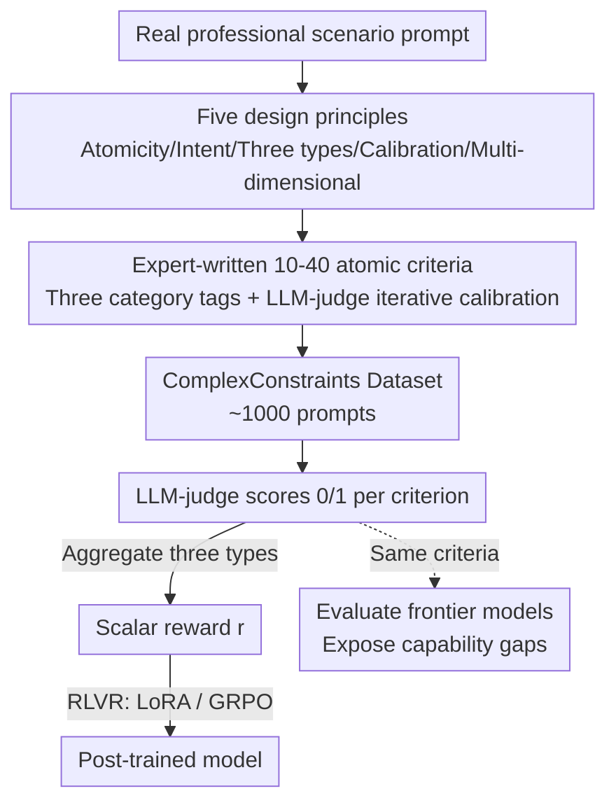

# ComplexConstraints and Beyond: Expert Rubrics for RLVR

**Conference**: ACL 2026  
**arXiv**: [2606.09118](https://arxiv.org/abs/2606.09118)  
**Code**: To be confirmed  
**Area**: Alignment RLHF / RLVR Reward Design  
**Keywords**: Expert Rubrics, RLVR, Instruction Following, Verifiable Reward, Agent Evaluation

## TL;DR
This paper systematically demonstrates that "expert-written fine-grained scoring rubrics" serve as both more reliable evaluation tools for frontier LLMs and data-efficient RLVR reward signals. It proposes five design principles for constructing high-quality rubrics and introduces the ComplexConstraints dataset, where each prompt contains 10–40 atomic criteria. Empirical results show that performing RLVR with only ~1,000 expert samples improves the instruction-following capability of a 4B model by +15.5 pp and a 235B model by +12.2 pp. Furthermore, single-epoch agentic training successfully transfers to out-of-distribution (OOD) benchmarks that the model never encountered during training (BFCL +4.5 / τ²-Bench +7.4 / Toolathlon +6.8 pp).

## Background & Motivation

**Background**: Instruction-following evaluation has evolved from the "programmatically verifiable constraints" of IFEval (25 types of word count/forbidden character/formatting rules that use scripts for automated judging) to the hierarchical constraint categorization of ComplexBench, and more recently toward expert-written rubrics in AdvancedIF. RLVR (Reinforcement Learning from Verifiable Rewards), popularized by DeepSeek-R1 and the open-source release of Tülu 3, has also begun experimenting with using rubrics as reward signals for instruction following.

**Limitations of Prior Work**: Traditional benchmarks are approaching saturation and their reliability is being eroded by data contamination. More fundamentally, what they measure is often misaligned with real-world deployment needs. IFEval exposes this problem: its programmatic verifiability is traded for **construct validity**. A model can produce incoherent nonsense but still "pass" as long as it avoids commas or the letter "c." Consequently, benchmarks are shaped around evaluation methods rather than the actual capabilities they claim to measure.

**Key Challenge**: The more expressive a criterion is (the better it distinguishes model capability), the harder it is to reliably automate. Programmatic checks can be automated but fail to capture the core of real tasks like "pragmatic intent" and "context-dependent behavior"; expert rubrics capture these but are difficult to automate at scale.

**Goal**: This work aims to establish "expert-written rubrics" as a robust paradigm—demonstrating that they are both more effective as evaluation tools and can serve directly as **RLVR reward signals** to train models. To this end, the paper provides actionable construction principles, a dataset, and empirical evidence across both instruction-following and agentic domains.

**Key Insight + Core Idea**: The authors advocate for domain experts to decompose "task success" into **atomic, verifiable** criteria, with 10–40 criteria per prompt, each scored 0/1 by an LLM-judge. These dense rubrics serve two functions: during evaluation, they provide fine-grained diagnosis of "which criteria were met vs. missed"; as RLVR rewards, these dense criteria naturally provide **continuous reward gradients** (scoring 28/30 vs 15/30 yields distinct signals). This makes credit assignment far more precise than binary pass/fail signals. In short: if a rubric is rich enough to evaluate frontier models, it is rich enough to train them.

## Method

### Overall Architecture
The paper proposes a methodology involving "expert rubrics → evaluation + RLVR rewards" along with a dataset and empirical validation. The input is a real professional scenario prompt. Experts decompose "task success" into 10–40 atomic criteria based on five design principles, including category tags (Primary Intent / Extra Credit / Dodged Bullet). Each criterion is iteratively calibrated via an LLM-judge. These criteria are used both to evaluate frontier models (exposing capability gaps) and aggregated into a scalar reward $r$ for RLVR (using LoRA for instruction following and GRPO for agentic tasks).

### Key Designs

**1. Five Principles for Expert Rubrics: Ensuring rubrics are both evaluative and trainable**

These five principles form the core of the methodology. **① Maximum Viable Atomicity**: Each criterion should correspond to the "smallest meaningful unit" of the prompt, rather than mechanical over-decomposition. For example, a C7 chord should contain C/E/G/B♭. If each note is judged independently, an answer giving C/E/G/B♮ (a Cmaj7 chord) would receive 75%—in RL, this would reward a fundamentally incorrect answer and produce misleading gradients. **② Intent-Aware**: Criteria must reflect the user’s pragmatic intent rather than literal phrasing; annotators define the "what" and "why" after reviewing model responses. For instance, if a user wants to "improve Spanish" but mentions reading economics journals, literal rubrics might reward basic vocabulary, while an intent-aware rubric rewards advanced material. **③ Three-Category Taxonomy (see Design 2)**. **④ LLM-judge Iterative Calibration (see Design 3)**. **⑤ Domain-Grounded Task Complexity**: Agentic task rubrics follow professional workflows across dimensions like completeness, correctness, and constraint satisfaction, providing dense, criterion-level feedback to the RL optimizer.

**2. Three-Category Taxonomy: Distinguishing "Requirements/Bonus/Traps" with asymmetric weighting**

Treating all criteria equally loses information. The authors categorize criteria based on their relationship to user experience. **Primary Intent**: Requirements directly derived from the prompt that form the primary reward signal. **Extra Credit (Reward only)**: Elements that enhance the response but were not requested; failure to meet these does not penalize the model. **Dodged Bullet (Penalty only)**: Checks if the response avoids common pitfalls the user might not have noticed; violation results in a penalty. The reward function is defined as:

$$r=\frac{1}{|C_{\text{PI}}|}\sum_{c\in C_{\text{PI}}}s_c+\alpha\frac{1}{|C_{\text{EC}}|}\sum_{c\in C_{\text{EC}}}s_c-\beta\frac{1}{|C_{\text{DB}}|}\sum_{c\in C_{\text{DB}}}(1-s_c)$$

where $\alpha, \beta \ge 0$. This asymmetric structure provides a **dense learning signal** that credits partial success and penalizes avoidable errors more effectively than binary pass/fail metrics.

**3. LLM-judge Iterative Calibration: Ensuring human-judge alignment**

Since rubrics depend on an LLM-judge for both evaluation and training, names and descriptions must be unambiguous. Each criterion undergoes iterative verification: authors draft the criterion and score a reference answer → LLM verifier evaluates → discrepancies are resolved by rewriting the criterion → the author modifies the reference answer to trigger the opposite judgment to ensure the verifier follows. This eliminates noise in the reward signal and reduces the risk of reward hacking. Comparison between different judge models and policy models further mitigates shared representation vulnerabilities.

## Key Experimental Results

### Main Results: Training effectiveness using rubrics as reward signals
Instruction following was trained on ComplexConstraints (approx. 900 samples, LoRA) and agentic tasks on CoreCraft (GRPO, 16 rollouts per prompt, GPT-5-mini as judge).

| Setting | Model/Benchmark | Base | Trained | Δ |
|------|----------------|------|---------|------|
| Instruction Following (In-dist) | Qwen3-4B Per-criterion Pass Rate | 57.9% | 73.4% | +15.5 pp |
| Instruction Following (In-dist) | Qwen3-235B Per-criterion Pass Rate | 73.9% | 86.1% | +12.2 pp |
| AdvancedIF Transfer | Qwen3-4B Overall | 28.2% | 36.6% | +8.5 pp |
| AdvancedIF Transfer | Qwen3-4B System Steerability | 22.5% | 34.9% | +12.4 pp |
| Agentic OOD | GLM 4.6 BFCL Parallel | 91.0% | 95.5% | +4.5 pp |
| Agentic OOD | GLM 4.6 τ²-Bench Retail | 68.7% | 76.1% | +7.4 pp |
| Agentic OOD | GLM 4.6 Toolathlon Pass@1 | 18.8% | 25.6% | +6.8 pp |

Two key observations: the trained 4B model (73.4%) nearly matches the 50x larger 235B baseline (73.9%). Despite ComplexConstraints containing only **single-turn data**, it significantly improves multi-turn context (+7.1 pp) and system steerability (+12.4 pp). This suggests that training to satisfy 10–40 simultaneous constraints fosters a general constraint-tracking capability that transfers to multi-turn interactions.

### Key Evaluation Findings: Exposing capability gaps

| Benchmark | Metric | Strongest Frontier Model | Note |
|-----------|------|--------------|------|
| ComplexConstraints | Perfect Task % (All criteria met) | GPT-5.1 only 16.55% | Weak models <5%; difficulty stems from constraint multiplication |
| CoreCraft | Task Pass % | GPT-5.2 only 42.6% | Strongest models solve less than half of agentic tasks |

The value of dense rubrics lies in the "multiplicative difficulty": for a 20-criterion task, a small failure probability on each multiplied across all criteria leads to a low "perfect task" rate. This creates a **continuous gradient** between partially and fully correct answers, providing a richer reward landscape for RL than binary signals.

## Highlights & Insights
- **"Evaluation as Training" Double Dividend**: The same expert rubrics serve as both high-validity evaluation instruments and data-efficient RL rewards.
- **Asymmetric Three-Category Reward Function**: A concise formula encodes "Must-have / Bonus / Trap-avoidance" into RLVR, providing a template for other rubric-based RL efforts.
- **Construct Validity**: The critique of IFEval (using the "comma avoidance" example) powerfully illustrates the limitations of programmatic evaluation.
- **Agentic Capability Hierarchy**: Decomposing agentic tasks into 5 levels (tool use to common-sense reasoning) provides a structure for designing localized RL feedback.

## Limitations & Future Work
- **Single Seed and Single-turn**: Instruction-following results use a single training seed; variance was not quantified. The dataset is single-turn, meaning multi-turn benefits are inferred rather than controlled.
- **High Expert Cost**: Drafting 10–40 atomic criteria and performing iterative calibration is human-intensive, representing a bottleneck for scaling.
- **Judge Dependency**: Reward quality is bound by LLM-judge performance. While calibration helps, judge bias remains a potential source of noise.
- **Comparability Caveat**: Comparisons with works like RIFL are indicative rather than strictly controlled due to differences in base models and pipelines.

## Related Work & Insights
- **vs IFEval / FollowBench / ComplexBench**: This work prioritizes construct validity over programmatic automation by using expert rubrics.
- **vs AdvancedIF / HealthBench**: While also using expert rubrics, this work is specifically designed for the dual-use of evaluation and RLVR training, emphasizing high constraint density.
- **vs RIFL / VerIF / ToolRL**: Unlike methods relying on synthetic rubrics, this work argues that expert-written rubrics capture pragmatic intent that synthetic versions miss.
- **vs RubricRAG**: While RubricRAG uses RAG to generate rubrics during inference to save costs, this work advocates for manual expert curation to ensure maximum intent fidelity.

## Rating
- Novelty: ⭐⭐⭐⭐ Systematic demonstration of the dual-use paradigm.
- Experimental Thoroughness: ⭐⭐⭐⭐ Cross-domain validation and OOD transfer; however, lacks multi-seed variance quantification.
- Writing Quality: ⭐⭐⭐⭐⭐ Excellent use of examples and clear reward function derivation.
- Value: ⭐⭐⭐⭐⭐ Highly practical methodology and datasets for RLVR and frontier model evaluation.

<!-- RELATED:START -->

## Related Papers

- [\[ICML 2026\] SFT Overtraining Predicts Rank Inversion via Entropy Collapse Under RLVR](../../ICML2026/llm_alignment/sft_overtraining_predicts_rank_inversion_via_entropy_collapse_under_rlvr.md)
- [\[ICLR 2026\] Beyond Pairwise: Empowering LLM Alignment With Ranked Choice Modeling](../../ICLR2026/llm_alignment/beyond_pairwise_empowering_llm_alignment_with_ranked_choice_modeling.md)
- [\[ICLR 2026\] Beyond RLHF and NLHF: Population-Proportional Alignment under an Axiomatic Framework](../../ICLR2026/llm_alignment/beyond_rlhf_and_nlhf_population-proportional_alignment_under_an_axiomatic_framew.md)
- [\[ICLR 2026\] Beyond Binary Preferences: A Principled Framework for Reward Modeling with Ordinal Feedback](../../ICLR2026/llm_alignment/beyond_binary_preferences_a_principled_framework_for_reward_modeling_with_ordina.md)
- [\[ICML 2026\] Steering Beyond the Support: Adversarial Training on Unsupervised Jailbroken Activation Simulation](../../ICML2026/llm_alignment/steering_beyond_the_support_adversarial_training_on_unsupervised_jailbroken_acti.md)

<!-- RELATED:END -->
