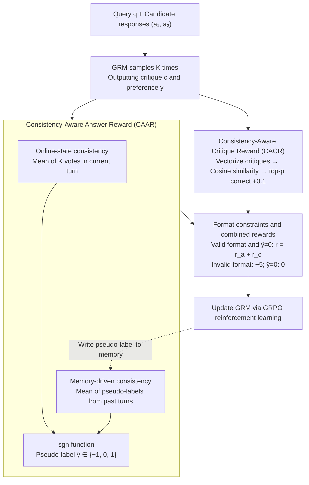

# ConsistRM: Improving Generative Reward Models via Consistency-Aware Self-Training

**Conference**: ACL 2026  
**arXiv**: [2604.07484](https://arxiv.org/abs/2604.07484)  
**Code**: [GitHub](https://github.com/yuliangCarmelo/ConsistRM)  
**Area**: RLHF Alignment / Reward Model  
**Keywords**: Generative Reward Models, Self-training, Consistency-aware, Pseudo-labels, Position bias

## TL;DR

ConsistRM proposes a consistency-aware self-training framework. By utilizing two modules—temporal consistency pseudo-labels (preference consistency merging online states and historical memory) and semantic consistency critique rewards (measuring semantic similarity of multiple generated critiques)—it improves the average performance of generative reward models by 1.5% across five benchmarks without human annotation, while significantly mitigating position bias.

## Background & Motivation

**Background**: Generative Reward Models (GRM) replace traditional scalar reward models by generating textual critiques and preference labels, offering stronger expressiveness and generalization. Representative works include DeepSeek-GRM (critique generation + self-derived rules) and RM-R1 (inference trajectory distillation + reinforcement learning).

**Limitations of Prior Work**: GRM training faces two major challenges: (1) dependence on expensive human-annotated data, which limits scalability; (2) self-training methods (such as majority voting pseudo-labels in TTRL) are prone to reward hacking and early overfitting to noisy pseudo-labels because the reward signals are highly coupled with the policy model.

**Key Challenge**: Self-training requires reliable pseudo-labels, but the pseudo-labels generated by the model itself are unstable—single votes are susceptible to sampling randomness, and pseudo-label bias accumulates in later stages of training.

**Goal**: Design a stable and effective GRM self-training framework that does not require human annotation.

**Key Insight**: Leverage the model's internal "consistency" signal as a source of self-supervision. If a model provides consistent preference judgments for the same sample across multiple samplings and training rounds, the judgment is more likely to be correct.

**Core Idea**: Construct reliable pseudo-labels using temporal consistency (current round + historical memory) and provide fine-grained rewards using semantic consistency (similarity of multiple critique texts) to achieve stable GRM self-training without annotations.

## Method

### Overall Architecture
ConsistRM bases the self-training of generative reward models on the principle that "consistency implies reliability." Given a query $q$ and two candidate responses $(a_1, a_2)$, the GRM generates a structured output $o = (c, y)$, where $c$ is a textual critique and $y \in \{-1, 1\}$ is a preference label. The framework does not rely on any human annotation; instead, it extracts supervision from two types of internal consistency signals: Consistency-Aware Answer Reward (CAAR), which uses current votes and historical memory to determine reliable pseudo-labels; and Consistency-Aware Critique Reward (CACR), which measures process quality via the semantic similarity of multiple produced critiques. These signals are combined under format constraints into a final reward for GRPO reinforcement learning.

### Key Designs

**1. Consistency-Aware Answer Reward (CAAR): Calibrating Online Voting with Historical Memory**

The greatest risk in self-training is the instability of pseudo-labels—single-round voting is affected by sampling randomness, and bias accumulates in later training stages. CAAR merges two layers of consistency signals: online-state consistency $s_{\text{online}}^{(n)} = \frac{1}{K}\sum_{j=1}^{K} y_j$ aggregates preference predictions from $K$ rollouts in the current round, while memory-driven consistency $s_{\text{memory}}^{(n)} = \frac{1}{n-1}\sum_{i=0}^{n-1} \hat{y}^{(i)}$ aggregates pseudo-labels from all previous rounds to provide a stable anchor for the current judgment.

The final pseudo-label is obtained by taking the sign of the sum: $\hat{y}^{(n)} = \text{sgn}(s_{\text{online}}^{(n)} + s_{\text{memory}}^{(n)})$. When the online and memory directions conflict, it outputs 0, meaning no supervision is provided for these low-confidence samples. This ternary +1/-1/0 design explicitly excludes uncertain samples from optimization, which avoids noise-dominant training better than binary forced classification.

**2. Consistency-Aware Critique Reward (CACR): Supplementing Process Supervision via Semantic Convergence**

CAAR only considers preference results and cannot constrain the quality of the critique text itself. CACR addresses this by providing process supervision. It encodes each generated critique $c_j$ into a vector using Qwen3-4B-Embedding, calculates a cosine similarity matrix, and ranks them by semantic consistency. Critiques that are in the top $p$ and have the correct preference receive an additional reward $r_j^{(c)} = 0.1$. The intuition is that if multiple generated critiques are highly consistent semantically, the model's evaluation has converged to a stable region, making such critiques more likely to reflect reliable judgment.

Consequently, CAAR monitors results while CACR monitors the process. They complement each other at different granularities, ensuring the reward system incentivizes being both "correct" and "stable."

**3. Format Constraints and Combined Rewards: Ensuring Parsability and Unified Optimization**

To ensure GRM outputs are parsable and multiple reward layers align, ConsistRM combines answer and critique rewards into $r^{(n)} = r_j^{(a,n)} + r_j^{(c,n)}$, which is applied only when the format is valid and $\hat{y} \neq 0$. An invalid format receives a heavy penalty of $r = -5$, while $\hat{y} = 0$ (uncertain samples) results in $r = 0$. Optimization is performed using the GRPO algorithm with a global batch size of 64, learning rate of 1e-6, 8 rollouts, and a KL coefficient of 0.001.

Format constraints guarantee that outputs can be parsed by downstream tasks, while stacking different granularities of consistency rewards ensures that CAAR and CACR provide consistent gradient signals for both results and processes, preventing exploitation of a single reward signal.

### Loss & Training
Training uses GRPO for 4 epochs, with a maximum generation length of 1024 (training) / 2048 (inference) and temperatures of 1.0 (training) / 0 (inference). The overall process starts with SFT on HelpSteer3, followed by RFT (Reinforcement Fine-Tuning). ConsistRM's dual consistency rewards replace the original reward signals during the RFT stage.

## Key Experimental Results

### Main Results

**Performance across five benchmarks on Qwen3-8B**

| Method | RewardBench | PPE Pref | RM-Bench | RMB | JudgeBench | Average | Gain |
|------|------------|----------|----------|-----|------------|------|---|
| Qwen3-8B (Base) | 81.6 | 63.8 | 75.8 | 78.8 | 54.3 | 70.9 | - |
| + SFT | 82.7 | 65.0 | 77.1 | 76.9 | 51.7 | 70.7 | -0.2 |
| + RFT | 85.4 | 65.4 | 78.2 | 78.2 | 55.4 | 72.5 | +1.6 |
| + TTRL | 85.3 | 65.0 | 77.4 | 74.2 | 56.8 | 71.7 | +0.8 |
| + ConsistRM (Ours) | **85.6** | **67.7** | **78.3** | **79.1** | **56.9** | **73.5** | **+2.6** |

### Ablation Study

| Configuration | RewardBench | PPE | RM-Bench | RMB | JudgeBench | Average | Gain |
|------|------------|-----|----------|-----|------------|------|---|
| ConsistRM | 85.6 | 67.7 | 78.3 | 79.1 | 56.9 | 73.5 | - |
| w/o CACR | 84.9 | 64.8 | 77.3 | 78.1 | 56.0 | 72.2 | -1.3 |
| w/o Online-State | 85.5 | 64.1 | 78.6 | 76.7 | 56.7 | 72.3 | -1.2 |
| w/o Memory-Driven | 84.3 | 63.1 | 75.4 | 74.2 | 54.8 | 70.4 | **-3.2** |

### Key Findings

- Memory-driven consistency preference is the most critical component (performance drops by 3.2 points without it), indicating that historical info is vital for pseudo-label quality.
- ConsistRM significantly improves position bias mitigation (+5.3 vs. +1.4 for RFT) because consistency rewards encourage the model to focus on content rather than position.
- ConsistRM allows a 4B model to reach the performance level of an 8B model through multi-round voting.
- Replacing CACR with token-level confidence (DeepConfidence) leads to reward hacking and performance degradation.

## Highlights & Insights

- The core assumption that "consistency implies reliability" is simple yet powerful—leveraging internal consistency signals to replace external annotations.
- The temporal memory mechanism (aggregating historical pseudo-labels) is a key innovation, providing a stable anchor across training rounds.
- The ternary label design (+1/-1/0) elegantly handles uncertain samples, preventing noise from polluting the training.
- Improvements in generation efficiency were also observed—ConsistRM generates more concise critiques (1717 vs. 1924 tokens).

## Limitations & Future Work

- Semantic consistency evaluation is currently at the overall critique level and fails to align individual semantic segments of the critique with fine granularity.
- Validation was limited to Qwen3 and LLaMA-3.1; generalization across more model families remains to be verified.
- Hyperparameters for consistency rewards (top-p ratio, CACR reward value of 0.1) may require adjustment for different tasks.

## Related Work & Insights

- **vs. TTRL**: TTRL uses majority voting for pseudo-labels but lacks temporal consistency across rounds, leading to bias accumulation; ConsistRM mitigates this via historical memory.
- **vs. DeepSeek-GRM**: The latter requires human-annotated reward signals, while ConsistRM is entirely annotation-free.
- **Insight**: Consistency signals may serve as a universal, low-cost quality indicator in self-training scenarios.

## Rating

- Novelty: ⭐⭐⭐⭐ The consistency-aware self-training paradigm is cleverly designed, especially the temporal consistency memory mechanism.
- Experimental Thoroughness: ⭐⭐⭐⭐⭐ Comprehensive coverage with five benchmarks, four models, full ablation, and analysis of position bias and multi-round voting.
- Writing Quality: ⭐⭐⭐⭐ Clear methodological descriptions and detailed experimental analysis.
- Value: ⭐⭐⭐⭐ Provides a practical and effective solution for annotation-free GRM training.

<!-- RELATED:START -->

## Related Papers

- [\[AAAI 2026\] GRAM-R²: Self-Training Generative Foundation Reward Models for Reward Reasoning](../../AAAI2026/llm_alignment/gram-r2_self-training_generative_foundation_reward_models_for_reward_reasoning.md)
- [\[ACL 2026\] Compatibility-Aware Dynamic Fine-Tuning for Large Language Models](compatibility-aware_dynamic_fine-tuning_for_large_language_models.md)
- [\[ICML 2026\] Consistency Training Can Entrench Misalignment](../../ICML2026/llm_alignment/consistency_training_can_entrench_misalignment.md)
- [\[ACL 2026\] Mitigating Selection Bias in Large Language Models via Permutation-Aware GRPO](mitigating_selection_bias_in_large_language_models_via_permutation-aware_grpo.md)
- [\[ACL 2026\] Team-Based Self-Play With Dual Adaptive Weighting for Fine-Tuning LLMs](team-based_self-play_with_dual_adaptive_weighting_for_fine-tuning_llms.md)

<!-- RELATED:END -->
