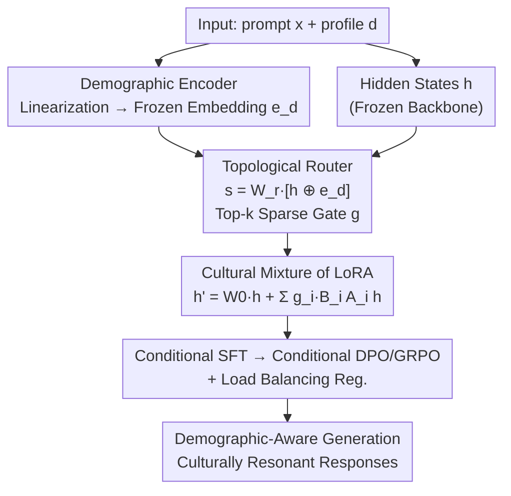

# CuMA: Aligning LLMs with Sparse Cultural Values via Demographic-Aware Mixture of Adapters

**Conference**: ACL 2026  
**arXiv**: [2601.04885](https://arxiv.org/abs/2601.04885)  
**Code**: https://github.com/Throll/CuMA  
**Area**: Alignment RLHF / Multicultural Alignment  
**Keywords**: Cultural Alignment, Value Pluralism, Mixture of Experts, LoRA, Demographic Routing

## TL;DR
CuMA argues that dense models suffer from "Mean Collapse" when fitting conflicting cultural values, resulting in representations that represent no specific group well. By utilizing a "Demographic + Semantic" joint routing in a Mixture of LoRA Adapters, the method decouples conflicting gradients into dedicated expert subspaces, improving accuracy while preserving cultural diversity across multiple benchmarks.

## Background & Motivation
**Background**: The mainstream paradigm for LLM alignment is RLHF, which characterizes human preferences using a single reward model. This paradigm excels in "consensus-based" tasks such as safety compliance, coding, and mathematics, where a global optimal answer exists.

**Limitations of Prior Work**: LLMs serve a global user base, but value-based questions often **lack consensus**—a response considered profound in one community may be meaningless in another. Existing methods use a single set of dense parameters to fit these conflicting value distributions, implicitly assuming a unified value system. When a model minimizes total error across conflicting patterns, it slides toward a statistical average, which the authors term **Mean Collapse**: compressing divergent values into a dominant representation and erasing minority perspectives. Worse, this "average" is not neutral; due to homogeneity in pre-training corpora and annotators, it often biases toward WEIRD (Western, Educated, Industrialized, Rich, and Democratic) norms.

**Key Challenge**: The authors attribute the root cause to **gradient interference**. Human values are inherently **sparse**—clustering into discrete, conflicting patterns rather than a continuous spectrum (termed **Cultural Sparsity**). Geometrically, a single set of dense parameters cannot simultaneously cover these disjoint patterns and can only converge to a "diluted middle."

**Goal**: The paper reformulates cultural alignment as a **conditional capacity separation** problem—instead of forcing all conflicting values into one parameter set, capacity is allocated to specialized subspaces based on "who is asking."

**Key Insight**: Standard MoE routing relies solely on internal hidden states (semantic content), which fails to distinguish between "conflicting preferences within similar contexts." The authors observe that cultural differences are driven by both **semantics and demographic profiles**; thus, routing must simultaneously consider "what is asked" and "who is asking."

**Core Idea**: CuMA (Cultural Mixture of Adapters) employs **demographic-aware routing** to combine LoRA experts. This allows the model to learn a "latent cultural topology," explicitly decoupling conflicting gradients into respective experts to avoid mean collapse and maintain cultural diversity.

## Method

### Overall Architecture
CuMA freezes the backbone and attaches a set of LoRA experts. The core mechanism involves conditioning the activation of experts **simultaneously** on the semantic hidden state $h$ and the user demographic profile $e_d$. The workflow is: linearize structured demographic profiles (Country, Religion, Age, etc.) into natural language, pass them through a **frozen** sentence embedding model to obtain $e_d$. The router concatenates $h$ and $e_d$ to compute routing logits for Top-$k$ sparse activation. Selected LoRA experts are weighted by gating scores, providing a demographic-dependent low-rank increment to the frozen backbone. Here, $h$ determines "what is asked" and $e_d$ determines "who is asking," ensuring conflicting cultural patterns are directed to different expert subsets and gradients are structurally isolated. Training begins with conditional SFT, followed by conditional preference optimization (DPO/GRPO) when preference labels are available, alongside a load-balancing regularization.

### Key Designs

**1. Cultural Sparsity and Mean Collapse: A Geometric Characterization of Alignment Failure**

This serves as the theoretical foundation, transforming the vague notion of "mediocre model responses" into a provable geometric proposition. **Cultural Sparsity** is defined as follows: the Mahalanobis distance between the centers of value distributions of two demographic groups far exceeds the dimension $m$ of the representation space, i.e., $(\mu_i-\mu_j)^{\top}\bar{\Sigma}_{ij}^{-1}(\mu_i-\mu_j)\gg m$. This implies that inter-group divergence dominates intra-group dispersion, resulting in multi-modal, disjoint distributions. Under this premise, the authors prove the **Mean Collapse Theorem**: a dense estimator (e.g., a single-component exponential family like Gaussian) minimizing forward KL $D_{KL}(P_{data}\parallel P_\theta)$ has its optimal mean parameter $\mu_\theta^*=\mathbb{E}_{P_{data}}[y]$ strictly converge to the global mixture mean. This purely statistical minimization of global error fails to capture value pluralism. This theory explains why simply adding parameters or data cannot save dense models; the root lies in gradient interference caused by parameter sharing, which necessitates **conditional routing** for capacity separation.

**2. Demographic Encoder: Leveraging Frozen Embedding Spaces for Generalizable Cultural Priors**

To enable demographic-aware routing, profiles must be encoded into stable, comparable vectors. Rather than learning embeddings from scratch, the authors linearize structured profiles (e.g., `{Country: Thailand, Religion: Buddhism, Age: 55}`) into a natural language description $t_d$ ("A 55-year-old Buddhist living in Thailand") and pass it through a **frozen** pre-trained sentence embedding model $E(\cdot)$ to obtain $e_d=E(t_d)$. The advantage of using a frozen space is the preservation of the semantic topology from pre-training—groups with similar geography or religion naturally cluster together. This provides stable similarity signals to the router, allowing it to **generalize to demographic groups not seen during training**. It is a clever way to inject "cultural priors" from external embedding spaces rather than learning them solely from alignment data.

**3. Topological Learning Router: Joint Semantic and Demographic Conditioning**

Standard MoE routers only consider the hidden state $h$, failing to distinguish conflicting preferences in similar contexts. The CuMA router **concatenates** the layer input $h$ with the demographic embedding $e_d$ to calculate logits: $s=W_r\cdot[h\oplus e_d]$, followed by a Top-$k$ sparse softmax to obtain gating $g_i=\frac{\exp(s_i)\cdot\mathbb{1}[i\in\text{Top-}k(s)]}{\sum_j \exp(s_j)\cdot\mathbb{1}[j\in\text{Top-}k(s)]}$. This concatenation allows the router to decouple "what is asked" ($h$) and "who is asking" ($e_d$). $W_r$ learns the latent cultural topology, directing divergent cultural patterns to distinct expert subsets and isolating conflicting gradients at the parameter level. This implements the core argument: semantic routing is insufficient; explicit demographic conditioning is mandatory.

**4. Cultural Mixture of Adapters: Low-Rank Increments as Demographic-Dependent Parameters**

To achieve fine-grained adaptation without compromising general reasoning, CuMA freezes the backbone $W_0$ and instantiates a pool of $N$ LoRA modules $\{(A_i,B_i)\}$. LoRA is chosen for its stability and efficiency in large-scale fine-tuning. During the forward pass, these are weighted by sparse gating: $h'=W_0 h+\sum_{i=1}^N g_i\cdot(B_i A_i h)$, which is equivalent to constructing a **demographic-dependent** parameter increment $\Delta W(d)=\sum g_i(d)B_i A_i$. Conflicting cultural values are thus processed by different parameter combinations, mechanically severing the gradient interference that causes mean collapse. The training objective $\mathcal{L}=\mathcal{L}_{task}+\lambda_{lb}\mathcal{L}_{lb}$ transitions through SFT/DPO/GRPO stages, with $\mathcal{L}_{lb}$ as a load-balancing regularizer to prevent expert collapse.

### Loss & Training
Two backbones are used: Llama-3.1-8B-Instruct and Qwen3-8B; the demographic encoder uses a frozen Qwen3-Embedding-0.6B. The number of experts $N=8$, Top-$k=2$, and LoRA rank $r=8/64$. Optimization uses AdamW with cosine decay. Training follows a staged approach: conditional SFT establishes basic alignment, followed by conditional DPO or GRPO for refinement with preference data.

## Key Experimental Results

### Main Results
On three benchmarks—WorldValuesBench (WVB), Community Alignment (CA), and PRISM (10:1 train/test split)—CuMA achieves SOTA across both backbones. Representative results for Llama-3.1-8B are shown below (WVB uses Acc/Macro-F1/EMD, CA uses Acc/Macro-F1, generation tasks use win rate against the base):

| Category / Method | Trainable Params | WVB Acc↑ | WVB EMD↓ | CA Acc↑ | CA Gen Win Rate (GRPO) |
|---|---|---|---|---|---|
| Vanilla Baseline | 0% | 32.42 | 0.3967 | 26.70 | - |
| Full Fine-Tuning | 100% | 45.25 | 0.2205 | 45.15 | 65.2% |
| LoRA | 0.37% | 34.30 | 0.2537 | 38.53 | 62.1% |
| MixLoRA (Semantic Only) | 3.01% | 45.20 | 0.2440 | 46.80 | 68.2% |
| HydraLoRA (Semantic Only) | 2.31% | 46.50 | 0.2350 | 47.90 | 69.5% |
| **CuMA (r=8)** | 1.53% | 48.90 | 0.1903 | 50.12 | 73.8% |
| **CuMA (r=64)** | 4.15% | **50.46** | **0.1870** | **52.45** | **74.5%** |

Three observations: First, dense methods hit a clear ceiling; even 100% FFT (45.25 Acc) lags behind CuMA (50.46), confirming the bottleneck of gradient interference in "one-size-fits-all" parameterization. Second, CuMA’s low-rank version ($r=8$, 1.53% params) outperforms the larger HydraLoRA (2.31% params), suggesting that **routing precision is more important than parameter scale**. Third, semantic-only MoE exhibits "high Acc, high EMD" (MixLoRA/HydraLoRA EMD ~0.24 vs. CuMA 0.19), indicating they predict the mode well but fail to reconstruct the shape of the cultural value distribution.

### Ablation Study / Cross-Backbone
Results are consistent on Qwen3-8B, where CuMA(r=64) pushes CA Acc to 57.20, gen win rate to 78.2%, and PRISM to 76.8%, significantly outperforming dense baselines (≈65%).

| Config (Qwen3) | WVB Acc | WVB EMD | CA Acc | CA Win Rate (GRPO) |
|---|---|---|---|---|
| HydraLoRA (Semantic) | 45.36 | 0.2793 | 52.80 | 73.6% |
| CuMA (r=8) | 49.02 | 0.1980 | 55.40 | 76.5% |
| CuMA (r=64) | **50.64** | **0.1876** | **57.20** | **78.2%** |

### Key Findings
- **EMD is the critical metric for distinguishing "alignment" from "stereotyping"**: High accuracy does not equate to good alignment. CuMA’s significantly lower EMD (Wasserstein-1 distance) shows it models the shape of human value distributions rather than just memorizing the mode.
- **Demographic conditioning is necessary, not optional**: Despite being sparse MoEs, semantic-only models cannot resolve cultural conflicts. Accuracy and diversity improve simultaneously only with demographic-aware routing.
- **Quantifiable mitigation of Mean Collapse**: Using predictive entropy (WVB) and Distinct-2 (CA/PRISM), the authors demonstrate that CuMA preserves generation diversity far better than dense models.
- **Generalization to unseen groups**: The stable topology provided by the frozen embedding space allows the router to assign appropriate experts even to demographic profiles not seen during training.

## Highlights & Insights
- **Formalizing "Alignment Failure" as a Geometric Theorem**: By using Cultural Sparsity and the Mean Collapse Theorem, the authors elevate "mediocre model responses" from empirical observation to a provable proposition rooted in gradient interference.
- **Routing Conditioning: Integrating "Who is Asking" with "What is Asked"**: Injecting demographic profiles into MoE routing is a simple yet pivotal modification that resolves the failure of semantic routing in conflicting cultural contexts.
- **Leveraging Frozen Embedding Spaces for Cultural Priors**: Reusing the semantic topology of pre-trained sentence embeddings instead of learning profiles from scratch ensures stability and generalization.
- **Evaluating Alignment via EMD**: The focus shifts from pure accuracy to distributional fidelity, offering a vital evaluation paradigm for pluralistic value alignment.

## Limitations & Future Work
- **Dependency on Accurate Demographic Profiles**: The method assumes access to structured demographic attributes, which might be missing, noisy, or privacy-sensitive in real-world deployments.
- **Ethical Risks of Demographic Profiling**: Assigning responses based on "who is asking" could reinforce stereotypes or be used for manipulation, necessitating governance.
- **Culture as a Proxy of Demographics**: Equating culture to observable proxies (Nationality/Religion/Age) is a simplification and may ignore intra-group value heterogeneity.
- **Expert Scaling**: The selection of $N=8$ and Top-$k=2$ lacks systematic sensitivity analysis regarding how the framework scales with the number of cultural patterns.

## Related Work & Insights
- **vs. Dense Alignment (RLHF/FFT/LoRA/DoRA)**: These use global parameters to fit conflicting values, inevitably leading to mean collapse. CuMA uses conditional capacity separation to decouple conflicts.
- **vs. Semantic MoE (MixLoRA / HydraLoRA)**: While sparse, these only route based on hidden states and cannot distinguish cultural conflicts in similar contexts. CuMA's demographic routing yields better accuracy and EMD with fewer parameters.
- **vs. Inference-Time Methods (Persona Prompting / Steering)**: Prompting provides limited gains (win rates ~55-59%). CuMA internalizes the cultural topology into parameters, resulting in significantly higher win rates.

## Rating
- Novelty: ⭐⭐⭐⭐⭐ Reformulating cultural alignment as conditional capacity separation with demographic-aware MoE is both theoretically and methodologically novel.
- Experimental Thoroughness: ⭐⭐⭐⭐⭐ Extensive testing across three benchmarks, two backbones, and multiple baselines, with deep analysis of collapse and generalization.
- Writing Quality: ⭐⭐⭐⭐⭐ Logical progression from geometric intuition to theorems and architecture; clear visualizations.
- Value: ⭐⭐⭐⭐⭐ Directly addresses the critical issue of pluralistic value alignment with a parameter-efficient, deployable method.

<!-- RELATED:START -->

## Related Papers

- [\[ICML 2026\] Quantifying the Salience of Geo-Cultural Values for Pluralistic Safety Alignment](../../ICML2026/llm_alignment/quantifying_the_salience_of_geo-cultural_values_for_pluralistic_safety_alignment.md)
- [\[ACL 2026\] WildFeedback: Aligning LLMs With In-situ User Interactions And Feedback](wildfeedback_aligning_llms_with_in-situ_user_interactions_and_feedback.md)
- [\[ACL 2026\] BACH-V: Bridging Abstract and Concrete Human-Values in Large Language Models](bach-v_bridging_abstract_and_concrete_human-values_in_large_language_models.md)
- [\[ACL 2026\] Aligning Agents via Planning: A Benchmark for Trajectory-Level Reward Modeling](aligning_agents_via_planning_a_benchmark_for_trajectory-level_reward_modeling.md)
- [\[ICML 2026\] Korean Culture into LLM Alignment: Toward Cultural Coherence](../../ICML2026/llm_alignment/korean_culture_into_llm_alignment_toward_cultural_coherence.md)

<!-- RELATED:END -->
