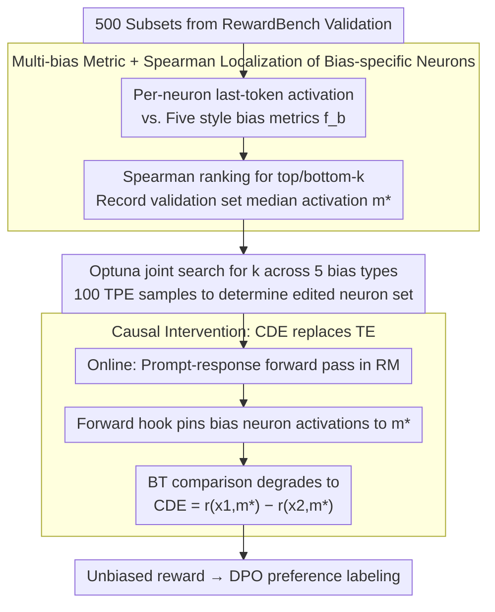

# Debiasing Reward Models via Causally Motivated Inference-Time Intervention

**Conference**: ACL 2026  
**arXiv**: [2604.27495](https://arxiv.org/abs/2604.27495)  
**Code**: Repository link not disclosed in the paper (not in cache)  
**Area**: LLM Alignment / RLHF / Causal Intervention / Interpretability  
**Keywords**: reward model, causal intervention, neuron editing, length bias, formatting bias

## TL;DR
The authors view the Bradley-Terry reward model as a causal graph for estimating total effect and identify bias-specific neurons (accounting for < 2% of total neurons) highly correlated with activations of five stylistic biases (length / paragraph / word overlap / exclamation mark / bold). During inference, these neuron activations are replaced with validation set medians (estimating the controlled direct effect). This approach eliminates bias without performance degradation on RewardBench / RM-Bench. When used downstream with DPO, it allows an 8B model's alignment score to match that of a 70B SOTA reward model.

## Background & Motivation
**Background**: The reward model (RM) in RLHF is central to scoring LLM preference, typically implemented via the BT model $p(y_1\succ y_2\mid q)=\sigma(r_\theta(x_1)-r_\theta(x_2))$. However, research increasingly suggests that RMs exhibit systematic preferences for response length (length bias) and formats such as lists, bolding, paragraphs, and emojis (Singhal et al. 2024, Zhang et al. 2025).

**Limitations of Prior Work**: (i) Training-time debiasing (ensemble, weight averaging, infoBN, adding heads via ODIN, data augmentation) require retraining the RM; costs are high as data/architecture must be adjusted for every new bias type. (ii) Inference-time debiasing is limited to length penalty (subtracting reward based on character count) and LWR (Locally Weighted Regression for length-only bias estimation), both of which only handle length and introduce a performance trade-off between "biased" and "unbiased" data subsets. (iii) How the RM internally "encodes" these biases remains largely a black box.

**Key Challenge**: Training-time debiasing is expensive and does not generalize to new bias types; existing inference-time methods perform coarse-grained subtraction on rewards without accessing internal representations, inherently causing a trade-off between biased and unbiased samples.

**Goal**: (i) Provide an **inference-time debiasing** method without retraining that handles multiple stylistic biases simultaneously; (ii) Reveal which neurons and layers in the RM encode these biases for interpretability; (iii) Apply the method to DPO preference labeling to evaluate improvements in downstream LLM alignment.

**Key Insight**: The RM is modeled as a causal graph: input $x$ → mediator $m$ (bias neuron activations) → output $r$. The BT model implicitly estimates the total effect $\hat{\mathrm{TE}}$, failing to separate "content quality" from "bias signals." By estimating the controlled direct effect $\hat{\mathrm{CDE}}$—fixing $m$ to $m^*$ (validation set median) before calculating the difference—the comparison effectively assumes both responses have the same degree of bias.

**Core Idea**: Identify top/bottom-$k$ neurons most correlated with five bias categories using Spearman correlation. During inference, replace their activations with the validation set median, equivalent to performing a CDE estimation. This achieves debiasing without retraining, generalizes across bias types, and avoids performance trade-offs.

## Method

### Overall Architecture
CIRM (Causally motivated Inference-time intervention for Reward Models) splits RM debiasing into two steps: offline localization and online intervention, which never modifies RM weights (Figure 2). Offline, it uses 500 RewardBench validation sub-samples to collect pairs of "last-token activations" and five stylistic bias measures $f_b(x)$ for every neuron. Spearman correlation is used to select the minority of neurons that truly encode biases, and their median activations are recorded. The number of edited neurons ($k$) for each bias category is determined via a five-dimensional joint search using Optuna to optimize validation set accuracy. During online inference, each prompt-response pair undergoes a standard forward pass, but activations of bias-specific neurons are pinned to the median $m^*$ before outputting the reward. The BT comparison degrades from total effect to the controlled direct effect $\hat{\mathrm{CDE}} = r_\theta(x_1, m^*) - r_\theta(x_2, m^*)$, comparing content quality under equal bias conditions.

### Key Designs

**1. Localization of bias-specific neurons via multi-bias metrics + Spearman ranking: Moving debiasing from the reward layer to the neuron layer**

Previous methods like LP/LWR perform subtraction only on reward scalars, which is too coarse. This work identifies which internal RM neurons are responsible for stylistic biases. For each bias $b\in\{\text{len, para, over, excl, bold}\}$, a quantifiable surface feature is defined: character count for length, occurrences of `\n\n` for paragraphs, common word ratio for overlap, and counts of `!` / `**` for exclamation/bolding. Spearman $\rho(a_n, f_b)$ is then calculated for each neuron $n$ on the validation set. Both top-$k$ and bottom-$k$ neurons are selected as bias-specific neurons for $b$, as biases can be encoded via both positive and negative correlations.

Spearman correlation is preferred over Pearson because it only requires monotonic correlation and is more robust to outlier activations. This localization is precise enough that the merged set across all five biases accounts for only 1.7% of neurons in GRM and 0.085% in FsfairX while covering all stylistic biases.

**2. Joint Optuna search for $k$ across multiple biases: Coordinating neuron counts**

The number of neurons to edit ($k$) for each bias category cannot be tuned independently, as different bias neuron sets may overlap or interfere. CIRM treats $k$ for the five biases as 5D hyperparameters. Candidate values $k\in\{50,100,200,500,1000,2000,5000\}$ yield $7^5 \approx 16,807$ combinations. TPE is sampled 100 times to maximize the overall reward accuracy on the 500-sample validation set.

Joint search allows TPE to account for couplings, such as when editing too many paragraph neurons degrades length accuracy. Final selections for GRM were len=5000, para=5000, over=500, excl=200, bold=50; for FsfairX: len=500, para=100, over=100, excl=50, bold=200. These differences confirm that various RMs have different levels of redundancy for bias encoding.

**3. Causal intervention using CDE instead of TE: Pining mediators to subtract stylistic contributions**

Once neurons and $k$ are determined, debiasing occurs during online inference. Modeling the RM as a causal graph (Figure 3), the path from input $x$ to reward $r$ consists of a direct content path ($x \to r$) and an indirect bias path ($x \to m \to r$, where $m$ is bias neuron activation). The original BT estimates $\hat{\mathrm{TE}} = r_\theta(x_1, m(x_1)) - r_\theta(x_2, m(x_2))$, mixing content quality with style intensity. CIRM estimates $\hat{\mathrm{CDE}} = r_\theta(x_1, m^*) - r_\theta(x_2, m^*)$ by using forward hooks to fix the mediator to a common value $m^*$. Conceptually, this compares which content is better assuming $x_1$ and $x_2$ are identical in bias dimensions—exactly the unbiased comparison desired in a reward model.

$m^*$ is set to the validation set median activation. Empirical tests of 0, swap, and median showed that median was the most stable. Median is chosen over mean for outlier robustness, and a fixed value is used over swapping to prevent content differences in $x_1, x_2$ from contaminating each other via the mediator.

### Loss & Training
**Completely training-free.** All edits are performed during inference via forward hooks that replace targeted activations with $m^*$. Downstream DPO training uses standard hyperparameters ($\beta=0.1$, lr 5e-7, batch size 64, 1-epoch).

## Key Experimental Results

### Main Results
Accuracy (%) on RewardBench bias subsets and overall (excerpt from Table 2, $B_b$ represents biased subsets, $\overline{B_b}$ represents unbiased subsets):

| RM / Method | $B_{\text{len}}$ | $\overline{B_{\text{len}}}$ | $\overline{B_{\text{para}}}$ | $\overline{B_{\text{over}}}$ | $\overline{B_{\text{excl}}}$ | ALL |
|-----------|-----:|-----:|-----:|-----:|-----:|----:|
| FsfairX (7B base) | 95.14 | 77.93 | 75.63 | 82.49 | 71.13 | 86.68 |
| FsfairX + LP | 93.45 | 85.12 | 86.57 | 85.99 | 77.32 | 89.67 |
| FsfairX + LWR | 93.45 | 85.95 | 87.04 | 86.38 | 78.35 | 90.08 |
| **Ours (FsfairX + CIRM)** | **95.25** | 78.02 | 74.91 | 83.27 | 72.16 | 86.80 |
| INF-ORM-70B (SOTA) | 96.72 | 95.70 | 93.91 | 95.72 | 90.72 | 96.60 |

While LP/LWR show higher gains on $\overline{B_{\text{len}}}$, they sacrifice accuracy on $B_{\text{len}}$ (FsfairX 95.14→93.45). CIRM maintains or slightly improves both subsets. On GRM, $\overline{B_{\text{para}}}$ accuracy is maintained/improved while $B_{\text{para}}$ increases to 93.69. RM-Bench results follow (Table 3): LP/LWR lower Easy scores while raising Hard scores, a clear trade-off; CIRM maintains Easy scores while matching Hard scores.

Downstream DPO + AlpacaEval 2.0 / MT-Bench (excerpt from Table 4, Llama-3-8B-Instruct):

| Reward model | LCWR | WR | length | MT-Bench |
|---|---:|---:|---:|---:|
| GRM (2B) | 37.53 | 47.47 | 2193 | 7.45 |
| GRM + LP | 44.49 | 40.18 | 1571 | 7.29 |
| GRM + LWR | 39.77 | 47.59 | 2119 | 7.58 |
| **Ours (GRM + CIRM)** | 41.89 | 50.13 | 2201 | 7.53 |
| FsfairX (7B) | 37.78 | 49.74 | 2368 | 7.64 |
| FsfairX + LP | 44.03 | 46.88 | 1881 | 7.60 |
| FsfairX + LWR | 43.11 | 47.07 | 1929 | 7.44 |
| **Ours (FsfairX + CIRM)** | 39.49 | **51.19** | 2345 | 7.62 |
| INF (70B SOTA) | 40.63 | 49.61 | 2201 | 7.42 |

The 7B + CIRM model achieved a WR of 51.19, surpassing the 70B INF score of 49.61, while matching its MT-Bench performance.

### Ablation Study
Table 5: Sequentially removing interventions for specific biases (FsfairX + Llama3-8B):

| Configuration | LCWR | WR | MT-Bench |
|------|-----:|---:|---------:|
| CIRM (All 5 types) | 39.49 | **51.19** | 7.62 |
| −len | 37.10 | 49.83 | 7.81 |
| −para | 38.20 | 50.89 | 7.53 |
| −over | 40.02 | 50.24 | 7.54 |
| −excl | 37.06 | 50.21 | 7.56 |
| −bold | 38.38 | 50.06 | 7.29 |

Removing any intervention upsets the balance across LCWR, WR, and MT-Bench, proving the necessity of joint processing. Table 6 verifies that CIRM slightly reduces biased ratios in GRM labels (len 54.85→51.71, para 55.88→52.14) without the aggressive drops seen in LP/LWR (len 25.65). This moderate suppression preserves MT-Bench quality.

### Key Findings
- **Bias-specific neurons are concentrated in early layers** (Figure 4-5): Neurons for the five biases are primarily in early transformer layers, mostly in query/up/gate projections. This aligns with the hypothesis in Meng et al. (2022) regarding up-projections retrieving knowledge. This suggests RMs place stylistic features in early fast-paths, facilitating local editing.
- **CIRM avoids the biased/unbiased trade-off**: LP dropped RM-Bench Easy from 88.43 to 82.39 while raising Hard to 59.55. CIRM maintained Easy at 88.95 and Hard at 49.04, as it only removes bias dependency without affecting semantic signals for correct comparisons.
- **2B / 7B + CIRM $\approx$ 70B INF**: Smaller RMs with CIRM reached the same tier as 70B SOTA RMs on AlpacaEval and MT-Bench, suggesting that debiasing is more valuable for downstream alignment than simply increasing RM scale.
- **Downstream LLM bias is suppressed** (Table 7): Using vanilla GRM for DPO labeling with Gemma 2 amplified biases (length 1323→1538, bold 14.82→21.22); CIRM labeling resulted in moderate changes (length 1511) without pushing extra exclamation marks like LP/LWR.
- **TruthfulQA Improvements** (Table 8): Truthfulness increased in three out of four groups after CIRM, indicating that removing stylistic bias makes the RM prioritize factual content.

## Highlights & Insights
- **Causal Narrative**: Treating the BT reward as a TE estimate and replacing it with CDE is a clean conceptual framing. This is the first work to formally apply causal mediation analysis to RLHF reward modeling to decompose style versus content.
- **Activation Replacement**: The discovery that median replacement outperforms zeroing or swapping is useful. Using the median provides a robust controlled value, which is a valuable insight for neuron intervention research (Vig 2020, Kojima 2024).
- **Interactions Revealed**: Joint search for $k$ showed that paragraph bias was slightly harmed by CIRM in the $\overline{B_{\text{para}}}$ subset, yet removing the intervention hurt downstream DPO. This implies subset accuracy in RM benchmarks is not an infallible proxy for downstream alignment.

## Limitations & Future Work
- Only covers five predefined biases; other stylistic biases (lists, links, emojis) or task-specific biases require manual surface feature definition.
- Localization depends on a 500-sample validation set and hyperparameter search, risking overfitting. The searched $k$ values differ significantly across models (GRM 21k vs. FsfairX 1.9k).
- The causal graph ($x\to m\to r$) is simplified; intervention efficiency drops if bias signals are widely distributed across several hidden states.
- Downstream evaluation relies on LLM-as-judge (GPT-4o), which may inherit similar biases.
- The method depends on "last token activation" for correlation, requiring redesign for encoder-only or non-autoregressive RMs.

## Related Work & Insights
- **Comparison with LP (Dong et al. 2024) / LWR (Huang et al. 2024)**: These are also training-free but only handle length via reward-level subtraction. CIRM is a neuron-level causal intervention handling five bias types without trade-offs.
- **Comparison with ODIN / InfoRM / Park et al. 2024a**: These require RM retraining (adding heads, info bottlenecks, data augmentation), while CIRM works purely at inference time.
- **Comparison with Vig et al. 2020 / Meng et al. 2022 / Kojima et al. 2024**: These used causal mediation for single attributes (gender, knowledge, language). Ours extends this to reward modeling in RLHF for joint multi-bias handling.
- **Comparison with RM Ensembles (Eisenstein 2024) / WARM (Rame 2024)**: These focus on robustness via averaging across multiple models; CIRM enables deployment with a single RM.

## Rating
- Novelty: ⭐⭐⭐⭐⭐ Framing BT as TE and using CDE for neuron intervention is innovative and lightweight.
- Experimental Thoroughness: ⭐⭐⭐⭐ Extensive validation across RM benchmarks, DPO, and TruthfulQA; however, testing more RM architectures would be beneficial.
- Writing Quality: ⭐⭐⭐⭐ Clear causal diagrams and formulas; intuitive case studies.
- Value: ⭐⭐⭐⭐⭐ Allowing a 7B RM to achieve 70B SOTA alignment quality provides direct benefits to industrial RLHF pipelines.

<!-- RELATED:START -->

## Related Papers

- [\[ACL 2026\] To Intervene or Not: Guiding Inference-time Alignment with Probabilistic Model Blending](to_intervene_or_not_guiding_inference-time_alignment_with_probabilistic_model_bl.md)
- [\[ICML 2026\] Reward Shaping for (Inference-Time) Alignment: A Stackelberg Game Perspective](../../ICML2026/llm_alignment/reward_shaping_for_inference-time_alignment_a_stackelberg_game_perspective.md)
- [\[NeurIPS 2025\] Inference-time Alignment in Continuous Space](../../NeurIPS2025/llm_alignment/inference-time_alignment_in_continuous_space.md)
- [\[AAAI 2026\] W2S-AlignTree: Weak-to-Strong Inference-Time Alignment for Large Language Models via Monte Carlo Tree Search](../../AAAI2026/llm_alignment/w2s-aligntree_weak-to-strong_inference-time_alignment_for_large_language_models_.md)
- [\[ACL 2026\] Student Guides Teacher: Weak-to-Strong Inference via Spectral Orthogonal Exploration](student_guides_teacher_weak-to-strong_inference_via_spectral_orthogonal_explorat.md)

<!-- RELATED:END -->
