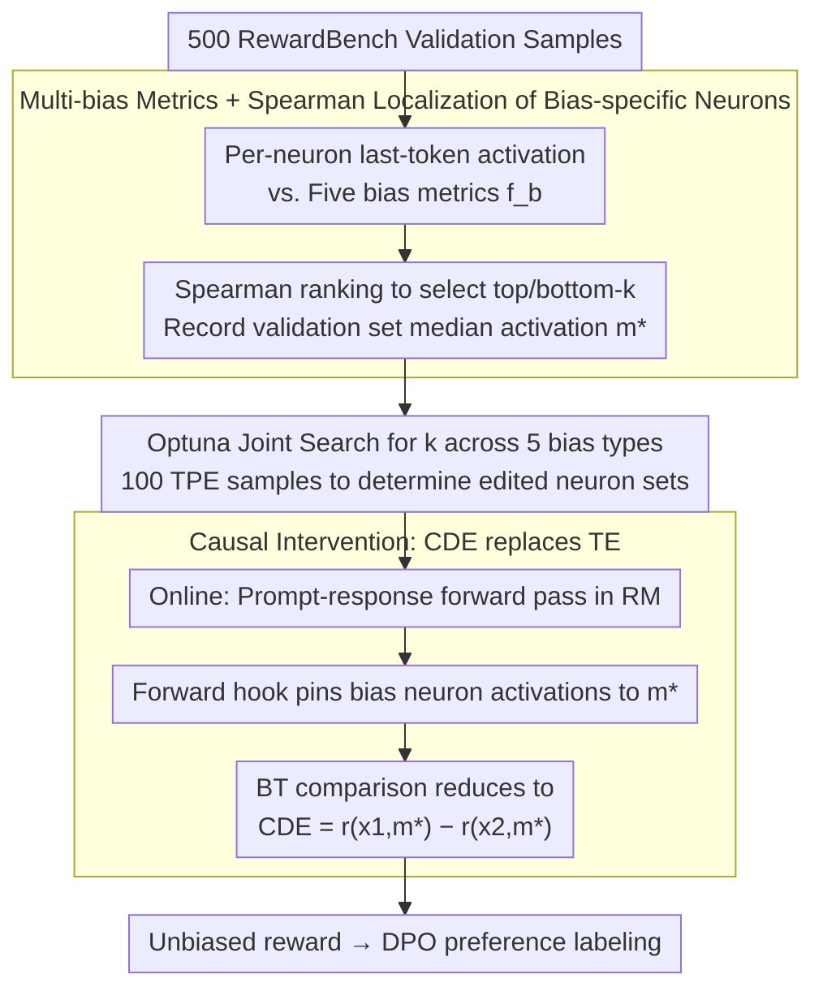

# Debiasing Reward Models via Causally Motivated Inference-Time Intervention

**Conference**: ACL 2026  
**arXiv**: [2604.27495](https://arxiv.org/abs/2604.27495)  
**Code**: Repository link not disclosed in the paper  
**Area**: LLM Alignment / RLHF / Causal Intervention / Interpretability  
**Keywords**: reward model, causal intervention, neuron editing, length bias, formatting bias

## TL;DR
The authors treat the Bradley-Terry reward model as a causal graph for estimating total effect and identify bias-specific neurons (representing <2% of total neurons) highly correlated with five types of stylistic biases (length, paragraph, word overlap, exclamation mark, and bolding). During inference, these neuron activations are replaced with the validation set median to estimate the controlled direct effect. This method eliminates bias without performance degradation on RewardBench/RM-Bench. Its downstream use in DPO allows an 8B model to match the alignment scores of 70B SOTA reward models.

## Background & Motivation
**Background**: The reward model (RM) in RLHF is core to scoring LLM preference, typically implemented via the BT model $p(y_1\succ y_2\mid q)=\sigma(r_\theta(x_1)-r_\theta(x_2))$. However, increasing research reveals that RMs have systemic preferences for response length (length bias) and formatting such as lists, bolding, paragraphs, and emojis (Singhal et al. 2024, Zhang et al. 2025).

**Limitations of Prior Work**: (i) Training-time debiasing (ensemble, weight averaging, infoBN, ODIN heads, data augmentation) requires retraining the RM. Costs are high as new data/architectures are needed for every new bias. (ii) Inference-time debiasing is limited to length penalty (subtracting reward based on character count) and LWR (locally weighted regression to estimate length-only bias terms). Both only handle length and introduce performance trade-offs between biased and unbiased data subsets (unbiased improves while biased drops significantly). (iii) How RMs "encode" these biases internally remains a black box.

**Key Challenge**: Training-time debiasing is expensive and does not generalize to new bias types; existing inference-time methods perform coarse-grained subtraction on the reward without touching internal representations, naturally resulting in a trade-off between biased and unbiased scenarios.

**Goal**: (i) Propose a **training-free** inference-time debiasing method capable of handling multiple stylistic biases; (ii) Reveal which neurons and layers in the RM encode these biases for interpretability; (iii) Apply this method to DPO preference labeling to evaluate improvements in downstream LLM alignment.

**Key Insight**: Treat the RM as a causal graph: input $x \to$ mediator $m$ (bias neuron activation) $\to$ output $r$. The BT model implicitly estimates the total effect $\hat{\mathrm{TE}}$, failing to separate "content quality" from "bias signals." Instead, estimate the controlled direct effect $\hat{\mathrm{CDE}}$ by fixing $m$ to a constant $m^*$ (validation set median). This effectively compares content quality while "assuming both responses have the same level of bias."

**Core Idea**: First, use Spearman correlation to identify the top/bottom-$k$ neurons most correlated with five categories of bias. Then, during inference, replace their activations with the validation set median. This is equivalent to CDE estimation, achieving a "retraining-free, multi-bias, trade-off-free" solution.

## Method

### Overall Architecture
CIRM (Causally motivated Inference-time intervention for Reward Models) splits RM debiasing into two steps: offline localization and online intervention, without ever modifying RM weights (Figure 2). During the offline phase, it collects "last-token activations" paired with five stylistic bias metrics $f_b(x)$ for each neuron using 500 RewardBench validation sub-samples. Spearman correlation is used to select the few neurons that truly encode bias, and their median activations on the validation set are recorded. The optimal number of edited neurons $k$ for each bias category is determined via a five-dimensional joint search using Optuna to maximize validation accuracy. During online inference, each prompt-response pair undergoes a standard forward pass, but the activations of these bias-specific neurons are forced to the median $m^*$ before outputting the reward. This transforms the BT comparison from estimating total effect to the controlled direct effect $\hat{\mathrm{CDE}} = r_\theta(x_1, m^*) - r_\theta(x_2, m^*)$, comparing content quality under equalized bias conditions.

### Key Designs

**1. Localization of bias-specific neurons via multi-bias metrics + Spearman ranking: Moving debiasing from the reward layer to the neuron layer**

Previous methods like LP/LWR only operate on the scalar reward value, which is too coarse. This paper identifies which specific internal neurons are responsible for stylistic bias. For each bias $b\in\{\text{len, para, over, excl, bold}\}$, a quantifiable surface feature is defined: length as character count, paragraph as `\n\n` occurrences, overlap as the ratio of shared words between response and query, and exclamation/bold as the count of `!` / `**`. Spearman correlation $\rho(a_n, f_b)$ is calculated for each neuron $n$ on the validation set. Both top-$k$ and bottom-$k$ neurons are selected as bias-specific neurons, as bias can be encoded via both positive and negative correlations.

Spearman correlation is preferred over Pearson because it only requires monotonic relationships and is more robust to outlier activations. This localization is highly precise; after merging the five bias categories, only 1.7% of neurons in GRM and 0.085% in FsfairX require editing to cover all stylistic biases.

**2. Joint search for $k$ across multiple biases using Optuna: Coordinating neuron counts**

Simply identifying candidates is insufficient; the number of neurons to edit ($k$) for each bias cannot be tuned in isolation. Doing so ignores the overlap and interference between different bias neuron sets (e.g., fixing length might negatively impact paragraph bias). CIRM treats the five $k$ values as a 5D hyperparameter space for joint search. Candidate values $k\in\{50,100,200,500,1000,2000,5000\}$ yield $7^5 \approx 16,807$ combinations. After 100 TPE samples, the objective function is the overall reward accuracy on the 500 validation samples.

This joint search allows TPE to perceive couplings, such as how editing too many paragraph neurons might degrade length accuracy. Ultimately, GRM was tuned to len=5000, para=5000, over=500, excl=200, bold=50, while FsfairX used significantly fewer (len=500, para=100, over=100, excl=50, bold=200), reflecting different encoding redundancies across RMs.

**3. Causal intervention using CDE instead of TE: Systematically removing stylistic contributions by pinning mediators**

Actual debiasing occurs during online inference. Viewing the RM as a causal graph (Figure 3), there are two paths from input $x$ to reward $r$: the direct content path $x \to r$ and the indirect bias path $x \to m \to r$ (where $m$ is the bias neuron activation). Vanilla BT estimates $\hat{\mathrm{TE}} = r_\theta(x_1, m(x_1)) - r_\theta(x_2, m(x_2))$, conflating content quality with stylistic strength. CIRM instead estimates $\hat{\mathrm{CDE}} = r_\theta(x_1, m^*) - r_\theta(x_2, m^*)$, using forward hooks to fix the mediator to a common value $m^*$. Conceptually, this answers "which content is better if $x_1$ and $x_2$ were identical in the bias dimension," which is the goal of an unbiased comparison.

The value $m^*$ is the median activation from the validation set. The authors tested 0, swap, and median; median performed most robustly. Using the median instead of the mean provides robustness against outliers, and using a fixed value instead of a swap prevents content differences from $x_1, x_2$ from bleeding through the mediator.

### Loss & Training
**Completely training-free.** All edits occur during inference via forward hooks that replace targeted activations with $m^*$. Downstream DPO training uses standard hyperparameters ($\beta=0.1$, lr 5e-7, batch 64, 1 epoch).

## Key Experimental Results

### Main Results
RewardBench bias subsets + Overall (Excerpt from Table 2, $B_b$ is biased subset / $\overline{B_b}$ is unbiased subset, accuracy %):

| RM / Method | $B_{\text{len}}$ | $\overline{B_{\text{len}}}$ | $\overline{B_{\text{para}}}$ | $\overline{B_{\text{over}}}$ | $\overline{B_{\text{excl}}}$ | ALL |
|-----------|-----:|-----:|-----:|-----:|-----:|----:|
| FsfairX (7B base) | 95.14 | 77.93 | 75.63 | 82.49 | 71.13 | 86.68 |
| FsfairX + LP | 93.45 | 85.12 | 86.57 | 85.99 | 77.32 | 89.67 |
| FsfairX + LWR | 93.45 | 85.95 | 87.04 | 86.38 | 78.35 | 90.08 |
| **FsfairX + CIRM** | **95.25** | 78.02 | 74.91 | 83.27 | 72.16 | 86.80 |
| INF-ORM-70B (SOTA) | 96.72 | 95.70 | 93.91 | 95.72 | 90.72 | 96.60 |

While LP/LWR show higher gains on $\overline{B_{\text{len}}}$, it comes at the cost of performance on $B_{\text{len}}$ (FsfairX 95.14 $\to$ 93.45). CIRM maintains or slightly improves both subsets. On RM-Bench (Table 3), LP/LWR often degrade performance on "Easy" samples while improving "Hard" ones (trade-off), while CIRM maintains Easy performance while matching Hard.

Downstream DPO + AlpacaEval 2.0 / MT-Bench (Excerpt from Table 4, Llama-3-8B-Instruct):

| Reward model | LCWR | WR | length | MT-Bench |
|---|---:|---:|---:|---:|
| GRM (2B) | 37.53 | 47.47 | 2193 | 7.45 |
| GRM + LP | 44.49 | 40.18 | 1571 | 7.29 |
| GRM + LWR | 39.77 | 47.59 | 2119 | 7.58 |
| **GRM + CIRM** | 41.89 | 50.13 | 2201 | 7.53 |
| FsfairX (7B) | 37.78 | 49.74 | 2368 | 7.64 |
| FsfairX + LP | 44.03 | 46.88 | 1881 | 7.60 |
| FsfairX + LWR | 43.11 | 47.07 | 1929 | 7.44 |
| **FsfairX + CIRM** | 39.49 | **51.19** | 2345 | 7.62 |
| INF (70B SOTA) | 40.63 | 49.61 | 2201 | 7.42 |

The WR 51.19 of the 7B + CIRM model exceeds the 49.61 of the 70B INF and matches it on MT-Bench.

### Ablation Study
Table 5: Sequentially removing intervention for specific biases (FsfairX + Llama3-8B):

| Configuration | LCWR | WR | MT-Bench |
|------|-----:|---:|---------:|
| CIRM (All 5) | 39.49 | **51.19** | 7.62 |
| −len | 37.10 | 49.83 | 7.81 |
| −para | 38.20 | 50.89 | 7.53 |
| −over | 40.02 | 50.24 | 7.54 |
| −excl | 37.06 | 50.21 | 7.56 |
| −bold | 38.38 | 50.06 | 7.29 |

Removing any bias intervention breaks the balance of performance, proving all 5 categories must be handled jointly.

### Key Findings
- **Bias-specific neurons are concentrated in shallow layers** (Figures 4-5): Neurons for the 5 biases are primarily in early transformer layers, mostly within query/up/gate projections. This supports the hypothesis (Meng et al. 2022) that up-projections retrieve knowledge. RMs likely place "surface style" in shallow fast-pass routes.
- **CIRM avoids the biased/unbiased trade-off**: LP drops Easy accuracy on RM-Bench (88.43 $\to$ 82.39) to gain on Hard; CIRM maintains Easy at 88.95 without significantly shifting Hard. It only removes reliance on bias without touching semantic signals.
- **2B / 7B + CIRM $\approx$ 70B INF**: Smaller RMs with CIRM perform on par with 70B SOTA RMs, suggesting "unbiasing" is potentially more valuable for downstream DPO than scaling up the RM.
- **Downstream LLM bias is suppressed** (Table 7): Using vanilla GRM labels for DPO amplifies length (1323 $\to$ 1538) and bolding (14.82 $\to$ 21.22). CIRM labels result in much milder shifts (1323 $\to$ 1511).
- **TruthfulQA Improvement** (Table 8): Truthfulness increased in three out of four groups after CIRM, suggesting style removal forces RMs to prioritize factual content.

## Highlights & Insights
- **Clean Causal Narrative**: This work is the first to formally connect causal mediation analysis to RLHF reward modeling, providing a formal language for the "style vs. content" decomposition in rewards.
- **Median Activation Replacement**: The finding that median replacement outperforms zero/swap is a valuable empirical insight for neuron intervention research (Vig 2020, Kojima 2024), as it provides a robust controlled value.
- **Joint $k$ Search**: This revealed that bias categories interact; paragraph bias accuracy on RewardBench was slightly compromised by CIRM, yet its inclusion was necessary for downstream performance. This suggests that RM benchmark subset accuracy is an imperfect proxy for alignment.

## Limitations & Future Work
- Only covers 5 predefined biases; other styles like lists, links, or emojis require manual surface feature engineering.
- Bias-specific neuron identification depends on a 500-sample validation set and hyperparameter search, risking overfitting.
- The causal graph ($x\to m\to r$) is simplified; intervention efficiency may drop if bias signals are widely distributed across multiple hidden states.
- Downstream alignment evaluation heavily relies on LLM-as-judge (GPT-4o), which may inherit similar biases.
- Method relies on "last-token activations," requiring redesigned analysis for encoder-only or non-autoregressive RMs.

## Related Work & Insights
- **vs. LP (Dong et al. 2024) / LWR (Huang et al. 2024)**: CIRM uses neuron-level causal intervention instead of reward-level subtraction, allowing it to handle multiple biases without trade-offs.
- **vs. ODIN / InfoRM / Park et al. 2024a**: These require RM retraining; CIRM is entirely inference-time.
- **vs. Vig et al. 2020 / Meng et al. 2022**: Previous causal mediation works focuses on single attributes (gender/knowledge); this work expands to multi-bias joint handling for RLHF.
- **vs. RM Ensemble (Eisenstein 2024) / WARM (Rame 2024)**: While those use averaging across multiple models, CIRM works on a single RM, making deployment simpler.

## Rating
- Novelty: ⭐⭐⭐⭐⭐ Innovative causal interpretation of BT and lightweight neuron intervention.
- Experimental Thoroughness: ⭐⭐⭐⭐ Extensive validation across RM benchmarks, DPO, and TruthfulQA; could benefit from more RM architectures.
- Writing Quality: ⭐⭐⭐⭐ Clear causal graphs and formalisms; intuitive case studies.
- Value: ⭐⭐⭐⭐⭐ Enables 7B RMs to reach 70B SOTA alignment quality; highly applicable to industrial RLHF pipelines.

<!-- RELATED:START -->

## Related Papers

- [\[NeurIPS 2025\] Inference-time Alignment in Continuous Space](../../NeurIPS2025/llm_alignment/inference-time_alignment_in_continuous_space.md)
- [\[AAAI 2026\] W2S-AlignTree: Weak-to-Strong Inference-Time Alignment for Large Language Models via Monte Carlo Tree Search](../../AAAI2026/llm_alignment/w2s-aligntree_weak-to-strong_inference-time_alignment_for_large_language_models_.md)
- [\[ACL 2026\] Student Guides Teacher: Weak-to-Strong Inference via Spectral Orthogonal Exploration](student_guides_teacher_weak-to-strong_inference_via_spectral_orthogonal_explorat.md)
- [\[ACL 2026\] ConsistRM: Improving Generative Reward Models via Consistency-Aware Self-Training](consistrm_improving_generative_reward_models_via_consistency-aware_self-training.md)
- [\[ACL 2026\] On the Rejection Criterion for Proxy-Based Test-Time Alignment](on_the_rejection_criterion_for_proxy-based_test-time_alignment.md)

<!-- RELATED:END -->
