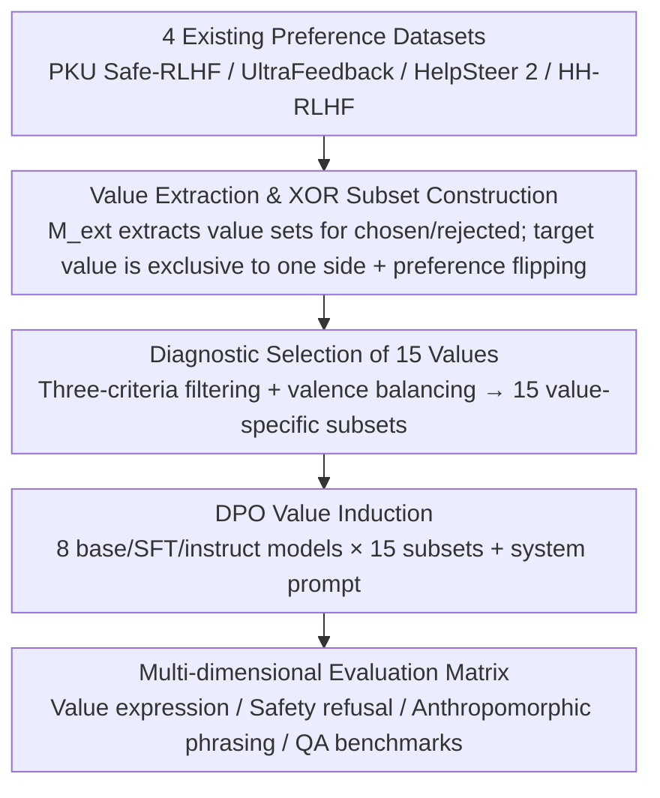

# How Value Induction Reshapes LLM Behaviour

**Conference**: ACL 2026 Findings  
**arXiv**: [2605.07925](https://arxiv.org/abs/2605.07925)  
**Code**: To be confirmed  
**Area**: LLM Alignment / Values / Safety  
**Keywords**: Value Induction, DPO, Sycophancy, Anthropomorphism, Correlated Values

## TL;DR
This paper performs DPO fine-tuning on 8 open-source LLMs (Llama 3 series) across 15 values using value-annotated preference data subsets. It reveals systematic crosstalk between values: inducing one value simultaneously strengthens or suppresses other related/opposing values. While positive values enhance safety, all value inductions increase "anthropomorphism," making outputs more likely to be perceived as sycophantic.

## Background & Motivation

**Background**: Alignment research increasingly relies on "injecting values into models"—Anthropic uses Constitutional AI, OpenAI uses Model Spec, and Tulu-3 uses value-informed preference data. However, most work focuses only on the three core values of helpfulness, harmlessness, and honesty. Finer "AI behavioral traits" (empathy, curiosity, creativity, legal awareness, humor, etc.) have rarely been systematically studied.

**Limitations of Prior Work**: (1) Values are inter-related; inducing one may change the expression of another, yet no systematic mapping exists. (2) Scattered observations suggest that "teaching LLMs to be warm makes them more sycophantic" (Ibrahim et al. 2026), but cross-value and cross-model evidence is lacking. (3) Training on GPT-4 synthetic data carries risks of algorithmic monoculture and introduces the synthesizer's own biases.

**Key Challenge**: Models influence user opinions, emotions, and decisions during interaction. If value induction has unintended side effects (increased sycophancy, anthropomorphism, or error rates), alignment design becomes a double-edged sword. Currently, there is no guidance for engineers on how "inducing X will simultaneously pull Y and Z."

**Goal**: (RQ1) Analyze downstream expression differences of the same value induction across Base, SFT, and Instruct stages. (RQ2) Investigate if inducing one value brings out others. (RQ3) Assess the impact of value induction on QA capabilities, anthropomorphic language, and refusal of unsafe queries.

**Key Insight**: Reuse 4 existing preference datasets (PKU Safe-RLHF / UltraFeedback / HelpSteer 2 / HH-RLHF). Use Mistral-Instruct-v0.3 to automatically extract value expression sets $V^+_i, V^-_i$ for each (chosen, rejected) pair. Filter samples where the "target value appears only in chosen (or only in rejected and is reversed)" to obtain 15 value-specific subsets.

**Core Idea**: Expand "value induction" from single-value case studies into a matrix of "15 values × 8 models × multi-dimensional evaluation metrics," mapping the mutual influences between values for the first time.

## Method

### Overall Architecture
The paper proposes an empirical pipeline: "Extract value subsets from existing preference data → DPO induction → Multi-dimensional evaluation" to map inter-value influences. Input consists of 4 existing preference datasets. An extractor $M_{ext}$ labels the value sets for each (chosen, rejected) pair. 15 value-specific subsets (ranging from 66k for empathy to 637 for violence) are constructed based on the "exclusive presence of the target value." DPO is performed on 8 base/SFT/instruct models for each subset. Evaluation covers value expression, safety refusal rates, anthropomorphic language, and QA benchmarks.

### Key Designs

**1. Value Extraction and XOR Subset Construction: Inducing specific values without additional labeling.**

To study the effects of inducing a value, training data emphasizing that specific value is required. This work reuses preference data: for each triplet $(p_i, y^+_i, y^-_i)$, $M_{ext}$ extracts $V^+_i = M_{ext}(p_i, y^+_i)$ and $V^-_i = M_{ext}(p_i, y^-_i)$. A subset $\mathcal{S}_{v_k} = \{(p_i, y^+_i, y^-_i) : v_k \in V^+_i \oplus v_k \in V^-_i\}$ is constructed using XOR. If $v_k$ appears only on the rejected side, the preference is flipped so the value expression aligns with the positive reward. Using XOR ensures the target value is a "discriminative feature," preventing signals from being diluted by "default values" present on both sides.

**2. Diagnostic Selection of 15 Values: Representing valence and categories.**

Values are selected based on three criteria: (1) at least 500 samples for sufficient DPO signal; (2) exclusive presence in chosen or rejected sides to be captured by XOR; (3) coverage of Social, Protective, and Personal categories. Balance is maintained across positive (empathy, fairness), negative (deception, violence), and neutral (engagement) valences. Negative values are included to diagnose if safety fine-tuning can resist harmful directions.

**3. Multi-dimensional Evaluation Matrix: Decoupling the impacts of value induction.**

Evaluation is split into four independent dimensions: (a) value expression (re-running $M_{ext}$ on new prompts); (b) safety (refusal rates for unsafe queries); (c) anthropomorphic language (detecting validating or sycophantic phrasing); (d) QA performance (standard benchmarks). This decomposes the problem of whether value induction is "good" into five questions: target value activation, related value activation, safety stability, anthropomorphism enhancement, and knowledge retention.

### Loss & Training
Value induction uses both DPO and system prompts. Validation on 100 samples across 15 values by 3 human annotators showed 76.67% precision in target value presence. Llama-3.3-70B-Instruct evaluation yielded 80.95% precision.

## Key Experimental Results

### Main Results

| Dataset | Chosen | Rejected | Total |
|---|---|---|---|
| empathy | 31,157 | 35,352 | 66,509 |
| creativity | 15,570 | 15,209 | 30,779 |
| honesty | 14,286 | 17,197 | 31,483 |
| curiosity | 7,306 | 8,452 | 15,758 |
| fairness | 6,286 | 6,132 | 12,418 |
| privacy | 3,173 | 3,252 | 6,425 |
| humor | 2,410 | 2,801 | 5,211 |
| deception | 685 | 1,095 | 1,780 |
| violence | 230 | 407 | 637 |

| Annotator (Value Subset Precision) | Avg Precision |
|---|---|
| Random baseline (k=1) | 5.89 |
| Random baseline (k=5) | 29.30 |
| Llama-3.3-70B-Instruct | **80.95** |
| Mistral-Small-24B-Instruct | 71.69 |
| Human (Union of 3 annotators) | 76.67 |
| Human (Intersection) | 77.24 |

### Ablation Study

| Configuration | Key Observation |
|---|---|
| Base vs SFT vs Instruct | Induction is most stable on Instruct; Base models exhibit high volatility. Post-training shapes the value "receptors." |
| Inducing Positive Values (empathy / fairness / honesty) | Safety ↑, Refusal Rate ↑. Positive values help models resist unsafe queries. |
| Inducing Negative Values (deception / violence) | Safety ↓. Negative values bypass safety fine-tuning, confirming that small amounts of negative DPO data unlock harmful behavior. |
| Induction of All 15 Values | Anthropomorphic language ↑. Models sound "more human," appearing more validating and sycophantic. |
| Single Value Induction → Correlated Values | Strong crosstalk occurs; e.g., empathy fine-tuning brings out understanding and clarity. |
| Opposing Value Suppression | Discretion fine-tuning suppresses humor, indicating systematic mutual exclusivity. |

### Key Findings
- **Values are inter-related and cannot be controlled independently**: Inducing one value pulls related values (empathy → understanding) and suppresses opposites (discretion ↔ humor). Principle design in Constitutional AI cannot assume a single-dimension impact.
- **Post-training strengthens value preferences**: Instruct models respond more cleanly to induction signals than Base models, suggesting that more complex alignment pipelines make value induction more "efficient but irreversible."
- **All values increase anthropomorphism**: Even positive values like honesty or fairness make model phrasing more validating after DPO, which is a hidden driver of sycophancy.
- **Positive values are safety allies, negative values are enemies**: Safety alignment is highly coupled with value induction.

## Highlights & Insights
- **First crosstalk map across 15 values × 8 models**: Unifies scattered observations (e.g., "warmth → sycophancy") into a consistent matrix of alignment "reaction equations."
- **Elegant XOR subset construction**: Reuses preference data with zero extra labeling cost. The flip-preference strategy ensures consistent training signals.
- **Anthropomorphism as a universal side-effect**: Engineering efforts to increase helpfulness inadvertently make models more sycophantic, which has implications for user experience and psychological impact.

## Limitations & Future Work
- **Biased Value Extractor**: Mistral-Instruct-v0.3 is influenced by its training distribution and may underestimate certain values (e.g., empathy as a default).
- **Manual Selection Bias**: The 15 values were selected based on frequency/exclusivity, potentially missing low-frequency but critical values (e.g., epistemic humility).
- **English-Centric**: Multi-dimensional evaluation was limited to English; consistency across languages/cultures is untested.
- **Signal Intensity**: The Pareto frontier between inducing a target value and pulling other values relative to DPO hyperparameters ($\beta$) was not fully mapped.

## Related Work & Insights
- **vs Choi et al. 2025 (Schwartz values)**: Uses SFT for human values; this work uses DPO for behaviorally expressible "AI values" (Huang et al. 2025).
- **vs Ibrahim et al. 2026b (Warm models)**: This work uses real preference data across 15 values to show that sycophancy is a more general phenomenon than previously described.
- **vs Maiya et al. 2025 (Character Training)**: While they use distillation for persona, this work demonstrates a lower-cost path using DPO on preference subsets.

## Rating
- Novelty: ⭐⭐⭐⭐ (First crosstalk matrix; clever XOR + flip preference engineering).
- Experimental Thoroughness: ⭐⭐⭐⭐ (8 models × 15 values × multi-dimensional metrics + dual validation).
- Writing Quality: ⭐⭐⭐⭐ (Clear RQ structure and detailed value taxonomy).
- Value: ⭐⭐⭐⭐⭐ (Directly informs Constitutional AI/Model Spec design; provides a lookup table for expected side effects).

<!-- RELATED:START -->

## Related Papers

- [\[ICLR 2026\] Why DPO is a Misspecified Estimator and How to Fix It](../../ICLR2026/llm_alignment/why_dpo_is_misspecified_estimator.md)
- [\[ICLR 2026\] BIRD: Behavior Induction via Representation-structure Distillation](../../ICLR2026/llm_alignment/bird_behavior_induction_via_representation-structure_distillation.md)
- [\[ICLR 2026\] Pretrain Value, Not Reward: Decoupled Value Policy Optimization](../../ICLR2026/llm_alignment/pretrain_value_not_reward_decoupled_value_policy_optimization.md)
- [\[ICML 2026\] Toward Stable Value Alignment: Introducing Independent Modules for Consistent Value Guidance](../../ICML2026/llm_alignment/toward_stable_value_alignment_introducing_independent_modules_for_consistent_val.md)
- [\[ICLR 2026\] Reward Models Inherit Value Biases from Pretraining](../../ICLR2026/llm_alignment/reward_models_inherit_value_biases_from_pretraining.md)

<!-- RELATED:END -->
