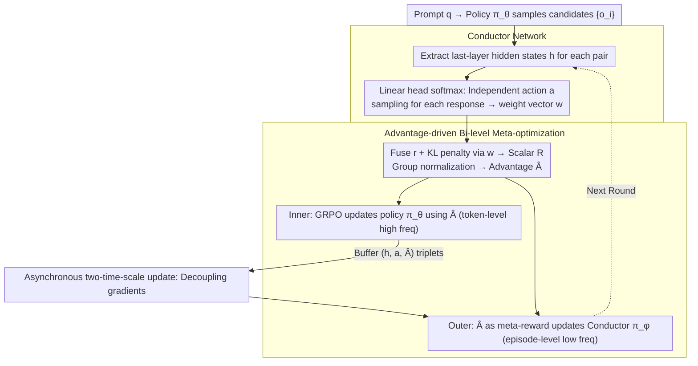

# MAESTRO: Meta-learning Adaptive Estimation of Scalarization Trade-offs for Reward Optimization

**Conference**: ACL 2026  
**arXiv**: [2601.07208](https://arxiv.org/abs/2601.07208)  
**Code**: [https://github.com/zy125413/MAESTRO](https://github.com/zy125413/MAESTRO)  
**Area**: Model Compression/LLM Alignment  
**Keywords**: Open-domain alignment, Multi-objective optimization, Reward orchestration, Meta-learning, GRPO

## TL;DR

This work proposes MAESTRO, which reframes reward scalarization in GRPO as a contextual bandit problem. By utilizing a lightweight Conductor network to adaptively select reward weights for each prompt-response pair based on last-layer hidden states, it consistently outperforms static and single-reward baselines across seven open-domain benchmarks.

## Background & Motivation

**Background**: GRPO has become a mainstream paradigm for LLM alignment, excelling in tasks with verifiable ground truths such as mathematics and code. However, extending GRPO to open-domain generation (e.g., creative writing, social intelligence) remains a critical challenge due to the lack of objective verification rules.

**Limitations of Prior Work**: Current open-domain alignment primarily relies on two approaches: (1) LLM-as-a-Judge, which is computationally expensive and introduces style biases (e.g., favoring longer responses); (2) heuristic proxy signals based on perplexity or entropy, which correlate poorly with human utility and use static, context-independent scalarization weights. Neither solution captures the fine-grained multi-objective trade-offs in open-domain generation.

**Key Challenge**: Open-domain alignment is inherently a multi-objective optimization problem—conflicts exist between creativity and factuality, or conciseness and richness. Existing methods collapse the high-dimensional Pareto frontier into a single point using fixed weights. Applying the same reward preferences to mathematical reasoning and creative writing is fundamentally suboptimal.

**Goal**: To design a framework capable of dynamically adjusting reward weights based on the semantic content of prompt-response pairs, enabling GRPO to adaptively switch reward preferences across different tasks and contexts.

**Key Insight**: It is observed that the last-layer hidden states of a Transformer serve as a semantic bottleneck, encoding high-level information about task intent and generative features. These representations can be used as context to train a lightweight meta-policy for selecting reward scalarization strategies.

**Core Idea**: Reward orchestration is modeled as a contextual bandit problem. Using the group-relative advantage of GRPO as a meta-reward signal, a Conductor network is co-evolved with the policy model within a bi-level optimization framework.

## Method

### Overall Architecture

MAESTRO integrates a lightweight Conductor layer atop standard GRPO, transforming reward weight selection from fixed constants into semantic-dependent decisions. Given a prompt $q$, the policy model $\pi_\theta$ first samples a set of candidate outputs $\{o_i\}$. The Conductor $\pi_\phi$ reads the last-layer hidden states of each prompt-response pair and samples a reward-focusing action to induce a weight vector $\mathbf{w}^{(a)}$. The raw reward vector $\mathbf{r}$ is then fused with the KL penalty into a scalar reward $R$, which is group-normalized to obtain the advantage $\hat{A}$. The training follows a bi-level optimization: the inner loop updates the policy $\pi_\theta$ via GRPO using $\hat{A}$, while the outer loop uses the same $\hat{A}$ as a meta-reward to update the Conductor $\pi_\phi$.

### Key Designs

**1. Conductor Network: Semantic-conditioned Dynamic Reward Weighting**

Open-domain alignment is a multi-objective problem, yet fixed weights collapse the Pareto frontier, imposing identical preferences on disparate tasks. MAESTRO leverages the fact that the last-layer hidden state $h \in \mathbb{R}^{d_{\text{model}}}$ encodes task intent. The Conductor is implemented as a linear projection head $\pi_\phi(\cdot|h) = \text{softmax}((W_\phi h + b_\phi)/\tau)$. During training, discrete actions $a$ are sampled to select reward modes; during inference, the continuous distribution serves as deterministic weights. The use of a simple linear head ensures minimal overhead while effectively distinguishing task semantics.

**2. Advantage-driven Bi-level Meta-optimization: Heterogeneous Sampling for Meta-gradients**

To provide stable signals for the Conductor, MAESTRO maximizes the meta-objective $J(\phi) = \mathbb{E}[\hat{A}(x,y;w(h,a))]$. Under group-relative normalization, using uniform weights for all responses to a single prompt results in a zero-mean advantage, causing meta-gradients to vanish. MAESTRO solves this via heterogeneous sampling—independently sampling reward actions $a_{i,j}$ for each response within a group. This breaks the symmetry of the group baseline, creating "meta-competition" that exposes informative variance for weight optimization.

**3. Asynchronous Two-time-scale Update: Decoupling Meta and Policy Optimization**

Tightly coupling meta and policy gradients can lead to instability. MAESTRO buffers $(h_{i,j}, a_{i,j}, \hat{A}_{i,j})$ triplets during GRPO training and periodically updates $\phi$ using the Policy Gradient Theorem. This creates two time scales: high-frequency token-level updates for the policy (inner loop) and low-frequency episode-level updates for the Conductor (outer loop). This design prevents gradient interference and ensures stable learning of meaningful trade-offs.

### Loss & Training

The reward space consists of $K=5$ components: perplexity reward $r_{\text{ppl}}$ (proxy for reasoning consistency), format validity $r_{\text{fmt}}$, entropy reward $r_{\text{ent}}$ (exploration vs. redundancy), length penalty $r_{\text{len}}$, and semantic preference reward $r_{\text{pref}}$ (from Skywork-Reward). The inner loop uses standard GRPO loss, while the outer loop employs REINFORCE gradients with entropy regularization.

## Key Experimental Results

### Main Results (Qwen3-8B)

| Dataset | Base | SFT | NOVER | EM-GRPO | MAESTRO | Gain vs. Best Baseline |
|---------|------|-----|-------|---------|---------|------------------------|
| Natural Reasoning | 39.6 | 26.0 | 46.9 | 52.0 | **53.2** | +1.2 |
| SS-GEN | 33.1 | 68.7 | 77.8 | 88.8 | **92.5** | +1.9 |
| WebInstruct | 7.8 | 34.6 | 42.7 | 43.4 | **43.5** | +0.1 |
| ToMBench | 5.7 | 46.9 | 56.2 | 63.8 | **71.9** | +8.1 |
| GeneralThoughts | 34.0 | 34.7 | 64.6 | 68.0 | **68.1** | +0.1 |
| OPUS-Books | 5.1 | 5.5 | 10.1 | 11.7 | **12.6** | +0.9 |
| EmoBench | 36.7 | 46.1 | 42.2 | 41.4 | **47.7** | +1.6 |

### Ablation Study

| Configuration | Description | Effect |
|---------------|-------------|--------|
| Equal-Weights (Eq) | Fixed uniform weights | Moderate gain but unstable (e.g., 38.27% on ToMBench) |
| Random-Weights (Rand) | Randomized weights | Occasionally detrimental (35.7% on GeneralThoughts) |
| MAESTRO (Ours) | Conductor dynamic weights | Optimal across almost all tasks |
| Train Time SS-GEN | w/ Conductor vs w/o | **20.1% Speedup** (reduced redundant generation) |
| Train Time WebInstruct | w/ Conductor vs w/o | Marginal overhead (+4.0%) |

### Key Findings

- **Significant Gain on ToMBench (+8.1%)**: Social intelligence tasks require flexible expression and emotional understanding, where the advantages of dynamic reward orchestration are most pronounced.
- **EM-GRPO performance**: While entropy minimization aids deterministic reasoning, it degrades significantly on open-domain tasks (SS-GEN, ToMBench), illustrating that a single inductive bias cannot generalize across domains.
- **Efficiency via Redundancy Reduction**: On SS-GEN, the Conductor learns to suppress verbose outputs early, shortening average sequence lengths and increasing training throughput by 20.1%.
- **Semantic Weight Patterns**: The Conductor learns distinct patterns—creative writing favors entropy rewards, while structured reasoning favors perplexity rewards. These patterns converge rapidly.

## Highlights & Insights

- **Elegant Fusion of Contextual Bandits and GRPO**: Modeling reward weighting as a decision problem conditioned on semantics is both intuitive and efficient. This paradigm is extensible to any RL alignment scenario requiring multi-reward trade-offs.
- **Solving Meta-signal Vanishing via Heterogeneous Sampling**: Exploiting the zero-mean property of group-relative advantage to introduce variance through diverse intra-group reward configurations is a refined solution to meta-credit assignment.
- **Efficiency Gains**: Dynamic orchestration does not merely maintain efficiency; it can accelerate training in long-form generation by penalizing redundancy, countering the intuition that increased complexity necessitates slower training.

## Limitations & Future Work

- Evaluations were limited to 7-8B scale models; scalability to larger models remains to be explored.
- The Conductor uses a simple linear projection; more complex architectures might capture finer trade-offs.
- Reward components are fixed to 5 predefined signals; automatic discovery and combination of rewards remain open problems.
- Reliance on external LLM Judges (Qwen3-235B, Gemini-2.5-Flash) may introduce evaluation biases.

## Related Work & Insights

- **vs. NOVER (Liu et al., 2025b)**: NOVER uses conditional perplexity as the sole reward in GRPO, excelling in reasoning but failing in open-domain tasks. MAESTRO generalizes this via multi-reward orchestration.
- **vs. EM-GRPO**: Entropy minimization matches MAESTRO on reasoning but fails on creative/social tasks (SS-GEN 88.8% vs 92.5%), proving the limitations of static inductive biases.
- **vs. DYNAOPT (Pérez-Rosas et al., 2024)**: While DYNAOPT adjusts weights at the training stage level, MAESTRO operates at the instance level, providing finer granularity.
- **vs. Pareto-based MORL**: Multi-policy Pareto methods are computationally expensive. MAESTRO achieves dynamic Pareto frontier exploration with a single policy and a lightweight Conductor.

## Rating

- Novelty: ⭐⭐⭐⭐⭐ The combination of contextual bandits and bi-level optimization for GRPO is highly original.
- Experimental Thoroughness: ⭐⭐⭐⭐ Extensive benchmarks and baselines, though lacking validation on very large models.
- Writing Quality: ⭐⭐⭐⭐⭐ Clear motivation, rigorous methodology, and insightful analysis.
- Value: ⭐⭐⭐⭐⭐ Provides a practical and efficient new paradigm for open-domain LLM alignment.

<!-- RELATED:START -->

## Related Papers

- [\[ACL 2025\] Balancing the Budget: Understanding Trade-offs Between Supervised and Preference-Based Finetuning](../../ACL2025/llm_alignment/balancing_the_budget_understanding_trade-offs_between_supervised_and_preference-.md)
- [\[ACL 2026\] ARES: Adaptive Red-Teaming and End-to-End Repair of Policy-Reward System](ares_adaptive_red-teaming_and_end-to-end_repair_of_policy-reward_system.md)
- [\[ACL 2026\] AgentV-RL: Scaling Reward Modeling with Agentic Verifier](agentv-rl_scaling_reward_modeling_with_agentic_verifier.md)
- [\[ACL 2026\] Team-Based Self-Play With Dual Adaptive Weighting for Fine-Tuning LLMs](team-based_self-play_with_dual_adaptive_weighting_for_fine-tuning_llms.md)
- [\[ACL 2026\] P-Check: Advancing Personalized Reward Model via Learning to Generate Dynamic Checklist](p-check_advancing_personalized_reward_model_via_learning_to_generate_dynamic_che.md)

<!-- RELATED:END -->
