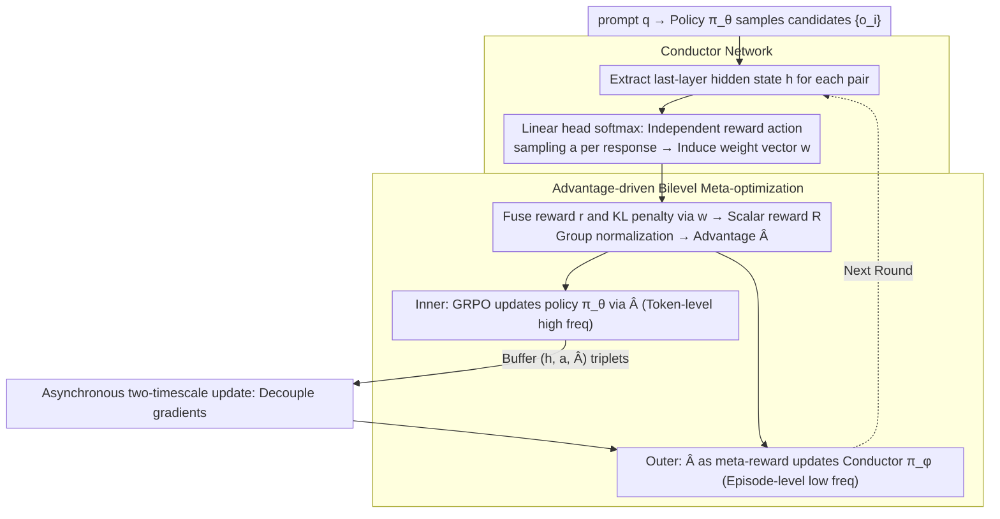

# MAESTRO: Meta-learning Adaptive Estimation of Scalarization Trade-offs for Reward Optimization

**Conference**: ACL 2026  
**arXiv**: [2601.07208](https://arxiv.org/abs/2601.07208)  
**Code**: [https://github.com/zy125413/MAESTRO](https://github.com/zy125413/MAESTRO)  
**Area**: Model Compression/LLM Alignment  
**Keywords**: Open-domain alignment, Multi-objective optimization, Reward orchestration, Meta-learning, GRPO

## TL;DR

Ours proposes MAESTRO, which reformulates reward scalarization in GRPO as a contextual bandit problem. By utilizing a lightweight Conductor network to leverage last-layer hidden states of the model, it adaptively selects reward weights for each prompt-response pair, consistently outperforming static and single reward baselines across seven open-domain benchmarks.

## Background & Motivation

**Background**: GRPO has become a mainstream paradigm for LLM alignment, performing excellently on tasks with verifiable ground truths such as mathematics and code. However, extending GRPO to open-domain generation (e.g., creative writing, social intelligence) remains a critical challenge due to the lack of objective verification rules.

**Limitations of Prior Work**: Current open-domain alignment primarily follows two routes: (1) LLM-as-a-Judge, which is computationally expensive and introduces stylistic biases (e.g., favoring longer responses); (2) methods based on heuristic proxy signals like perplexity and entropy, which correlate poorly with human utility and use static, context-independent scalarization weights. Neither approach captures the fine-grained multi-objective trade-offs inherent in open-domain generation.

**Key Challenge**: Open-domain alignment is essentially a multi-objective optimization problem—contradictions exist between creativity and factuality, or conciseness and richness. However, existing methods collapse the high-dimensional Pareto front into a single point using fixed weights; it is suboptimal to apply identical reward preferences to both mathematical reasoning and creative writing.

**Goal**: Design a framework capable of dynamically adjusting reward weights based on the semantic content of prompt-response pairs, enabling GRPO to adaptively switch reward preferences across different tasks and contexts.

**Key Insight**: It is observed that the last-layer hidden states of a Transformer serve as a semantic bottleneck, encoding high-level information regarding task intent and generation features. Using these latent representations as context, a lightweight meta-policy can be trained to select reward scalarization strategies.

**Core Idea**: Model reward orchestration as a contextual bandit problem, using the group-relative advantage of GRPO as the meta-reward signal. Within a bilevel optimization framework, let the Conductor network co-evolve with the policy model.

## Method

### Overall Architecture

MAESTRO attaches a lightweight Conductor layer atop standard GRPO, transforming reward scalarization weights from fixed constants into semantic-dependent decisions. Given a prompt $q$, the policy model $\pi_\theta$ first samples a set of candidate outputs $\{o_i\}$. The Conductor $\pi_\phi$ reads the last-layer hidden state of each prompt-response pair and samples a reward-focusing action, inducing a weight vector $\mathbf{w}^{(a)}$. The raw reward vector $\mathbf{r}$ is fused with the KL penalty into a scalar reward $R$, which is then group-normalized to obtain the advantage $\hat{A}$. The training follows a bilevel optimization: the inner loop updates the policy $\pi_\theta$ via $\hat{A}$ at a high frequency, while the outer loop uses $\hat{A}$ as a meta-reward to update the Conductor $\pi_\phi$, allowing both to co-evolve.

### Key Designs

**1. Conductor Network: Dynamic Reward Weight Selection via Last-layer Hidden States**

Open-domain alignment is a multi-objective problem, yet fixed weights collapse the high-dimensional Pareto front unnecessarily. MAESTRO notes that the last-layer hidden state $h \in \mathbb{R}^{d_{\text{model}}}$ acts as a semantic bottleneck encoding task intent and generation features. The Conductor is implemented as a linear projection head $\pi_\phi(\cdot|h) = \text{softmax}((W_\phi h + b_\phi)/\tau)$. During training, discrete actions $a$ are sampled from this categorical distribution to select reward-focusing modes; during inference, the distribution is used as deterministic weights. A linear head is sufficient because last-layer representations are already linearly separable for task semantics, ensuring minimal overhead.

**2. Advantage-driven Bilevel Meta-optimization: Solving Signal Vanishing via Intra-group Heterogeneous Sampling**

The Conductor requires a stable training signal. MAESTRO's meta-objective is $J(\phi) = \mathbb{E}[\hat{A}(x,y;w(h,a))]$. A critical challenge is that under group-relative normalization, if all responses for a single prompt use the same weights, the mean advantage is always zero, causing meta-gradients to vanish. The solution is intra-group heterogeneous sampling—independently sampling reward actions $a_{i,j}$ for each response within the group. This breaks the symmetry of the group baseline and introduces "meta-competition," exposing informative variance for the meta-gradient.

**3. Asynchronous Two-timescale Update: Decoupling Conductor and Policy Optimization**

Tightly coupling meta-gradients with policy gradients can lead to training instability. MAESTRO buffers $(h_{i,j}, a_{i,j}, \hat{A}_{i,j})$ triplets and periodically updates $\phi$ using the Policy Gradient Theorem. Consequently, the policy model updates at a high token-level frequency (inner loop) while the Conductor updates at a lower episode-level frequency (outer loop). This asynchronous design prevents gradient interference and ensures stable learning of meaningful trade-offs.

### Loss & Training

The reward space consists of $K=5$ components: perplexity reward $r_{\text{ppl}}$ (proxy for reasoning consistency), format validity reward $r_{\text{fmt}}$, entropy reward $r_{\text{ent}}$ (balancing exploration and redundancy), length penalty $r_{\text{len}}$, and semantic preference reward $r_{\text{pref}}$ (from Skywork-Reward). The inner loop uses standard GRPO loss for the policy model, while the outer loop utilizes REINFORCE gradients (with entropy regularization) to update the Conductor.

## Key Experimental Results

### Main Results (Qwen3-8B)

| Dataset | Base | SFT | NOVER | EM-GRPO | MAESTRO | Gain vs Prev. SOTA |
|--------|------|-----|-------|---------|---------|------------|
| Natural Reasoning | 39.6 | 26.0 | 46.9 | 52.0 | **53.2** | +1.2 |
| SS-GEN | 33.1 | 68.7 | 77.8 | 88.8 | **92.5** | +1.9 |
| WebInstruct | 7.8 | 34.6 | 42.7 | 43.4 | **43.5** | +0.1 |
| ToMBench | 5.7 | 46.9 | 56.2 | 63.8 | **71.9** | +8.1 |
| GeneralThoughts | 34.0 | 34.7 | 64.6 | 68.0 | **68.1** | +0.1 |
| OPUS-Books | 5.1 | 5.5 | 10.1 | 11.7 | **12.6** | +0.9 |
| EmoBench | 36.7 | 46.1 | 42.2 | 41.4 | **47.7** | +1.6 |

### Ablation Study

| Configuration | Description | Result |
|------|------|------|
| Equal-Weights (Eq) | Fixed uniform weights | Moderate gain but unstable; e.g., only 38.27% on ToMBench |
| Random-Weights (Rand) | Random weights | Occasionally detrimental (35.7% on GeneralThoughts) |
| MAESTRO (Ours) | Conductor dynamic weights | Optimal across almost all tasks |
| Training Time SS-GEN | w/ Conductor vs w/o | **Accelerated by 20.1%** (reduced redundant generation) |
| Training Time WebInstruct | w/ Conductor vs w/o | Overhead of only +4.0% |

### Key Findings

- **Largest gain on ToMBench (+8.1%)**: Social intelligence tasks require flexible expression and emotional understanding, where the advantages of dynamic reward orchestration are most pronounced.
- **EM-GRPO vs. MAESTRO in Reasoning**: Entropy minimization favors deterministic reasoning but degrades severely on open-domain tasks (SS-GEN, ToMBench), illustrating that a single inductive bias cannot generalize across domains.
- **Dynamic weights reduce redundancy**: On SS-GEN, the Conductor learns to suppress lengthy outputs early, shortening average sequence length and increasing training throughput by 20.1%.
- **Semantic patterns in weights**: Creative writing tasks focus on entropy rewards, while structured reasoning tasks emphasize perplexity rewards; weight patterns converge and stabilize early in training.

## Highlights & Insights

- **Integration of Contextual Bandits and GRPO**: Modeling reward weight selection as a decision-making problem dependent on prompt-response semantics is elegant and efficient, requiring only a linear head. This paradigm is generalizable to any RL alignment scenario involving multi-reward trade-offs.
- **Solving Meta-signal Vanishing via Heterogeneous Sampling**: Leveraging the zero-mean property of group-relative advantage by assigning different reward configurations to responses within the same group is a sophisticated solution to meta-credit assignment in bilevel optimization.
- **Efficiency Gains**: Dynamic reward orchestration does not merely avoid increasing training overhead; in long-text scenarios, it significantly accelerates training by reducing redundant outputs, defying the intuition that more complex methods are slower.

## Limitations & Future Work

- Validated only on 7-8B scale models; performance on larger models remains to be explored.
- The Conductor uses a simple linear projection head; more complex architectures might capture finer trade-offs.
- Reward components are limited to 5 predefined signals; automatic discovery and combination of rewards remain open problems.
- Evaluation relies on external LLM Judges (e.g., Qwen3-235B), which may introduce their own biases.

## Related Work & Insights

- **vs NOVER (Liu et al., 2025b)**: NOVER uses conditional perplexity as the sole reward signal, excelling in reasoning but failing in open-domain tasks. MAESTRO consistently outperforms it through multi-reward orchestration.
- **vs EM-GRPO**: Entropy minimization methods are competitive in reasoning but degrade in creative and social tasks (e.g., SS-GEN 88.8% vs 92.5%), proving the limitations of a single inductive bias.
- **vs DYNAOPT (Pérez-Rosas et al., 2024)**: While DYNAOPT adjusts weights at global training stages, MAESTRO performs orchestration at the instance level with semantic conditioning, offering finer granularity.
- **vs Pareto-based MORL**: Multi-policy Pareto methods require training and maintaining multiple large models with massive overhead. MAESTRO explores the dynamic Pareto front using a single policy and a lightweight Conductor.

## Rating

- Novelty: ⭐⭐⭐⭐⭐ The combination of Contextual Bandits and GRPO bilevel optimization is novel, and the solution to the meta-credit assignment problem is elegant.
- Experimental Thoroughness: ⭐⭐⭐⭐ Seven benchmarks, two backbones, and multiple baselines, though validation on larger models is missing.
- Writing Quality: ⭐⭐⭐⭐⭐ Clear motivation, rigorous methodology, and deep analysis (especially the visualization of reward weight evolution).
- Value: ⭐⭐⭐⭐⭐ Provides a practical and efficient new paradigm for open-domain LLM alignment; the Conductor design is plug-and-play.

<!-- RELATED:START -->

## Related Papers

- [\[ICLR 2026\] Cognitive models can reveal interpretable value trade-offs in language models](../../ICLR2026/llm_alignment/cognitive_models_can_reveal_interpretable_value_trade-offs_in_language_models.md)
- [\[ACL 2026\] AdaJudge: Adaptive Multi-Perspective Judging for Reward Modeling](adajudge_adaptive_multi-perspective_judging_for_reward_modeling.md)
- [\[ACL 2025\] Balancing the Budget: Understanding Trade-offs Between Supervised and Preference-Based Finetuning](../../ACL2025/llm_alignment/balancing_the_budget_understanding_trade-offs_between_supervised_and_preference-.md)
- [\[ICLR 2026\] Aligner, Diagnose Thyself: A Meta-Learning Paradigm for Fusing Intrinsic Feedback in Preference Alignment](../../ICLR2026/llm_alignment/aligner_diagnose_thyself_a_meta-learning_paradigm_for_fusing_intrinsic_feedback_.md)
- [\[ACL 2026\] ARES: Adaptive Red-Teaming and End-to-End Repair of Policy-Reward System](ares_adaptive_red-teaming_and_end-to-end_repair_of_policy-reward_system.md)

<!-- RELATED:END -->
