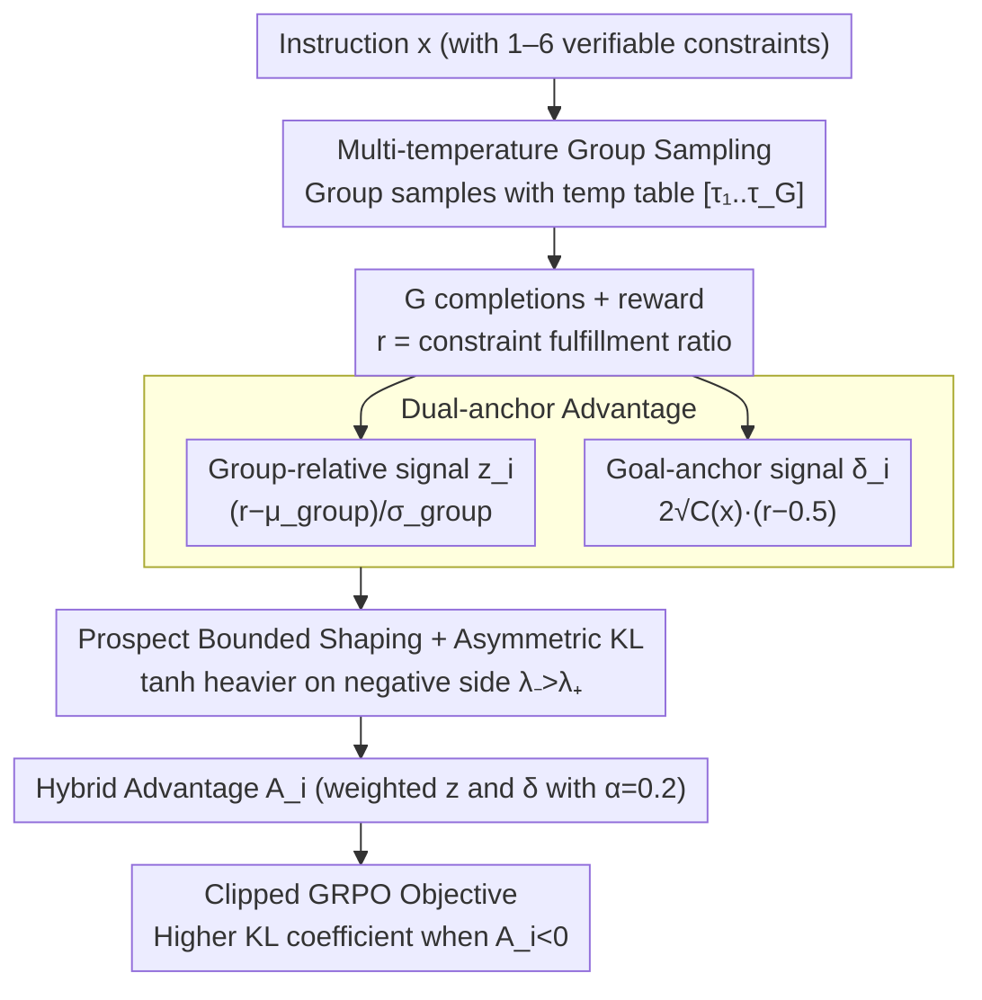

# MDP-GRPO: Stabilized Group Relative Policy Optimization for Multi-Constraint Instruction Following

**Conference**: ACL2026  
**arXiv**: [2606.06058](https://arxiv.org/abs/2606.06058)  
**Code**: https://github.com/m-salmani78/MDP-GRPO  
**Area**: LLM Alignment / RLVR / Multi-Constraint Instruction Following  
**Keywords**: GRPO, Verifiable Rewards, Multi-Constraint Instructions, Advantage Stabilization, Prospect Theory

## TL;DR
MDP-GRPO addresses the instability of GRPO under discrete low-variance rewards in multi-constraint instruction following. By combining multi-temperature sampling, dual-anchor advantage, prospect-theoretic shaping, and asymmetric KL, it achieves more stable soft/hard constraint satisfaction rates for small models on IFEval, FollowBench, and a custom multi-constraint test set.

## Background & Motivation
**Background**: LLMs can follow many natural language instructions, but they still struggle when a request contains multiple explicit constraints simultaneously—such as formatting, vocabulary, capitalization, ending phrases, and structured output. In real-world deployment, such multi-constraint prompts are common: legal templates, product copy, developer tool outputs, and security policies often require that "missing even one makes it unusable."

**Limitations of Prior Work**: RL with Verifiable Rewards (RLVR) is well-suited for these tasks because each constraint can be deterministically checked by rule-based validators, avoiding biases from learned reward models or LLM-as-a-judge. However, these rewards are typically discrete, sparse, and low-variance. GRPO relies on group-wise z-score normalization of multiple samples for the same prompt. When the reward distribution within a group is too homogeneous, the advantage signal suffers from three types of pathology.

**Key Challenge**: The intra-group relative normalization of GRPO only considers "who is better within the group" and easily ignores absolute reward levels. In the early stages of multi-constraint tasks, all samples may be equally wrong or equally correct, resulting in zero intra-group variance. Even if variance is non-zero, tiny differences can be amplified into excessive gradients. The model needs to both retain intra-group comparison signals and know "how far it is from full constraint satisfaction."

**Goal**: The authors aim to stabilize GRPO without introducing a critic, making it suitable for deterministic multi-constraint rewards. Goals include reducing homogeneous groups, restoring learning signals in zero-variance groups, controlling advantage update magnitudes, and more conservatively constraining policy drift when penalizing constraint violations.

**Key Insight**: Instead of modifying the reward itself, this paper starts with sampling and advantage estimation. Multi-temperature sampling prevents homogeneous groups; dual-anchor advantage injects absolute target levels into advantage estimation; prospect shaping uses the concept of loss aversion from behavioral economics to limit update magnitudes; and asymmetric KL constrains policy deviation more strongly during negative advantage.

**Core Idea**: Extend the single intra-group z-score advantage of GRPO into a hybrid advantage of "intra-group relative signal + target anchor signal," and apply bounded, asymmetric shaping before the policy update. This simultaneously mitigates low-variance amplification, mean-centering blind spots, and zero-variance collapse.

## Method

### Overall Architecture
MDP-GRPO follows the critic-free, intra-group relative policy optimization of GRPO but addresses three types of instability under discrete low-variance rewards. Given an instruction $x$, the model generates $G$ completions. The reward for each completion is the constraint satisfaction ratio $r(x,y)=\frac{1}{C(x)}\sum_t c_t(x,y)$. While standard GRPO uses intra-group mean and std to calculate advantage, MDP-GRPO inserts three stabilization modules: first, multi-temperature sampling generates a more dispersed set of responses; then, it calculates both a group-relative signal $z_i$ and a goal-aware signal $\delta_i$. These are transformed into bounded signals via prospect-theoretic shaping and mixed into the final advantage $A_i$ for the standard clipped GRPO objective, with different KL coefficients set based on the sign of $A_i$.

Regarding data, the authors constructed 3,000 training prompts, with about one-third of the seeds coming from existing data and the rest being manually curated, covering general Q&A, creative writing, and material assistance. Each instruction is injected with 1–6 constraints, with a taxonomy containing 9 high-level categories and 26 constraint types, all verified by deterministic validators like regex and parsers.

### Key Designs

**1. Multi-temperature Group Sampling: Preventing identical rewards from the data generation side**

The root cause of zero-variance collapse is the lack of reward variation within a group—where all samples are either all right or all wrong, and the advantage provides no direction. Standard GRPO samples the entire group with a fixed temperature. MDP-GRPO changes this to assign a temperature table $\mathbf{T}=[\tau_1,...,\tau_G]$ to different samples within the group, e.g., $[0.1,0.4,0.7,1.0]$. Low-temperature samples handle high-quality exploitation, while high-temperature samples increase exploration, making it more likely to produce different constraint satisfaction patterns. This does not change the objective function but increases reward dispersion at the sampling stage, which is especially effective for small groups like $G=4$.

**2. Dual-anchor Advantage: Injecting an absolute signal of "how far from full satisfaction" beyond relative comparison**

Since GRPO only looks at who is better within a group, it suffers from a mean-centering blind spot—"all-wrong groups" and "all-right groups" look identical after normalization. The standard intra-group signal is $z_i=(r_i-\mu_{group})/(\sigma_{group}+\epsilon)$. MDP-GRPO adds a goal-aware anchor: assuming each constraint is independently satisfied with $p=0.5$ under a neutral baseline, the reward goal center is $\mu_{goal}=0.5$ and the standard deviation is $\sigma_{goal}=1/(2\sqrt{C(x)})$. The absolute advantage is written as $\delta_i=2\sqrt{C(x)}(r_i-0.5)$. The final advantage is a mixture of the shaped $z_i$ and $\delta_i$ (default mixing weight $\alpha=0.2$). Thus, even if intra-group samples are identical, the model knows whether the current completion is above or below the neutral satisfaction level, restoring partial directional signals.

**3. Prospect-theoretic Shaping + Asymmetric KL: Capping updates and making violations "more painful"**

Low variance can amplify tiny differences into excessive gradients, and in multi-constraint tasks, a regression in a single constraint might make the output entirely unusable, so negative updates must be more conservative. The authors apply a scaled tanh transformation to the raw advantage, with a larger upper bound on the negative side ($\lambda_->\lambda_+>0$). Experiments use $(\lambda_+,\lambda_-)=(1.25,2.0)$ and $\beta_{PT}=0.8$, making positive gains marginal and negative violations heavier. The accompanying asymmetric KL uses a higher coefficient $\beta^{high}_{KL}=0.025$ when $A_i<0$ and $\beta^{low}_{KL}=0.01$ when $A_i\ge 0$. The tanh bounding prevents advantage explosion, while loss aversion pushes corrective force towards samples that violate constraints.

### Loss & Training
Training uses the standard GRPO clipped surrogate, replacing only the advantage and optionally enabling asymmetric KL. Experimental models are Gemma-2-2B-Instruct and Llama-3.2-3B-Instruct: single NVIDIA A100, learning rate $1\times10^{-5}$, batch size 32, PPO clip $\epsilon_{clip}=0.2$, base KL coefficient 0.01, max generation length 1024, top_p=0.9, trained for 1 epoch. The main group size is $G=8$, with $G=4$ used to analyze the effect of multi-temperature sampling in small groups. The default dual-anchor mixing weight is $\alpha=0.2$, and the goal center is $\mu_{goal}=0.5$.

## Key Experimental Results

### Main Results

| Model / Group Size | Method | IFEval SSR/HSR | Custom SSR/HSR | FollowBench SSR/HSR | Key Findings |
|--------------------|--------|----------------|----------------|---------------------|--------------|
| Gemma-2-2B, G=8 | Baseline | 56.7 / 45.1 | 54.8 / 18.8 | 63.7 / 52.9 | Zero-shot instruction model |
| Gemma-2-2B, G=8 | GRPO | 73.7 / 62.4 | 68.4 / 29.0 | 64.0 / 53.2 | Standard GRPO provides significant gains |
| Gemma-2-2B, G=8 | MDP-GRPO | 75.3 / 64.1 | 70.3 / 32.8 | 66.9 / 57.4 | Full pipeline is more stable; Custom HSR +3.8 vs GRPO |
| Llama-3.2-3B, G=8 | Baseline | 54.2 / 46.8 | 60.3 / 20.8 | 69.7 / 59.8 | Llama has strong initial FollowBench performance |
| Llama-3.2-3B, G=8 | GRPO | 66.1 / 58.5 | 65.1 / 24.8 | 68.4 / 58.9 | Gain on Custom; slight drop on FollowBench |
| Llama-3.2-3B, G=8 | MDP-GRPO | 71.3 / 59.8 | 65.8 / 25.2 | 69.4 / 59.1 | IFEval SSR +5.2 vs GRPO |

The paper also notes that individual components are not always globally optimal. For example, for Gemma-2-2B on IFEval, PT-GRPO achieves the highest HSR of 65.8%, exceeding GRPO's 62.4%; for Llama-3.2-3B on IFEval, DA-PT-GRPO hits a 71.5% SSR, slightly higher than MDP-GRPO's 71.3%. The authors emphasize that the full pipeline offers a more stable overall profile rather than ranking first in every single metric.

### Ablation Study

| Setting | Key Number | Description |
|---------|------------|-------------|
| Gemma, G=8, Custom HSR | GRPO 29.0, DA-GRPO 32.6, DA-PT-GRPO 33.4, MDP-GRPO 32.8 | Goal anchor helps most with complex constraint combinations |
| Gemma, G=4, IFEval | GRPO 69.7 / 58.2, MT-GRPO 71.1 / 59.4, MDP-GRPO 71.2 / 59.5 | MT restores reward dispersion in small groups |
| Gemma, G=4, Custom HSR | GRPO 28.6, MT-GRPO 30.6, MDP-GRPO 30.4 | MT effects are amplified in low-diversity settings |
| Llama, G=4, IFEval | GRPO 67.2 / 55.0, MT-GRPO 70.5 / 58.4 | Multi-temp sampling is also effective for Llama's small group settings |
| Difficulty Analysis | baseline HSR below 10% for Difficulty 4; DA-PT-GRPO at ~20% for Difficulty 5 vs GRPO at ~12% | Stabilization methods are more robust against degradation at high constraint counts |

### Key Findings
- Standard GRPO significantly improves verifiable instruction following, but suffers from homogeneous groups and mean-centering blind spots on difficult multi-constraint prompts.
- Dual-anchor provides the most stable HSR gains on the Custom Test Set, consistent with its design goal of fixing zero-variance / absolute blindness.
- Prospect shaping controls KL drift while preserving reward gains; DA-PT-GRPO further suppresses KL drift.
- MT-GRPO may increase KL and decrease entropy under the current schedule, requiring careful temperature tuning; however, it is critical for restoring performance in small group ($G=4$) settings.

## Highlights & Insights
- **Problem diagnosis is more important than the method itself**: The breakdown into low-variance amplification, mean-centering blind spots, and zero-variance collapse clearly explains the instability of GRPO under discrete rewards.
- **Modify the advantage before modifying the reward**: Multi-constraint rewards provided by deterministic checkers are credible and cheap. MDP-GRPO avoids introducing learned reward models and instead supplements signals via advantage estimation and sampling.
- **Reintroducing absolute target levels to critic-free RL**: The appeal of GRPO is avoiding a value model, but the cost is only seeing relative within-group performance. Dual-anchor is a lightweight compromise that adds a sense of goal-orientation to critic-free methods.
- **Measured use of Prospect Theory**: It is not used to redefine human preference targets, but merely as a bounded asymmetric transformation for advantage shaping, making it more acceptable from an engineering perspective.

## Limitations & Future Work
- The method relies on explicit, automatically verifiable constraints. For subjective, stylistic, or underspecified constraints, learned rewards or preference feedback may be needed, reintroducing reward misspecification and judge bias.
- MDP-GRPO introduces several hyperparameters: anchor mixing weight, shaping parameters, temperature schedule, and asymmetric KL. These may need recalibration and KL monitoring when migrating to different reward scales or task domains.
- Experiments only cover 2B/3B instruction-tuned models, standard instruction-following benchmarks, and a custom multi-constraint set. Large-scale models and structured domains like multilingualism, tool use, and code generation remain unverified.
- The method optimizes constraint satisfaction encoded in the reward specification; it does not automatically guarantee broader safety, such as factuality, harmlessness, or value alignment.
- While multi-temperature sampling increases dispersion, it may increase KL or decrease entropy; actual training requires coordination with decoding controls.

## Related Work & Insights
- **vs Standard GRPO**: Standard GRPO uses intra-group z-score advantage, which is simple but fragile under discrete low-variance rewards; MDP-GRPO stabilizes updates via sampling, anchors, and shaping.
- **vs MAPO / NGRPO**: Related works also attempt to fix group-relative advantage assignment or all-negative groups; MDP-GRPO differs by simultaneously reducing homogeneous groups, restoring goal anchors, and applying prospect-style bounded shaping.
- **vs KTO**: KTO uses prospect-theoretic utility at the objective function level to handle binary preferences; MDP-GRPO only applies prospect-inspired shaping at the advantage level, keeping the reward definition unchanged.
- **Insights**: For any task where rule-based verifiers are strong and rewards are discrete—such as formatted output, tool API schemas, code style checks, or compliant document generation—one should try goal-anchor advantages rather than just applying standard GRPO.

## Rating
- Novelty: ⭐⭐⭐⭐☆ Clear contributions in decomposing GRPO failure modes and combining dual-anchor/prospect shaping.
- Experimental Thoroughness: ⭐⭐⭐⭐☆ Covers two models, two group sizes, three types of benchmarks, ablation, and training diagnostics; limited by smaller model scales.
- Writing Quality: ⭐⭐⭐⭐☆ Motivation and formulas are relatively clear, with complete tables; some symbols in the cached text were slightly cluttered but the overall logic is highly readable.
- Value: ⭐⭐⭐⭐☆ Practical for RLVR, multi-constraint instruction following, and critic-free policy optimization; suitable for future expansion to larger models.

<!-- RELATED:START -->

## Related Papers

- [\[ICLR 2026\] Group-Relative REINFORCE Is Secretly an Off-Policy Algorithm: Demystifying Some Myths About GRPO and Its Friends](../../ICLR2026/llm_alignment/group-relative_reinforce_is_secretly_an_off-policy_algorithm_demystifying_some_m.md)
- [\[ICLR 2026\] RECAST: Expanding the Boundaries of LLMs' Complex Instruction Following with Multi-Constraint Data](../../ICLR2026/llm_alignment/recast_expanding_the_boundaries_of_llms_complex_instruction_following_with_multi.md)
- [\[ICLR 2026\] ContextIF: Enhancing Instruction-Following through Context Reward](../../ICLR2026/llm_alignment/contextif_enhancing_instruction-following_through_context_reward.md)
- [\[ACL 2026\] Taming Extreme Tokens: Covariance-Aware GRPO with Gaussian-Kernel Advantage Reweighting](taming_extreme_tokens_covariance-aware_grpo_with_gaussian-kernel_advantage_rewei.md)
- [\[AAAI 2026\] LaF-GRPO: In-Situ Navigation Instruction Generation for the Visually Impaired via GRPO with LLM-as-Follower Reward](../../AAAI2026/llm_alignment/laf-grpo_in-situ_navigation_instruction_generation_for_the_visually_impaired_via.md)

<!-- RELATED:END -->
