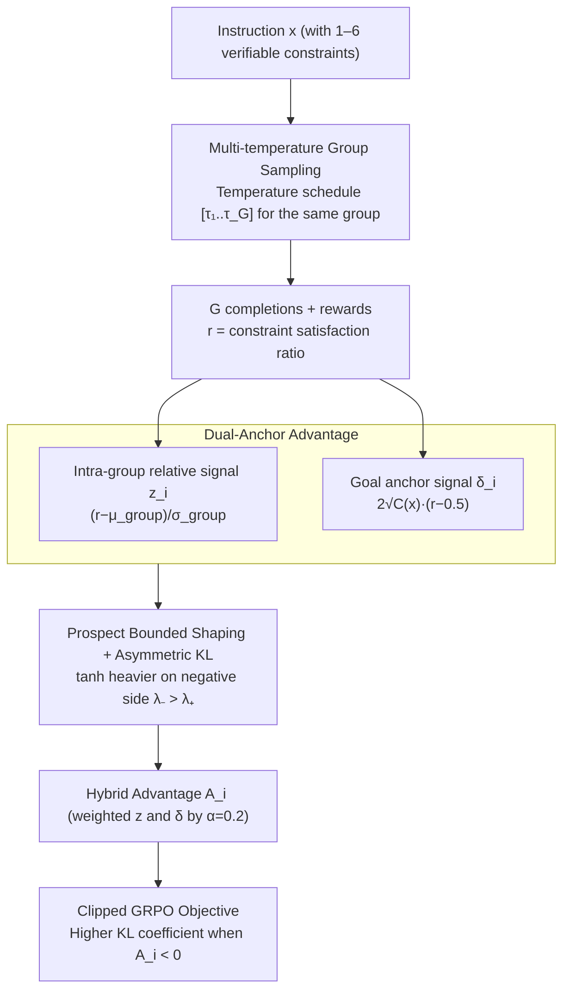

# MDP-GRPO: Stabilized Group Relative Policy Optimization for Multi-Constraint Instruction Following

**Conference**: ACL2026  
**arXiv**: [2606.06058](https://arxiv.org/abs/2606.06058)  
**Code**: https://github.com/m-salmani78/MDP-GRPO  
**Area**: LLM Alignment / RLVR / Multi-Constraint Instruction Following  
**Keywords**: GRPO, Verifiable Reward, Multi-Constraint Instruction, Advantage Stabilization, Prospect Theory

## TL;DR
MDP-GRPO addresses the instability of GRPO under discrete, low-variance rewards in multi-constraint instruction following. By combining multi-temperature sampling, dual-anchor advantages, prospect-theoretic shaping, and asymmetric KL, it enables small models to achieve more stable soft/hard constraint satisfaction rates on IFEval, FollowBench, and custom multi-constraint test sets.

## Background & Motivation
**Background**: LLMs are proficient at following natural language instructions. However, when a request involves multiple explicit constraints—such as format, vocabulary, case, ending phrases, and structured output—models often omit certain requirements. In real-world deployments like legal templates, product copywriting, developer tools, and security policies, these multi-constraint prompts are common, and "missing a single constraint makes the output unusable."

**Limitations of Prior Work**: Reinforcement Learning with Verifiable Rewards (RLVR) is well-suited for such tasks because each constraint can be deterministically checked by rule-based validators, avoiding the bias of learned reward models or LLM-as-a-judge. However, these rewards are typically discrete, sparse, and low-variance. GRPO relies on group-relative z-score normalization of multiple samples for the same prompt. When the reward distribution within a group is too homogeneous, the advantage scores exhibit three types of pathologies.

**Key Challenge**: The intra-group relative normalization of GRPO only considers "who is better in the group" while ignoring absolute reward levels. In the early stages of multi-constraint tasks, all samples might be equally wrong or equally right, resulting in zero intra-group variance. Even with non-zero variance, tiny differences can be amplified into excessive gradients. The model needs to retain intra-group comparison signals while simultaneously knowing "how far it is from full constraint satisfaction."

**Goal**: The authors aim to stabilize GRPO without introducing a critic, making it suitable for deterministic multi-constraint rewards. Goals include reducing homogeneous groups, recovering learning signals in zero-variance groups, controlling advantage update magnitudes, and becoming more conservative regarding policy drift when penalizing constraint violations.

**Key Insight**: Instead of modifying the rewards themselves, the paper focuses on sampling and advantage estimation. Multi-temperature sampling prevents homogeneous groups; dual-anchor advantages inject absolute target levels into advantage estimation; prospect shaping limits update magnitudes using the idea of loss aversion from behavioral economics; and asymmetric KL constrains policy deviation more strongly for negative advantages.

**Core Idea**: Extend the single intra-group z-score advantage of GRPO into a hybrid advantage consisting of a "relative intra-group signal + target anchor signal." Apply bounded, asymmetric shaping before the policy update to mitigate low-variance amplification, mean-centering blindness, and zero-variance collapse simultaneously.

## Method

### Overall Architecture
MDP-GRPO follows the critic-free, group-relative policy optimization of GRPO but addresses three types of instabilities under discrete low-variance rewards. Given an instruction $x$, the model generates $G$ completions. The reward for each completion is the ratio of satisfied constraints: $r(x,y)=\frac{1}{C(x)}\sum_t c_t(x,y)$. While standard GRPO uses intra-group mean and std for advantage calculation, MDP-GRPO inserts three stabilization modules: multi-temperature sampling for diverse responses, dual-anchor advantages to calculate relative signal $z_i$ and goal-aware signal $\delta_i$, and prospect-theoretic shaping for bounded signals. These are combined into a final advantage $A_i$ for the clipped GRPO objective, utilizing different KL coefficients based on the sign of $A_i$.

For data, the authors constructed 3,000 training prompts. Approximately one-third of the seeds come from existing datasets, with the rest manually curated, covering general Q&A, creative writing, and material assistance. Each instruction is injected with 1–6 constraints, with a taxonomy of 9 high-level categories and 26 constraint types, all verified by deterministic validators like regex and parsers.

### Key Designs

**1. Multi-temperature Group Sampling: Preventing identical rewards from the generation side**

The root cause of zero-variance collapse is the lack of reward variation within a group—where all samples are either all right or all wrong, providing no direction for the advantage. Standard GRPO uses a fixed temperature for the entire group. MDP-GRPO assigns a temperature schedule $\mathbf{T}=[\tau_1,...,\tau_G]$ (e.g., $[0.1, 0.4, 0.7, 1.0]$) to different samples. Low-temperature samples handle high-quality exploitation, while high-temperature samples increase exploration, making it more likely to produce diverse constraint satisfaction patterns. This increases reward dispersion at the sampling stage without changing the objective function, which is particularly effective for small groups like $G=4$.

**2. Dual-anchor Advantage: Injecting an absolute "distance to full satisfaction" signal beyond relative comparison**

Standard GRPO suffers from mean-centering blindness—an "all-wrong group" and an "all-right group" look identical after normalization. The standard intra-group signal is $z_i=(r_i-\mu_{group})/(\sigma_{group}+\epsilon)$. MDP-GRPO adds a goal-aware anchor: assuming each constraint is satisfied independently with $p=0.5$ under a neutral baseline, the reward target center is $\mu_{goal}=0.5$ and the standard deviation is $\sigma_{goal}=1/(2\sqrt{C(x)})$. The absolute advantage is defined as $\delta_i=2\sqrt{C(x)}(r_i-0.5)$. The final advantage combines shaped $z_i$ and $\delta_i$ (default mixing weight $\alpha=0.2$). Even if all samples in a group are identical, the model knows whether the current completion is above or below the neutral satisfaction level, recovering directional signals.

**3. Prospect-theoretic Shaping + Asymmetric KL: Bounding updates and making violations "more painful"**

Low variance can amplify tiny differences into extreme gradients. In multi-constraint tasks, a single constraint regression can make the entire output unusable, so negative updates should be more conservative. The authors apply a scaled tanh transformation to the raw advantage, with a larger upper bound on the negative side ($\lambda_- > \lambda_+ > 0$). In experiments, $(\lambda_+, \lambda_-) = (1.25, 2.0)$ and $\beta_{PT} = 0.8$ are used, creating diminishing marginal returns for positive gains and heavier penalties for violations. The corresponding asymmetric KL uses a higher coefficient $\beta^{high}_{KL}=0.025$ when $A_i < 0$ and $\beta^{low}_{KL}=0.01$ when $A_i \ge 0$. The tanh bounding prevents advantage explosion, while loss aversion focuses correction efforts on samples that violate constraints.

### Loss & Training
Training uses the standard GRPO clipped surrogate objective, replacing only the advantage and enabling asymmetric KL. Experimental models include Gemma-2-2B-Instruct and Llama-3.2-3B-Instruct. Training is conducted on a single NVIDIA A100 with a learning rate of $1\times10^{-5}$, batch size of 32, PPO clip $\epsilon_{clip}=0.2$, base KL coefficient 0.01, max generation length 1024, top_p=0.9, for 1 epoch. The main group size is $G=8$. A $G=4$ setting is used to analyze the effect of multi-temperature sampling in small groups. The dual-anchor mixing weight defaults to $\alpha=0.2$ with target center $\mu_{goal}=0.5$.

## Key Experimental Results

### Main Results
| Model / Group Size | Method | IFEval SSR/HSR | Custom SSR/HSR | FollowBench SSR/HSR | Key Observations |
|--------------------|--------|----------------|----------------|---------------------|------------------|
| Gemma-2-2B, G=8 | Baseline | 56.7 / 45.1 | 54.8 / 18.8 | 63.7 / 52.9 | Zero-shot instruction model |
| Gemma-2-2B, G=8 | GRPO | 73.7 / 62.4 | 68.4 / 29.0 | 64.0 / 53.2 | Standard GRPO yields significant gains |
| Gemma-2-2B, G=8 | MDP-GRPO | 75.3 / 64.1 | 70.3 / 32.8 | 66.9 / 57.4 | More stable overall; Custom HSR +3.8 vs GRPO |
| Llama-3.2-3B, G=8 | Baseline | 54.2 / 46.8 | 60.3 / 20.8 | 69.7 / 59.8 | Llama stronger on FollowBench initially |
| Llama-3.2-3B, G=8 | GRPO | 66.1 / 58.5 | 65.1 / 24.8 | 68.4 / 58.9 | Improved on Custom; dropped on FollowBench |
| Llama-3.2-3B, G=8 | MDP-GRPO | 71.3 / 59.8 | 65.8 / 25.2 | 69.4 / 59.1 | IFEval SSR +5.2 vs GRPO |

Individual components are not always globally optimal. For Gemma-2-2B on IFEval, PT-GRPO achieved the highest HSR at 65.8%, whereas MDP-GRPO reached 64.1%. For Llama-3.2-3B on IFEval, DA-PT-GRPO reached 71.5% SSR. The authors emphasize that the full pipeline provides a more stable overall profile rather than ranking first in every single metric.

### Ablation Study
| Setting | Key Figures | Description |
|---------|-------------|-------------|
| Gemma, G=8, Custom HSR | GRPO 29.0, DA-GRPO 32.6, DA-PT-GRPO 33.4, MDP-GRPO 32.8 | Goal anchors help most with complex constraint combinations |
| Gemma, G=4, IFEval | GRPO 69.7/58.2, MT-GRPO 71.1/59.4, MDP-GRPO 71.2/59.5 | MT recovers reward dispersion in small groups |
| Gemma, G=4, Custom HSR | GRPO 28.6, MT-GRPO 30.6, MDP-GRPO 30.4 | MT effects are amplified in low-diversity settings |
| Llama, G=4, IFEval | GRPO 67.2/55.0, MT-GRPO 70.5/58.4 | MT sampling is also effective for Llama small-group settings |
| Difficulty Analysis | Baseline HSR drops below 10% for Diff 4; DA-PT-GRPO ~20% at Diff 5 vs GRPO ~12% | Stabilization methods are more resilient to degradation with more constraints |

### Key Findings
- Standard GRPO significantly improves verifiable instruction following but suffers from homogeneous groups and mean-centering blindness on difficult multi-constraint prompts.
- Dual-anchor logic provides the most consistent gains in HSR for the Custom Test Set, aligning with its design goal of fixing zero-variance/absolute blindness.
- Prospect shaping controls KL drift while preserving reward gains; DA-PT-GRPO further suppresses KL drift.
- MT-GRPO might increase KL and decrease entropy under the current schedule, requiring careful temperature tuning; however, it is critical for performance recovery in $G=4$ groups.

## Highlights & Insights
- **Diagnosis is more important than the method itself**: The failure modes of low-variance amplification, mean-centering blindness, and zero-variance collapse clearly explain why GRPO is fragile under discrete rewards.
- **Adjust the advantage before the reward**: Multi-constraint rewards provided by deterministic checkers are credible and cheap. MDP-GRPO avoids introducing a learned reward model and instead reinforces signals in advantage estimation and sampling.
- **Reintroducing absolute targets to critic-free RL**: The appeal of GRPO is the absence of a value model, but the cost is a purely relative intra-group comparison. Dual-anchor is a lightweight compromise that adds "goal-awareness" to critic-free methods.
- **Restrained use of Prospect Theory**: It is not used to redefine human preference objectives but as a bounded asymmetric transformation for advantage shaping, making it more engineering-friendly.

## Limitations & Future Work
- The method relies on explicit, automatically verifiable constraints. For subjective, stylistic, or underspecified constraints, learned rewards or preference feedback might be necessary, reintroducing reward misspecification and judge bias.
- MDP-GRPO introduces several hyperparameters: anchor mixing weights, shaping parameters, temperature schedules, and asymmetric KL coefficients. These require recalibration and KL monitoring when migrating to different reward scales or task domains.
- Experiments only cover 2B/3B instruction-tuned models on specific benchmarks. Validation on large-scale models, multilingual tasks, tool use, and structured domains like code generation is still pending.
- The method optimizes for constraints encoded in the reward specification; it does not automatically guarantee broader safety, such as factuality, harmlessness, or value alignment.
- While multi-temperature sampling increases dispersion, it may also increase KL or decrease entropy, requiring decoding control during training.

## Related Work & Insights
- **vs. Standard GRPO**: Standard GRPO uses intra-group z-score advantages, which are simple but fragile under discrete low-variance rewards; MDP-GRPO stabilizes updates through sampling, anchors, and shaping.
- **vs. MAPO / NGRPO**: Related works attempt to fix group-relative advantage assignment or all-negative groups; MDP-GRPO's distinction lies in simultaneously reducing homogeneous groups, recovering goal anchors, and applying prospect-style bounded shaping.
- **vs. KTO**: KTO uses prospect-theoretic utility at the objective level for binary preferences; MDP-GRPO applies prospect-inspired shaping only at the advantage level while keeping the reward definition unchanged.
- **Insight**: For any task where rule-based verifiers are strong and rewards are discrete—such as formatted output, tool API schemas, code style checks, and compliance document generation—one should try goal-anchor advantages instead of directly applying standard GRPO.

## Rating
- Novelty: ⭐⭐⭐⭐☆ The breakdown of GRPO failure modes and the combination of dual-anchor/prospect shaping provide a clear contribution.
- Experimental Thoroughness: ⭐⭐⭐⭐☆ Covers two models, two group sizes, three types of benchmarks, ablation studies, and training diagnostics. The limitation is the small model scale.
- Writing Quality: ⭐⭐⭐⭐☆ Motivations and formulas are clear, with complete tables.
- Value: ⭐⭐⭐⭐☆ Practical for RLVR, multi-constraint instruction following, and critic-free policy optimization; suitable for scaling to larger models.

<!-- RELATED:START -->

## Related Papers

- [\[ICLR 2026\] Group-Relative REINFORCE Is Secretly an Off-Policy Algorithm: Demystifying Some Myths About GRPO and Its Friends](../../ICLR2026/llm_alignment/group-relative_reinforce_is_secretly_an_off-policy_algorithm_demystifying_some_m.md)
- [\[ACL 2026\] Taming Extreme Tokens: Covariance-Aware GRPO with Gaussian-Kernel Advantage Reweighting](taming_extreme_tokens_covariance-aware_grpo_with_gaussian-kernel_advantage_rewei.md)
- [\[ACL 2025\] Reverse Preference Optimization for Complex Instruction Following](../../ACL2025/llm_alignment/reverse_preference_optimization_for_complex_instruction_following.md)
- [\[AAAI 2026\] LaF-GRPO: In-Situ Navigation Instruction Generation for the Visually Impaired via GRPO with LLM-as-Follower Reward](../../AAAI2026/llm_alignment/laf-grpo_in-situ_navigation_instruction_generation_for_the_visually_impaired_via.md)
- [\[NeurIPS 2025\] GVPO: Group Variance Policy Optimization for Large Language Model Post-Training](../../NeurIPS2025/llm_alignment/gvpo_group_variance_policy_optimization_for_large_language_model_post-training.md)

<!-- RELATED:END -->
