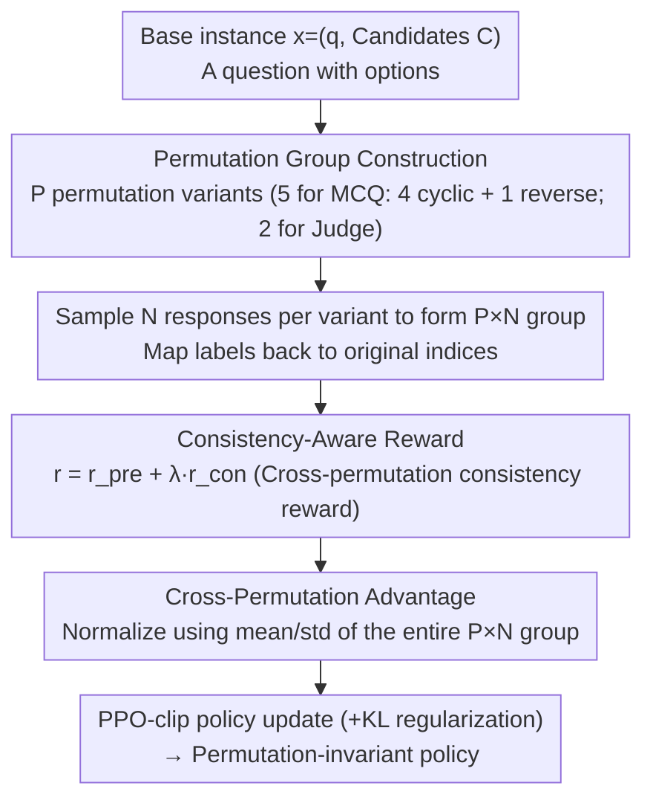

# Mitigating Selection Bias in Large Language Models via Permutation-Aware GRPO

**Conference**: ACL 2026  
**arXiv**: [2603.21016](https://arxiv.org/abs/2603.21016)  
**Code**: GitHub (Mentioned in the paper; link not explicitly provided in the abstract)  
**Area**: LLM Alignment / Reinforcement Learning / Selection Bias / LLM-as-a-Judge  
**Keywords**: GRPO, permutation invariance, selection bias, cross-permutation advantage, consistency reward

## TL;DR
The authors identified that standard GRPO treats different option orders of the same question as independent prompts, leading to "permutation-blindness" where model choices change after shuffling. To address this, they propose PA-GRPO, which organizes multiple permutations of a semantic instance into a permutation group. By employing cross-permutation advantage baselines and consistency rewards, the method explicitly optimizes for "order-invariant choices." PA-GRPO significantly reduces selection bias across seven MCQ/Judge benchmarks while maintaining high accuracy.

## Background & Motivation

**Background**: LLMs are increasingly utilized as Multiple Choice Question (MCQ) solvers and LLM-as-a-Judge evaluators, where the output space is restricted to discrete symbols like A/B/C/D. In theory, option positions and label symbols are non-semantic. However, empirically, LLMs often change their answers when options are swapped—a phenomenon known as selection bias, which includes position bias and label bias. This poses a direct threat to alignment, leaderboards, and data synthesis tasks relying on discrete choices.

**Limitations of Prior Work**: Existing debiasing methods fall into two categories: (1) **Inference-time calibration** (e.g., PriDe, CalibraEval) adjusts surface probabilities without modifying the model, which is computationally expensive and fails to fix internal flaws; internal interventions (e.g., UniBias, BNP) often have side effects due to attention masking or parameter pruning. (2) **Training-time SFT** (e.g., PIF, LLM distillation) treats different permutations as independent static samples for cross-entropy training; the model merely imitates the data distribution passively rather than actively exploring a "permutation-invariant" policy space.

**Key Challenge**: The essence of selection bias is the failure of robust reasoning—the same semantics in different surface forms should yield the same choice. This is fundamentally an RL-style policy learning problem rather than a supervised label-fitting problem. However, even strong RL methods like GRPO treat different permutations of the same instance as independent prompts, lacking cross-permutation consistency constraints. This failure mode is termed **permutation-blindness**: the model receives high rewards for "favorable orders" without being penalized for failure in "unfavorable orders."

**Goal**: To encode permutation invariance directly into the RL objective, enabling the model to actively learn to maintain consistent choices regardless of order.

**Key Insight**: Since GRPO uses the group mean as a baseline to calculate relative advantage, the definition of a "group" can be expanded from "multiple samples of the same prompt" to "multiple permutations of the same semantic instance $\times$ multiple samples." This naturally allows for comparing different permutations at the advantage level.

**Core Idea**: Permutation Group + Cross-Permutation Advantage + Consistency-Aware Reward are integrated to bake consistency into the RL optimization objective.

## Method

### Overall Architecture
PA-GRPO addresses the "permutation-blindness" of standard GRPO. Standard GRPO treats different option orders for the same question as unrelated prompts. PA-GRPO expands the RL "group" boundary: for each base instance $x=(q,\mathcal{C})$, it generates $P$ prompt variants using a set of permutation mappings (e.g., 5 for MCQ, 2 for Judge). $N$ responses are sampled for each variant to form a permutation group. Labels are mapped back to the original candidate indices, consistency rewards are calculated, and the policy is updated via PPO-clip using a cross-permutation advantage baseline instead of the original intra-prompt baseline.

### Key Designs

**1. Permutation Group Construction: Approximating 24 Permutations with 5 Representative Ones**

The full permutation set for an MCQ with 4 options is $4!=24$, which is computationally prohibitive. The authors select 5 representative permutations $\Pi_\text{MCQ}=\{\text{ABCD},\text{BCDA},\text{CDAB},\text{DABC},\text{DCBA}\}$. The first four are cyclic shifts, ensuring every candidate appears in every position exactly once to decouple position and label. The final reverse order breaks the fixed adjacency (e.g., "A always before B") found in cyclic patterns. For Judge tasks with two candidates, the full set $\{\text{AB},\text{BA}\}$ is used ($P=2$). Experiments show that $P=5$ offers an optimal trade-off, achieving results within 2 points of $P=24$ on TinyMMLU CA (75.0 vs 77.0) with significant computational savings.

**2. Consistency-Aware Reward: Directly Rewarding Order-Invariant Choices**

Standard GRPO rewards only individual response accuracy, failing to signal group-level consistency. An additional cross-permutation consistency reward $r_\text{con}$ is introduced. The total reward is $r^{(t,i)}=r_\text{pre}^{(t,i)}+\lambda r_\text{con}^{(t,i)}$, where $r_\text{pre}$ includes accuracy ($r_\text{acc}\in\{+1,-1\}$) plus length and format penalties.

For Judge tasks, index-aligned pairwise rewards are used: responses for the same index $i$ in two permutations are compared; if $z^{(1,i)}=z^{(2,i)}$, the reward is $+1$, otherwise $-1$. For MCQ, a unique-mode agreement is used: votes $n_k$ for each semantic candidate are counted across the group. A reward of $+1$ is given only if a unique mode exists ($|\mathcal{M}|=1$) and $z^{(t,i)}=z^\star$. Ties or mismatches result in $-1$, deliberately penalizing cases where the model spreads its uncertainty across options.

**3. Cross-Permutation Advantage: Upgrading the Baseline to the Entire Permutation Group**

Standard GRPO normalizes rewards within a single prompt, allowing the model to gain high advantage by performing well on "easy" orders while ignoring failures on others. PA-GRPO treats all $P\times N$ samples as a single comparison set. The group mean $\mu_{\mathcal{G}}=\frac{1}{PN}\sum_{t,i} r^{(t,i)}$ and standard deviation $\sigma_{\mathcal{G}}$ are used to compute:
$$A_\text{PA}^{(t,i)}=(r^{(t,i)}-\mu_{\mathcal{G}})/(\sigma_{\mathcal{G}}+\epsilon)$$
Only samples that perform well across *all* permutations receive positive advantage. To prevent noise amplification when rewards are nearly identical, the advantage is set to zero if $\sigma_{\mathcal{G}}<\delta$.

### Loss & Training
The final PPO-clip objective is $\mathcal{L}_\text{clip}(\theta)=\mathbb{E}[\min(\rho^{(t,i)} A_\text{PA}^{(t,i)},\,\text{clip}(\rho^{(t,i)},1-\eta,1+\eta)A_\text{PA}^{(t,i)})]$ with KL regularization against a reference policy. Models used include Llama-3.1-8B-Instruct, Qwen3-8B, and Qwen3-32B. Training data comprises Chatbot Arena (pairwise) and MMLU (MCQ), fine-tuned via LoRA using the verl framework.

## Key Experimental Results

### Main Results (Llama-3.1-8B: Acc/Consistency/CA)

| Method | MT-Bench Acc/Con/CA | JudgeBench Acc/Con/CA | RewardBench Acc/Con/CA |
|------|---------------------|------------------------|------------------------|
| Base | 59.6 / 25.2 / 22.2 | 35.0 / 34.8 / 6.1 | 60.5 / 31.5 / 26.2 |
| GRPO | 75.7 / 80.6 / 65.4 | 48.2 / 56.1 / 28.2 | 70.9 / 76.9 / 61.5 |
| PIF (SFT) | 76.1 / 84.6 / 70.4 | 53.3 / 59.2 / 30.4 | 73.7 / 76.7 / 62.0 |
| CalibraEval (Inference) | 62.3 / 42.1 / 33.4 | 49.3 / 15.7 / 7.1 | 60.7 / 34.4 / 27.8 |
| **PA-GRPO** | **77.6 / 88.0 / 71.7** | **57.1 / 58.3 / 32.4** | **71.0 / 82.7 / 62.3** |

Improvements for Qwen3-8B were even more significant: JudgeBench Acc increased 50.4→60.1 (+9.7), CA 34.8→45.3 (+10.5); GPQA CA 43.8→56.7 (+12.9).

### Ablation Study (Llama-3.1-8B, PreferenceBench)

| Configuration | Acc | Con | CA |
|------|-----|-----|-----|
| Base | 60.8 | 22.6 | 22.1 |
| GRPO | 82.2 | 85.1 | 76.3 |
| GRPO + $r_\text{con}$ only | 82.6 | 85.9 | 76.9 |
| GRPO + $A_\text{PA}$ only | 83.4 | 86.4 | 77.8 |
| **PA-GRPO (both)** | **86.2** | **87.2** | **79.8** |

### Key Findings
- **Complementary Components**: $r_\text{con}$ primarily improves consistency, while $A_\text{PA}$ stabilizes advantage calculation. Both are required to simultaneously boost accuracy, consistency, and CA.
- **No CoT Dependency**: PA-GRPO achieved 69.3% CA on MT-Bench using direct decoding, surpassing Base+CoT (58.0%). This suggests invariance is internalized into the policy rather than compensated for by reasoning.
- **Residual Bias is Position-Driven**: In JudgeBench, consistency remained high (79.0%) under label-only perturbations but dropped to 45.5% under order-only changes, indicating position bias is more stubborn than label bias.
- **Efficiency of $P=5$**: Cyclic+reverse covers most adjacency patterns. Expanding to $P=24$ yielded only 2 points of CA gain at ~5x the computational cost.
- **Balanced Hyperparameters**: $\lambda = 1.0$ provided the best trade-off; higher values (e.g., 2.0) improved consistency but degraded accuracy.

## Highlights & Insights
- **Defining "Permutation-Blindness"**: The paper provides a clean conceptual framework for why GRPO fails on selection tasks and offers a minimal fix via baseline and reward adjustments.
- **Strategic Permutation Selection**: The 4 cyclic + 1 reverse combination is an elegant approximation of the symmetric group, effectively decoupling positions and labels without exhaustive computation.
- **Mode-based Consistency**: Using unique-mode agreement instead of a simple majority is a clever design—penalizing ties prevents the model from "hedging its bets" across options to game the reward.

## Limitations & Future Work
- The method is currently limited to discrete choice tasks (MCQ/Judge). Quantifying semantic equivalence in open-ended generation remains challenging.
- Experiments focused on English and medium-scale models (8B/32B). Generalization to long-context options (e.g., code blocks) or multilingual scenarios is untested.
- Future work could introduce hierarchical advantages or weight position-specific rewards to address the residual position bias more effectively.

## Related Work & Insights
- **vs. Calibration**: Unlike inference-time methods (PriDe/CalibraEval) that adjust softmax outputs, PA-GRPO internalizes invariance into the policy, enabling single-inference debiasing with significantly higher CA.
- **vs. PIF (SFT)**: While PIF passively learns from negative samples, PA-GRPO uses RL to actively explore the strategy space and discover orders that consistently yield high rewards.
- **vs. Standard GRPO**: The core improvement lies in the "group" boundary. Redefining the group as a semantic equivalence set rather than a prompt-specific set is a broadly applicable insight for RL alignment.

## Rating
- Novelty: ⭐⭐⭐⭐ (Permutation-blindness is a strong concept; the solution is an intuitive and effective extension of GRPO.)
- Experimental Thoroughness: ⭐⭐⭐⭐⭐ (Broad benchmarks, multiple backbones, and detailed ablations on hyperparameters and permutation strategies.)
- Writing Quality: ⭐⭐⭐⭐⭐ (Clear definitions, concise formulas, and intuitive visualizations.)
- Value: ⭐⭐⭐⭐⭐ (Provides a ready-to-use RL recipe for debiasing LLM-as-a-Judge and reasoning tasks.)

<!-- RELATED:START -->

## Related Papers

- [\[AAAI 2026\] Exploring the Effects of Alignment on Numerical Bias in Large Language Models](../../AAAI2026/llm_alignment/exploring_the_effects_of_alignment_on_numerical_bias_in_large_language_models.md)
- [\[ACL 2026\] Taming Extreme Tokens: Covariance-Aware GRPO with Gaussian-Kernel Advantage Reweighting](taming_extreme_tokens_covariance-aware_grpo_with_gaussian-kernel_advantage_rewei.md)
- [\[CVPR 2026\] Uncertainty-Aware Exploratory Direct Preference Optimization for Multimodal Large Language Models](../../CVPR2026/llm_alignment/uncertainty-aware_exploratory_direct_preference_optimization_for_multimodal_larg.md)
- [\[ACL 2026\] BACH-V: Bridging Abstract and Concrete Human-Values in Large Language Models](bach-v_bridging_abstract_and_concrete_human-values_in_large_language_models.md)
- [\[ACL 2026\] S2H-DPO: Hardness-Aware Preference Optimization for Vision-Language Models](s2h-dpo_hardness-aware_preference_optimization_for_vision-language_models.md)

<!-- RELATED:END -->
