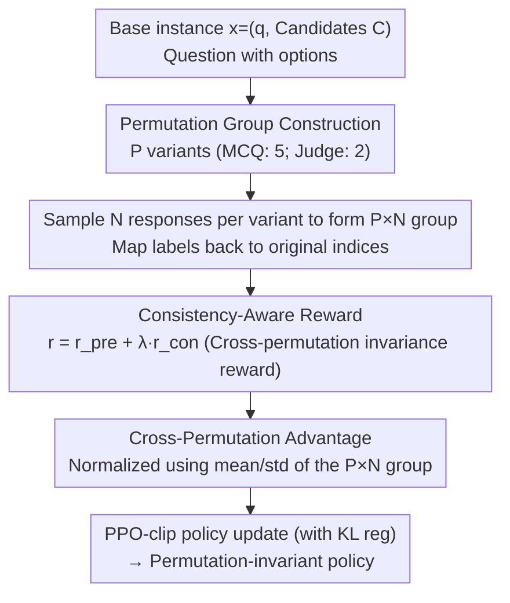

# Mitigating Selection Bias in Large Language Models via Permutation-Aware GRPO

**Conference**: ACL 2026  
**arXiv**: [2603.21016](https://arxiv.org/abs/2603.21016)  
**Code**: GitHub (Mentioned in paper; link not explicitly provided in the abstract)  
**Area**: LLM Alignment / Reinforcement Learning / Selection Bias / LLM-as-a-Judge  
**Keywords**: GRPO, permutation invariance, selection bias, cross-permutation advantage, consistency reward

## TL;DR
The authors identify that standard GRPO treats different option orderings of the same question as independent prompts, leading to "permutation-blindness" where model choices change when order varies. They propose PA-GRPO: organizing multiple permutations of the same semantic instance into a permutation group and employing a cross-permutation advantage baseline with a consistency reward. This explicitly optimizes for "order invariance," substantially reducing selection bias across 7 MCQ/Judge benchmarks while maintaining or improving accuracy.

## Background & Motivation

**Background**: LLMs are increasingly deployed as Multiple Choice Question (MCQ) solvers and LLM-as-a-Judge evaluators, where the output space is restricted to discrete symbols like A/B/C/D. Theoretically, the position and label of an option should be non-semantic; however, empirically, LLMs often change their answers when options are permuted—a phenomenon known as selection bias (comprising position bias and label bias). This threatens the reliability of alignment, leaderboards, and data synthesis.

**Limitations of Prior Work**: Existing debiasing methods fall into two categories: (1) **Inference-time calibration** (PriDe, CalibraEval) adjusts surface probabilities without modifying the model, which is computationally expensive and fails to fix intrinsic issues; internal interventions (UniBias, BNP) often have negative side effects due to attention masking or parameter pruning. (2) **Training-time SFT** (PIF, LLM distillation) treats different permutations as independent static samples for cross-entropy training; the model merely mimics the data distribution passively rather than actively exploring a "permutation-invariant" strategy space.

**Key Challenge**: The essence of selection bias is a failure in robust reasoning—identical semantics with different surface forms should yield identical choices. This is fundamentally a reinforcement learning (RL) policy learning problem rather than a supervised label-fitting problem. Even strong RL methods like GRPO treat different permutations of the same instance as independent prompts without cross-permutation consistency constraints. The authors name this failure mode **permutation-blindness**: models receive high rewards for "lucky" orderings and are not penalized for failures on "unlucky" ones.

**Goal**: To embed permutation invariance directly into the RL objective, enabling the model to actively learn a "order-invariant" policy.

**Key Insight**: Since GRPO uses the group mean as a baseline to calculate relative advantage, extending the "group" from "multiple samples of the same prompt" to "multiple permutations × multiple samples of the same semantic instance" allows for an advantage comparison across different orderings.

**Core Idea**: Permutation Group + Cross-Permutation Advantage + Consistency-Aware Reward work in tandem to internalize consistency within the RL optimization objective.

## Method

### Overall Architecture
PA-GRPO addresses the permutation-blindness of standard GRPO. It expands the RL "group" boundary from "multiple samplings of a single prompt" to a "permutation group" consisting of "multiple permutations of a semantic instance × multiple samplings." For each base instance $x=(q,\mathcal{C})$, a set of permutation mappings generates $P$ prompt variants (5 for MCQ, 2 for Judge). $N$ responses are sampled for each variant to form the group. Labels are mapped back to original candidate indices, a consistency reward is calculated, and a cross-permutation advantage baseline is used for PPO-clip updates. The training is implemented using the verl framework with LoRA.

### Key Designs

**1. Permutation Group Construction: Approximating 24 Permutations with 5 Representatives**

To prevent computational explosion (MCQ has $4!=24$ permutations), the authors select 5 representative permutations $\Pi_\text{MCQ}=\{\text{ABCD},\text{BCDA},\text{CDAB},\text{DABC},\text{DCBA}\}$. The first four are cyclic shifts, ensuring every candidate appears in every position exactly once to decouple positions from labels. The final reverse permutation breaks the fixed adjacency (e.g., "A always before B") inherent in cyclic shifts. For Judge tasks with two candidates, the full set $\{\text{AB},\text{BA}\}$ ($P=2$) is used. This approximation provides a high performance-to-cost ratio, as $P=24$ only yields marginal gains over $P=5$.

**2. Consistency-Aware Reward: Directly Penalizing Inconsistency**

Standard GRPO rewards only individual response accuracy, failing to signal group-level consistency. The authors introduce a cross-permutation consistency reward $r_\text{con}$. The total reward is $r^{(t,i)}=r_\text{pre}^{(t,i)}+\lambda r_\text{con}^{(t,i)}$, where $r_\text{pre}$ includes accuracy ($+1/-1$), length penalties, and format rewards. $\lambda=1.0$ was found optimal.
For Judge tasks, index-aligned pairwise rewards are used ($+1$ if responses match across permutations). For MCQ, a unique-mode agreement is used: a reward of $+1$ is given only if a unique mode exists in the group and the current response matches it; ties or mismatches are penalized with $-1$ to prevent the model from hedging its bets across options.

**3. Cross-Permutation Advantage: Upgrading the Baseline to the Entire Group**

In standard GRPO, normalization occurs within a single prompt, allowing models to gain high advantage by performing well on "easy" orderings while ignoring failures elsewhere. PA-GRPO treats all $P \times N$ samples as a single comparison set. The advantage is calculated as $A_\text{PA}^{(t,i)}=(r^{(t,i)}-\mu_{\mathcal{G}})/(\sigma_{\mathcal{G}}+\epsilon)$, where $\mu_{\mathcal{G}}$ and $\sigma_{\mathcal{G}}$ are the mean and standard deviation of the entire permutation group. This ensures only responses that are "good across all permutations" receive positive advantage. A gate $\sigma_{\mathcal{G}} < \delta$ is used to zero out the advantage if the rewards within a group are nearly identical to avoid noise amplification.

### Loss & Training
The final objective is the PPO-clip loss $\mathcal{L}_\text{clip}(\theta)$ with KL regularization against a reference policy. The experiments used Llama-3.1-8B-Instruct, Qwen3-8B, and Qwen3-32B. Training data sampled from Chatbot Arena (pairwise) and MMLU (MCQ), fine-tuned using LoRA.

## Key Experimental Results

### Main Results (Llama-3.1-8B: Accuracy/Consistency/CA)

| Method | MT-Bench Acc/Con/CA | JudgeBench Acc/Con/CA | RewardBench Acc/Con/CA |
|------|---------------------|------------------------|------------------------|
| Base | 59.6 / 25.2 / 22.2 | 35.0 / 34.8 / 6.1 | 60.5 / 31.5 / 26.2 |
| GRPO | 75.7 / 80.6 / 65.4 | 48.2 / 56.1 / 28.2 | 70.9 / 76.9 / 61.5 |
| PIF (SFT) | 76.1 / 84.6 / 70.4 | 53.3 / 59.2 / 30.4 | 73.7 / 76.7 / 62.0 |
| CalibraEval (Inf) | 62.3 / 42.1 / 33.4 | 49.3 / 15.7 / 7.1 | 60.7 / 34.4 / 27.8 |
| **PA-GRPO** | **77.6 / 88.0 / 71.7** | **57.1 / 58.3 / 32.4** | **71.0 / 82.7 / 62.3** |

Improvements on Qwen3-8B were even more significant: JudgeBench Acc rose by 9.7 points, and GPQA CA increased by 12.9 points.

### Ablation Study (Llama-3.1-8B, PreferenceBench)

| Configuration | Acc | Con | CA |
|------|-----|-----|-----|
| Base | 60.8 | 22.6 | 22.1 |
| GRPO | 82.2 | 85.1 | 76.3 |
| GRPO + $r_\text{con}$ only | 82.6 | 85.9 | 76.9 |
| GRPO + $A_\text{PA}$ only | 83.4 | 86.4 | 77.8 |
| **PA-GRPO (both)** | **86.2** | **87.2** | **79.8** |

### Key Findings
- **Complementary Components**: $r_\text{con}$ improves consistency, while $A_\text{PA}$ stabilizes the advantage. Both are required for optimal accuracy and consistency.
- **Independence from CoT**: PA-GRPO maintains high performance under direct decoding, outperforming Base+CoT, suggesting invariance is internalized in the policy.
- **Residual Bias is Position-Centric**: Consistency remains higher under label-only perturbations than order-only ones, indicating position bias is more stubborn and requires targeted weighting.
- **$P=5$ Efficiency**: This configuration covers necessary adjacency patterns while remaining 5x more efficient than full permutation sets.

## Highlights & Insights
- **Defining "Permutation-Blindness"**: Identifying the group-normalization flaw in standard GRPO allows for a mathematically simple yet effective fix.
- **Approximation of Symmetry Groups**: Using 4 cyclic + 1 reverse permutations is an elegant way to sample representative elements of a symmetry group, applicable to other ranking or multi-turn tasks.
- **Mode-based vs. Majority Reward**: Utilizing a "unique mode" requirement for rewards prevents "consistency hacking," where the model could otherwise spread its uncertainty across options to game the system.

## Limitations & Future Work
- The method is currently restricted to discrete choice tasks (MCQ/Judge) where permutations are well-defined.
- Residual position bias suggests that future iterations could incorporate weighted penalties specifically for position-based inconsistency.
- The computational cost of cross-permutation sampling during training remains higher than standard RL, though zero-cost at inference.

## Related Work & Insights
- **Inference-time methods**: Methods like CalibraEval only shift the distribution post-hoc; PA-GRPO modifies the policy itself, achieving much higher CA (Consistency-Aware Accuracy).
- **SFT approaches**: Unlike SFT, which forces the model to mimic fixed labels, PA-GRPO uses RL to allow the model to discover "position-independent" strategies within the policy space.
- **Insight**: This work suggests that for any RL alignment task, the definition of the "group" should encompass all semantically equivalent surface forms (e.g., different reasoning paths or tool-use orders).

## Rating
- Novelty: ⭐⭐⭐⭐
- Experimental Thoroughness: ⭐⭐⭐⭐⭐
- Writing Quality: ⭐⭐⭐⭐⭐
- Value: ⭐⭐⭐⭐⭐

<!-- RELATED:START -->

## Related Papers

- [\[ACL 2026\] Compatibility-Aware Dynamic Fine-Tuning for Large Language Models](compatibility-aware_dynamic_fine-tuning_for_large_language_models.md)
- [\[AAAI 2026\] Exploring the Effects of Alignment on Numerical Bias in Large Language Models](../../AAAI2026/llm_alignment/exploring_the_effects_of_alignment_on_numerical_bias_in_large_language_models.md)
- [\[ACL 2026\] Taming Extreme Tokens: Covariance-Aware GRPO with Gaussian-Kernel Advantage Reweighting](taming_extreme_tokens_covariance-aware_grpo_with_gaussian-kernel_advantage_rewei.md)
- [\[CVPR 2026\] Uncertainty-Aware Exploratory Direct Preference Optimization for Multimodal Large Language Models](../../CVPR2026/llm_alignment/uncertainty-aware_exploratory_direct_preference_optimization_for_multimodal_larg.md)
- [\[ACL 2026\] BACH-V: Bridging Abstract and Concrete Human-Values in Large Language Models](bach-v_bridging_abstract_and_concrete_human-values_in_large_language_models.md)

<!-- RELATED:END -->
