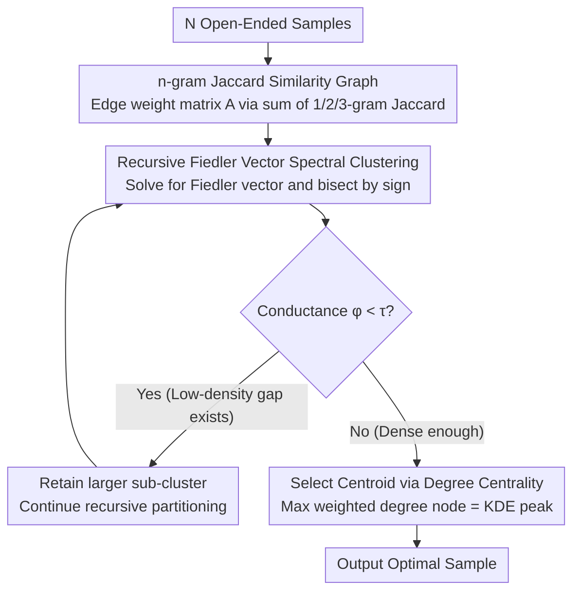

# ModeX: Evaluator-Free Best-of-N Selection for Open-Ended Generation

**Conference**: ACL 2026  
**arXiv**: [2601.02535](https://arxiv.org/abs/2601.02535)  
**Code**: https://github.com/deeplearning-wisc/ModeX  
**Area**: LLM Inference / Test-time Computing / Best-of-N Sampling  
**Keywords**: Best-of-N, Self-consistency, Spectral Clustering, Mode Extraction, Evaluator-free

## TL;DR
ModeX models Best-of-N selection for open-ended text generation as a problem of "finding modal clusters on a generated text similarity graph." By using n-gram Jaccard graph construction, recursive spectral clustering with Fiedler vectors, and centrality-based centroid selection, it generalizes self-consistency to tasks without standard answers (e.g., summarization, code, math) without requiring any reward models or LLM-judges.

## Background & Motivation

**Background**: LLM single-path generation is sensitive to sampling noise; a single unfavorable token can trigger hallucination propagation. Best-of-N (BoN) and self-consistency mitigate this by sampling multiple paths and selecting the optimal one, which has proven effective in math and multiple-choice questions.

**Limitations of Prior Work**: Existing BoN/self-consistency methods rely heavily on two types of external components: (1) external reward models or process reward models (expensive and requiring specialized training data), and (2) exact string matching for voting (applicable only to finite answer spaces). For tasks with **infinite output spaces** like summarization, coding, and open-ended QA, both fail: reward models are often unavailable for specific tasks, and exact-match voting fails because the same semantics can have countless surface expressions.

**Key Challenge**: In open-ended generation, it is impossible to enumerate answers for majority voting, and obtaining cheap, reliable external evaluators is difficult. The question of "which sample is best" falls into a dilemma.

**Goal**: Design an **evaluator-free** BoN selection method that naturally generalizes majority voting to open-ended generation without pre-defined answer sets.

**Key Insight**: The authors observe that high-quality generations tend to **cluster** in the semantic space, while hallucinations or anomalous outputs appear as sparse outliers. Thus, the question of "which sample is most likely correct" transforms into "which sample is located at the center of the densest semantic cluster." This is essentially a **mode estimation** problem in statistics.

**Core Idea**: Treat $N$ generated samples as a similarity graph (edge weight = n-gram Jaccard similarity). Use recursive spectral clustering to extract the largest "semantic modal cluster," then select the node with the highest intra-cluster degree as the centroid. Essentially, this replaces exact-match voting with **Kernel Density Estimation (KDE)**, extending majority voting to continuous semantic manifolds.

## Method

### Overall Architecture
ModeX aims to select the "most likely correct" sample from $N$ open-ended samples without a reward model or exact-match voting. Its core assumption is that high-quality generations form dense clusters in semantic space, while hallucinations act as sparse outliers. Thus, selection is equivalent to "finding the center of the densest semantic cluster." The process involves three steps: first, calculate pairwise n-gram Jaccard similarity for $N$ samples to construct an edge weight matrix $A \in \mathbb{R}^{N \times N}$; then, perform recursive spectral clustering on this graph, bisecting along the Fiedler vector and using conductance to determine if a low-density gap exists to peel off the main modal cluster; finally, select the node with the highest weighted degree within the cluster as the centroid output. Input is a set of sampled texts, the intermediate is a similarity graph and its main modal cluster, and the output is the centroid response. This process involves zero neural network re-evaluation, and its complexity $\mathcal{O}(N^2)$ is much lower than the $\mathcal{O}(NL)$ of generation itself. The authors also propose a lightweight variant, ModeX-Lite, which integrates spectral clustering into the generation process for pruning.

### Key Designs

**1. n-gram Jaccard Similarity Graph: Mathematically Defining Text "Similarity"**
In infinite output spaces, exact-match voting fails, so "how similar two texts are" must be quantified as graph edge weights. ModeX uses the sum of Jaccard similarities for 1, 2, and 3-grams: $A_{i,j}=s_1(v_i,v_j)+s_2(v_i,v_j)+s_3(v_i,v_j)$, where $s_k$ is the Jaccard similarity of $k$-gram sets. Unigrams capture vocabulary coverage, bigrams capture phrase fluency, and trigrams capture structural information. Appendix F shows that removing trigrams causes the largest performance drop, confirming the high information density of high-order n-grams. The authors compared this with LastTokenEmb and SentenceBERT embedding similarities (Table 3), where n-gram outperformed both across three tasks. In structured tasks like code and math, embeddings fail to capture critical tokens that Jaccard aligns directly.

**2. Recursive Fiedler Vector Spectral Clustering: Adaptive Modal Extraction**
The number of modes varies by task and input, making fixed-$K$ clustering like K-means unsuitable. ModeX uses spectral clustering for parameter-minimal adaptive clustering. By solving $f=\arg\min_{u^\top\mathbf{1}=0,\|u\|=1} u^\top L u$ for the Fiedler vector (the second smallest eigenvector of the graph Laplacian $L=D-A$), the graph is bisected by $f_i \ge 0$. Conductance $\phi(\mathcal{G}_1,\mathcal{G}_2)=\mathrm{cut}/\min(\mathrm{vol}_1,\mathrm{vol}_2)$ is then used to judge the quality of the cut. If $\phi < \tau$ (with $\tau=0.8$), a low-density gap exists, and the larger sub-cluster is recursively processed. This recursion corresponds to Cheeger's inequality $\lambda_2/2 \le \phi^\ast \le \sqrt{2\lambda_2}$: in the large $N$ limit, the Fiedler cut is equivalent to cutting along the "low-density valley" between two modes.

**3. Degree Centrality Selection: Formalizing Majority Voting as KDE Peaks**
Once the main modal cluster is identified, a representative output must be selected. ModeX selects the node with the maximum weighted degree in the sub-cluster adjacency matrix $\tilde{A}$: $v_c=\arg\max_i\sum_j\tilde{A}_{ij}$. This "most connected node" approach is equivalent to Kernel Density Estimation (KDE) where Jaccard acts as the kernel. The weighted degree $d(v_i)=\sum_j S(v_i,v_j) \propto \hat{p}(v_i)$ represents the density at that point. Thus, open-ended selection is translated from "discrete vote counting" to "continuous KDE peak estimation," a mapping formally proven in Theorem 2.

### Loss & Training
ModeX is completely training-free and operates only during inference: parallel generation of $N$ samples $\rightarrow$ graph construction $\rightarrow$ recursive clustering $\rightarrow$ centroid selection. Hyperparameters are limited to the conductance threshold $\tau=0.8$ and the pruning interval $T=100$ tokens for ModeX-Lite. Sensitivity experiments show stable performance within reasonable ranges ($\tau \in [0.5, 0.8]$, $T \in [100, 500]$).

## Key Experimental Results

### Main Results
Evaluation conducted on Qwen2.5-7B-Instruct and LLaMA3.1-8B-Instruct across three open-ended tasks: CNN/DailyMail (Summarization), HumanEval (Code), and Math-500 (Math).

| Model / Method | CNN/DM ROUGE-L | HumanEval Pass@1 | Math-500 Acc |
|------------|---------------|------------------|--------------|
| Qwen Single Path (Mean ± std) | 20.17 ± 0.28 | 69.89 ± 3.59 | 70.98 ± 1.74 |
| Qwen + Self-Refine (k=4) | 18.22 | 26.22 | 68.67 |
| Qwen + LLM Judge (N=16) | 19.72 | 65.24 | 74.67 |
| Qwen + Perplexity BoN (N=16) | 21.06 | 73.17 | 78.00 |
| Qwen + Self-Certainty BoN (N=16) | 19.32 | 55.49 | 67.00 |
| **Qwen + ModeX (N=16)** | 21.06 | **75.61** | **78.00** |
| **Qwen + ModeX-Lite (N=16)** | **21.89** | **78.66** | 75.33 |
| Qwen + Gold-Standard BoN (RM, N=16) | 20.49 | – | 82.00 |
| LLaMA Single Path | 21.30 ± 0.34 | 18.29 ± 15.22 | 38.75 ± 1.98 |
| **LLaMA + ModeX (N=16)** | 22.70 | **32.32** | **49.33** |
| **LLaMA + ModeX-Lite (N=16)** | **22.80** | 29.88 | 45.33 |

Qwen's code task improved from 69.89% to 78.66% Pass@1 (**Gain**: +8.8 points), approaching or even exceeding the gold-standard BoN using reward models. Summarization results comprehensively outperformed LLM-Judge and Self-Refine.

### Ablation Study
Ablations on similarity functions, n-gram combinations, and model scalability:

| Configuration | CNN/DM ROUGE-L | HumanEval Pass@1 | Math-500 Acc |
|------|---------------|------------------|--------------|
| Single Path | 20.17 | 69.89 | 70.98 |
| ModeX-LastTokenEmb (N=16) | 20.26 | 75.00 | 71.33 |
| ModeX-SentenceBERT (N=16) | 20.92 | 72.56 | 70.67 |
| **ModeX-n-gram (N=16)** | **21.06** | **75.61** | **78.00** |
| GPT-4 + ModeX (N=16, AIME2025) | – | – | 30.00 (vs 20.42 baseline) |

Complexity comparison (Single CNN/DM sample, Qwen-7B): Single Path 5.5s / Self-Refine 31.7s / LLM Judge 10.7s / **ModeX-Lite (N=16) 9.1s**. ModeX-Lite is 3.5× faster than Self-Refine.

### Key Findings
- **Structure-aware selection > Brute-force sampling**: Increasing $N$ from 4 to 16 for LLM-Judge only yielded +1.34 points (LLaMA Math), whereas ModeX-Lite gained +7.33 points, indicating that simply increasing samples without a principled selection mechanism is ineffective.
- **Early pruning is viable**: Figure 4 shows that for Math tasks, high-quality paths can be identified with < 50% of the trajectory, supporting the rationale for ModeX-Lite's intra-generation pruning.
- **Superior to Reward Models**: On Qwen Math, ModeX-Lite (75.33%) trails the gold-standard RM-BoN (82%), but on Code, ModeX achieves SOTA without requiring any external evaluator.
- **Self-Refine causes degradation**: Iterative self-correction dropped LLaMA summarization from 21.30 to 15.28, confirming that more compute without selection mechanisms amplifies error propagation.

## Highlights & Insights
- **Paradigm Shift from "Voting" to "Density Estimation"**: Translating majority voting to KDE provides mathematical interpretability and allows generalization to any open-ended generation where a similarity kernel can be defined.
- **Spectral Clustering as "Adaptive Modal Slicing"**: The combination of Fiedler vectors, Cheeger's inequality, and recursive conductance thresholds is equivalent to slicing multi-modal distributions along low-density valleys.
- **n-gram Jaccard Beats Embeddings**: Stability in code/math suggests that token/syntactic-level overlap is more accurate than semantic embeddings in highly structured tasks.
- **Efficiency via ModeX-Lite**: By differentiating high-quality paths at 50% length, ModeX-Lite transforms BoN from "select after sampling" into "prune during sampling," offering a new direction for test-time compute optimization.

## Limitations & Future Work
- **Limitations**: (1) n-gram Jaccard fails to capture deep semantic paraphrasing; diverse but correct surface forms might be misclassified as outliers. (2) It assumes "majority is correct"; if a model **collapses into a hallucinated mode**, ModeX will reinforce the error.
- **Observation**: (1) As a "collective voting" method, it may harm tasks requiring long-tail or low-probability creative answers. (2) The fixed threshold $\tau=0.8$ may not be universal. (3) Performance at very high $N$ (e.g., $N > 100$) for frontier models is unexplored.
- **Future Work**: Hybrid kernels combining Jaccard and embedding similarity; "outlier detection" strategies for creative tasks; adaptive threshold prediction.

## Related Work & Insights
- **vs Self-Consistency (Wang et al. 2023)**: SC is limited to exact-match voting for structured answers; ModeX generalizes to open-ended text without post-processing.
- **vs LLM-as-Judge (Zheng et al. 2023)**: LLM-as-Judge requires secondary inference and introduces evaluator bias. ModeX is faster and outperformed LLM-Judge by 10+ points on HumanEval.
- **vs Reward-Model BoN**: RM-BoN is the gold standard but requires specialized training; ModeX is the only universal solution when RMs are missing.
- **vs Self-Certainty / Perplexity BoN (Kang et al. 2025)**: Perplexity is often unfaithful in long-form generation (biasing toward short answers). ModeX uses external consensus across samples, which is more robust.
- **vs Self-Refine (Madaan et al. 2023)**: Serial refinement is slow and prone to error propagation; ModeX-Lite is faster and more accurate.

## Rating
- Novelty: ⭐⭐⭐⭐ Uses spectral clustering to generalize majority voting—a clean conceptual leap.
- Experimental Thoroughness: ⭐⭐⭐⭐ 3 tasks × 2 models × 5 baselines plus scaling studies.
- Writing Quality: ⭐⭐⭐⭐ Clear progression from motivation to theoretical grounding.
- Value: ⭐⭐⭐⭐⭐ Training-free, evaluator-free, and $\mathcal{O}(N^2)$ complexity; highly practical for reliable LLM systems.

<!-- RELATED:START -->

<!-- RELATED:END -->

## Related Papers

- [\[NeurIPS 2025\] Artificial Hivemind: The Open-Ended Homogeneity of Language Models (and Beyond)](../../NeurIPS2025/llm_alignment/artificial_hivemind_the_open-ended_homogeneity_of_language_models_and_beyond.md)
- [\[ACL 2026\] Mitigating Selection Bias in Large Language Models via Permutation-Aware GRPO](mitigating_selection_bias_in_large_language_models_via_permutation-aware_grpo.md)
- [\[CVPR 2026\] Unlocking Token Rewards via Training-Free Reward Attribution](../../CVPR2026/llm_alignment/unlocking_token_rewards_via_training-free_reward_attribution.md)
- [\[ACL 2026\] Alignment Data Map for Efficient Preference Data Selection and Diagnosis](alignment_data_map_for_efficient_preference_data_selection_and_diagnosis.md)
- [\[ICLR 2026\] Is On-Policy Data always the Best Choice for Direct Preference Optimization-based LM Alignment?](../../ICLR2026/llm_alignment/is_on-policy_data_always_the_best_choice_for_direct_preference_optimization-base.md)

<!-- RELATED:END -->
