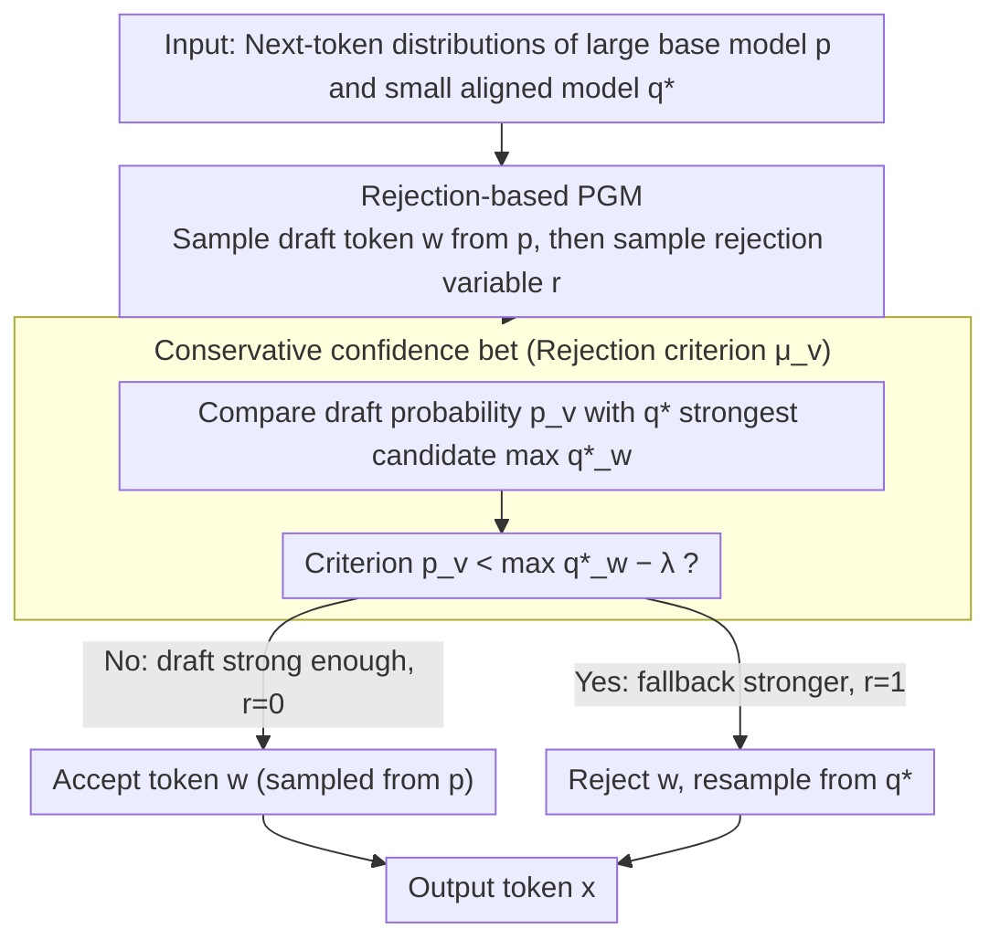

# On the Rejection Criterion for Proxy-Based Test-Time Alignment

**Conference**: ACL2026  
**arXiv**: [2604.16146](https://arxiv.org/abs/2604.16146)  
**Code**: https://github.com/ayoubhammal/knapsack-approximation-deferral  
**Area**: LLM Alignment / Test-Time Alignment  
**Keywords**: Test-time alignment, proxy models, rejection criterion, guided decoding, LLM inference

## TL;DR
This paper unifies proxy-based test-time alignment methods—such as implicit reward, Nudging, and KAD—into a "sample first, then decide to reject" probabilistic graphical model. It proposes a "conservative confidence bet" using the best confidence of a small alignment model as a reference, improving hybrid decoding accuracy across multiple mathematical and commonsense reasoning datasets.

## Background & Motivation
**Background**: LLM alignment typically relies on training phases like SFT, RLHF, DPO, and RLVR to push the base model's output distribution toward human preferences, task formats, or reasoning requirements. While effective, the cost of training-based alignment scales rapidly with model size; realigning a massive model from scratch when full post-training resources are missing is impractical.

**Limitations of Prior Work**: Test-time alignment attempts to alter the distribution during generation to avoid retraining the large model. Explicit reward-guided decoding can filter candidates per-token using rewards but often requires extra forward passes for each candidate or handles only local rewards with limited expressiveness. Methods based on full-answer reranking or MCMC require sampling many outputs, which is slow.

**Key Challenge**: Proxy-based test-time alignment uses a smaller aligned model $q^\ast$ to guide a larger base model $p$, appearing as a good compromise: it retains the large model's capabilities while borrowing the small model's alignment bias. However, existing methods lack a unified understanding of when to trust the large model versus the small model. Implicit reward methods use $q^\ast/q$ as an alignment signal to shift $p$; Nudging and KAD defer based on $p$'s confidence. Despite different surface mechanisms, they revolve around the same question: how the criterion for rejecting samples from the large model should be defined.

**Goal**: The authors first aim to provide a common probabilistic interpretation for these methods, showing they are different parameterizations of the same rejection-based generation process rather than unrelated tricks. Second, they point out that the "reject if low confidence" intuition is not robust, as natural language often has multiple equally correct tokens sharing probability mass. Finally, they aim to design a more conservative rejection criterion: switching generation from the large base model only when the small aligned model can indeed provide a stronger choice.

**Key Insight**: The paper seizes the key action of proxy methods: the large model provides a draft token, and the small model takes over only if the draft is rejected. Thus, rather than viewing different methods as reward shaping, guided decoding, or cascades, they are rewritten as a probabilistic graphical model with a latent rejection variable. Consequently, differences between methods concentrate on the rejection distribution $\pi(r=1\mid \bar{x}=v)$.

**Core Idea**: Unify proxy-based test-time alignment using a "rejection criterion," and change the criterion from looking only at the large model's own confidence to comparing the probability $p_v$ of the large model's draft token with the probability $\max_w q^\ast_w$ of the small alignment model's strongest candidate.

## Method

### Overall Architecture
This paper does not propose a new training pipeline; instead, it rewrites the probabilistic structure of test-time decoding: in the absence of a large aligned model $p^\ast$, it improves the large base model $p$ using information from a small aligned model $q^\ast$. For each token generated, a draft token $w$ is sampled from $p$; then a rejection variable $r$ determines its fate—$r=0$ accepts $w$, and $r=1$ rejects $w$ and resamples from $q^\ast$. The final output distribution is decomposed into "retaining large model samples" and "takeover by small model after rejection." Most structures in the framework are fixed (the latent draft distribution is set to $\pi(\bar{x}=w)=p_w$, and the fallback distribution is set to $q^\ast$), leaving only the rejection probability $\mu_v=\pi(r=1\mid\bar{x}=v)$—the rejection criterion in the title—open for design. In this formulation, the input is the next-token distributions of $p$ and $q^\ast$, the core is a probabilistic graphical model with a latent rejection variable, and the output is the combined token distribution. Many seemingly different test-time alignment methods are condensed into the same problem—how to set $\mu_v$ to preserve the large model's ability while switching to the small model when it is more reliable.

### Key Designs

**1. Rejection-based PGM: Decoupling proxy alignment into "propose candidate, then decide rejection"**

Existing methods are often obscured by implementation details. The authors unify them using a generative model with a latent draft token and a rejection variable: first sample $\bar{x}=w$ from $p$, then sample rejection variable $r$. If $r=0$, the final token copies $w$; if $r=1$, sample from $q^\ast$. The overall output distribution is summarized as $\pi(x=v)=p_v(1-\mu_v)+q^\ast_v\sum_w p_w\mu_w$. This framework explicitly decomposes "using a small aligned model to guide a large base model" into two interpretable steps: the large model proposes a candidate, and a rejection criterion is defined. This allows direct comparison of Nudging, KAD, and implicit reward methods.

**2. Reducing existing proxy methods to different rejection criteria**

Within this unified framework, prior methods are simply different choices for $\mu_v$. Nudging uses a distribution-level criterion: if $\max_w p_w < \lambda$, the entire step is handed over to $q^\ast$, rejecting the entire distribution $p$ rather than a specific token. Dual KAD is a token-level criterion: a sampled token is rejected if its probability $p_v < \lambda$. Implicit reward methods construct $s_v=p_v(q^\ast_v/q_v)/Z$; Proposition 1 in the paper proves that, under enclosing conditions, this can also be generated by certain rejection distributions. This reduction exposes a shared weakness: Nudging and KAD rely only on the absolute confidence of $p$ without asking if the fallback $q^\ast$ can do better, while implicit reward requires access to both the base and aligned versions of the small model, increasing deployment complexity.

**3. Conservative confidence bet: Rejection depends on whether the fallback has a stronger candidate**

The new criterion shifts the decision from "is the large model confident" to "does the small aligned model have a more certain alternative." For a token $v$ sampled from $p$, it compares $p_v$ with the probability of the most confident token in the small aligned model, $\max_w q^\ast_w$: if $p_v < \max_w q^\ast_w - \lambda$, it indicates that $q^\ast$ has at least one candidate more reliable than the current draft, leading to rejection; otherwise, it is kept. A larger margin $\lambda$ makes the policy more conservative and less likely to trigger deferral. This design addresses the fact that "low confidence" does not automatically mean "wrong." For instance, if both "frameworks like Pytorch" and "frameworks such as Pytorch" are reasonable, the probability mass is split between "like" and "such," resulting in low individual token probabilities. By using the best candidate of $q^\ast$ as a baseline, rejection only occurs when the fallback truly offers a stronger option, avoiding excessive switching due to language ambiguity.

### Loss & Training
This paper does not train new models or introduce extra losses; it focuses on decoding-time distribution combination strategies. Each generation step simultaneously retrieves the next-token distributions of $p$ and $q^\ast$, determining the final token source via the rejection criterion. Experiments use a temperature of 0.7 to isolate the benefits of the decoding rule. The margin $\lambda$ is selected from $\{0, 0.1, 0.2\}$ on a small development subset; the authors emphasize that performance is competitive even at $\lambda=0$.

## Key Experimental Results

### Main Results
Experiments follow the setup of Hammal et al. (2026), evaluating three mathematical reasoning datasets (GSM8K, MATH500, SVAMP) and two commonsense reasoning datasets (ARC-Challenge, CommonsenseQA). Model families include OLMo 2 and Qwen 3, each pairing a small aligned model with a large base model. The metric is accuracy after answer extraction.

| Model Family | Method | GSM8K | MATH | SVAMP | ARC | CSQA | Avg. |
|--------------|--------|------:|-----:|------:|----:|-----:|-----:|
| OLMo 2 | Large base model $p$ | 54.5 | 9.4 | 57.6 | 29.6 | 19.4 | 34.1 |
| OLMo 2 | Small aligned model $q^\ast$ | 62.5 | 16.4 | 70.3 | 43.8 | 48.4 | 48.2 |
| OLMo 2 | Implicit reward | 58.4 | 18.2 | 73.0 | 63.3 | 55.8 | 53.7 |
| OLMo 2 | Dual KAD, $\lambda=0.4$ | 72.3 | 23.4 | 75.3 | 61.9 | 55.6 | 57.7 |
| OLMo 2 | Confidence bet, $\lambda=0.2$ | 71.7 | 26.4 | 79.0 | 62.6 | 54.9 | 58.9 |
| OLMo 2 | Target large aligned model $p^\ast$ | 84.3 | 39.6 | 87.6 | 82.5 | 76.9 | 74.1 |
| Qwen 3 | Large base model $p$ | 75.5 | 51.8 | 80.0 | 86.6 | 76.9 | 74.1 |
| Qwen 3 | Small aligned model $q^\ast$ | 75.3 | 53.0 | 86.6 | 82.9 | 68.7 | 73.3 |
| Qwen 3 | Implicit reward | 80.7 | 60.6 | 89.0 | 88.9 | 78.1 | 79.4 |
| Qwen 3 | Dual KAD, $\lambda=0.4$ | 81.7 | 60.6 | 87.3 | 91.5 | 80.7 | 80.3 |
| Qwen 3 | Confidence bet, $\lambda=0.2$ | 82.1 | 61.6 | 89.3 | 90.5 | 79.3 | 80.5 |
| Qwen 3 | Target large aligned model $p^\ast$ | 82.4 | 64.0 | 88.3 | 93.8 | 83.1 | 82.3 |

For OLMo 2, "confidence bet" reaches an average accuracy of 58.9, outperforming dual KAD (57.7) and implicit reward (53.7). Specifically, MATH accuracy improves from 23.4 (dual KAD) to 26.4, showing the new criterion avoids erroneous deferral on difficult math tasks. For Qwen 3, the average "confidence bet" (80.5) is very close to dual KAD (80.3) and slightly higher than implicit reward (79.4). It performs stronger on math but does not always lead on commonsense tasks.

### Ablation Study
The paper analyzes the sensitivity of the margin $\lambda$. Only the average accuracies are listed below to show the impact of conservativeness.

| Configuration | OLMo 2 Avg. | Qwen 3 Avg. | Description |
|---------------|------------:|------------:|-------------|
| Confidence bet, $\lambda=0$ | 56.0 | 78.4 | Most aggressive; switches whenever $p_v$ is lower than $q^\ast$'s top candidate |
| Confidence bet, $\lambda=0.1$ | 58.4 | 79.9 | Medium margin; more stable than $\lambda=0$ for both model families |
| Confidence bet, $\lambda=0.2$ | 58.9 | 80.5 | Best average setting; shows conservative rejection reduces unnecessary deferral |
| Nudging, $\lambda=0.4$ | 50.2 | 78.7 | Distribution-level threshold; significantly weaker than token-level rules on OLMo 2 |
| Dual KAD, $\lambda=0.4$ | 57.7 | 80.3 | Strong baseline; considers $p_v$ but not the relative strength of $q^\ast$'s top candidate |

### Key Findings
- The most stable gains occur in OLMo 2: the 37.4 point gap between the base model $p$ and the target aligned model $p^\ast$ indicates a large alignment deficit where the proxy signal from the small aligned model provides high value.
- Gains on Qwen 3 are smaller because the base and aligned models are already close (71.4 vs 80.2), compressing the headroom for any deferral method.
- $\lambda=0.2$ is the best average setting for both model families, confirming that "being conservative" is beneficial: leaving a margin for $p$ avoids over-rejection due to linguistic ambiguity.
- The new criterion is particularly attractive for mathematical reasoning. Qwen 3's MATH score reaches 61.6 (vs 60.6 for dual KAD), and OLMo 2's MATH score reaches 26.4 (vs 23.4 for dual KAD).
- Success is not universal across commonsense tasks. On Qwen 3 ARC/CSQA, dual KAD (91.5/80.7) outperforms confidence bet (90.5/79.3), suggesting that the calibration quality of the small model's confidence baseline still affects decision making across task types.

## Highlights & Insights
- The most significant highlight is the "unified perspective." The paper does not treat Nudging, KAD, and implicit reward as isolated paths; rather, it identifies them as instances of rejection distributions, allowing subsequent designs to focus directly on $\mu_v$.
- The brilliance of the "conservative confidence bet" is that it moves the question from "is the large model confident" to "does the small model have a more certain alternative." This is closer to the essence of deferral, which is about choosing the more trustworthy source among two generators.
- The critique of language ambiguity is insightful. Multiple tokens being simultaneously correct is standard in natural language; a decline in single-token probability does not necessarily imply a model error. Misinterpreting this as uncertainty causes the decoder to switch frequently to smaller models, sacrificing the benefits of the larger model.
- This approach is transferable to other cascade or speculative decoding scenarios. In any system where a primary model proposes candidates and an auxiliary model can take over, the decision logic can be changed from fixed thresholds to relative comparisons between the candidate source and the fallback source.
- The paper also reminds us that proxy models are not natural experts. Old "reject option" intuitions often assume fallback errors are negligible, but $q^\ast$ can be weaker than $p$. Thus, rejection criteria must explicitly consider the fallback quality rather than just the primary model's uncertainty.

## Limitations & Future Work
- The margin $\lambda$ still needs selection on a development set. While $\lambda=0$ is competitive, the best results require tuning, which may vary by model family, task, or temperature.
- Experiments focus on math and commonsense QA where the primary metric is accuracy. Whether this criterion works stably for open-ended writing, safety refusal, or multi-turn dialogue remains to be verified.
- The method requires retrieving distributions from both $p$ and $q^\ast$ at each step, making inference more expensive than running a single model. Analysis of throughput, latency, and VRAM overhead is limited.
- Confidence bet relies on probability calibration. If $q^\ast$'s maximum probability is consistently over or under-confident, the $\max_w q^\ast_w$ baseline will mislead the deferral. Future work could consider temperature calibration or task-adaptive margins.
- Currently, the criterion only compares single-token confidence and does not model long-term returns. Some tokens may have low immediate probability but lead to better full reasoning chains.

## Related Work & Insights
- **vs Implicit reward / proxy tuning**: Implicit reward uses $q^\ast/q$ to extract the alignment shift of the small model and applies it to $p$ to form $s$. This paper explains this as a special case of rejection-based sampling while avoiding the requirement to access the base version $q$.
- **vs Nudging**: Nudging performs distribution-level deferral based on $\max_w p_w$. If the large model appears broadly unconfident, the step is handed to $q^\ast$. This paper argues this confuses ambiguity with uncertainty, moving the decision to token-level and introducing a relative reference from $q^\ast$.
- **vs Dual KAD**: Dual KAD moves to token-level decisions but still uses absolute thresholds like $p_v<\lambda$. This paper improves on it by making the threshold relative to $q^\ast$'s current strongest candidate, better reflecting whether it is "worth" handing over to the proxy.
- **vs Cascade / speculative decoding**: Related cascade methods also make takeover decisions between models. This paper's insight for NLP alignment is that takeover rules should use relative evidence from both models rather than treating the small model as an always-correct fallback expert.

## Rating
- Novelty: ⭐⭐⭐⭐ The unified PGM perspective is clear, and the new criterion captures the relative nature of deferral; it is simple in form but targets the right problem.
- Experimental Thoroughness: ⭐⭐⭐⭐ Coverage across two model families and five reasoning datasets with margin analysis; could benefit from open-ended alignment evaluation and efficiency analysis.
- Writing Quality: ⭐⭐⭐⭐ Direct and concise, with good correspondence between formulas and intuition.
- Value: ⭐⭐⭐⭐ Highly relevant for researchers working on test-time alignment, model cascading, and guided decoding; serves as a foundational framework for designing rejection/deferral rules.

<!-- RELATED:START -->

## Related Papers

- [\[ICLR 2026\] GuardAlign: Test-time Safety Alignment in Multimodal Large Language Models](../../ICLR2026/llm_alignment/guardalign_test-time_safety_alignment_in_multimodal_large_language_models.md)
- [\[CVPR 2025\] Jailbreaking the Non-Transferable Barrier via Test-Time Data Disguising](../../CVPR2025/llm_alignment/jailbreaking_the_non-transferable_barrier_via_test-time_data_disguising.md)
- [\[ACL 2026\] Pref-CTRL: Preference Driven LLM Alignment using Representation Editing](pref-ctrl_preference_driven_llm_alignment_using_representation_editing.md)
- [\[ACL 2026\] Debiasing Reward Models via Causally Motivated Inference-Time Intervention](debiasing_reward_models_via_causally_motivated_inference-time_intervention.md)
- [\[NeurIPS 2025\] Inference-time Alignment in Continuous Space](../../NeurIPS2025/llm_alignment/inference-time_alignment_in_continuous_space.md)

<!-- RELATED:END -->
