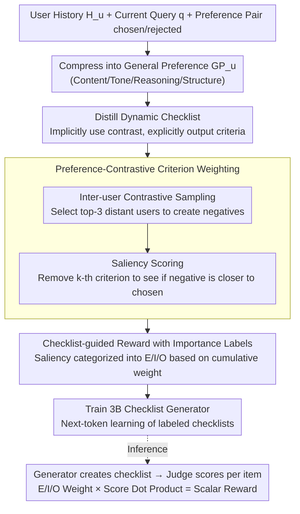

# P-Check: Advancing Personalized Reward Model via Learning to Generate Dynamic Checklist

**Conference**: ACL2026  
**arXiv**: [2601.02986](https://arxiv.org/abs/2601.02986)  
**Code**: Marked as CODE on the paper page, specific URL not parsed in cache  
**Area**: Interpretability / Personalized Reward Model  
**Keywords**: Personalized Reward Model, Dynamic Checklist, LLM-as-a-Judge, Preference Contrastive Learning, Interpretable Alignment

## TL;DR
P-Check transforms personalized reward modeling from "cramming user history into the judge" to "first generating a weighted dynamic evaluation checklist for the current user and current query, then using it to guide reward scoring." It significantly outperforms persona, memory retrieval, and fine-tuned reward model baselines on personalized preference prediction and downstream generation tasks in PRISM, Arena, and BESPOKE.

## Background & Motivation
**Background**: RLHF and preference optimization typically rely on reward models to compress human feedback into a scalar score. As LLMs are increasingly used as personal assistants, reward models must judge not just "general quality," but also whether an output aligns with specific user tastes, tone, information density, value orientations, and task habits. Existing personalized reward modeling typically provides user history as context, retrieved memory, user embeddings, personas, or few-shot examples to the reward model.

**Limitations of Prior Work**: User signals in these methods are mostly static and implicit. A static persona might describe a user as "liking specific, structured, and analytical responses," but it does not necessarily tell the judge which conditions to check for the current query. Implicit user embeddings are harder to interpret and difficult to use as explicit constraints for the judge in OOD queries. Preliminary experiments show that even when provided with user history, LLMs struggle to select the checklist that truly explains user preference between an oracle checklist and a counter-preference checklist; however, if an explicit checklist is provided directly, the LLM's personalized judgment improves significantly.

**Key Challenge**: Personalized judgment involves both long-term user preferences and the current task context. Long-term preferences provide stable tendencies, while the current query determines which tendencies are actually relevant. Treating user history as a fixed profile ignores the drift of preference focus across different tasks for the same user; relying solely on free-text rationales risks mixing objective quality errors with subjective preferences.

**Goal**: The authors aim to train a plug-and-play checklist generator: it takes a summary of user history and the current query as input and outputs the personalized evaluation criteria required for the current judgment. These criteria then guide any LLM-as-a-Judge to predict the reward. This goal encompasses three sub-problems: how to construct checklist supervision signals from preference pairs, how to distinguish criteria that truly determine user choice from superficial ones, and how to ensure the generated checklist stably translates into a scalar reward during inference.

**Key Insight**: The authors interpret "human evaluation" as a process of ad-hoc construction of evaluation criteria. When facing a new problem, humans do not necessarily explicitly recall all historical preferences but rather form a few actionable standards based on the current situation, such as "give me specific facts," "consider historical context," or "don't be too conservative in tone." Such standards are closer to an executable interface for a judge than a generic persona.

**Core Idea**: Use a dynamically generated personalized checklist with importance labels, instead of a static persona or implicit user vector, as the intermediate representation for the reward model to judge personalized preferences.

## Method
The core of P-Check is splitting personalized reward modeling into two steps: first, learning a small checklist generator offline that writes evaluation criteria with importance labels based on the user profile and current query; then, allowing any LLM judge to score according to these criteria and aggregate them into a scalar reward via weighting. The challenge lies not in generating the checklist itself, but in extracting criteria that truly distinguish user tastes from preference pairs and assigning a credible weight to each criterion.

### Overall Architecture
The inputs are a user's historical preferences $H_u$, current query $q$, and candidate response $y$. Traditional reward models directly estimate $r(y \mid H_u, q)$, compressing user signals into an implicit context. P-Check inserts an explicit checklist $C_{u,q}$ in the middle, rewriting the reward as a judgment determined by the candidate response, query, user history, and checklist: $r \sim P_\theta(\cdot \mid y, q, H_u, C_{u,q})$. This is equivalent to placing a "what to check here" itemization before the judge. During training, checklists are distilled from preference data and importance labels are annotated to teach a 3B small model to act as the generator. At inference time, the process involves the generator producing a checklist and the judge scoring it item-by-item; thus, training is complex but test overhead only adds one checklist generation and item-level scoring session compared to a bare judge.

### Key Designs

**1. Distilling dynamic checklists from preference pairs: Replacing static persona with executable criteria**

A static persona can describe a user as "liking specific, structured answers," but it doesn't tell the judge exactly which items to verify for the current query. Preliminary experiments also show that LLMs struggle to derive correct criteria solely from user history. P-Check first compresses historical preferences into a general preference $GP_u$ emphasizing content, tone, reasoning, and structure. Then, using $GP_u$, the query, and the chosen/rejected pair, a strong LLM generates the checklist $C_{u,q}=LLM(GP_u,q,y^+,y^-)$. A key trade-off is that the prompt explicitly requires the final checklist not to mention the specific answers themselves, but only to present criteria derived from the user profile and query. Because the chosen/rejected pair best reveals the factors distinguishing user preference for the current task, but if traces of the pair are in the list, the generator would learn instance-level explanations rather than generalizable criteria. This "implicitly use contrast, explicitly output criteria" approach ensures the checklist is both discriminative and transferable.

**2. Preference-Contrastive Criterion Weighting: Rating each criterion's weight by marginal impact after removal**

Original rejected responses are often just low-quality and do not represent a "personalized contrast" that another user might like but the target user does not. Thus, directly trusting the LLM-written checklist easily mistakes general quality standards for core signals. P-Check first performs inter-user contrastive sampling: users are clustered by $GP$, the most distant cluster is selected for the target user, and combined with query-conditioned embedding $Enc(GP_x,q)$, the top-3 preference-distant users are selected to generate negative responses for the same query. This shifts the contrast axis from general quality to personalized difference. Subsequently, personalized saliency scoring is performed: the LLM scores the chosen answer and the negative pool against each criterion, calculating the increase in the normalized score ratio of the negative pool relative to the chosen answer after removing the $k$-th criterion:

$$Saliency(c_k)=\frac{s(C^{-k},Y^-)}{s(C^{-k},y^+)+\epsilon}-\frac{s(C,Y^-)}{s(C,y^+)+\epsilon}$$

Criteria that better pull the chosen answer and negatives apart have higher saliency, while irrelevant items or those easily satisfied by all answers are downweighted. This step uses "valuation by seeing if the negative gets closer to the chosen upon deletion," which is more controllable than letting the LLM self-report importance and closer to the goal of reward prediction.

**3. Checklist-guided reward with importance labels: Effectively integrating the checklist into score aggregation**

A pure checklist only tells the judge "what to see," not "which items are more important." During P-Check training, saliency is sorted and discretized into three natural language labels—Essential, Important, and Optional—based on cumulative weight thresholds $\tau_1=0.4, \tau_2=0.9$. During inference, the judge outputs a criterion-wise score vector for the candidate response, and E/I/O labels are mapped back to numerical weights (Essential=1.0, Important=0.7, Optional=0.3 in main experiments). The final reward is the dot product of weights and itemized scores: $r_{u,q}(y)=\mathbf{w}_{u,q}^\top\theta(GP_u,q,y,\hat{C}_{u,q})$. Continuous weights are easy to calculate but hard to generate and interpret; discrete E/I/O labels provide a lightweight, readable, and learnable weight interface for small models, allowing the same checklist to enhance interpretability and stably aggregate into scalar rewards.

### Loss & Training
The checklist generator is trained using standard next-token prediction, aiming to maximize the probability of the labeled checklist $\tilde{C}_{u,q}$ conditioned on $GP_u, q$. The loss is: $\mathcal{L}_\phi=-\sum \log p_\phi(\tilde{C}_{u,q}\mid GP_u,q)$. Llama-3.2-3B-Instruct is used as the generator backbone, trained for 3 epochs on 8 A6000 GPUs, with a per-device batch size of 2, gradient accumulation of 16, and a learning rate of $2\times10^{-4}$.

For training data construction, GPT-4o-mini generates the $GP_u$ and initial checklists, with rejection sampling used to filter low-quality samples: if a checklist as extra context does not result in a higher reward for the chosen response from a Llama-3.1-8B judge, it is regenerated. Contrastive sampling uses Qwen3-Embedding-0.6B for user representation, using K-Means to find distant clusters and selecting the top-3 query-conditioned distant users. Saliency scoring uses Llama-3.1-8B, outputting 1-10 scores per criterion.

Inference does not require re-running contrastive sampling or saliency calculation; it only involves generating the checklist and itemized scoring. While the training pipeline is complex, testing is only slightly slower than a standard LLM judge due to checklist generation and criteria scoring.

## Key Experimental Results

### Main Results
Evaluation was conducted on three personalized reward benchmarks: PRISM-Personalized (ID), ChatbotArena-Personalized and BESPOKE-MetaEval (OOD). All data used strict user-level splits (test users unseen during training). The metric is binary preference prediction accuracy. Reward judges used Llama-3-8B-Instruct and Llama-3-3B-Instruct.

| Method | PRISM-P 8B | ARENA-P 8B | BESPOKE-M 8B | Average |
|------|------------|-------------|--------------|------|
| GPO | 56.48 | 52.01 | 51.49 | 53.20 |
| VPL | 58.23 | 53.36 | 53.54 | 54.77 |
| PAL | 54.23 | 53.89 | 51.33 | 53.36 |
| BT + SynthMe | 62.74 | 56.42 | 50.47 | 55.86 |
| Default LLM judge | 52.80 | 53.56 | 55.46 | 53.19 |
| + Memory | 54.17 | 58.15 | 57.75 | 54.58 |
| + CoT distill | 55.47 | 55.84 | 61.35 | 55.84 |
| + SynthMe | 55.24 | 58.83 | 54.67 | 54.16 |
| + P-Check | 65.11 | 61.56 | 75.48 | 63.62 |

P-Check achieves an average accuracy of 63.62, a 10.43 percentage point increase over Default LLM judge (approx. 19.61% relative improvement). Crucially, it leads significantly on the two OOD datasets: outperforming Memory / SynthMe in Arena and jumping from 55.46 to 75.48 in BESPOKE. This indicates that the distilled checklist learns evaluation logic that transfers to new users and scenarios rather than static templates.

The authors also tested if P-Check transfers across different judges. Results show that regardless of the judge (Qwen3-8B, Qwen3-13B, GPT-4o-mini, or GPT-4o), accuracy across all three datasets improved with P-Check. For instance, GPT-4o on BESPOKE-M improved from 63.27 to 77.66. This suggests that the bottleneck is not merely judge capacity, but the lack of an explicit interface telling the judge "what to look for."

| Judge | PRISM-P Original | PRISM-P + P-Check | ARENA-P Original | ARENA-P + P-Check | BESPOKE-M Original | BESPOKE-M + P-Check |
|-------|--------------|-------------------|--------------|-------------------|-----------------|----------------------|
| Qwen3-8B | 55.14 | 63.71 | 57.41 | 59.98 | 59.23 | 70.36 |
| Qwen3-13B | 59.76 | 63.23 | 58.89 | 63.62 | 64.14 | 79.16 |
| GPT-4o-mini | 56.07 | 63.40 | 59.86 | 62.31 | 60.23 | 76.51 |
| GPT-4o | 58.94 | 64.83 | 60.06 | 69.36 | 63.27 | 77.66 |

### Ablation Study
Ablation focused on the two components of Preference-Contrastive Criterion Weighting: inter-user contrastive sampling and saliency scoring. Full P-Check is strongest; removing saliency scoring caused the largest drop, particularly in BESPOKE-M (from 75.48 to 66.68).

| Configuration | PRISM-P | ARENA-P | BESPOKE-M | Description |
|------|---------|---------|-----------|------|
| P-Check (full) | 65.11 | 61.56 | 75.48 | Full model |
| w/o inter-user sampling | 63.46 | 59.56 | 72.23 | Negatives consist only of original rejected; weaker personalized contrast |
| w/o saliency scoring | 59.98 | 58.46 | 66.68 | Items lack discriminative weights; generalization and aggregation suffer |

Downstream personalized generation was evaluated on BESPOKE using P-Check as the reward. Comparison included Best-of-N (BoN) selection and DPO, with metrics including ROUGE-L, METEOR, and BESPOKE-EVAL. Regardless of whether the policy was Llama3-8B or GPT-4o-mini, P-Check achieved the highest scores, with differences vs. the strongest baseline being statistically significant (paired t-test).

| Alignment | Policy | Reward / Method | ROUGE-L | METEOR | BESPOKE-EVAL |
|----------|--------|---------------|---------|--------|--------------|
| BoN | Llama3-8B | Default policy | 7.92 | 6.09 | 51.55 |
| BoN | Llama3-8B | strongest baseline: CoT distill | 8.24 | 7.14 | 54.90 |
| BoN | Llama3-8B | P-Check | 9.43 | 8.22 | 59.76 |
| BoN | GPT-4o-mini | strongest baseline: CoT distill | 8.24 | 7.62 | 54.76 |
| BoN | GPT-4o-mini | P-Check | 9.61 | 8.47 | 57.32 |
| DPO | Llama3-8B | strongest baseline: CoT distill | 8.41 | 7.63 | 56.64 |
| DPO | Llama3-8B | P-Check | 9.94 | 9.67 | 61.21 |

### Key Findings
- Explicit checklists are more effective than static personas. Preliminary tests showed LLMs struggle to infer correct criteria from history alone; however, once an oracle checklist is provided, preference selection improves significantly.
- Saliency scoring is the most critical training signal. Removing it causes a larger drop than removing contrastive sampling, indicating that criteria in the checklist cannot be treated equally; the model must know which items actually drive user choices.
- P-Check is more robust with sparse history and OOD users. Accuracy remains steady as the number of observable historical interactions decreases, whereas baselines degrade. This is likely because it only needs to extract a few criteria relevant to the current query rather than reconstructing the full preference distribution.
- Checklists can serve as verbal feedback for lightweight personalization. Using P-Check checklists for self-correction outperformed Self-Refine and SynthMe, showing checklists can be fed directly back to generative models.
- Inference time for Llama-3-8B on PRISM increased from 19:30 to 28:37, but accuracy jumped from 52.8 to 65.11. Compared to Qwen3-13B, it has similar latency but higher accuracy; compared to BT+SynthMe, it is both faster and more accurate.

## Highlights & Insights
- The most valuable contribution is switching the intermediate layer of personalized rewards from "user representation" to an "evaluation interface." Personas and embeddings describe the user; checklists describe what the judge should check, making them highly suitable for LLM-as-a-Judge.
- Preference-Contrastive Criterion Weighting is clever: it doesn't blindly trust LLM-generated checklists but estimates criterion value by the marginal change in the chosen/negative gap upon deletion.
- Inter-user negative design captures the essence of personalization. A response might not be low quality, but merely mismatched with the target user. Constructing negatives from users with distant preferences allows the checklist to learn the axis of difference that matters specifically to the target user.
- E/I/O labels are a practical engineering compromise. Continuous weights are good for math but bad for generation/explanation; natural language labels are learnable and human-readable.
- This approach is transferable to tasks with highly subjective preferences, such as personalized writing assistants, code review style modeling, or educational depth control.

## Limitations & Future Work
- The checklist assumes preferences can be expressed via discrete natural language criteria. Some preferences involve subtle rhythm or tone that might not be perfectly externalized. Future work could explore hybrid representations of explicit criteria and implicit vectors.
- Error propagation: if the generator produces an incorrect checklist, the reward will systematically shift. Case studies showed the model misjudging a subjective question as needing "scientific consensus."
- The training pipeline is heavy (summaries, checklists, clustering, extra negatives, saliency annotation). While cacheable offline, maintenance in real products is non-trivial.
- Experiments rely on public benchmarks; real-world deployment requires handling privacy, shifting preferences, and safety policy conflicts.

## Related Work & Insights
- **vs SynthMe / persona-based personalization**: SynthMe uses personas and examples to optimize judge prompts (describing "who the user is"); P-Check generates query-specific checklists (describing "what the answer should satisfy"). The former is broader, the latter more actionable.
- **vs VPL / PAL / GPO**: These learn user embeddings or mixture models for end-to-end modeling; P-Check's intermediate representation is interpretable, editable, and plug-and-play for different judges.
- **vs rubric / checklist-based evaluation**: Existing rubric rewards focus on task-level or general quality; P-Check personalizes the rubric to the user and query with saliency weighting.
- **vs generative reward modeling / CoT distill**: CoT rationales explain why an answer is good but don't necessarily form reusable scoring dimensions; P-Check structures reasoning into weighted criteria.
- **Insight**: Personalized systems don't have to cram all preferences into policy parameters. Decoupling the "user preference interpreter" from the "base judge/generator" may be a cheaper, more transparent, and more debuggable path.

## Rating
- Novelty: ⭐⭐⭐⭐☆ Using dynamic checklists and criterion saliency for personalized reward modeling is a novel problem definition and training signal.
- Experimental Thoroughness: ⭐⭐⭐⭐⭐ Covers ID/OOD accuracy, different judges, sparse history, downstream BoN/DPO, verbal feedback, ablation, cost, and case studies.
- Writing Quality: ⭐⭐⭐⭐☆ Clear main line and solid organization; however, some table placements require jumping between the main text and appendix.
- Value: ⭐⭐⭐⭐⭐ Direct inspiration for personalized alignment, interpretable rewards, and LLM-as-a-Judge frameworks.

<!-- RELATED:START -->

## Related Papers

- [\[ICLR 2026\] RewardBench 2: Advancing Reward Model Evaluation](../../ICLR2026/llm_alignment/rewardbench_2_advancing_reward_model_evaluation.md)
- [\[ACL 2026\] PERSA: Reinforcement Learning for Professor-Style Personalized Feedback with LLMs](persa_reinforcement_learning_for_professor-style_personalized_feedback_with_llms.md)
- [\[ICLR 2026\] Learning to Summarize User Information for Personalized RLHF (PLUS)](../../ICLR2026/llm_alignment/learning_to_summarize_user_information_for_personalized_reinforcement_learning_f.md)
- [\[ICLR 2026\] Inverse Reinforcement Learning with Dynamic Reward Scaling for LLM Alignment](../../ICLR2026/llm_alignment/inverse_reinforcement_learning_with_dynamic_reward_scaling_for_llm_alignment.md)
- [\[ACL 2025\] Dynamic Scaling of Unit Tests for Code Reward Modeling](../../ACL2025/llm_alignment/dynamic_scaling_of_unit_tests_for_code_reward_modeling.md)

<!-- RELATED:END -->
