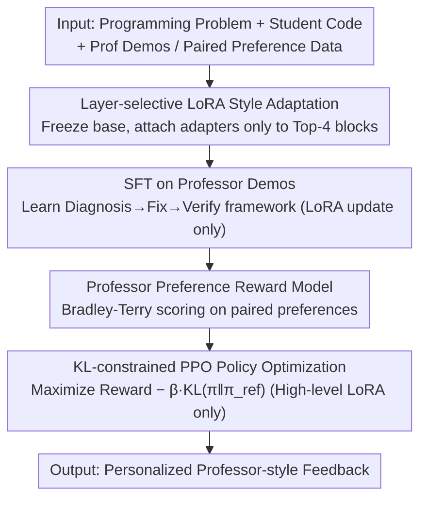

# PERSA: Reinforcement Learning for Professor-Style Personalized Feedback with LLMs

**Conference**: ACL2026  
**arXiv**: [2605.01123](https://arxiv.org/abs/2605.01123)  
**Code**: Not disclosed  
**Area**: Educational Feedback / LLM Personalization / Alignment RLHF  
**Keywords**: Educational feedback, Personalized LLMs, RLHF, LoRA, Style alignment

## TL;DR
PERSA utilizes "professor demonstrations + professor preference rewards + PPO updating only high-level LoRA" to tune general LLMs into specific teacher programming feedback styles. It significantly improves style consistency across APPS, PyFiXV, and CodeReviewQA while maintaining nearly 100% diagnostic accuracy.

## Background & Motivation
**Background**: LLMs are capable of generating feedback for programming problems, code reviews, and learning platforms. Mainstream approaches include direct prompting, supervised fine-tuning (SFT), general RLHF, and preference optimization such as DPO/ORPO/KTO. in educational contexts, feedback quality depends not only on whether the identified bug is correct, but also on tone, structure, level of encouragement, and whether actionable suggestions are provided.

**Limitations of Prior Work**: General LLMs typically describe a general direction but struggle to organize feedback like a specific real-world teacher. For instance, regarding "read the array before finding the index," a general model might simply write "check input handling," whereas teacher-style feedback usually validates progress first, locates the root cause, and finally reminds the student about edge cases. Full-parameter fine-tuning often degrades underlying capabilities and incurs high computational costs.

**Key Challenge**: Personalized teaching requires changing "how to speak" without damaging "what the model knows." Style is a high-level discourse attribute, while correctness relies on low-level code understanding and reasoning. Updating all parameters simultaneously causes style transfer and knowledge retention to interfere with each other.

**Goal**: The authors aim to solve three sub-problems: first, how to learn a "professor's voice" from demonstrations and preferences; second, how to preserve diagnostic correctness during RLHF; third, how to make this personalized adaptation lightweight enough for 2B-3B scale open models.

**Key Insight**: Observations from internal transformer analysis suggest that high-level attributes like style, tone, and discourse organization are concentrated in the upper layers, particularly in FFN and high-level projection modules. Therefore, it is unnecessary to update the full model; one only needs to attach LoRA to high-level layers and inject preference signals into these style-carrying components via RLHF.

**Core Idea**: Utilize layer-selective LoRA to restrict RLHF updates to the high-level blocks of the model, allowing PPO to primarily adjust the teacher-style expression while freezing the original model's code diagnostic capabilities as much as possible.

## Method
**Mechanism**: PERSA can be understood as a compact RLHF pipeline tailored for "professor-style programming feedback." Rather than reinventing RLHF, it constrains the three stages of RLHF into a style-related parameter subspace: performing SFT with professor demonstrations, training a reward model with paired preferences, and finally optimizing the policy model using PPO with KL constraints. The critical difference is that the trainable parameters are not the full model, but LoRA adapters situated in high-level transformer blocks.

### Overall Architecture
The input is a programming problem, the student's submitted code, and a prompt potentially containing error types or context; the output is natural language feedback for the student. Training data includes two types: professor-authored feedback demonstrations denoted as $(x, y^*)$, and paired preferences for candidate feedback under the same prompt denoted as $(x, y_w, y_l)$, where $y_w$ better matches the professor's style or correctness.

The entire pipeline consists of four steps. Step 1: Load LoRA onto Llama-3.2-3B-Instruct or Gemma-2-2B-IT, enabling only the attention and FFN projections of the top several transformer blocks. Step 2: Perform SFT using professor demonstrations to learn the basic "Diagnosis $\rightarrow$ Fix Suggestion $\rightarrow$ Verification Reminder" format. Step 3: Train a reward model $r_\phi(x, y)$ using the Bradley-Terry objective to assign higher scores to professor-preferred responses. Step 4: Starting from the SFT model, use PPO to maximize rewards while applying a KL penalty to limit deviation from the SFT reference policy.

During inference, PERSA receives student code and generates feedback like a standard instruction model; it requires no additional retrieval or external executors. The behavioral changes stem primarily from high-level LoRA adapters, allowing different adapters for different teachers to be maintained on a shared base model.

### Key Designs

**1. Layer-selective LoRA Style Adaptation: Attaching adapters only to high-level layers to embed style into a minimal parameter subspace**

The core contradiction in personalized teaching is changing "how the model speaks" without destroying "what it knows." Full-parameter fine-tuning forces the two to compete. The authors hypothesize that discourse attributes like style, tone, and format are primarily carried by the upper transformer attention and FFN projections, while lower layers contain more syntax and code knowledge. Consequently, PERSA only overlays LoRA low-rank increments $\Delta W=BA$ on selected high-level weight matrices, freezing all base weights. A typical configuration targets the top 4 blocks (top-4 LoRA). This reduces trainable parameters from billions to millions, significantly preventing the catastrophic drift that would damage diagnostic capabilities and enabling the deployment of multiple teacher-specific adapters on one shared base.

**2. Professor Preference Reward Model: Converting "teacher-like," "educational value," and "correctness" into optimizable scalar signals**

SFT can only imitate the average distribution of demonstrations, learning the framework of "Diagnosis $\rightarrow$ Fix Suggestion $\rightarrow$ Verification Reminder" but failing to capture nuanced preferences in wording strength, encouragement methods, or edge-case reminders. To address this, PERSA trains a reward model $r_\phi(x, y)$ on paired preferences $(x, y_w, y_l)$. The reward modeling follows the Bradley-Terry form, aiming to maximize the score gap between winning and losing samples with the loss: $L_{RM}=-\mathbb{E}[\log\sigma(r_\phi(x,y_w)-r_\phi(x,y_l))]$. Unlike the "copying" nature of SFT, this signal tells PPO which expression is "more like the teacher," upgrading style selection from imitation to preference alignment.

**3. KL-constrained PPO Policy Optimization: Moving toward preferred rewards without leaving the reliable SFT region**

Educational feedback cannot sacrifice diagnostic correctness for the sake of "looking like a professor"; thus, policy optimization must be tethered between style rewards and reliability. PERSA starts from the SFT model and uses PPO to maximize the objective $r_\phi(x,y)-\beta\,\mathrm{KL}(\pi_\theta(\cdot|x)\,\|\,\pi_{\mathrm{ref}}(\cdot|x))$, where $\pi_{\mathrm{ref}}$ is the frozen SFT reference policy. The KL term locks the policy within the neighborhood of the SFT model—which already knows how to provide teacher-style feedback and remains basically correct—preventing "reward hacking" where the model might output incorrect diagnostics just to gain style points. Restricting training to high-level LoRA further ensures that base correctness remains untouched, explaining why PERSA maintains 100% CA while pushing SAC to 96+.

### Loss & Training
The SFT stage uses standard autoregressive negative log-likelihood, updating only `theta_LoRA`. The reward modeling stage utilizes a pairwise logistic loss: $L_{RM} = -\mathbb{E}[\log \sigma(r_\phi(x, y_w) - r_\phi(x, y_l))]$. The PPO stage employs a clipped objective and incorporates the KL control term into the trajectory reward or auxiliary penalty. The same process is applied to two lightweight open models, comparing Base, SFT, InstructGPT-style RLHF, DPO, ORPO, KTO, and PERSA.

## Key Experimental Results

### Main Results
Evaluations were conducted on three code feedback datasets: 200 instances for the APPS professor-style feedback set, 240 for PyFiXV Codeforces Python syntax error feedback, and 900 for CodeReviewQA multilingual code review. Metrics include Style Alignment (SAC), Politeness Proximity (APC), BLEU-4, Diagnostic Correctness (CA), and Preference Win Rate (PWR) relative to Base.

| Dataset / Backbone | Method | SAC | BLEU-4 | CA | PWR |
|--------|------|------|--------|------|------|
| APPS / Llama-3 | Base | 34.8 | 6.4 | 98.2 | - |
| APPS / Llama-3 | SFT | 82.0 | 80.0 | 100.0 | 86.2 |
| APPS / Llama-3 | ORPO | 95.6 | 95.0 | 100.0 | 90.2 |
| APPS / Llama-3 | **Ours (PERSA)** | 96.2 | 95.8 | 100.0 | 90.1 |
| APPS / Gemma-2 | Base | 20.0 | 2.0 | 98.0 | - |
| APPS / Gemma-2 | **Ours (PERSA)** | 99.0 | 98.0 | 100.0 | 98.0 |
| PyFiXV / Llama-3 | Strong baseline (ORPO) | 93.5 | 93.2 | 99.8 | 88.6 |
| PyFiXV / Llama-3 | **Ours (PERSA)** | 94.5 | 94.0 | 99.9 | 89.0 |
| CodeReviewQA / Gemma-2 | KTO | 87.0 | 78.0 | 100.0 | 96.0 |
| CodeReviewQA / Gemma-2 | **Ours (PERSA)** | 98.0 | 98.0 | 100.0 | 98.2 |

| Human Evaluation | Sample / Dimension | PERSA Score | Vanilla LLM | Tie / Notes |
|------|------|------|------|------|
| Student Survey | 20 students, 5 ex: Clarity | 4.34 / 5 | - | SD 1.05 |
| Student Survey | Helpfulness | 4.37 / 5 | - | SD 1.04 |
| Student Survey | Trustworthiness | 4.31 / 5 | - | SD 0.97 |
| Student Survey | Teacher Realism | 3.87 / 5 | - | SD 1.34 |
| Teacher Blind Eval | Overall Preference | 83.6% | 1.8% | 14.6% |
| Teacher Blind Eval | Helpfulness / Actionability | 85.5% | 1.8% | 12.7% |
| Teacher Blind Eval | Teacher Authenticity | 74.5% | 1.8% | 23.7% |
| Teacher Blind Eval | Technical Correctness | 61.8% | 5.5% | 32.7% |

### Ablation Study

| Config | SAC | APC | BLEU-4 | CA | PWR | Description |
|------|------|------|--------|------|------|------|
| Base | 14.0 | 90.0 | 1.5 | 98.0 | - | Almost no professor style |
| SFT only | 82.0 | 91.6 | 64.7 | 100.0 | 86.0 | Learns basic feedback structure |
| PPO only | 60.0 | 91.2 | 40.0 | 98.0 | 84.0 | Unstable style without SFT anchor |
| SFT+PPO full-param | 92.0 | 92.0 | 92.0 | 100.0 | 88.0 | Achieves alignment but at high cost |
| SFT+PPO all-layer LoRA | 96.0 | 92.0 | 94.7 | 100.0 | 88.6 | Improved performance after limiting drift |
| SFT+PPO top-2 LoRA | 94.0 | 92.0 | 90.0 | 100.0 | 90.0 | Upper layers capture most style |
| SFT+PPO top-4 LoRA | 96.2 | 92.1 | 95.8 | 100.0 | 90.1 | **Best config (PERSA)** |

### Key Findings
- Base models already achieve CA near 96%-98%, indicating base models can handle basic code judgment, but low SAC and BLEU-4 prove that "correctness" and "teacher-likeness" are separable dimensions.
- SFT provides the largest single performance jump, particularly increasing SAC for APPS / Llama-3 from 34.8 to 82.0; however, fine-grained style gaps remain after SFT, necessitating preference optimization.
- PPO cannot be used in isolation: without SFT initialization, SAC is only 60.0, indicating reward optimization requires a starting point that already outputs teacher-style feedback.
- Top-4 LoRA achieves the highest SAC and BLEU-4 while maintaining 100.0 CA, supporting the hypothesis that "high layers carry style while low layers preserve capabilities."
- Human evaluation shows high tie rates for technical correctness, suggesting vanilla LLMs can sometimes judge right/wrong; PERSA's advantage lies in clarity, actionability, trustworthy tone, and teacher authenticity.

## Highlights & Insights
- Treating the "Teacher Voice" as an optimizable alignment goal rather than a prompt-based style description is highly practical. Real-world teacher feedback has stable structures and tones that are difficult to guarantee consistently via prompting.
- Layer-selective LoRA is the most valuable engineering judgment in this paper. It transforms personalization from "retraining a model" into "attaching different teacher adapters to the same base," making it naturally suited for multi-user deployment in courses and learning platforms.
- Ablation results clarify the division of labor between SFT and RLHF: SFT establishes the teacher-style skeleton, while PPO focuses on fine-tuning preferences between candidate expressions. This can be transferred to medical consultation, customer service, or legal explanation.
- Qualitative examples show a key educational metric: good feedback does not dump the full answer but identifies root causes, gives directions, and reminds students of edge cases. The student survey gave "contains directly copyable full solution" a low score of 2.55, indicating the model does not excessively leak answers.

## Limitations & Future Work
- The data scale is relatively small (200 APPS professor instances). Whether it covers large-scale courses, multi-teacher collaboration, or non-programming disciplines requires further validation.
- Style metrics (SAC, APC, BLEU-4) may still bias toward surface similarity. Deep pedagogical strategies (when to ask questions vs. give hints) are harder for automatic metrics to capture.
- Reward models reflect specific professor preferences; the paper does not fully discuss annotation costs, preference conflicts between teachers, or how student differences enter rewards.
- Evidence for maintaining correctness primarily comes from existing benchmarks; deployment in real IDEs requires integration with execution tests or static analysis to avoid style-accurate but logically incorrect diagnostics.
- Future work could combine teacher adapters with course knowledge bases and student profiles for "one teacher style + varying student learning stages" dual personalization.

## Related Work & Insights
- **vs InstructGPT-style RLHF**: General RLHF optimizes for broad helpfulness/harmlessness, whereas PERSA optimizes for specific teacher feedback preferences using high-level LoRA, resulting in narrower goals and lower deployment costs.
- **vs SFT for teacher demonstrations**: SFT mimics feedback formats but lacks explicit comparison of which responses are "more like the teacher." PERSA learns preference boundaries via reward models to fill in tone and validation details.
- **vs DPO / ORPO / KTO**: While these offline methods are lighter, PERSA retains PPO but controls drift via top-layer LoRA, showing particularly strong results on Gemma-2.
- **vs Automated Code Feedback Systems**: Traditional systems emphasize testing and error location; PERSA emphasizes expression and persona. The two are complementary: the former provides verifiable diagnostics, while the latter makes them acceptable to students.

## Rating
- Novelty: ⭐⭐⭐⭐☆ Combines RLHF, LoRA, and personalization naturally; innovation lies in "high-level style adaptation."
- Experimental Thoroughness: ⭐⭐⭐⭐☆ Automatic metrics, ablations, and human evals are complete, though data scale is limited.
- Writing Quality: ⭐⭐⭐⭐☆ Clear methodology; tables cover multiple baselines; some metric explanations could be more rigorous.
- Value: ⭐⭐⭐⭐⭐ Inspiring for educational LLMs and deployable personalized assistants, ideal as a prototype for multi-teacher systems.

<!-- RELATED:START -->

## Related Papers

- [\[NeurIPS 2025\] Strategyproof Reinforcement Learning from Human Feedback](../../NeurIPS2025/llm_alignment/strategyproof_reinforcement_learning_from_human_feedback.md)
- [\[ACL 2025\] Curiosity-Driven Reinforcement Learning from Human Feedback](../../ACL2025/llm_alignment/curiosity_driven_rlhf.md)
- [\[ACL 2026\] WildFeedback: Aligning LLMs With In-situ User Interactions And Feedback](wildfeedback_aligning_llms_with_in-situ_user_interactions_and_feedback.md)
- [\[ACL 2026\] P-Check: Advancing Personalized Reward Model via Learning to Generate Dynamic Checklist](p-check_advancing_personalized_reward_model_via_learning_to_generate_dynamic_che.md)
- [\[ACL 2026\] Too Correct to Learn: Reinforcement Learning on Saturated Reasoning Data](too_correct_to_learn_reinforcement_learning_on_saturated_reasoning_data.md)

<!-- RELATED:END -->
