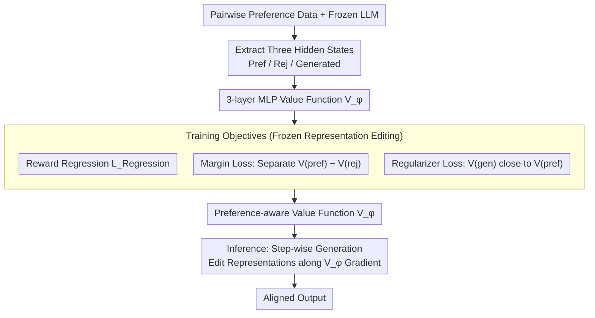

# Pref-CTRL: Preference Driven LLM Alignment using Representation Editing

**Conference**: ACL2026  
**arXiv**: [2604.23543](https://arxiv.org/abs/2604.23543)  
**Code**: https://github.com/UTS-nlPUG/pref-ctrl  
**Area**: Model Compression / Test-time Alignment / LLM Alignment  
**Keywords**: Representation Editing, Preference Learning, Test-time Alignment, Value Function, RLHF

## TL;DR
Pref-CTRL introduces a margin loss and a regularizer loss for training a lightweight value function within the RE-Control framework—a test-time alignment setup that does not update LLM parameters. This approach makes representation editing more consistent with human preferences and consistently outperforms RE-Control on SHP, HH-RLHF, and cross-domain data.

## Background & Motivation
**Background**: LLM alignment typically relies on RLHF, PPO, DPO, or their variants, utilizing preference data to make models conform to human expectations regarding helpfulness, harmlessness, and response style. These training-time methods are effective but often require retraining or fine-tuning model parameters, leading to high computational and maintenance costs when facing different models, preference attributes, and frequently changing requirements.

**Limitations of Prior Work**: Test-time alignment tries to bypass full fine-tuning by adjusting outputs during inference via reward models, candidate reranking, activation steering, or representation editing. RE-Control is a representative representation editing method: it freezes the LLM, uses a small value function to evaluate hidden states, and lightly adjusts internal representations along the value function gradient during generation. The issue is that RE-Control's value function primarily learns scalar rewards for individual responses, failing to explicitly utilize the pairwise structure (preferred vs. rejected) inherently present in many alignment datasets.

**Key Challenge**: Supervision signals for alignment tasks are usually relative preferences rather than isolated scores. Human annotations more naturally express that "Response A is better than Response B," and training-time methods like DPO are effective precisely because they model this relative relationship. If test-time representation editing continues to compress preference data into single-point rewards, the value function might know "whether this state has a high score" but lacks clarity on "how large the gap between preferred and rejected responses should be."

**Goal**: The authors aim to retain the advantages of RE-Control—freezing the LLM, training only a lightweight external value function, and performing alignment via representation editing during inference—while making the value function training more aligned with the structure of preference data. This aims to improve alignment effectiveness, reduce the risk of over-optimization, and investigate whether such modifications generalize to out-of-distribution datasets.

**Key Insight**: The observation is straightforward: if the training data already provides preferred and rejected candidates, the value function should not only regress to rewards but also learn to assign higher scores to preferred terminal states while preventing generated states from deviating too far from preferred states. Therefore, the improvement lies not in using a larger LLM or rewriting the inference control framework, but in incorporating preference ranking and conservative constraints into the value function training objective.

**Core Idea**: Replace the simpler reward regression objective in RE-Control with a multi-objective value function training involving "Reward Regression + Preference Margin + Generation-Preferred Regularization," making test-time representation editing more like preference learning than single-point reward chasing.

## Method
Pref-CTRL serves as an objective function upgrade for the RE-Control test-time alignment framework. The base LLM remains frozen; alignment knowledge is not embedded into model weights but delegated to an external, small value function. It reads the final layer hidden states of the LLM and outputs a scalar to estimate the value of the current generation state relative to alignment goals. During inference, the system performs representation editing on hidden states along the gradient of the value function to push subsequent generation toward high-value regions. The key modification is allowing the value function to see three types of representations—preferred responses, rejected responses, and the LLM's own generated responses—thereby explicitly incorporating "preferred should be higher than rejected" and "generated should not deviate too far from preferred" into the training objective.

### Overall Architecture
The process is divided into training and inference stages. In the training stage, the authors perform a forward pass with the frozen LLM on preference data to extract three sets of hidden states: preferred text, rejected text, and LLM-generated text. A 3-layer MLP value function is then trained on these states, regressing to rewards provided by an external reward model, learning the relative ranking of preferred vs. rejected, and using a regularization term to keep the value of generated states close to preferred states. During inference, the base LLM remains frozen; at each generation step, the current state is treated as a combination of hidden representations and logits, scored by the trained value function, and edited in the direction of increasing value. This work discusses high-level mechanisms for safety and preference alignment research and does not involve operational details for evasion or safety bypass.

### Key Designs

**1. Leveraging the Frozen Representation Editing Framework of RE-Control: Correcting Output Without Moving LLM Weights**

Retraining large models for every preference goal is costly. RE-Control treats the generation process as a dynamic system: state $s_t$ contains hidden representation $h_t$ and pre-softmax logits $o_t$. The value function $V_\phi(s_t)$ estimates the future reward of the current state. During inference, control signals are adjusted via gradient ascent to push subsequent states toward high-value regions. Pref-CTRL inherits this mechanism entirely to maintain the flexibility of test-time methods—a single frozen LLM can be used with external value functions for behavioral regulation without retraining the entire model for each goal. Consequently, the innovation is intentionally constrained to "how to train the value function."

**2. Explicitly Modeling Pairwise Preferences with Margin Loss: Embedding Relative Comparisons into the Value Function**

The true supervision signal for alignment data is often "Response A is more preferred than B," but RE-Control's value function primarily regresses to single-point rewards. It knows if a state score is high but not how much gap should exist between preferred and rejected states. Pref-CTRL takes the preferred terminal state $s^{pref}$ and rejected terminal state $s^{rej}$ from a pair and adds $L_{Margin}=-\log \sigma(V_\phi(s^{pref})-V_\phi(s^{rej}))$. If the value function scores the rejected state too high, the loss increases. This term directly injects DPO-style relative preference into the value function training, ensuring representation editing follows preference signals rather than simple reward maximization.

**3. Suppressing Over-optimization with Regularizer Loss: Adding a Conservative Anchor to the Editing Direction**

With only the margin constraint, the value function might be trained as an "over-discriminator," excessively widening the preferred/rejected gap and pushing generated states away from natural language fluency or task relevance—leading to reward hacking. Pref-CTRL pulls the value score of the final state of the LLM-generated response $s_N$ closer to that of the preferred terminal state $s^{pref}$, formally $L_{Regularizer}=(V_\phi(s_N)-V_\phi(s^{pref}))^2$. The total objective is $L_{Total}=L_{Regression}+L_{Margin}+L_{Regularizer}$. This tells the editing direction that the generated state should converge toward the preferred state rather than extrapolating infinitely for higher scores. Ablation studies show this term prevents the preference separation from deviating.

### Loss & Training
The value function uses the same lightweight MLP architecture as RE-Control, with an input dimension equal to the LLM hidden size (4096 in experiments). The structure is Linear(4096→4096)+ReLU, Linear(4096→4096)+ReLU, Linear(4096→1). Training uses Adam with a learning rate of $1\times10^{-5}$, batch size of 64, for 50 epochs, selecting the best epoch on the validation set for inference.

Experiments use UltraRM as the reward model to train the value function. Base models include Vicuna-7B and Hermes-3-Llama-3.1-8B. Training and testing are conducted on SHP and HH-RLHF, with zero-shot cross-domain evaluation on PKU-SafeRLHF and Nectar. For inference, HH-RLHF, PKU-SafeRLHF, and Nectar use a default step size of $\alpha=0.5$ and steps $k=100$; SHP uses $\alpha=1$ and $k=100$. These values reflect the experimental setup and are not deployment recommendations.

## Key Experimental Results

### Main Results
The main experiments compare variants of Pref-CTRL against RE-Control and a training-time DPO baseline. Metrics include win rates from three LLM-as-a-judge models, UltraRM average reward, diversity, and coherence. The following highlights the comparison between RE-Control and Pref-CTRL(Margin+Regularizer).

| Dataset / Base Model | Method | Llama Judge Win Rate | DeepSeek Judge Win Rate | GPT Judge Win Rate | Avg. Reward | Conclusion |
|--------|------|------:|------:|------:|------:|------|
| SHP / Vicuna-7B | RE-Control | 66.80 | 66.70 | 53.50 | -2.652 | Baseline representation editing |
| SHP / Vicuna-7B | Pref-CTRL(M+R) | 73.50 | 70.00 | 53.70 | -2.454 | Gains across judges and reward |
| SHP / Hermes3-8B | RE-Control | 79.80 | 74.80 | 60.90 | -2.303 | strong base model baseline |
| SHP / Hermes3-8B | Pref-CTRL(M+R) | 80.40 | 76.40 | 61.40 | -2.166 | Small but consistent gains |
| HH-RLHF / Vicuna-7B | RE-Control | 81.90 | 85.40 | 73.30 | -5.408 | Safety/Helpfulness baseline |
| HH-RLHF / Vicuna-7B | Pref-CTRL(M+R) | 82.90 | 85.60 | 74.60 | -5.288 | Win rate and reward improved |
| HH-RLHF / Hermes3-8B | RE-Control | 85.50 | 84.00 | 73.10 | -4.321 | strong base model baseline |
| HH-RLHF / Hermes3-8B | Pref-CTRL(M+R) | 85.70 | 84.30 | 73.60 | -4.268 | Gains while keeping diversity |

The advantage of Pref-CTRL is consistent across datasets, base models, and metrics. Notably, on SHP / Vicuna-7B, Pref-CTRL(M+R) increases the Llama judge win rate by 6.70 points and the DeepSeek judge by 3.30 points compared to RE-Control.

Pref-CTRL also compares favorably against other test-time methods. On HH-RLHF / Hermes3-8B, it significantly outperforms Best-of-N. Compared to CAST, it leads on the DeepSeek judge and is competitive on Llama and GPT judges.

| Method | Llama Judge Win Rate | DeepSeek Judge Win Rate | GPT Judge Win Rate | Interpretation |
|------|------:|------:|------:|------|
| Best-of-N | 85.30 | 78.90 | 72.10 | Requires sampling multiple candidates |
| CAST | 86.00 | 79.90 | 74.70 | Strong activation steering baseline |
| Pref-CTRL | 85.70 | 84.30 | 73.60 | Leading on DeepSeek, overall competitive |

### Ablation Study
The most valuable conclusion from the ablation is that margin loss alone is not always robust; the regularizer serves to rebalance preference separation and generation conservativeness.

| Dataset / Model | Config | Llama Win Rate | DeepSeek Win Rate | GPT Win Rate | Avg. Reward | Description |
|------|------|------:|------:|------:|------:|------|
| SHP / Vicuna-7B | RE-Control | 66.80 | 66.70 | 53.50 | -2.652 | Reward regression only |
| SHP / Vicuna-7B | Pref-CTRL(Margin) | 72.20 | 67.60 | 50.20 | -2.612 | Llama/DeepSeek up, GPT down |
| SHP / Vicuna-7B | Pref-CTRL(Regularizer) | 68.07 | 64.56 | 51.70 | -2.884 | Limited gain from reg only |
| SHP / Vicuna-7B | Pref-CTRL(M+R) | 73.50 | 70.00 | 53.70 | -2.454 | Most stable combination |
| HH-RLHF / Vicuna-7B | RE-Control | 81.90 | 85.40 | 73.30 | -5.408 | Safety/Helpfulness baseline |
| HH-RLHF / Vicuna-7B | Pref-CTRL(Margin) | 80.70 | 82.50 | 72.40 | -5.358 | Reward improves, win rate drops |
| HH-RLHF / Vicuna-7B | Pref-CTRL(M+R) | 82.90 | 85.60 | 74.60 | -5.288 | Regularizer mitigates margin over-opt |

Cross-domain evaluation supports the claim: value functions that learn preference comparisons rather than just memorizing rewards generalize better to new data distributions.

### Key Findings
- The structure of the value function's training objective is critical. Explicitly adding pairwise preference relations makes the direction of test-time representation editing more reliable.
- Margin loss is the primary signal for preference discrimination, but used alone, it may overemphasize the gap; the regularizer stabilizes results when combined with margin loss.
- Pref-CTRL approaches some training-time DPO results, though they differ in cost and positioning (DPO modifies weights, Pref-CTRL uses an external value function).
- Sensitivity analysis shows reward peaks near $\alpha=0.5, k=100$ on HH-RLHF / Hermes3; further increasing step size or count leads to declines, indicating an over-optimization boundary for test-time editing.
- Diversity and coherence show no obvious degradation, suggesting improvements are not merely sacrificing text quality for judge scores.

## Highlights & Insights
- **Porting Preference Learning to Test-time Alignment**: Instead of reinventing a complex system, the paper identifies the mismatch between RE-Control's training objective and preference data structure, fixing it with pairwise margins.
- **Regularizer as a Stabilizer**: Ablation shows regularizer-only is weak, but it prevents margin loss from over-amplifying the preference gap, acting as a stabilizer rather than a primary driver.
- **Test-time Methods Require Signal Calibration**: External value functions must be supervised correctly; how training data is organized determines if the control direction is trustworthy even if the LLM is frozen.
- **Relative Preference Generalization**: Improvements on PKU-SafeRLHF and Nectar suggest the model captures a transferable preference ranking signal rather than just in-dataset reward calibration.
- **Extensible to Multi-attribute Control**: The framework could naturally extend to multi-head value functions for simultaneous control of helpfulness, safety, and style.

## Limitations & Future Work
- Gradient-based test-time intervention depends on hyperparameters like step size and count, which may require validation across domains.
- The value function relies on fixed reward models and pairwise labels; its boundaries are limited by the training data's coverage.
- Experiments focused on single-turn prompts; performance in multi-turn dialogues or long contexts remains to be proven.
- Evaluation relies heavily on LLM-as-a-judge; there is a lack of large-scale human evaluation.
- Inference overhead from step-wise gradient editing was not detailed; a trade-off between quality, latency, and cost is necessary for production.

## Related Work & Insights
- **vs RLHF/PPO**: RLHF updates LLM parameters, which is effective but costly. Pref-CTRL is a lightweight test-time correction layer.
- **vs DPO**: DPO optimizes parameters using pairwise preferences. Pref-CTRL applies this "relative preference" concept to value function training instead of LLM fine-tuning.
- **vs RE-Control**: Pref-CTRL improves the value function by training on preferred/rejected/generated states with margin and regularizer losses.
- **vs Best-of-N**: Pref-CTRL adjusts the generation direction internally rather than selecting from a pool of candidates.
- **Insight**: For "Frozen LLM + Small Module Control," the supervision objective of the small module is often more important than its capacity.

## Rating
- Novelty: ⭐⭐⭐⭐☆ Clear and effective application of pairwise preferences to test-time representation editing.
- Experimental Thoroughness: ⭐⭐⭐⭐☆ Covers multiple datasets, models, and OOD tests; lacks human evaluation and cost analysis.
- Writing Quality: ⭐⭐⭐⭐☆ Clear link between motivation and method.
- Value: ⭐⭐⭐⭐☆ Strong reference for those reducing alignment costs or researching test-time control.

<!-- RELATED:START -->

## Related Papers

- [\[ACL 2026\] Teaching LLM to be Persuasive: Reward-Enhanced Policy Optimization for Alignment from Heterogeneous Rewards](teaching_llm_to_be_persuasive_reward-enhanced_policy_optimization_for_alignment_.md)
- [\[ACL 2026\] Alignment Data Map for Efficient Preference Data Selection and Diagnosis](alignment_data_map_for_efficient_preference_data_selection_and_diagnosis.md)
- [\[ACL 2025\] RISE: Subtle Errors in Reasoning: Preference Learning via Error-injected Self-editing](../../ACL2025/llm_alignment/rise_error_inject_preference.md)
- [\[ACL 2025\] Curiosity-Driven Reinforcement Learning from Human Feedback](../../ACL2025/llm_alignment/curiosity_driven_rlhf.md)
- [\[ACL 2026\] On the Rejection Criterion for Proxy-Based Test-Time Alignment](on_the_rejection_criterion_for_proxy-based_test-time_alignment.md)

<!-- RELATED:END -->
