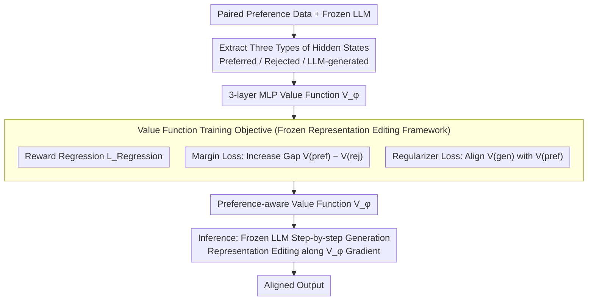

# Pref-CTRL: Preference Driven LLM Alignment using Representation Editing

**Conference**: ACL2026  
**arXiv**: [2604.23543](https://arxiv.org/abs/2604.23543)  
**Code**: https://github.com/UTS-nlPUG/pref-ctrl  
**Area**: Model Compression / Test-time Alignment / LLM Alignment  
**Keywords**: Representation Editing, Preference Learning, Test-time Alignment, Value Function, RLHF

## TL;DR
Pref-CTRL introduces margin loss and regularizer loss oriented toward paired preference data to train a lightweight value function within the RE-Control framework—a test-time alignment framework that does not update LLM parameters. This makes representation editing more consistent with human preferences and achieves stable performance gains over RE-Control on SHP, HH-RLHF, and cross-domain data.

## Background & Motivation
**Background**: LLM alignment typically relies on RLHF, PPO, DPO, or their variants, which align models with human expectations on helpfulness, harmlessness, and response style through preference data. While effective, these training-time methods often require retraining or fine-tuning model parameters, leading to high computational and maintenance costs when facing different models, preference attributes, and frequently changing requirements.

**Limitations of Prior Work**: Test-time alignment attempts to bypass full fine-tuning by adjusting outputs during inference via reward models, candidate reranking, activation steering, or representation editing. RE-Control is a representative representation editing method: it freezes the LLM, evaluates hidden states using a small value function, and lightly adjusts internal representations along the value function gradient during generation. The issue is that RE-Control’s value function primarily learns scalar rewards for individual responses, failing to explicitly utilize the paired "preferred vs. rejected" structure naturally contained in many alignment datasets.

**Key Challenge**: Supervision signals in alignment tasks are usually relative preferences rather than isolated scores. Human annotations more frequent express that "Response A is better than Response B," and training-time methods like DPO are effective precisely because they directly model this relative relationship. If test-time representation editing still compresses preference data into single-point rewards, the value function might know "whether a state has a high score," but it may not clearly understand "how large the gap between preferred and rejected responses should be."

**Goal**: The authors aim to retain the advantages of RE-Control—freezing the LLM, training only a lightweight external value function, and performing alignment via representation editing during inference—while making the value function training more compatible with the structure of preference data. This aims to improve alignment performance, reduce over-optimization risks, and investigate whether these changes generalize to out-of-distribution datasets.

**Key Insight**: The observation is straightforward: if the training data already provides preferred/rejected pairs, the value function should not only regress to rewards but also learn to assign higher scores to preferred terminal states and ensure generated states do not deviate too far from preferred ones. Thus, the improvement lies not in using a larger LLM or rewriting the inference framework, but in incorporating preference ranking and conservative constraints into the value function's training objective.

**Core Idea**: Replace the single reward regression objective in RE-Control with a multi-objective training approach consisting of "reward regression + preference margin + generation-preferred regularization." This makes test-time representation editing more akin to preference learning rather than single-point reward chasing.

## Method
Pref-CTRL serves as an upgrade to the objective function of the test-time alignment framework RE-Control. The base LLM remains frozen, and alignment knowledge is delegated to an external lightweight value function rather than being encoded into model weights. This function reads the last-layer hidden states of the LLM and outputs a scalar to estimate the value of the current state relative to alignment goals. During inference, the system performs representation editing on hidden states along the gradient of the value function to push generation toward high-value regions. The key modification is allowing the value function to observe three types of representations—preferred responses, rejected responses, and LLM-generated responses—explicitly incorporating the constraints "preferred should be higher than rejected" and "generation should not deviate far from preferred" into the training objective.

### Overall Architecture
The process is divided into training and inference stages. During training, the authors first perform forward passes with the frozen LLM on preference data to extract hidden states for preferred text, rejected text, and LLM-generated text. A 3-layer MLP value function is then trained on these states, regressing to rewards provided by an external reward model, learning the relative ranking of preferred and rejected samples, and using a regularization term to keep the value of generated states close to preferred states. During inference, the base LLM remains frozen. Each generation step treats the current state as a combination of hidden representations and logits, scores it using the trained value function, and performs test-time editing on the internal representation to increase value. This discussion focuses on high-level mechanisms for safety and preference alignment research and does not involve operational details for evasion or safety bypass.

### Key Designs

**1. Leveraging RE-Control’s Frozen Representation Editing Framework: Correcting Outputs Without Moving LLM Weights**

Retraining large models for every preference goal is costly. RE-Control treats the generation process as a dynamic system: the state $s_t$ contains the hidden representation $h_t$ and pre-softmax logits $o_t$. The value function $V_\phi(s_t)$ estimates future rewards, and a control signal is adjusted via gradient ascent during inference to move subsequent states toward high-value regions. Pref-CTRL entirely inherits this mechanism as it preserves the flexibility of test-time methods—a single frozen LLM can be combined with external value functions for behavioral adjustment without retraining the entire model for each goal. Consequently, the innovation is deliberately constrained to "how to train the value function" rather than modifying the LLM itself.

**2. Modeling Paired Preferences Explicitly with Margin Loss: Embedding Relative Comparisons into the Value Function**

The true supervision signal in alignment data is often "Response A is more preferred than B," yet RE-Control’s value function primarily regresses to single-point rewards, knowing the score level but not the required gap between preferred and rejected outputs. Pref-CTRL takes terminal states of preferred samples $s^{pref}$ and rejected samples $s^{rej}$ and adds $L_{Margin}=-\log \sigma(V_\phi(s^{pref})-V_\phi(s^{rej}))$. If the value function scores the rejected state too high, the loss increases; if a sufficient gap is maintained, the loss decreases. This term injects DPO-style relative preference signals directly into the value function training, ensuring test-time representation editing inherits the core signal of preference learning.

**3. Suppressing Over-optimization with Regularizer Loss: Adding a Conservative Anchor to the Editing Direction**

With only margin constraints, the value function might be trained as an "over-discriminator," excessively widening the preferred/rejected gap and pushing generated states away from natural language fluency or task relevance, leading to reward-hacking side effects. Pref-CTRL thus pulls the value scores of the final state of LLM-generated responses $s_N$ closer to the preferred terminal states $s^{pref}$, formulated as $L_{Regularizer}=(V_\phi(s_N)-V_\phi(s^{pref}))^2$. The total objective becomes $L_{Total}=L_{Regression}+L_{Margin}+L_{Regularizer}$. This instructs the editing direction that generated states should converge toward preferred states rather than extrapolating infinitely for higher scores. Ablations show this term prevents the preference separation from deviating.

### Loss & Training
The value function utilizes the same lightweight MLP architecture as RE-Control, with an input dimension equal to the LLM hidden size (4096 in experiments). The structure consists of Linear(4096→4096)+ReLU, Linear(4096→4096)+ReLU, and Linear(4096→1). Training uses Adam with a learning rate of $1\times10^{-5}$, a batch size of 64, for 50 epochs, selecting the best epoch on the validation set for inference.

Experiments use UltraRM as the reward model to train the value function. Base models include Vicuna-7B and Hermes-3-Llama-3.1-8B. The authors train and test on SHP and HH-RLHF, and perform zero-shot cross-domain evaluations on PKU-SafeRLHF and Nectar. For inference analysis, default settings for HH-RLHF, PKU-SafeRLHF, and Nectar are step size $\alpha=0.5$ and steps $k=100$; for SHP, $\alpha=1$ and $k=100$ are used due to higher complexity. These figures characterize the experimental setup and do not constitute deployment recommendations.

## Key Experimental Results

### Main Results
The main experiment compares RE-Control, Pref-CTRL variants, and a training-time DPO reference baseline. Evaluation metrics include win rates from three LLM-as-a-judge models, UltraRM average rewards, diversity, and coherence. The following table highlights the comparison between RE-Control and Pref-CTRL(Margin+Regularizer).

| Dataset / Base Model | Method | Llama Judge Win Rate | DeepSeek Judge Win Rate | GPT Judge Win Rate | Avg. Reward | Conclusion |
|--------|------|------:|------:|------:|------:|------|
| SHP / Vicuna-7B | RE-Control | 66.80 | 66.70 | 53.50 | -2.652 | Original baseline |
| SHP / Vicuna-7B | Pref-CTRL(M+R) | 73.50 | 70.00 | 53.70 | -2.454 | Improvement across judges and reward |
| SHP / Hermes3-8B | RE-Control | 79.80 | 74.80 | 60.90 | -2.303 | Strong base model baseline |
| SHP / Hermes3-8B | Pref-CTRL(M+R) | 80.40 | 76.40 | 61.40 | -2.166 | Small but consistent gain |
| HH-RLHF / Vicuna-7B | RE-Control | 81.90 | 85.40 | 73.30 | -5.408 | Safety/Helpfulness baseline |
| HH-RLHF / Vicuna-7B | Pref-CTRL(M+R) | 82.90 | 85.60 | 74.60 | -5.288 | Win rate and reward both improved |
| HH-RLHF / Hermes3-8B | RE-Control | 85.50 | 84.00 | 73.10 | -4.321 | Strong base model baseline |
| HH-RLHF / Hermes3-8B | Pref-CTRL(M+R) | 85.70 | 84.30 | 73.60 | -4.268 | Slight gain with diversity/coherence |

As shown, Pref-CTRL’s advantage is not a fluctuation in a single metric but is consistent across two datasets, two base models, three judges, and reward metrics. Notably, on SHP / Vicuna-7B, moving from RE-Control to Pref-CTRL(M+R) improves the Llama judge win rate by 6.70 points and the DeepSeek judge by 3.30 points, with Avg. Reward improving from -2.652 to -2.454.

The authors also compare Pref-CTRL with additional test-time alignment methods. In HH-RLHF / Hermes3-8B, Pref-CTRL shows a clear advantage over Best-of-N and is competitive with CAST, significantly outperforming it on the DeepSeek judge.

| Method | Llama Judge Win Rate | DeepSeek Judge Win Rate | GPT Judge Win Rate | Interpretation |
|------|------:|------:|------:|------|
| Best-of-N | 85.30 | 78.90 | 72.10 | Requires filtering multiple candidates |
| CAST | 86.00 | 79.90 | 74.70 | Strong activation steering baseline |
| Pref-CTRL | 85.70 | 84.30 | 73.60 | DeepSeek lead, overall competitive |

### Ablation Study
The most valuable conclusion from the ablation is that margin loss is not always robust on its own; the regularizer balances preference separation with generation conservatism.

| Dataset / Model | Configuration | Llama Win Rate | DeepSeek Win Rate | GPT Win Rate | Avg. Reward | Description |
|------|------|------:|------:|------:|------:|------|
| SHP / Vicuna-7B | RE-Control | 66.80 | 66.70 | 53.50 | -2.652 | Single reward regression |
| SHP / Vicuna-7B | Pref-CTRL(Margin) | 72.20 | 67.60 | 50.20 | -2.612 | Llama/DeepSeek up, GPT judge down |
| SHP / Vicuna-7B | Pref-CTRL(Regularizer) | 68.07 | 64.56 | 51.70 | -2.884 | Limited gain alone |
| SHP / Vicuna-7B | Pref-CTRL(M+R) | 73.50 | 70.00 | 53.70 | -2.454 | Most stable combination |
| HH-RLHF / Vicuna-7B | RE-Control | 81.90 | 85.40 | 73.30 | -5.408 | Safety/Helpfulness baseline |
| HH-RLHF / Vicuna-7B | Pref-CTRL(Margin) | 80.70 | 82.50 | 72.40 | -5.358 | Reward up, win rate down |
| HH-RLHF / Vicuna-7B | Pref-CTRL(M+R) | 82.90 | 85.60 | 74.60 | -5.288 | Regularizer mitigates over-optimization |

Cross-domain evaluations further support the argument: a value function that learns preference rankings rather than just memorizing rewards generalizes better to new distributions.

| Training Data | Test Data | Method | Llama Win Rate | DeepSeek Win Rate | Gain |
|------|------|------|------:|------:|------|
| SHP | PKU-SafeRLHF | RE-Control | 81.00 | 73.00 | Baseline |
| SHP | PKU-SafeRLHF | Pref-CTRL | 83.00 | 75.00 | +2.00 across both judges |
| HH-RLHF | PKU-SafeRLHF | RE-Control | 78.00 | 65.00 | Baseline |
| HH-RLHF | PKU-SafeRLHF | Pref-CTRL | 80.00 | 67.00 | +2.00 across both judges |
| HH-RLHF | Nectar | RE-Control | 30.67 | 33.67 | Baseline |
| HH-RLHF | Nectar | Pref-CTRL | 32.33 | 35.67 | Slight gain on Nectar |

### Key Findings
- The structure of the value function's training objective is critical. Incorporating explicit pairwise preference relationships makes test-time representation editing directions more reliable.
- Margin loss is the primary preference discrimination signal, but used alone, it may overemphasize the preferred-rejected gap; the regularizer may not provide gains alone but stabilizes results when combined with margin loss.
- Pref-CTRL approaches some results of training-time DPO, but their costs and positioning differ: DPO modifies parameters, while Pref-CTRL freezes the LLM and trains an external value function.
- Sensitivity analysis shows rewards peak near $\alpha=0.5, k=100$ on HH-RLHF / Hermes3; further increasing step size or steps leads to performance decay, indicating test-time gradient editing still has over-optimization boundaries.
- Diversity and coherence show no obvious degradation, suggesting improvements do not come at the cost of text quality.

## Highlights & Insights
- **Porting Preference Learning to Test-time Alignment**: Instead of reinventing a complex inference system, the paper identifies a mismatch between RE-Control's training objective and preference data structures, fixing it with a direct pairwise margin. This "minor objective change, major framework preservation" approach is highly practical.
- **Regularizer Significance**: Ablations show the regularizer serves as a stabilizer rather than a simple performance booster, preventing the preference gap from being excessively distorted.
- **Supervision Shapes Control**: Even for test-time methods focusing on inference-stage control, Pref-CTRL demonstrates that the value function's supervision determines the credibility of control directions.
- **Cross-domain Robustness**: Consistent gains on PKU-SafeRLHF and Nectar suggest that margin + regularizer learns a more transferable preference ranking signal than simple within-dataset reward calibration.
- **Extension to Multi-attribute Control**: This multi-objective value function framework could naturally extend to multi-head or multi-attribute value functions for simultaneous control of helpfulness, safety, and style.

## Limitations & Future Work
- Gradient-based test-time interventions depend on hyperparameters like step size and steps, requiring validation across domains; excessive $\alpha$ or $k$ can degrade effects.
- The value function relies on fixed reward models and paired preference labels, so its preference boundaries are limited by training data coverage. 
- Experiments focused on single-turn prompts; stability in multi-turn dialogues or complex tool-use scenarios is not yet proven.
- Evaluations rely heavily on LLM-as-a-judge and UltraRM; while multiple judges were used, large-scale human evaluation is missing, and judge/reward model bias remains a concern.
- Test-time computational overhead was not detailed in main tables. Each step of gradient editing incurs additional inference costs that require balancing quality, latency, and cost.
- Future work could explore attention-based value functions, multi-attribute alignment, and adaptive test-time interventions where the system automatically decides intervention strength based on input risk.

## Related Work & Insights
- **vs. RLHF / PPO**: RLHF updates LLM parameters via reward models and RL, which is effective but costly. Pref-CTRL serves as a lightweight test-time correction layer without updating the LLM.
- **vs. DPO**: DPO optimizes parameters using paired preferences. Pref-CTRL borrows the relative preference concept but applies it to value function training instead of LLM fine-tuning.
- **vs. RE-Control**: Pref-CTRL shares the frozen LLM and representation editing framework but makes the control signal more preference-aware by seeing preferred/rejected/generated states.
- **vs. Best-of-N**: Best-of-N selects handles multiple candidates, increasing overhead. Pref-CTRL adjusts the generation direction of a single pass at the representation level.
- **vs. CAST / Activation Steering**: CAST uses activation directions for specific attributes. Pref-CTRL’s control direction stems from a value function trained on preference data, making it closer to RLHF structures.
- **Insight**: For "frozen LLM + small module control" methods, the supervision target of the small module is often more important than its capacity. Preference data should not be collapsed into single scalar labels.

## Rating
- Novelty: ⭐⭐⭐⭐☆ Modifications to RE-Control are straightforward but clearly effective at bridging the gap between preference data and test-time editing.
- Experimental Thoroughness: ⭐⭐⭐⭐☆ Covers major datasets, base models, multiple judges, and OOD tests; lacks extensive human evaluation and detailed cost analysis.
- Writing Quality: ⭐⭐⭐⭐☆ Clear relationship between motivation and method, though main tables require careful cross-referencing for some variants.
- Value: ⭐⭐⭐⭐☆ Highly relevant for reducing alignment costs and studying test-time control and preference modeling.

<!-- RELATED:START -->

<!-- RELATED:END -->

## Related Papers

- [\[ACL 2026\] Teaching LLM to be Persuasive: Reward-Enhanced Policy Optimization for Alignment from Heterogeneous Rewards](teaching_llm_to_be_persuasive_reward-enhanced_policy_optimization_for_alignment_.md)
- [\[ACL 2025\] RISE: Subtle Errors in Reasoning: Preference Learning via Error-injected Self-editing](../../ACL2025/llm_alignment/rise_error_inject_preference.md)
- [\[ACL 2026\] Alignment Data Map for Efficient Preference Data Selection and Diagnosis](alignment_data_map_for_efficient_preference_data_selection_and_diagnosis.md)
- [\[ACL 2025\] Curiosity-Driven Reinforcement Learning from Human Feedback](../../ACL2025/llm_alignment/curiosity_driven_rlhf.md)
- [\[ACL 2026\] Topology-Enhanced Alignment for Large Language Models: Trajectory Topology Loss and Topological Preference Optimization](topology-enhanced_alignment_for_large_language_models_trajectory_topology_loss_a.md)

<!-- RELATED:END -->
