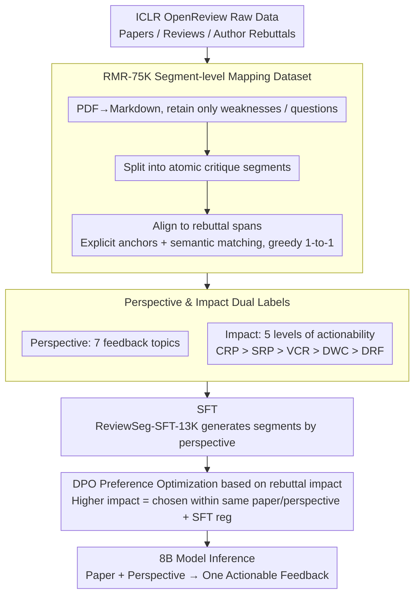

# RbtAct: Rebuttal as Supervision for Actionable Review Feedback Generation

**Conference**: ACL 2026 Findings  
**arXiv**: [2603.09723](https://arxiv.org/abs/2603.09723)  
**Code**: arXiv page mentions RbtAct; public repository URL not resolved in cache  
**Area**: LLM Alignment / Academic Peer Review / Feedback Generation  
**Keywords**: Author rebuttal, actionable review feedback, preference optimization, DPO, peer review dataset

## TL;DR
RbtAct treats author rebuttals as implicit supervision for "which review comments actually prompt modifications," constructs a dataset of 75,000 review-rebuttal segment-level mappings, and employs SFT+DPO to train an 8B model to generate more specific and actionable paper review feedback.

## Background & Motivation
**Background**: LLMs have begun intervening in scientific writing and peer review, either by generating full reviews from paper drafts or by improving feedback coverage through multi-agent systems or fine-tuning. Existing work primarily focuses on "review-likeness": whether the language is fluent, whether it mentions pros and cons, and whether it covers major paper modules.

**Limitations of Prior Work**: Truly useful reviews do not just point out "insufficient experiments" or "unclear writing"; they should inform authors of exactly what to change, what to add, and how to improve. LLM-generated reviews often appear complete in form but are generalized in content, tending toward templated suggestions that are difficult for authors to act upon.

**Key Challenge**: The value of review feedback stems from the authors' subsequent actions. However, standard review datasets only provide the review text itself, with no indication of whether a specific comment prompted actual modifications. In other words, while models can mimic the language of a reviewer, they lack the supervision signal of "which statements are adopted by authors."

**Goal**: This paper aims to transform author reactions in rebuttals into training signals to learn the generation of single, focused, perspective-oriented review comments. The task input consists of the full paper and a specified perspective; the output is a review segment in the style of a weakness or question.

**Key Insight**: The authors observe that rebuttals naturally record how authors respond to reviewers: some comments lead to completed revisions, some yield only future plans, and others are defended or diverted by the author. This "author uptake," though noisy, serves as a proxy label for actionability in large-scale public review data.

**Core Idea**: Utilize mappings between review segments and rebuttal segments to convert author responses into preference rankings, guiding the model toward generating feedback more likely to trigger specific modifications.

## Method
The RbtAct method is divided into two layers: first, constructing a review-rebuttal segment-level dataset, and then converting rebuttal impact into preference data to train the generative model. Rather than generating a full-length review, the task is narrowed to "generating a focused comment given a paper and a specific review perspective." This setup reduces evaluation ambiguity and allows each piece of feedback to align with a specific response in the rebuttal.

### Overall Architecture
The input is a full paper and a target perspective (e.g., Experiments, Novelty, Writing, or Reproducibility). The system extracts papers, reviews, and author rebuttals from ICLR 2024 OpenReview data and converts PDFs to Markdown. It focuses only on the "weakness" and "question" sections of reviews, splitting them into atomic critique segments and performing one-to-one mapping with rebuttal spans.

After mapping, each review segment receives two labels: a review perspective describing the aspect of the paper the comment focuses on, and a rebuttal impact describing the degree of author action in response. The training phase starts with supervised fine-tuning using ReviewSeg-SFT-13K to enable Llama-3.1-8B-Instruct to generate review segments by perspective, followed by DPO using ReviewPref-DPO-22K, where segments leading to stronger author actions are treated as preferred outputs.

### Key Designs

**1. RMR-75K Segment-level Mapping: Aligning Each Review Comment with Corresponding Author Responses**

The true value of review feedback is whether the authors accept it, but standard data only contains review text. The granularity of a whole review versus a whole rebuttal is too coarse to identify which specific comment elicited which type of response. RbtAct extracts data from ICLR 2024, splits the weakness/question sections into atomic critique segments using structural cues or GPT-5, and aligns each segment to a rebuttal span via explicit anchors (reviewer numbers, quotes) and semantic matching. This results in 75,542 segment-level mappings across 4,825 papers, with an automated mapping F1 of 0.91 relative to human annotation (κ=0.80). This makes "which suggestion the author adopted" an observable and trainable signal.

> ⚠️ "GPT-5" is the model name mentioned in the original text.

**2. Perspective and Impact Dual Labels: Managing Topics and Quantifying Actionability**

A single paper can have issues across experiments, theory, and writing. If feedback quality is compared directly across topics, the preference ranking will be contaminated by thematic differences. Consequently, each review segment is labeled with: a "perspective" (Experiments, Evaluation, Reproducibility, Novelty, Theory, Writing, Presentation) and an "impact" representing author action levels (CRP, SRP, VCR, DWC, DRF—corresponding to completed revision, specific plan, vague commitment, defensive refusal, and diversion). Perspectives ensure preference pairs are constructed only within the same paper and topic, while impact converts abstract "actionability" into discrete levels of real author behavior. Automated classification accuracy for these labels reaches approximately 92% and 89%, respectively.

**3. Rebuttal Impact-based DPO Optimization: Guiding Models toward Feedback That Triggers Real Revisions**

With the dual labels, "good feedback" is no longer a subjective impression but rather "whether the author actually modified the work." RbtAct constructs preference pairs within the same paper and perspective, ranked by actionability: $\mathrm{CRP}>\mathrm{SRP}>\mathrm{VCR}>\mathrm{DWC}>\mathrm{DRF}$. High-impact segments are treated as `chosen` and low-impact as `rejected`. DPO is used to increase the margin of $\log\pi_\theta(y_w|x)-\log\pi_\theta(y_l|x)$ relative to the reference model. Pairwise preferences are more robust than regressing a coarse actionability score for noisy implicit signals like rebuttals. Additionally, an SFT regularization term of $\lambda=0.1$ is included to prevent perspective drift in long-context scenarios.

### Loss & Training
The model is based on Llama-3.1-8B-Instruct. The SFT phase uses ReviewSeg-SFT-13K (13,300 samples, 4,637 papers, ~1,900 per perspective). The DPO phase uses ReviewPref-DPO-22K (21,822 preference pairs, 4,825 papers). DPO follows the standard Bradley-Terry form, aiming to increase the difference in `$\log \pi_\theta(y_w|x)-\log \pi_\theta(y_l|x)$`. The inclusion of a `$\lambda=0.1$` SFT regularization term for positive samples mitigates output drift caused by preference training.

## Key Experimental Results

### Main Results
Evaluation was conducted on an ICLR 2025 subset, including human evaluation on 50 papers and LLM-as-a-judge evaluation on 105 papers. RbtAct's primary advantages are concentrated in Actionability and Specificity, while maintaining performance comparable to strong models in Groundedness and Relevance.

| System | Human Action. | Human Spec. | Human Ground. | Human Rel. | LLM Action. | LLM Spec. |
|------|---------------|-------------|---------------|------------|-------------|-----------|
| RbtAct | 3.46 | 4.08 | 4.30 | 4.76 | 3.38 | 3.70 |
| RbtAct-SFT | 3.28 | 4.01 | 4.16 | 4.70 | 3.18 | 3.59 |
| GPT-5-chat | 3.38 | 4.04 | 4.35 | 4.98 | 3.28 | 3.66 |
| DeepSeek-V3.2 | 3.15 | 3.98 | 4.22 | 4.88 | 3.13 | 3.56 |
| Llama-3.1-70B | 3.22 | 3.95 | 4.18 | 4.65 | 3.11 | 3.54 |
| DeepReviewer-14B | 3.27 | 3.96 | 4.28 | 4.75 | 3.23 | 3.48 |

RbtAct also leads in pairwise actionability comparisons. The win rates below represent "row model beats column model."

| Opponent | RbtAct Win Rate | GPT-5-chat Win Rate | DeepSeek-V3.2 Win Rate |
|------|-------------|-----------------|--------------------|
| GPT-5-chat | 57.1% | - | 44.8% |
| DeepSeek-V3.2 | 63.8% | 55.2% | - |
| Llama-3.1-70B | 61.9% | 57.1% | 54.3% |
| MARG | 68.6% | 62.9% | 59.0% |
| LimGen | 76.2% | 71.4% | 68.6% |

### Ablation Study
The most direct ablation compares SFT-only with SFT+DPO. The gain from DPO is modest but stable, specifically focused on actionability and specificity without sacrificing groundedness for sharper comments.

| Configuration | Human Action. | LLM Action. | Human Spec. | LLM Spec. | Description |
|------|---------------|-------------|-------------|-----------|------|
| RbtAct-SFT | 3.28 | 3.18 | 4.01 | 3.59 | Learns real review segment distribution only |
| RbtAct | 3.46 | 3.38 | 4.08 | 3.70 | Adds rebuttal impact DPO |
| Gain | +0.18 | +0.20 | +0.07 | +0.11 | Preference optimization primarily improves actionability |

Quality control for data construction demonstrates that training signals are not merely coarse text.

| Data/Validation Item | Value | Meaning |
|-------------|------|------|
| RMR-75K mappings | 75,542 | Review segment to rebuttal span mappings |
| Covered papers | 4,825 | From ICLR 2024 OpenReview |
| Auto-mapping F1 | 0.91 | Alignment with human-annotated span overlaps |
| Mapping IAA | κ=0.80 | High inter-annotator agreement |
| Perspective label accuracy | ~92% | Automated labels match human judgment |
| Impact label accuracy | 89% | Reliability of rebuttal impact labels |

### Key Findings
- While the gains from rebuttal-derived DPO are not as drastic as switching to a larger model, they enable the 8B model to surpass strong baselines like GPT-5-chat, DeepSeek-V3.2, and Llama-3.1-70B in actionability.
- The improvements in actionability and specificity do not come at the cost of groundedness or relevance, indicating the model does not produce high scores simply by fabricating "harsher" suggestions.
- Pairwise results showcase the advantage more clearly: RbtAct achieves win rates exceeding 65% against review generation methods like LimGen, MARG, and DeepReviewer.
- The key to this task is not just generating a review, but learning "which feedback authors will respond to seriously," transforming peer review data from an imitation target into a source of preference supervision.

## Highlights & Insights
- The paper redefines the rebuttal as a training signal rather than just a dialogue record or analysis object. This perspective is inspiring: many "subsequent reactions" in academic workflows can serve as implicit preference labels.
- Segment-level generation is a pragmatic design choice. Evaluating the generation of a whole review is difficult and prone to mixing multiple issues; single perspective-conditioned feedback is better for alignment, training, and human evaluation.
- The ranking of impact categories makes actionability concrete. It is no longer a subjective impression but a behavioral signal: "Did the author already change it, plan to change it, or defend against it?"
- This method can be migrated to scenarios like proposal reviews, code reviews, or educational feedback: anywhere a "comment-response-action" log exists, similar preference data can be constructed.

## Limitations & Future Work
- Rebuttals only reflect short-term author responses and do not equate to final paper modifications; some authors may make strategic promises, and high-quality suggestions might not be adopted due to time constraints.
- The data is primarily from CS conferences in the OpenReview style; generalization to journals, non-English communities, or fields without public rebuttals requires further verification.
- Model-generated suggestions might be specific but impractical; current evaluations do not strictly verify if suggestions can be supported by the paper, code, and data.
- The preference ranking assumes CRP is always better than SRP or VCR, but some defensive responses may be due to reviewer misunderstanding rather than poor feedback quality.
- Future work could integrate rebuttals with camera-ready diffs, experimental supplements, and author revision logs to build actionability signals closer to real modification outcomes.

## Related Work & Insights
- **vs ARIES**: ARIES focuses on the connection between review comments and paper edits; RbtAct converts review-rebuttal segment mappings into trainable generation preferences. The former is more like behavior analysis; the latter is oriented toward model optimization.
- **vs DISAPERE / JitsuPeer**: These works have sentence-level review-rebuttal relationship annotations, but with smaller scales and different label goals. RbtAct’s RMR-75K is larger and explicitly incorporates perspective and impact categories.
- **vs MARG / DeepReviewer / LimGen**: These methods improve feedback quality via prompting, multi-agent systems, or review generation models; RbtAct differs by using author reactions to define "good feedback."
- **Insight**: Alignment research does not have to rely solely on manual preference scoring; subsequent behavior logs in real workflows can provide low-cost preference signals.

## Rating
- Novelty: ⭐⭐⭐⭐☆ Using rebuttals as actionability preference supervision is highly innovative, and the task setup is more focused than standard review generation.
- Experimental Thoroughness: ⭐⭐⭐⭐☆ Includes human evaluation, LLM judges, pairwise comparisons, automated metrics, and data quality validation, though real modification results are not yet incorporated.
- Writing Quality: ⭐⭐⭐⭐☆ Clear motivation, complete data pipeline, and experimental tables support the main conclusions; some appendices are heavily relied upon.
- Value: ⭐⭐⭐⭐⭐ High reuse value for academic review assistance, feedback generation, and workflow preference learning.

<!-- RELATED:START -->

## Related Papers

- [\[ACL 2026\] WildFeedback: Aligning LLMs With In-situ User Interactions And Feedback](wildfeedback_aligning_llms_with_in-situ_user_interactions_and_feedback.md)
- [\[CVPR 2025\] Continual SFT Matches Multimodal RLHF with Negative Supervision](../../CVPR2025/llm_alignment/continual_sft_matches_multimodal_rlhf_with_negative_supervision.md)
- [\[ACL 2026\] Towards Bridging the Reward-Generation Gap in Direct Alignment Algorithms](towards_bridging_the_reward-generation_gap_in_direct_alignment_algorithms.md)
- [\[ACL 2026\] PERSA: Reinforcement Learning for Professor-Style Personalized Feedback with LLMs](persa_reinforcement_learning_for_professor-style_personalized_feedback_with_llms.md)
- [\[ACL 2026\] Better Literary Translation: A Multi-Aspect Data Generation and LLM Training Approach](better_literary_translation_a_multi-aspect_data_generation_and_llm_training_appr.md)

<!-- RELATED:END -->
