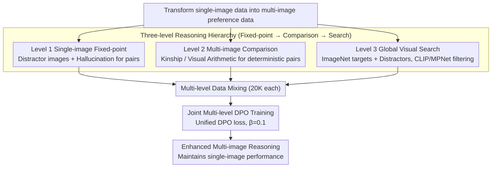

# S2H-DPO: Hardness-Aware Preference Optimization for Vision-Language Models

**Conference**: ACL 2026 Findings  
**arXiv**: [2604.18512](https://arxiv.org/abs/2604.18512)  
**Code**: None  
**Area**: Multimodal VLM / Preference Alignment  
**Keywords**: Multi-image reasoning, DPO preference optimization, visual search, hardness grading, VLM alignment

## TL;DR

Ours proposes the Simple-to-Hard (S2H) DPO framework, which systematically enhances the multi-image reasoning capabilities of VLMs by constructing multi-image preference data across three progressive difficulty levels (fixed-point reasoning $\rightarrow$ cross-image comparison $\rightarrow$ global visual search) while maintaining single-image performance.

## Background & Motivation

**Background**: VLMs have made significant progress in single-image understanding, but effective reasoning across multiple images remains challenging. Multi-image reasoning requires locating relevant images, comparing, and integrating information from multiple visual sources.

**Limitations of Prior Work**: Existing multi-image alignment methods (e.g., MIA-DPO) primarily focus on "fixed-point reasoning"—where the question pre-specifies which image to look at (e.g., "Look at Figure 3..."), bypassing the critical abilities of global visual search and autonomous cross-image comparison. This leads to poor performance in more complex multi-image scenarios.

**Key Challenge**: MIA-DPO only trains on Level 1 data (single-image fixed-point questions), ignoring higher-order reasoning abilities required for Level 2 (multi-image fixed-point comparison) and Level 3 (global visual search). Different levels of questions induce qualitatively different reasoning patterns, and low-level training does not generalize to high-level tasks.

**Goal**: To explicitly define the capability hierarchy required for multi-image reasoning and construct preference data covering all levels to comprehensively improve VLM multi-image reasoning.

**Key Insight**: Define a three-level capability hierarchy—Level 1 (reasoning on a pre-specified single image), Level 2 (comparing pre-specified multiple images), and Level 3 (autonomously searching all images to locate those meeting specific conditions)—and construct corresponding chosen/rejected pairs for DPO training.

**Core Idea**: Create chosen/rejected pairs through prompt-driven complexity (rather than model-specific hallucinations), making the dataset model-agnostic while covering the complete reasoning spectrum from simple to hard.

## Method

### Overall Architecture

The starting point of S2H-DPO is that multi-image reasoning is not a single capability but a spectrum ranging from "viewing specified images" to "autonomously searching all images," whereas MIA-DPO only covers the lowest level. To address this, the authors transform existing single-image data into three progressive levels of multi-image preference data (20K samples per level). Level 1 uses distractor images and model hallucinations to create preference pairs; Level 2 utilizes kinship recognition and visual arithmetic tasks to assess cross-image comparison; Level 3 employs global visual search tasks requiring the model to search all images before locating the target. Finally, the three levels are mixed for standard joint DPO training, allowing low-level and high-order reasoning capabilities to reinforce each other.

### Key Designs

**1. Definition of Three-Level Reasoning Hierarchy: Deconstructing multi-image reasoning into a comprehensive spectrum**

MIA-DPO training on Level 1 is insufficient because different levels induce qualitatively different reasoning patterns. S2H-DPO explicitly divides multi-image reasoning into three layers, with each layer strictly requiring more capabilities than the previous one: Level 1 (Single-image fixed-point) such as "What color is the car in Figure 2?", which only requires looking at the specified image; Level 2 (Multi-image fixed-point comparison) such as "Are the cars in Figure 1 and Figure 3 the same color?", requiring cross-image correlation; and Level 3 (Global search) such as "Which image contains a white car?", requiring an exhaustive search of all images. This hierarchy ensures preference data systematically covers all reasoning requirements.

**2. Universal Chosen/Rejected Construction Method: Creating contrasts via task difficulty rather than model flaws**

MIA-DPO relies on model-specific hallucinations to generate rejected samples, necessitating data regeneration for each new model. S2H-DPO shifts to prompt-driven complexity, where contrasts stem from the task design itself: Level 1 still uses distractor images to trigger hallucinations (consistent with MIA-DPO); Level 2 leverages pre-labeled datasets (kinship datasets, synthetic visual arithmetic) to generate deterministic correct/incorrect pairs; Level 3 selects target concept images from ImageNet paired with random distractors, where the 'chosen' response is an accurate target description and 'rejected' is a generalized description without target specification, filtered by CLIP/MPNet semantic similarity. These pairs are model-agnostic and remain effective as model capabilities improve.

**3. Joint Multi-level Training: Mutually reinforcing reasoning capabilities under a single objective**

After mixing the three levels of data, S2H-DPO employs the standard DPO loss for unified optimization:

$$L_{\text{DPO}} = -\mathbb{E}\Big[\log \sigma\big(\beta \log \tfrac{\pi_\theta(y_w|x)}{\pi_{\text{ref}}(y_w|x)} - \beta \log \tfrac{\pi_\theta(y_l|x)}{\pi_{\text{ref}}(y_l|x)}\big)\Big]$$

Evaluations were conducted on LLaVA-v1.5-7B, Qwen2.5-VL-7B, and Qwen3-VL-2B. Ablation studies demonstrate that joint training outperforms single-level training, showing that different levels of reasoning are not isolated; instead, fixed-point, comparison, and search capabilities exhibit mutual gains.

### Loss & Training

Standard DPO loss is used with temperature $\beta=0.1$, a learning rate of $5 \times 10^{-5}$, and training for 3 epochs. Each level consists of 20K samples.

## Key Experimental Results

### Main Results

| Method | BLINK | MANTIS | NLVR2 | Multi-image Avg |
|------|-------|--------|-------|---------|
| LLaVA-v1.5 Baseline | 37.1 | 41.9 | 52.1 | 43.7 |
| MIA-DPO | 42.9 | 44.2 | 54.2 | 47.1 |
| S2H-DPO | **43.4** | **47.9** | **55.6** | **49.0** |
| Gain vs Baseline | +6.3 | +6.0 | +3.5 | +5.3 |

### Ablation Study

| Config | Multi-image Avg | Single-image Avg | Description |
|------|---------|---------|------|
| Level 1 Only | 47.1 | Maintained | Equivalent to MIA-DPO |
| Level 2 Only | Improve | Maintained | Cross-image comparison is helpful |
| Level 3 Only | Improve | Maintained | Global search is most challenging |
| Level 1+2+3 | **49.0** | **Maintained** | Joint optimal |

### Key Findings

- S2H-DPO surpasses MIA-DPO across all multi-image benchmarks, showing more significant advantages in harder Level 3 tasks.
- Joint training of all three levels is superior to training on any single level, as different reasoning tiers reinforce each other.
- **Key Advantage**: Effectively enhances multi-image reasoning while fully maintaining single-image reasoning performance (no decline in MMStar and POPE).
- Unlike MIA-DPO, the data construction in S2H-DPO does not depend on specific model hallucinations, making it model-agnostic.

## Highlights & Insights

- **Clear and Persuasive Capability Hierarchy**: The progression from fixed-point to comparison then to search provides a systematic framework for task analysis that can be transferred to other multimodal reasoning scenarios.
- **Prompt-driven vs. Hallucिनेशन-driven Contrast**: The former generates natural contrasts through task difficulty, while the latter relies on specific model flaws. The former is more universal and does not lose effectiveness as models improve.
- **Practical Importance of Maintaining Single-image Performance**: Multi-image improvements must not come at the cost of single-image degradation; S2H-DPO successfully balances both.

## Limitations & Future Work

- Task designs for specific levels (kinship, visual arithmetic) may lack diversity.
- Level 3 rejected samples generated via "non-specification" may have inconsistent quality.
- Validation was only performed on 7B and 2B models; effects on larger models remain unknown.
- Scenarios involving more than 4 images were not considered.

## Related Work & Insights

- **vs MIA-DPO**: MIA-DPO only uses Level 1 data and depends on model hallucinations, whereas S2H-DPO covers all three levels and uses model-agnostic data construction.
- **vs LLaVA-RLHF/HA-DPO**: These methods focus on single-image preference alignment, while S2H-DPO focuses on hierarchical improvements for multi-image reasoning.

## Rating

- Novelty: ⭐⭐⭐⭐ The definition of the three-level capability hierarchy is insightful, though the core methodology (DPO + synthetic data) is established.
- Experimental Thoroughness: ⭐⭐⭐⭐ Evaluated on 3 multi-image and 2 single-image benchmarks across 3 models with comprehensive ablations.
- Writing Quality: ⭐⭐⭐⭐ Motivation is clear with good visualization of capability hierarchies, though some descriptions are verbose.

<!-- RELATED:START -->

## Related Papers

- [\[ACL 2025\] LPOI: Listwise Preference Optimization for Vision Language Models](../../ACL2025/llm_alignment/lpoi_listwise_preference_optimization_for_vision_language_models.md)
- [\[CVPR 2026\] Uncertainty-Aware Exploratory Direct Preference Optimization for Multimodal Large Language Models](../../CVPR2026/llm_alignment/uncertainty-aware_exploratory_direct_preference_optimization_for_multimodal_larg.md)
- [\[ACL 2026\] Mitigating Selection Bias in Large Language Models via Permutation-Aware GRPO](mitigating_selection_bias_in_large_language_models_via_permutation-aware_grpo.md)
- [\[ICLR 2026\] Toward Universal and Transferable Jailbreak Attacks on Vision-Language Models (UltraBreak)](../../ICLR2026/llm_alignment/toward_universal_and_transferable_jailbreak_attacks_on_vision-language_models.md)
- [\[ICLR 2026\] Token-Importance Guided Direct Preference Optimization (TI-DPO)](../../ICLR2026/llm_alignment/token-importance_guided_direct_preference_optimization.md)

<!-- RELATED:END -->
