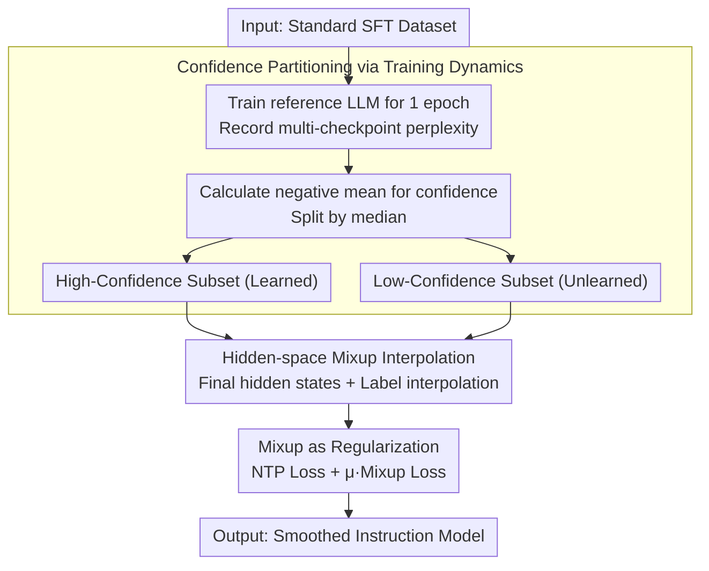

# SFTMix: Elevating Language Model Instruction Tuning with Mixup Recipe

**Conference**: ACL 2026  
**arXiv**: [2410.05248](https://arxiv.org/abs/2410.05248)  
**Code**: None  
**Area**: LLM Alignment  
**Keywords**: Instruction Tuning, Mixup Regularization, Training Dynamics, Confidence Partitioning, Data Utilization Efficiency

## TL;DR

This paper proposes SFTMix, a Mixup-based instruction tuning method. By partitioning SFT datasets into high-confidence and low-confidence subsets through training dynamics, it performs linear interpolation in the hidden representation space and applies Mixup regularization. SFTMix consistently improves instruction-following capabilities across different LLM families and dataset scales without relying on high-quality dataset curation.

## Background & Motivation

**Background**: LLM instruction fine-tuning (SFT) is a critical stage for enabling models to follow instructions. Current mainstream methods train on instruction-response pairs using the Next Token Prediction (NTP) loss. Major efforts to improve SFT focus on data quality: filtering data via LLM scoring (AlpaGasus), manual annotation of high-quality data (LIMA), or using stronger LLMs to generate responses (GPT-4 distillation).

**Limitations of Prior Work**: (1) Obtaining high-quality SFT data depends on powerful closed-source LLMs or expensive human annotation; (2) Standard NTP training treats all samples equally, ignoring significant differences in the model's learning state across samples; (3) High-confidence samples are prone to overfitting, while low-confidence samples are difficult to generalize, with both being clearly separated in the semantic space.

**Key Challenge**: The NTP paradigm treats every training sample equally, overlooking the non-uniformity of LLM confidence in the semantic representation space—samples in different regions should play different roles during training.

**Goal**: To design a general method that improves instruction tuning by optimizing data utilization rather than relying on dataset curation quality.

**Key Insight**: SFT data is divided into high-confidence and low-confidence subsets via training dynamics (perplexity statistics across multiple checkpoints). Mixup is then utilized to interpolate between the two, facilitating the flow of supervisory signals across confidence regions.

**Core Idea**: Perform linear interpolation between high- and low-confidence samples in the hidden representation space. Combined with Mixup regularization, this establishes a smooth transition between "learned" and "unlearned" regions, alleviating overfitting and enhancing generalization.

## Method

### Overall Architecture

SFTMix aims to address the issue where standard NTP treats every instruction-response pair equally, despite varying model mastery across samples. It first runs one epoch of training with a reference LLM on the SFT data, recording perplexity at multiple checkpoints to split the data into high-confidence and low-confidence halves based on the median. During target LLM training, these subsets are linearly interpolated in the hidden representation space, and the Mixup cross-entropy is added to the original NTP loss as a regularization term. The pipeline takes a standard SFT dataset as input, produces two subsets partitioned by learning difficulty, and outputs a model smoothed between mastered and non-mastered regions.

### Key Designs

**1. Confidence Partitioning via Training Dynamics: Splitting Data by the Model's Learning Curve**

To determine if a sample is "difficult," SFTMix observes how smoothly the reference LLM learns it rather than looking at the data source quality. Specifically, perplexity is calculated at $C$ training checkpoints of the reference LLM, and confidence is derived as $\text{Conf}(\mathcal{Y}_i|\mathcal{X}_i) = -\frac{1}{C}\sum_{c=1}^{C}\text{Perp}_c(\mathcal{Y}_i|\mathcal{X}_i)$. The dataset is then split into a high-confidence subset $\mathcal{D}^c$ and a low-confidence subset $\mathcal{D}^u$ at the median. t-SNE visualization shows these subsets are clearly separated in the representation space, corresponding to "mastered" and "un-digested" regions.

Critically, confidence does not correlate with data quality: the confidence distribution of GPT-4 generated "high-quality" responses significantly overlaps with that of original responses. This indicates that partitioning characterizes model-specific learning states rather than intrinsic data quality—making interpolation between these regions meaningful.

**2. Hidden-space Mixup Interpolation: Building a Bridge Between Regions**

With the two subsets, SFTMix performs linear interpolation on both the hidden states of the final Transformer layer and the one-hot labels: $\tilde{\mathbf{Z}}_n = \lambda \mathbf{Z}_n^c + (1-\lambda)\mathbf{Z}_n^u$ and $\tilde{\mathbf{Y}}_n = \lambda \mathbf{Y}_n^c + (1-\lambda)\mathbf{Y}_n^u$, where the mixing coefficient $\lambda \sim \text{Beta}(\alpha, \alpha)$ with $\alpha=0.5$. When responses have unequal lengths, they are truncated to $\min(N_i^c, N_i^u)$ before interpolation. This effectively creates continuous "middle ground" supervisory signals between high-confidence samples (far from decision boundaries, prone to overfitting) and low-confidence samples (near boundaries, difficult to learn).

This interpolation is more than simple sample weighting due to the non-linearity of softmax: the resulting gradient is not just a weighted sum of the two original gradients, but a truly new gradient direction. This explains why Mixup improves generalization more effectively than simple resampling or reweighting.

**3. Integration of Mixup as a Regularizer: Maintaining the NTP Backbone with Gentle Constraints**

SFTMix does not replace NTP loss with Mixup but treats it as a regularization term: the total loss is $\ell_{\text{SFTMix}} = \ell_{\text{NTP}}(\mathcal{D}) + \mu \cdot \ell_{\text{Mixup}}(\mathcal{D}^c, \mathcal{D}^u)$, with weight $\mu=0.2$. Each batch ensures an equal number of high/low-confidence samples for random pair interpolation. Ablation studies prove this lightweight integration is optimal—it preserves basic NTP learning capabilities while gaining cross-confidence generalization benefits, whereas using Mixup as the primary or equal-weight loss degrades instruction-following performance.

### Loss & Training

Standard NTP cross-entropy loss + Mixup cross-entropy regularization, $\mu=0.2$, $\alpha=0.5$. Using the AdamW optimizer with a learning rate of $2\times10^{-6}$, weight decay 0.1, cosine scheduler, and a warm-up ratio of 0.1. Alpaca-52K is trained for 3 epochs, while UltraChat-200K and Tulu3-939K are trained for 1 epoch with a batch size of 32 on 8 H100 GPUs.

## Key Experimental Results

### Main Results

**Instruction-Following Evaluation (Alpaca-52K Dataset)**

| LLM | Method | MT-Bench Overall | AlpacaEval-2 WR | AlpacaEval-2 LC WR |
|-----|------|-----------------|-----------------|-------------------|
| Llama-3.1-8B | NTP | 4.3625 | 4.0714 | 8.6528 |
| Llama-3.1-8B | SFTMix | **4.5825** | **4.9031** | **10.3195** |
| Mistral-7B | NTP | 4.6163 | 4.3560 | 9.1759 |
| Mistral-7B | SFTMix | **4.9100** | **4.5386** | **9.4994** |
| Qwen-2.5-14B | NTP | 6.1930 | 7.0764 | 13.9508 |
| Qwen-2.5-14B | SFTMix | **6.5247** | **7.8810** | **15.0235** |

**Medical Domain SFT (MedAlpaca-263K)**

| LLM | Method | MedQA | MedQA-5 | PubMedQA | MedMCQA | Average |
|-----|------|-------|---------|----------|---------|------|
| Llama | NTP | 59.31 | 54.52 | 75.40 | 53.65 | 60.72 |
| Llama | SFTMix | **60.88** | **55.38** | **77.80** | **54.15** | **62.05** |
| Mistral | NTP | 49.10 | 44.62 | 75.40 | 48.15 | 54.32 |
| Mistral | SFTMix | **51.77** | **45.72** | **77.40** | **49.03** | **55.98** |

### Ablation Study

**Role of Mixup Analysis (Llama-3.1-8B + Alpaca-52K)**

| NTP Role | Mixup Role | MT-Bench | AlpacaEval-2 LC WR |
|----------|-----------|----------|-------------------|
| Loss | — | 4.3625 | 8.6528 |
| Loss | **Reg.** | **4.5825** | **10.3195** |
| Loss | Loss | 4.4062 | 8.2856 |
| — | Loss | 4.5062 | 7.2964 |

### Key Findings

- SFTMix yields larger improvements in multi-turn dialogue capabilities (MT-Bench multi-turn avg +0.32 vs. single-turn +0.27), suggesting Mixup regularization aids context understanding.
- In human evaluation, SFTMix won 42.5% of head-to-head comparisons, while NTP won only 26.5%.
- Training dynamics confidence does not correspond to data quality—the confidence distribution of GPT-4 "high-quality" responses overlaps heavily with original "low-quality" ones.
- Confidence partitioning from a weak reference LLM (Gemma-2B) transfers to a strong target LLM (Llama-8B), supporting weak-to-strong generalization.
- SFTMix is compatible with data selection methods (AlpaGasus, Long); combined use leads to further gains. It is also compatible with LoRA, suiting compute-constrained scenarios.
- SFTMix reduced the standard deviation of confidence scores by 7%, indicating a more uniform confidence distribution and mitigated overfitting.

## Highlights & Insights

- The insight that "samples of different confidence should play different roles" is simple yet powerful—high-confidence samples are far from the decision boundary and prone to overfitting, while low-confidence samples are near the boundary and hard to learn. Mixup bridges this gap.
- Gradient analysis proves that Mixup introduces a truly new gradient direction (softmax non-linearity prevents gradient decomposition), making it more effective than simple sample reweighting.
- The method is highly practical: only one extra round of training is needed to obtain confidence, and it can be plugged into any SFT pipeline.

## Limitations & Future Work

- Experiments were not conducted on models exceeding 14B; effectiveness on larger models remains to be verified.
- Requires an additional training pass for training dynamics (similar to the overhead of data selection methods like LESS or Rho-1).
- Binary confidence partitioning (median split) might be too coarse; multi-level partitioning or continuous weighting is worth exploring.
- Not yet verified in the pre-training stage—dynamic Mixup scheduling and pre-training scaling are promising future directions.

## Related Work & Insights

- **vs IR-DRO (Chen et al., 2024b)**: The latter optimizes distribution robustness via sample reweighting but underperforms compared to SFTMix on MT-Bench and AlpacaEval-2—indicating that hidden-space interpolation is more effective than loss weighting.
- **vs Data Selection (AlpaGasus, LESS)**: These methods improve quality by "selecting good data," whereas SFTMix improves efficiency by "utilizing data well." The two are orthogonal and can be combined.

## Rating

- Novelty: ⭐⭐⭐⭐ Introducing Mixup to LLM SFT combined with training dynamics is a clear idea, though Mixup itself is established.
- Experimental Thoroughness: ⭐⭐⭐⭐⭐ Verified across 3 LLM families, 3 dataset scales, medical domain tasks, and 6 analysis dimensions.
- Writing Quality: ⭐⭐⭐⭐ Motivations and gradient analysis are clear; ablation studies are systematically designed.
- Value: ⭐⭐⭐⭐ High practicality, plug-and-play capability, and compatibility with existing methods.

<!-- RELATED:START -->

## Related Papers

- [\[ACL 2026\] What Makes Good Instruction-Tuning Data? An In-Context Learning Perspective](what_makes_good_instruction-tuning_data_an_in-context_learning_perspective.md)
- [\[ACL 2025\] Federated Data-Efficient Instruction Tuning for Large Language Models](../../ACL2025/llm_alignment/federated_data-efficient_instruction_tuning_for_large_language_models.md)
- [\[ACL 2025\] Rethinking Table Instruction Tuning](../../ACL2025/llm_alignment/rethinking_table_instruction_tuning.md)
- [\[ICML 2025\] Instruction Tuning of Large Language Models for Tabular Data Generation—in One Day](../../ICML2025/llm_alignment/instruction_tuning_of_large_language_models_for_tabular_data_generation-in_one_d.md)
- [\[AAAI 2026\] Importance-Aware Data Selection for Efficient LLM Instruction Tuning](../../AAAI2026/llm_alignment/importance-aware_data_selection_for_efficient_llm_instruction_tuning.md)

<!-- RELATED:END -->
