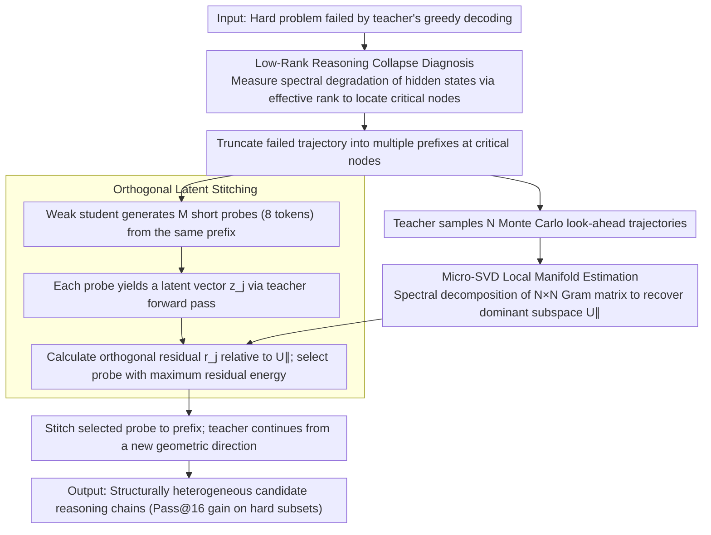

# Student Guides Teacher: Weak-to-Strong Inference via Spectral Orthogonal Exploration

**Conference**: ACL 2026  
**arXiv**: [2601.06160](https://arxiv.org/abs/2601.06160)  
**Code**: https://github.com/dayuwang401/spectral-orthogonal-exploration  
**Area**: LLM Alignment / Inference-time Search / Mathematical Reasoning  
**Keywords**: Reasoning Collapse, Spectral Orthogonal Exploration, Weak-to-Strong, Micro-SVD, Inference-time Intervention

## TL;DR
This paper explains the phenomenon of LLMs repeatedly sampling the same incorrect logic on difficult problems as low-rank collapse of hidden states. It proposes Spectral Orthogonal Exploration (SOE): using a weak student model to provide short probes orthogonal to the teacher's current dominant subspace. This forces the teacher to jump out of the biased manifold, improving the average Pass@16 from 26.7% to 45.9% on hard subsets of AIME, MATH, and Olympiad Bench.

## Background & Motivation
**Background**: Complex mathematical, logical, and code generation tasks typically rely on self-consistency, high-temperature sampling, Best-of-N, or PRM reranking to improve reasoning success rates. These methods share the common assumption that multiple samplings will cover enough diverse reasoning paths.

**Limitations of Prior Work**: On hard problems, "Reasoning Collapse" often occurs: while the output text appears different, the underlying reasoning is highly homogeneous, repeatedly unfolding around the same incorrect assumptions. At this point, increasing the temperature often only adds surface-level perturbations and fails to explore error-correcting directions.

**Key Challenge**: If the teacher model's hidden states are already concentrated on a low-dimensional bias manifold, standard sampling is merely a random walk within this low-dimensional space. What is truly needed is the injection of a signal into the orthogonal complement space that can change subsequent attention routing.

**Goal**: Design an inference-time geometric intervention to allow the teacher to escape collapsed reasoning trajectories and explore more heterogeneous candidate solutions without training new models or modifying teacher parameters.

**Key Insight**: The authors reverse the common usage of weak-to-strong. The weak student does not provide correct answers or supervisory labels to the teacher; instead, it serves as a structurally heterogeneous orthogonal probe. Its value comes from being "non-collinear" with the teacher's erroneous trajectories rather than being absolutely more capable.

**Core Idea**: Use Monte Carlo look-ahead + Micro-SVD to estimate the teacher's current dominant subspace, then select the candidate with the largest orthogonal residual energy from short probes generated by the student. This probe is stitched into the teacher's context, allowing the teacher to continue sampling from a new geometric direction.

## Method

### Overall Architecture
SOE addresses the issue where teacher models repeatedly sample along the same incorrect logic on hard problems, where increasing temperature only changes surface wording but not the reasoning direction. It is a purely inference-time framework: given a hard problem that the teacher's greedy decoding has failed, the failed trajectory is truncated into multiple prefixes at key reasoning nodes. For each prefix, the teacher generates several Monte Carlo look-ahead trajectories to estimate the local bias manifold. Simultaneously, a weak student model generates $M$ short candidate probes (fixed at 8 tokens) under the same prefix. The system maps each probe back to the teacher's hidden space and selects the one most orthogonal to the teacher's dominant subspace to stitch after the prefix. The output is a reasoning chain continued by the teacher from a fresh geometric direction. No training or parameter modification is involved.

### Key Designs
**1. Low-Rank Reasoning Collapse Diagnosis: Mapping "Going in Circles" to Measurable Spectral Degradation**

Reasoning collapse was previously judged subjectively based on output repetition or excessive length. SOE grounds it in spectral metrics of the hidden space. Representing the reasoning chain hidden states as $H_t=[h_1,h_2,\ldots,h_t]$, the local covariance $\Sigma_t$ is calculated within a sliding window. The effective rank $\mathrm{EffRank}(\Sigma_t)=\exp(-\sum_j \tilde{\sigma}_j\log \tilde{\sigma}_j)$ is then used to measure the trajectory's effective dimension. Incorrect and lengthy reasoning chains exhibit significant rank decay as generation progresses, indicating that states are increasingly concentrated on a low-dimensional bias manifold.

This diagnosis provides a geometric target for intervention: reasoning collapse is not just text repetition or length issues; it corresponds to a deeper contraction of the representation space. With spectral metrics, "making the teacher jump out of the original trajectory" becomes a clear geometric objective.

**2. Micro-SVD Local Manifold Estimation: Recovering the Dominant Subspace via Small Matrix Decomposition**

Inference-time methods must be lightweight. At the truncation point $t$, the teacher samples $N$ look-ahead trajectories. The hidden states $h_i$ from each trajectory are aggregated and centered to form matrix $H$. Directly decomposing the $d \times d$ covariance is too expensive, so an $N \times N$ Gram matrix $G=H^T H$ is constructed. Its eigenvectors are solved to recover the top-$k$ principal components $U_{\parallel}$.

This leverages the fact that the number of look-ahead samples $N$ is much smaller than the hidden dimension $d$, transforming a massive high-dimensional spectral decomposition into a small matrix problem, making inference-time geometric diagnosis feasible.

**3. Orthogonal Latent Stitching: Selecting the Short Probe Most Capable of Pushing the Teacher**

The weak student generates a set of candidates $\mathcal{C}_{Student}=\{s_1,\ldots,s_M\}$, and each candidate is passed through the teacher to obtain a latent vector $z_j$. Using the projection matrix $P_{\parallel}=U_{\parallel}U_{\parallel}^T$, the orthogonal residual $r_j=(I-P_{\parallel})(z_j-\hat{\mu})$ is computed. The candidate with the maximum normalized residual energy $\|r_j\|_2/(\|z_j-\hat{\mu}\|_2+\epsilon)$ is selected and stitched after the prefix.

The restraint in this design is key: the short probe from the weak student is never treated as the final answer; it acts only as a geometric perturbation responsible for pushing the teacher out of the current bias manifold. This utilizes the structural heterogeneity of the weak student while preventing its knowledge errors from polluting the final answer—its value lies in being "non-collinear" with the teacher's error path, not in being absolutely stronger.

### Loss & Training
SOE does not train the teacher or the student, nor does it use a new loss function. In experiments, the teacher is Qwen3-4B-Instruct-2507 by default, and the student is Gemma-3-4B-IT. The baseline is the teacher performing self-consistency sampling at $T=0.7$ under the same prompt. SOE lets the student generate 8 short probes at $T=1.0$, while the teacher's subsequent sampling still uses $T=0.7$, with a maximum context length of 8192 tokens. Answers are verified using regex normalization and MathEvaluator.

## Key Experimental Results

### Main Results
Main results reflect Pass@16 on the "difficult subset," i.e., problems where the teacher's greedy decoding failed.

| Dataset | Self-Consistency | SOE | Gain |
|---------|------------------|-----|------|
| AIME 2024 | 38.5% | 76.9% | +99.7% |
| AIME 2025 | 35.3% | 70.6% | +100.0% |
| MATH-500 | 33.7% | 45.9% | +36.2% |
| Olympiad Bench | 11.7% | 15.5% | +32.5% |
| Omni-Math (Hard) | 14.5% | 20.8% | +43.4% |
| **Average** | **26.7%** | **45.9%** | **+62.4%** |

Compared with a strong step-level Best-of-N + PRM baseline, SOE remains superior when matching sampling locations and subsequent trajectories.

| Dataset | PRM Best-of-N | SOE | Gain |
|---------|---------------|-----|------|
| AIME 2024 | 69.23% | 76.90% | +11.08% |
| AIME 2025 | 58.82% | 70.60% | +20.03% |
| MATH-500 | 40.98% | 45.90% | +12.01% |

### Ablation Study
The paper verifies the geometric mechanism through matched-control, random probes, and cross-model combinations.

| Configuration / Phenomenon | Metric | Description |
|----------------------------|--------|-------------|
| Short & Correct traces | Effective-rank drop 4.82% | Correct short chains show weakest spectral degradation |
| Short & Wrong traces | Effective-rank drop 19.65% | Errors are accompanied by significant rank decay |
| Long & Correct traces | Effective-rank drop 13.14% | Long chains show decay, but less severe than wrong ones |
| Long & Wrong traces | Effective-rank drop 27.04% | Rank decay is most strongly linked to reasoning failure |
| Random student probe | AIME 2025 58.82% | External heterogeneous signals are inherently helpful |
| SOE orthogonal probe | AIME 2025 70.59% | Micro-SVD selection of orthogonal directions yields further gains |

Accounting for approximately 12.8% runtime overhead under vLLM, SOE still outperforms self-consistency in time-normalized sampling efficiency: 68.39% vs 42.86% for AIME 2024, 63.83% vs 36.00% for AIME 2025, and 39.57% vs 35.12% for MATH-500. Cross-model experiments show that Qwen3-4B as a teacher paired with DeepSeek-R1-Distill-Qwen-7B or Mistral-7B as a student remains effective; performance gains also persist when using Qwen3-8B/32B as teachers.

### Key Findings
- Reasoning collapse is not just about output redundancy or repetition; it is highly correlated with the decrease in the effective rank of hidden states. Short erroneous trajectories also show significant rank decay, proving it is not merely a verbosity artifact.
- Random student probes can interrupt some incorrect trajectories, provided they are heterogeneous. However, selecting probes based on orthogonal residuals is significantly more powerful, proving the geometric selection is not a decorative module.
- The gains of SOE are not just "sampling more and picking the best," as it still achieves an 11%-20% relative improvement over matched PRM reranking settings.
- SOE significantly improves average sampling efficiency, especially in generating semantically diverse correct reasoning traces rather than a high volume of homogeneous paraphrases.
- Preliminary logic and code experiments also show gains: ZebraLogic improved from 56.23% to 58.72%, and HumanEvalPlus from 10.00% to 16.67%, though these remain preliminary in scale.

## Highlights & Insights
- The most ingenious aspect of this paper is the redefinition of the "weak model's" role. A weak student doesn't need to be smarter than the teacher; it only needs to be different. This heterogeneity is a resource in low-rank collapse scenarios.
- SOE clarifies the weakness of self-consistency: diverse tokens do not equate to a diverse reasoning manifold. This insight is also vital for code generation, where many erroneous programs are just variable-name variants of the same flawed algorithm.
- Micro-SVD is a practical engineering compromise. Performing spectral decomposition directly on the hidden dimensions would be too heavy. Recovering primary directions from a few look-ahead samples makes inference-time geometric diagnosis feasible.
- The "short probe + teacher continuation" design is very balanced: it doesn't let the weak student dominate the answer but uses it to change the exploration direction.

## Limitations & Future Work
- The method requires access to the teacher model's hidden states, making it primarily applicable to open-weight models rather than closed-source LLMs available only via API.
- SOE introduces extra inference overhead (look-ahead, embedding extraction, Micro-SVD, and probe scoring). While the overhead is ~12.8% per step, large-scale deployment still requires optimization.
- Experiments focus heavily on mathematical reasoning; logic and code generation are only verified preliminarily, lacking sufficient scale and difficulty.
- While the paper links collapse to low-rank spectral degradation, the causality requires stronger intervention experiments, such as controlling the rank without changing the semantics.
- Language fragments from student probes may introduce semantic shifts, especially in strict proof formats, code syntax, or tool-calling tasks, necessitating finer control over stitching boundaries.

## Related Work & Insights
- **vs Self-Consistency**: Self-consistency relies on repeated sampling and voting, which works when a correct path exists in the probability distribution. SOE targets cases where the correct path is obscured by a low-rank bias manifold, using external orthogonal signals to actively expand the exploration space.
- **vs Best-of-N / PRM**: PRM reranking is akin to "picking a good answer from existing candidates," whereas SOE changes the candidate generation process itself, allowing it to surpass PRM under matched sampling.
- **vs weak-to-strong imitation**: Traditional weak-to-strong involves strong models learning from weak supervisory labels. Here, the weak model acts as a structurally heterogeneous probe, deriving value from orthogonality rather than correctness.
- **Inspiration for Code Generation**: Many code errors are not syntax errors but result from being stuck in an incorrect algorithmic template. SOE could be used to inject different algorithmic directions mid-implementation, such as switching from greedy to DP or from brute-force to mathematical derivation.

## Rating
- Novelty: ⭐⭐⭐⭐⭐ The premise of using a weak model as an orthogonal geometric probe is highly distinctive.
- Experimental Thoroughness: ⭐⭐⭐⭐ Solid math experiments with ample cross-model and ablation studies; code intelligence remains preliminary.
- Writing Quality: ⭐⭐⭐⭐ Clear geometric narrative and intuitive diagrams, though some theoretical arguments use hypothetical language.
- Value: ⭐⭐⭐⭐ Highly inspiring for inference-time search in open-weight models; applications in code and agent tasks would increase its utility.

<!-- RELATED:START -->

## Related Papers

- [\[AAAI 2026\] W2S-AlignTree: Weak-to-Strong Inference-Time Alignment for Large Language Models via Monte Carlo Tree Search](../../AAAI2026/llm_alignment/w2s-aligntree_weak-to-strong_inference-time_alignment_for_large_language_models_.md)
- [\[ACL 2025\] Synergistic Weak-Strong Collaboration by Aligning Preferences](../../ACL2025/llm_alignment/synergistic_weak-strong_collaboration_by_aligning_preferences.md)
- [\[ACL 2026\] Debiasing Reward Models via Causally Motivated Inference-Time Intervention](debiasing_reward_models_via_causally_motivated_inference-time_intervention.md)
- [\[ICLR 2026\] General Exploratory Bonus for Optimistic Exploration in RLHF](../../ICLR2026/llm_alignment/general_exploratory_bonus_for_optimistic_exploration_in_rlhf.md)
- [\[NeurIPS 2025\] Inference-time Alignment in Continuous Space](../../NeurIPS2025/llm_alignment/inference-time_alignment_in_continuous_space.md)

<!-- RELATED:END -->
