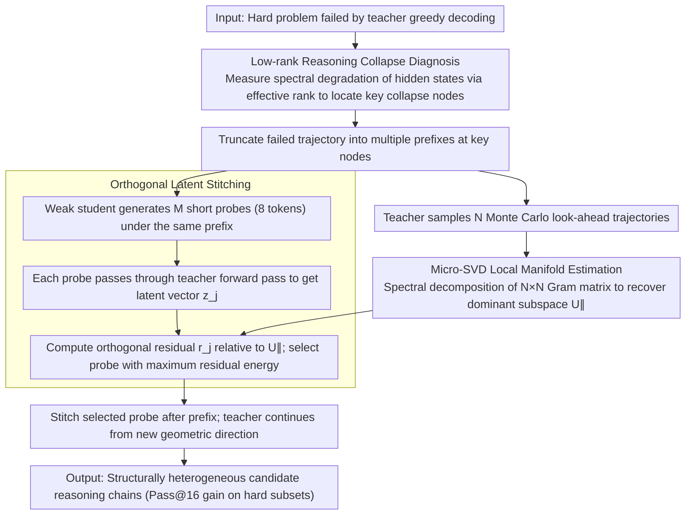

# Student Guides Teacher: Weak-to-Strong Inference via Spectral Orthogonal Exploration

**Conference**: ACL 2026  
**arXiv**: [2601.06160](https://arxiv.org/abs/2601.06160)  
**Code**: https://github.com/dayuwang401/spectral-orthogonal-exploration  
**Area**: LLM Alignment / Test-time Search / Mathematical Reasoning  
**Keywords**: Reasoning Collapse, Spectral Orthogonal Exploration, Weak-to-Strong, Micro-SVD, Test-time Intervention

## TL;DR
This paper interprets the phenomenon of LLMs repeatedly sampling along the same incorrect logic on difficult problems as low-rank collapse of hidden states. It proposes Spectral Orthogonal Exploration (SOE): using a weak student model to provide short probes orthogonal to the teacher's current dominant subspace, forcing the teacher to leap out of the original bias manifold. This improves Pass@16 on difficult subsets of AIME/MATH/Olympiad from 26.7% to 45.9% on average.

## Background & Motivation
**Background**: Complex mathematical, logical, and code generation tasks typically rely on self-consistency, high-temperature sampling, Best-of-N, or PRM reranking to improve reasoning success rates. The common assumption of these methods is that multiple samplings will cover a sufficient variety of different reasoning paths.

**Limitations of Prior Work**: Reasoning Collapse often occurs on hard problems: while the output text may appear different, the underlying reasoning is highly homogeneous, repeatedly unfolding around the same incorrect assumption. In such cases, increasing the temperature often only adds lexical perturbations without truly exploring error-correcting directions.

**Key Challenge**: If the teacher model's hidden states have already concentrated into a low-dimensional bias manifold, standard sampling merely performs a random walk within this low-dimensional space. What is truly needed is the injection of a signal into the orthogonal complement space that can alter subsequent attention routing.

**Goal**: Design a test-time geometric intervention to allow the teacher to escape collapsed reasoning trajectories and explore more heterogeneous candidate solutions without training new models or modifying teacher parameters.

**Key Insight**: The authors invert the common usage of "weak-to-strong." The weak student does not provide the teacher with correct answers or supervisory labels; instead, it serves as a structurally heterogeneous orthogonal probe. Its value stems from being "non-collinear" with the teacher's erroneous trajectories rather than having stronger absolute capabilities.

**Core Idea**: First, estimate the teacher's current dominant subspace via Monte Carlo look-ahead + Micro-SVD. Then, select the candidate with the largest orthogonal residual energy from short probes generated by the student, and stitch it into the teacher's context to allow the teacher to continue sampling from a new geometric direction.

## Method

### Overall Architecture
SOE addresses the issue where the teacher model repeatedly samples along the same incorrect logic on difficult problems, where increasing temperature only changes lexical tokens but not the reasoning direction. It is a pure test-time framework: given a hard problem that the teacher has failed via greedy decoding, the failed trajectory is truncated into multiple prefixes at key reasoning nodes. For each prefix, the teacher generates several Monte Carlo look-ahead trajectories to estimate the local bias manifold, while a weak student model generates $M$ short candidate probes (fixed at 8 tokens) under the same prefix. The system maps each probe back to the teacher's hidden space, selects the one most orthogonal to the teacher's dominant subspace, and stitches it after the prefix. The final output is a reasoning chain continued by the teacher from a new geometric direction. The entire process requires no training or parameter updates.

### Key Designs
**1. Low-rank Reasoning Collapse Diagnosis: Converting "Stuck in a Loop" into Measurable Spectral Degradation**

Reasoning collapse was previously judged subjectively based on repetitive or overly long outputs. SOE formalizes this using spectral metrics in the hidden space. Representing reasoning chain hidden states as $H_t=[h_1,h_2,\dots,h_t]$, the system calculates the local covariance $\Sigma_t$ within a sliding window and measures the effective dimension of the trajectory using effective rank $\mathrm{EffRank}(\Sigma_t)=\exp(-\sum_j \tilde{\sigma}_j\log \tilde{\sigma}_j)$. Erroneous and verbose reasoning chains show significant rank decay as generation progresses, indicating that states are increasingly concentrated in a low-dimensional bias manifold.

This diagnosis serves as the geometric target for subsequent intervention: reasoning collapse is not just text repetition or excessive length; it corresponds to a deeper contraction of the representation space. With spectral metrics, "making the teacher jump out of the original trajectory" becomes a clear geometric objective.

**2. Micro-SVD Local Manifold Estimation: Recovering the Dominant Subspace via Small Matrix Decomposition**

Test-time methods must be sufficiently lightweight. At truncation point $t$, the teacher samples $N$ look-ahead trajectories, aggregates units of hidden states $h_i$ from each trajectory, and centers them to form matrix $H$. Directly decomposing the $d\times d$ covariance is too expensive. Instead, an $N\times N$ Gram matrix $G=H^T H$ is constructed. By solving for its eigenvectors, the top-$k$ principal components $U_{\parallel}$ are recovered.

This exploits the fact that the number of look-ahead samples $N$ is much smaller than the hidden dimension $d$, transforming a massive high-dimensional spectral decomposition into a small matrix problem, making geometric diagnosis during inference feasible.

**3. Orthogonal Latent Stitching: Selecting the Short Probe Most Capable of Pushing the Teacher**

The weak student generates a candidate set $\mathcal{C}_{Student}=\{s_1,\dots,s_M\}$. Each candidate yields a latent vector $z_j$ through the teacher's forward pass. Using the projection matrix $P_{\parallel}=U_{\parallel}U_{\parallel}^T$, the orthogonal residual $r_j=(I-P_{\parallel})(z_j-\hat{\mu})$ is computed. The candidate with the maximum normalized residual energy $\|r_j\|_2/(\|z_j-\hat{\mu}\|_2+\epsilon)$ is selected and stitched after the prefix.

The restraint in this design is key: the student's short probes are never treated as final answers; they serve only as geometric perturbations responsible for pushing the teacher out of its current bias manifold. This utilizes the student's structural heterogeneity while avoiding its knowledge errors contaminating the final answer—the value comes from being "non-collinear" with the teacher's error path, not from superior ability.

### Loss & Training
SOE does not train the teacher or student, and there is no new loss function. In experiments, the default teacher is Qwen3-4B-Instruct-2507, and the default student is Gemma-3-4B-IT. The baseline is self-consistency sampling at $T=0.7$ with the same prompt. SOE lets the student generate 8 short probes at $T=1.0$, while the teacher's subsequent sampling still uses $T=0.7$, with a maximum context length of 8192 tokens. Answers are verified via regex normalization and MathEvaluator.

## Key Experimental Results

### Main Results
The main results report Pass@16 on the "difficult subset," defined as problems where teacher greedy decoding failed.

| Dataset | Self-Consistency | SOE | Gain |
|--------|------------------|-----|----------|
| AIME 2024 | 38.5% | 76.9% | +99.7% |
| AIME 2025 | 35.3% | 70.6% | +100.0% |
| MATH-500 | 33.7% | 45.9% | +36.2% |
| Olympiad Bench | 11.7% | 15.5% | +32.5% |
| Omni-Math (Hard) | 14.5% | 20.8% | +43.4% |
| Average | 26.7% | 45.9% | +62.4% |

Compared with the strong step-level Best-of-N + PRM baseline, SOE remains stronger when sampling locations and subsequent trajectory counts are matched.

| Dataset | PRM Best-of-N | SOE | Gain |
|--------|---------------|-----|------|
| AIME 2024 | 69.23% | 76.90% | +11.08% |
| AIME 2025 | 58.82% | 70.60% | +20.03% |
| MATH-500 | 40.98% | 45.90% | +12.01% |

### Ablation Study
The paper validates the geometric mechanism through matched-control, random probes, and cross-model combinations.

| Configuration / Phenomenon | Metric | Description |
|-------------|------|------|
| Short & Correct traces | Effective-rank drop 4.82% | Correct short chains show weakest spectral degradation |
| Short & Wrong traces | Effective-rank drop 19.65% | Errors are inherently accompanied by significant rank decay |
| Long & Correct traces | Effective-rank drop 13.14% | Long chains show degradation, but less severe than incorrect ones |
| Long & Wrong traces | Effective-rank drop 27.04% | Rank decay correlates most strongly with reasoning failure |
| Random student probe | AIME 2025 58.82% | External heterogeneous signals are already helpful |
| SOE orthogonal probe | AIME 2025 70.59% | Micro-SVD orthogonal selection provides further improvement |

Considering a ~12.8% runtime overhead under vLLM, SOE still outperforms self-consistency in time-normalized sampling efficiency: 68.39% vs 42.86% for AIME 2024, 63.83% vs 36.00% for AIME 2025, and 39.57% vs 35.12% for MATH-500. Cross-model experiments show that a Qwen3-4B teacher paired with DeepSeek-R1-Distill-Qwen-7B or Mistral-7B students remains effective; performance also improves when using Qwen3-8B/32B as the teacher.

### Key Findings
- Reasoning collapse is not just verbose or repetitive output; it is highly correlated with the decrease in the effective rank of hidden states. Short erroneous trajectories also show obvious rank decay, suggesting it is not purely a verbosity artifact.
- Random student probes can disrupt some incorrect trajectories, but selecting probes based on orthogonal residuals is significantly stronger, proving that geometric selection is not a decorative module.
- The gains from SOE are not just "sampling more and picking the best," as it still yields an 11%-20% relative improvement over matched PRM reranking settings.
- SOE significantly improves average sampling efficiency, particularly in producing semantically diverse correct reasoning traces rather than a high volume of homogeneous paraphrases.
- Preliminary logic and code experiments also showed gains: ZebraLogic from 56.23% to 58.72%, HumanEvalPlus from 10.00% to 16.67%, though these remain preliminary in scale.

## Highlights & Insights
- The most ingenious aspect of this paper is the redefinition of the "weak model's" role. A weak student doesn't need to be smarter than the teacher; it just needs to be different. This heterogeneity is a resource in low-rank collapse scenarios.
- SOE clarifies the weakness of self-consistency: diverse tokens do not equate to diverse reasoning manifolds. This insight is also important for code generation, where many buggy programs are simply variable-name variants of the same incorrect algorithm.
- Micro-SVD is a highly practical engineering trade-off. Direct spectral decomposition of the hidden dimension would be too heavy, but recovering the primary direction from a small number of look-ahead samples makes test-time geometric diagnosis feasible.
- The "short probe + teacher continuation" design of Orthogonal Latent Stitching is restrained: it does not let the weak student dominate the answer, but uses it only to shift the exploration direction.

## Limitations & Future Work
- The method requires access to the teacher model's hidden states, making it primarily applicable to open-weight models and not directly usable for closed-source LLMs via API.
- SOE introduces additional inference overhead, including look-ahead, embedding extraction, Micro-SVD, and probe scoring. While the overhead is ~12.8% per step, large-scale deployment still requires optimization.
- The experiments center on mathematical reasoning; logic and code generation are only validated preliminarily. The scale and difficulty of the code tasks are not yet sufficient.
- Although the paper links collapse with low-rank spectral degradation, the causal relationship requires stronger intervention experiments, such as controlling rank without changing semantics or injecting structured orthogonal vectors from non-student sources.
- Language segments from student probes may introduce semantic shifts, especially in tasks with strict proof formats, code syntax, or tool calling; stitching boundaries need finer control.

## Related Work & Insights
- **vs. Self-Consistency**: Self-consistency relies on repeated sampling and voting, suitable when correct paths already exist in the probability distribution. SOE targets cases where correct paths are obscured by a low-rank bias manifold, using external orthogonal signals to actively expand the exploration space.
- **vs. Best-of-N / PRM**: PRM reranking is akin to "picking the best answer from existing candidates," whereas SOE changes the candidate generation process itself, allowing it to outperform PRM under matched sampling.
- **vs. Weak-to-strong Imitation**: Traditional weak-to-strong involves a strong model learning from weak labels. Here, the weak model acts as a structurally heterogeneous probe, deriving value from orthogonality rather than correctness.
- **Inspiration for Code Generation**: Many code errors are not syntax errors but result from being stuck in an incorrect algorithmic template. SOE could be used to inject different algorithmic directions mid-implementation, such as shifting from greedy to DP or from brute force to mathematical derivation.

## Rating
- Novelty: ⭐⭐⭐⭐⭐ The characterization of a weak model as an orthogonal geometric probe is highly distinctive and differs significantly from conventional test-time sampling.
- Experimental Thoroughness: ⭐⭐⭐⭐ Solid math experiments with ample cross-model and ablation studies; the code intelligence portion remains preliminary.
- Writing Quality: ⭐⭐⭐⭐ The geometric narrative is clear and illustrations are intuitive, though some theoretical arguments use hypothetical language.
- Value: ⭐⭐⭐⭐ Highly inspiring for test-time search in open-weight models; value would increase significantly if extended to code and agent tasks.

<!-- RELATED:START -->

## Related Papers

- [\[AAAI 2026\] W2S-AlignTree: Weak-to-Strong Inference-Time Alignment for Large Language Models via Monte Carlo Tree Search](../../AAAI2026/llm_alignment/w2s-aligntree_weak-to-strong_inference-time_alignment_for_large_language_models_.md)
- [\[ACL 2025\] Synergistic Weak-Strong Collaboration by Aligning Preferences](../../ACL2025/llm_alignment/synergistic_weak-strong_collaboration_by_aligning_preferences.md)
- [\[ACL 2026\] Debiasing Reward Models via Causally Motivated Inference-Time Intervention](debiasing_reward_models_via_causally_motivated_inference-time_intervention.md)
- [\[ICLR 2026\] General Exploratory Bonus for Optimistic Exploration in RLHF](../../ICLR2026/llm_alignment/general_exploratory_bonus_for_optimistic_exploration_in_rlhf.md)
- [\[ACL 2026\] To Intervene or Not: Guiding Inference-time Alignment with Probabilistic Model Blending](to_intervene_or_not_guiding_inference-time_alignment_with_probabilistic_model_bl.md)

<!-- RELATED:END -->
